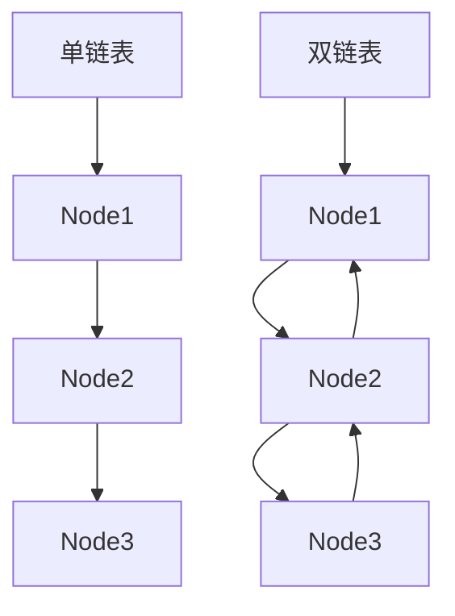
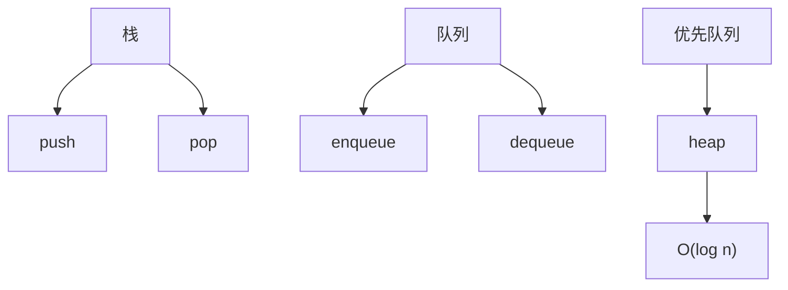
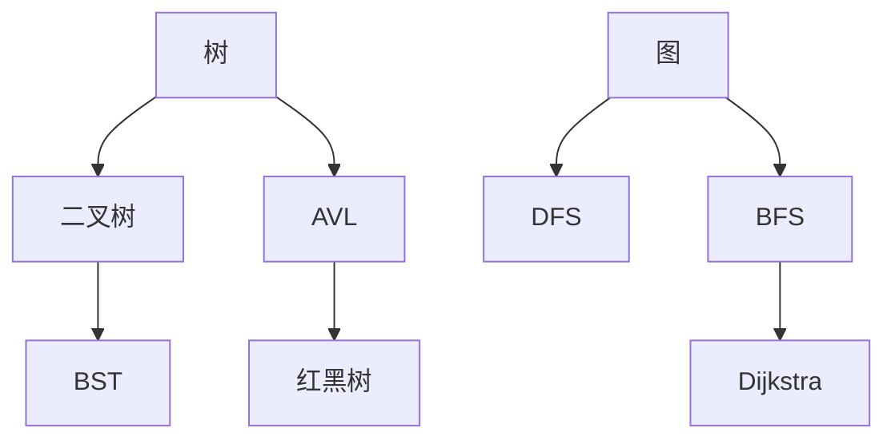

### 数组与链表
------
#### **1. 数组的特点与操作**
**🔑 知识点详解**
- **数组定义与特性**：
  - **核心定义**：数组是一块连续的内存空间，存储相同类型的数据。
  - **重要特性**：固定长度、随机访问（O(1) 时间）、内存分配静态。
  - **关键机制**：通过索引计算偏移量（如 `address = base + index * size`）访问元素。
    - **细节**：内存连续性带来高效的缓存命中率。
    👉 **注意**：插入和删除操作因需移动元素而效率低（O(n)）。
- **常见操作**：
  - **具体说明**：读取（get）、写入（set）、遍历、扩容。
  - **实现方式**：如 Java 中 `int[] arr = new int[10]; arr[0] = 1;`。
  - **使用场景**：静态数据存储、快速索引查询。
    👉 **辨析**：数组 vs 动态数组（如 ArrayList），后者支持动态扩容但有拷贝开销。

**🔥 面试高频题**
1. 数组的随机访问时间复杂度是多少？
   - **一句话答案**：O(1)。
   - **深入回答**：由于内存连续，通过基址加偏移量可直接定位元素，无需遍历。CPU 缓存预取进一步加速。
2. 数组插入元素的时间复杂度是多少？
   - **一句话答案**：O(n)。
   - **深入回答**：插入需将后续元素后移，如在中间插入，平均移动 n/2 个元素。尾部插入若无需扩容则为 O(1)。
3. 如何实现动态数组？
   - **一句话答案**：预分配空间，容量不足时倍增扩容。
   - **深入回答**：如 Java ArrayList，初始容量 10，满时扩容为 1.5 倍，拷贝旧数据到新数组，均摊时间复杂度 O(1)。

#### **2. 单链表、双链表的实现与应用场景**
**🔑 知识点详解**
- **单链表**：
  - **主要内容**：由节点组成，每个节点含数据和指向下一节点的指针。
  - **核心特点**：动态长度、插入删除高效（O(1) 若已定位）、顺序访问。
  - **实现原理**：节点结构如 `class Node { int data; Node next; }`，头节点指向首元素。
    - **细节**：尾节点 next 为 null，需遍历查找（O(n)）。
    👉 **注意**：无随机访问，内存不连续，缓存效率低。
- **双链表**：
  - **主要内容**：节点含前驱（prev）和后继（next）指针。
  - **核心特点**：双向遍历，删除前后节点更灵活。
  - **实现原理**：如 `class Node { int data; Node prev, next; }`，支持反向操作。
    - **细节**：占用更多内存，但操作更灵活。
    👉 **注意**：维护双向指针需额外逻辑。
- **应用场景**：
  - **单链表**：栈、队列基础实现，内存碎片化场景。
  - **双链表**：LRU 缓存（需快速删除和移动）、浏览器历史记录。

**🔥 面试高频题**
1. 单链表如何反转？
   - **一句话答案**：遍历链表，逐个改变指针方向。
   - **深入回答**：用三个指针（prev、curr、next），`curr.next = prev`，时间 O(n)，空间 O(1)。递归法也可但空间 O(n)。
2. 双链表相比单链表的优势是什么？
   - **一句话答案**：支持双向遍历，删除操作更高效。
   - **深入回答**：双链表可直接访问前驱，无需遍历查找，删除已知节点时 O(1)。如 LRU 缓存中快速调整顺序。
3. 如何检测单链表中的环？
   - **一句话答案**：快慢指针法。
   - **深入回答**：快指针每次走两步，慢指针走一步，若相遇则有环（Floyd 判圈法）。时间 O(n)，空间 O(1)。应用如循环检测。
4. 单链表和数组的适用场景有何不同？
   - **一句话答案**：单链表适合动态插入删除，数组适合随机访问。
   - **深入回答**：链表插入 O(1)（已定位），查询 O(n)；数组查询 O(1)，插入 O(n)。如频繁增删用链表，静态查询用数组。

**🌟 重点提醒**
- **要点一**：数组连续内存适合快速查询。
- **要点二**：链表动态性强，适合频繁修改。
- **要点三**：双链表在特定场景（如缓存）优于单链表。

**🔧 工具辅助**


**💡 复习建议**
1. 手写单链表反转和环检测代码。
2. 对比数组与链表的时间复杂度。
3. 理解双链表在 LRU 中的应用。

---

### 栈与队列
------
#### **1. 栈的后进先出（LIFO）特性**
**🔑 知识点详解**

- **栈的定义与特性**：
  - **核心定义**：栈是一种线性数据结构，遵循后进先出（Last In, First Out, LIFO）原则。
  - **重要特性**：仅在栈顶操作（入栈 push、出栈 pop），简单高效。
  - **关键机制**：基于数组或链表实现，栈顶指针追踪最新元素。
    - **细节**：数组实现需关注容量，链表实现动态扩展。
    👉 **注意**：栈溢出（固定数组）或空栈弹出是常见错误点。
- **典型操作**：
  - **具体说明**：push（入栈）、pop（出栈）、peek（查看栈顶）、is_empty（判空）。
  - **实现方式**：Python 中可用列表（如 `stack.append()` 和 `stack.pop()`）。
  - **使用场景**：递归模拟（如函数调用栈）、表达式求值、浏览器后退。
    👉 **辨析**：栈 vs 队列，前者 LIFO，后者 FIFO。

**🔥 面试高频题**
1. 栈的时间复杂度是多少？
   - **一句话答案**：入栈和出栈均为 O(1)。
   - **深入回答**：数组实现时操作栈顶直接访问，链表实现时维护头指针也为 O(1)。动态数组可能因扩容均摊 O(1)。
2. 如何用栈实现括号匹配？
   - **一句话答案**：遇到左括号入栈，右括号出栈匹配。
   - **深入回答**：遍历字符串，左括号（如 '('）push，右括号 pop 并检查是否对应，若栈空或不匹配则失败。时间 O(n)，空间 O(n)。
3. 如何用栈模拟递归？
   - **一句话答案**：用循环和栈手动管理调用状态。
   - **深入回答**：如 factorial(n)，递归转为迭代时用栈保存参数和返回点，代替系统调用栈。节省内存且可优化尾递归。
4. 栈在操作系统中的作用是什么？
   - **一句话答案**：管理函数调用和局部变量。
   - **深入回答**：函数调用时参数、返回地址压栈，返回时弹出，栈帧结构支持嵌套调用。

---

#### **2. 队列、优先队列的基本操作及应用**
**🔑 知识点详解**
- **队列**：
  - **主要内容**：线性结构，遵循先进先出（First In, First Out, FIFO）。
  - **核心特点**：队首出队（dequeue），队尾入队（enqueue）。
  - **实现原理**：可基于数组（循环队列）或链表，维护头尾指针。
    - **细节**：循环队列避免空间浪费，链表适合动态长度。
    👉 **注意**：数组实现需处理队满和队空。
- **优先队列**：
  - **主要内容**：元素按优先级出队，而非插入顺序。
  - **核心特点**：最高优先级优先出队，通常用堆实现。
  - **实现原理**：Python `heapq` 模块基于最小堆，插入 O(log n)，出队 O(log n)。
    - **细节**：可自定义比较规则实现最大堆。
    👉 **注意**：复杂度高于普通队列。
- **应用场景**：
  - **队列**：任务调度（如打印队列）、广度优先搜索（BFS）。
  - **优先队列**：Dijkstra 算法、事件驱动模拟、任务优先级管理。

**🔥 面试高频题**
1. 队列和栈的区别是什么？
   - **一句话答案**：队列 FIFO，栈 LIFO。
   - **深入回答**：队列适合顺序处理（如 BFS），栈适合逆序（如 DFS）。实现上队列需双端操作，栈单端即可。
2. 如何用数组实现循环队列？
   - **一句话答案**：用头尾指针和模运算管理循环。
   - **深入回答**：初始化 front 和 rear 指针，入队 rear = (rear + 1) % size，出队 front = (front + 1) % size。判满条件为 (rear + 1) % size == front。
3. 优先队列的实现原理是什么？
   - **一句话答案**：基于二叉堆维护优先级。
   - **深入回答**：最小堆中父节点小于子节点，插入时上浮调整，出队时下沉调整。时间复杂度 O(log n)，Python heapq 默认最小堆。
4. 如何用两个栈实现队列？
   - **一句话答案**：一个栈入队，另一个栈出队。
   - **深入回答**：入队全压入 stack1，出队时若 stack2 为空，将 stack1 元素倒入 stack2，取 stack2 栈顶。均摊 O(1)。

**🌟 重点提醒**
- **要点一**：栈适合逆序场景，队列适合顺序。
- **要点二**：优先队列依赖堆，复杂度更高。
- **要点三**：实现时关注边界条件（如空满）。

**📝 实践经验**
```python
# 栈实现括号匹配
def is_valid(s: str) -> bool:
    stack = []
    brackets = {')': '(', '}': '{', ']': '['}
    for char in s:
        if char in brackets.values():
            stack.append(char)
        elif char in brackets:
            if not stack or stack.pop() != brackets[char]:
                return False
    return len(stack) == 0

# 循环队列实现
class CircularQueue:
    def __init__(self, size):
        self.size = size
        self.queue = [None] * size
        self.front = self.rear = -1
    
    def enqueue(self, value):
        if self.is_full():
            return False
        if self.is_empty():
            self.front = 0
        self.rear = (self.rear + 1) % self.size
        self.queue[self.rear] = value
        return True
    
    def dequeue(self):
        if self.is_empty():
            return None
        value = self.queue[self.front]
        if self.front == self.rear:
            self.front = self.rear = -1
        else:
            self.front = (self.front + 1) % self.size
        return value
    
    def is_empty(self):
        return self.front == -1
    
    def is_full(self):
        return ((self.rear + 1) % self.size) == self.front

# 优先队列示例
import heapq
pq = []
heapq.heappush(pq, (2, 'task1'))
heapq.heappush(pq, (1, 'task2'))
print(heapq.heappop(pq))  # 输出 (1, 'task2')
```

**🔧 工具辅助**


**💡 复习建议**
1. 手写栈和队列的基本操作。
2. 实践优先队列在排序中的应用。
3. 理解循环队列的边界处理。

---

### 树与图
------
#### **1. 树结构：二叉树、二叉搜索树**
**🔑 知识点详解**
- **二叉树**：
  - **核心定义**：每个节点最多有两个子节点的树结构。
  - **重要特性**：层次结构，分为左子树和右子树，支持多种遍历（前序、中序、后序）。
  - **关键机制**：节点定义如 `class Node: left, right, val`，高度为 log(n)（平衡时）。
    - **细节**：完全二叉树适合数组存储。
    👉 **注意**：退化为链表时复杂度恶化。
- **二叉搜索树（BST）**：
  - **主要内容**：左子树 < 根 < 右子树。
  - **核心特点**：查找、插入、删除平均 O(log n)。
  - **实现原理**：递归比较插入，删除需处理三种情况（无子、单子、双子）。
    - **细节**：中序遍历为有序序列。
    👉 **注意**：不平衡时退化为 O(n)。

**🔥 面试高频题**
1. 二叉树的前序遍历如何实现？
   - **一句话答案**：递归或栈迭代访问根-左-右。
   - **深入回答**：递归直接 `root, left, right`；迭代用栈先压右再左，确保左先出。时间 O(n)，空间 O(h)。
2. BST 如何删除节点？
   - **一句话答案**：找到节点，处理三种情况后调整。
   - **深入回答**：无子直接删，单子用子节点替换，双子用右子树最小值替换并递归删除最小值。时间 O(h)。
3. BST 的优势和局限是什么？
   - **一句话答案**：快速查找但易失衡。
   - **深入回答**：平均 O(log n) 查找，退化为链表时 O(n)，需平衡树优化。

---

#### **2. 树结构：平衡树（AVL、红黑树）**
**🔑 知识点详解**
- **AVL 树**：
  - **主要内容**：自平衡 BST，左右子树高度差不超过 1。
  - **核心特点**：插入/删除后通过旋转恢复平衡。
  - **实现原理**：左旋、右旋、左右旋、右左旋四种调整。
    - **细节**：平衡因子 = 左高 - 右高。
    👉 **注意**：维护成本高，适合读多写少。
- **红黑树**：
  - **主要内容**：自平衡 BST，节点有红黑颜色，满足五条性质。
  - **核心特点**：保证最长路径不超过最短路径两倍。
  - **实现原理**：插入后通过 recoloring 和旋转调整。
    - **细节**：根黑、叶黑、红不连、黑高相等。
    👉 **注意**：写操作更高效，常用于 STL。

**🔥 面试高频题**
1. AVL 树和红黑树的区别是什么？
   - **一句话答案**：AVL 严格平衡，红黑树较松散。
   - **深入回答**：AVL 高度差 ≤ 1，调整频繁，查询快；红黑树平衡较弱，插入/删除少旋转，适合频繁更新（如 map）。
2. 红黑树的性质有哪些？
   - **一句话答案**：根黑、叶黑、红不连、黑高一致。
   - **深入回答**：确保 O(log n) 时间复杂度，性质通过颜色和旋转维护。
3. 如何插入红黑树并保持平衡？
   - **一句话答案**：插入后调整颜色和旋转。
   - **深入回答**：新节点为红，若父红则 recoloring 或旋转（如叔红染黑，父黑需旋转）。时间 O(log n)。

---

#### **3. 树结构：堆与 Trie 树**
**🔑 知识点详解**
- **堆**：
  - **主要内容**：完全二叉树，满足堆性质（大顶/小顶）。
  - **核心特点**：根节点为最值，插入/删除 O(log n)。
  - **实现原理**：数组存储，父子关系通过索引计算（如 `parent = (i-1)//2`）。
    - **细节**：上浮/下沉调整堆序。
    👉 **注意**：常用于优先队列。
- **Trie 树**：
  - **主要内容**：前缀树，存储字符串或键值。
  - **核心特点**：共享前缀，查找效率与字符串长度相关。
  - **实现原理**：节点含子节点字典，末尾标记结束。
    - **细节**：查询时间 O(m)，m 为键长。
    👉 **注意**：空间换时间，内存占用大。

**🔥 面试高频题**
1. 堆如何实现优先队列？
   - **一句话答案**：用最小堆或最大堆维护优先级。
   - **深入回答**：插入上浮调整，出队下沉调整，Python `heapq` 默认小顶堆。时间 O(log n)。
2. Trie 树的优势是什么？
   - **一句话答案**：快速前缀查询。
   - **深入回答**：如单词补全，查询 O(m) 不受数据量影响，优于哈希表的前缀搜索。
3. 如何构建最小堆？
   - **一句话答案**：从最后一个非叶节点开始下沉。
   - **深入回答**：从 n//2-1 到 0 遍历，逐个 heapify，时间 O(n)。

---

#### **4. 图论基础：图的表示方式与遍历**
**🔑 知识点详解**
- **图的表示方式**：
  - **邻接矩阵**：二维数组，`matrix[i][j]` 表示边权重。
    - **特点**：空间 O(V²)，适合稠密图，边查询 O(1)。
    - **细节**：无边用 ∞ 表示。
    👉 **注意**：稀疏图浪费空间。
  - **邻接表**：每个顶点存邻接链表。
    - **特点**：空间 O(V+E)，适合稀疏图，遍历邻边 O(度数)。
    👉 **辨析**：矩阵查边快，邻接表省空间。
- **图的遍历**：
  - **DFS（深度优先搜索）**：递归或栈，探到底再回溯。
    - **细节**：时间 O(V+E)，适合找连通性。
  - **BFS（广度优先搜索）**：队列，逐层扩展。
    - **细节**：时间 O(V+E)，适合最短路径。

**🔥 面试高频题**
1. 邻接矩阵和邻接表的区别是什么？
   - **一句话答案**：矩阵适合稠密图，邻接表适合稀疏图。
   - **深入回答**：矩阵空间 O(V²)，查边 O(1)；邻接表 O(V+E)，遍历邻边 O(度数)。选择依图密度。
2. DFS 和 BFS 的区别是什么？
   - **一句话答案**：DFS 深探，BFS 广搜。
   - **深入回答**：DFS 用栈，适合拓扑排序；BFS 用队列，适合单源最短路径（无权图）。
3. 如何用 DFS 检测图中的环？
   - **一句话答案**：记录访问状态，遇到已访问未完成的节点则有环。
   - **深入回答**：用颜色标记（白未访，灰访问中，黑完成），灰节点回溯到灰则有环。时间 O(V+E)。

---

#### **5. 图论基础：最短路径与最小生成树**
**🔑 知识点详解**
- **最短路径算法**：
  - **Dijkstra**：单源最短路径，非负权图。
    - **原理**：贪心，用优先队列选最小距离，时间 O((V+E)log V)。
    - **细节**：不处理负权边。
  - **Bellman-Ford**：单源最短路径，支持负权。
    - **原理**：松弛 V-1 次，检测负环，时间 O(VE)。
    👉 **注意**：Dijkstra 更快，Bellman-Ford 更通用。
- **最小生成树（MST）**：
  - **Kruskal**：按边权重排序，贪心加边。
    - **原理**：并查集判环，时间 O(E log E)。
  - **Prim**：从顶点扩展，选最小边。
    - **原理**：优先队列维护边界，时间 O((V+E)log V)。
    👉 **注意**：Kruskal 适合稀疏图，Prim 适合稠密图。

**🔥 面试高频题**
1. Dijkstra 算法的原理是什么？
   - **一句话答案**：贪心选择当前最短路径更新距离。
   - **深入回答**：从起点开始，用堆选最小距离顶点，更新邻接点距离，适用于非负权图。
2. Bellman-Ford 如何检测负环？
   - **一句话答案**：第 V 次松弛仍能更新则有负环。
   - **深入回答**：V-1 次松弛后路径应稳定，若第 V 次仍变短，说明循环负权。时间 O(VE)。
3. Kruskal 和 Prim 的区别是什么？
   - **一句话答案**：Kruskal 从边全局选，Prim 从点局部扩展。
   - **深入回答**：Kruskal 用并查集，适合稀疏图；Prim 用堆，适合稠密图。两者均得 MST。

**🌟 重点提醒**
- **要点一**：树是特殊图，掌握遍历和平衡。
- **要点二**：图算法依赖表示方式选择。
- **要点三**：理解堆和 Trie 的特化应用。

**📝 实践经验**
```python
# 二叉树前序遍历
class TreeNode:
    def __init__(self, val=0, left=None, right=None):
        self.val = val
        self.left = left
        self.right = right

def preorder(root):
    if not root:
        return []
    result = []
    stack = [root]
    while stack:
        node = stack.pop()
        result.append(node.val)
        if node.right:
            stack.append(node.right)
        if node.left:
            stack.append(node.left)
    return result

# 最小堆构建
import heapq
def build_min_heap(arr):
    heapq.heapify(arr)  # O(n)
    return arr

# BFS 图遍历
from collections import deque
def bfs(graph, start):
    visited = set()
    queue = deque([start])
    while queue:
        node = queue.popleft()
        if node not in visited:
            visited.add(node)
            queue.extend(graph[node])
    return visited
```

**🔧 工具辅助**


**💡 复习建议**
1. 手写树的遍历和图的搜索。
2. 实践堆和 Trie 的构建。
3. 对比最短路径和 MST 算法。

---

