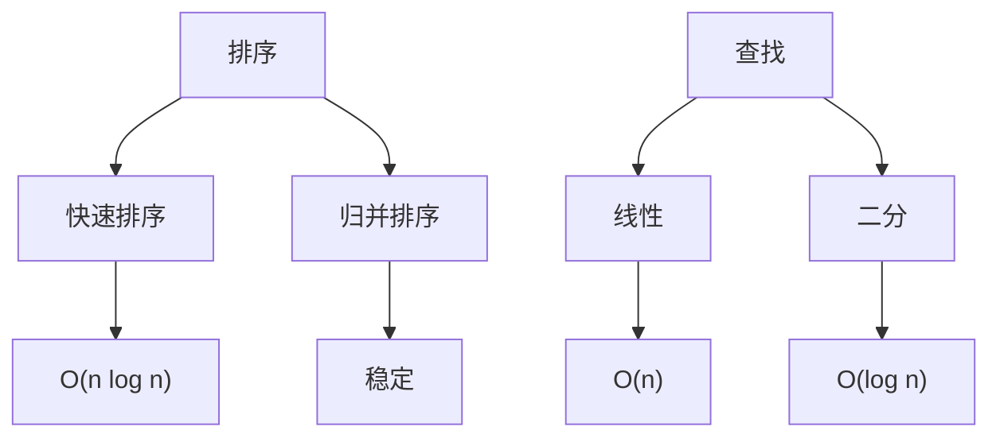
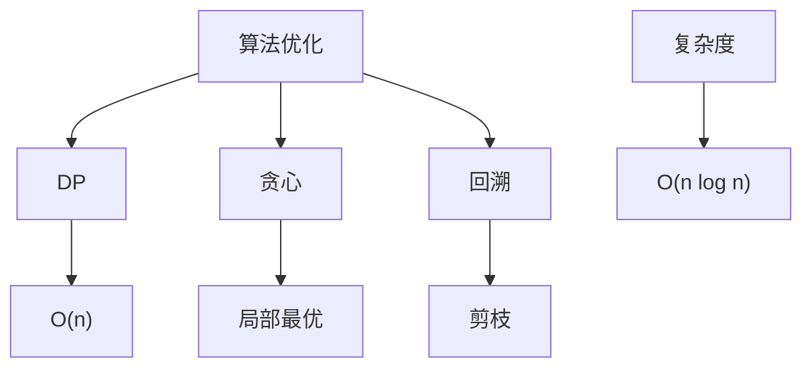

### 排序与查找
------
#### **1. 排序算法：快速排序、归并排序、堆排序**
**🔑 知识点详解**
- **快速排序（Quick Sort）**：
  - **核心定义**：基于分治，选择 pivot 分割数组，递归排序。
  - **重要特性**：原地排序，平均时间 O(n log n)，最坏 O(n²)。
  - **关键机制**：选 pivot（如首/尾/随机），左右指针交换，小于 pivot 放左，大于放右。
    - **细节**：随机 pivot 避免有序数组退化。
    👉 **注意**：不稳定排序，空间复杂度 O(log n)（递归栈）。
- **归并排序（Merge Sort）**：
  - **主要内容**：分治法，将数组分成最小单元后合并。
  - **核心特点**：稳定排序，时间 O(n log n)，空间 O(n)。
  - **实现原理**：递归分割至单元素，两两合并有序子数组。
    - **细节**：需额外数组存储合并结果。
    👉 **注意**：适合链表排序，无需随机访问。
- **堆排序（Heap Sort）**：
  - **主要内容**：基于堆，先建最大堆，逐个取出堆顶。
  - **核心特点**：时间 O(n log n)，空间 O(1)，不稳定。
  - **实现原理**：建堆 O(n)，调整堆 O(log n)，循环 n 次。
    - **细节**：从最后一个非叶节点下沉建堆。
    👉 **注意**：适合优先级排序场景。

**🔥 面试高频题**
1. 快速排序的核心思想是什么？
   - **一句话答案**：通过 pivot 分割数组，递归排序。
   - **深入回答**：选择 pivot（如随机），双指针分区，小于 pivot 放左，大于放右。平均 O(n log n)，最坏 O(n²) 若 pivot 选差。
2. 归并排序和快速排序的区别是什么？
   - **一句话答案**：归并稳定需额外空间，快速原地但不稳定。
   - **深入回答**：归并 O(n) 空间，适合外部排序；快速 O(log n) 栈空间，适合内存操作。归并始终 O(n log n)。
3. 堆排序如何实现？
   - **一句话答案**：建最大堆，依次交换堆顶和末尾并调整。
   - **深入回答**：从 n//2-1 开始 heapify 建堆，每次 pop 堆顶调整剩余堆。时间 O(n log n)。
4. 快速排序的最坏情况如何优化？
   - **一句话答案**：随机选 pivot 或三数取中。
   - **深入回答**：有序数组导致 O(n²)，随机化或取首中尾中值作 pivot，降低退化概率。

#### **2. 排序算法：冒泡排序、插入排序、选择排序**
**🔑 知识点详解**
- **冒泡排序（Bubble Sort）**：
  - **主要内容**：相邻元素比较交换，逐步“冒泡”到顶。
  - **核心特点**：稳定，时间 O(n²)，空间 O(1)。
  - **实现原理**：每轮最大值移到末尾，n-1 轮完成。
    - **细节**：可加标志优化已序情况。
    👉 **注意**：简单但效率低。
- **插入排序（Insertion Sort）**：
  - **主要内容**：将元素插入已排序部分。
  - **核心特点**：稳定，时间 O(n²)，空间 O(1)。
  - **实现原理**：从第二个元素开始，前插到合适位置。
    - **细节**：适合小数据集或近乎有序。
    👉 **注意**：比冒泡稍优。
- **选择排序（Selection Sort）**：
  - **主要内容**：每次选最小值放到前部。
  - **核心特点**：不稳定，时间 O(n²)，空间 O(1)。
  - **实现原理**：每轮从未排序部分找最小值，交换到开头。
    - **细节**：交换次数少于冒泡。
    👉 **注意**：不适应性强。

**🔥 面试高频题**
1. 冒泡排序的优化方法是什么？
   - **一句话答案**：加标志位检测是否已排序。
   - **深入回答**：若某轮无交换，说明已序，提前退出。最好 O(n)，平均仍 O(n²)。
2. 插入排序适合哪些场景？
   - **一句话答案**：小规模或部分有序数据。
   - **深入回答**：近乎有序时接近 O(n)，优于冒泡和选择，常用于小的子数组排序。
3. 选择排序为什么不稳定？
   - **一句话答案**：交换可能改变相同元素的相对顺序。
   - **深入回答**：如 [5a, 5b, 3]，选 3 交换 5a，5b 前移，顺序变 [3, 5b, 5a]。

---

#### **3. 查找算法：线性查找、二分查找**
**🔑 知识点详解**
- **线性查找**：
  - **核心定义**：逐个检查元素直到找到目标。
  - **重要特性**：简单，时间 O(n)，无需有序。
  - **关键机制**：遍历数组，比较每个元素。
    - **细节**：适用于小数据或无序集合。
    👉 **注意**：效率低，通用性强。
- **二分查找**：
  - **主要内容**：在有序数组中折半搜索。
  - **核心特点**：高效，时间 O(log n)，需预排序。
  - **实现原理**：取中点比较，递归或迭代缩小范围。
    - **细节**：左右指针更新为 `left = mid + 1` 或 `right = mid - 1`。
    👉 **注意**：边界处理易错（如越界）。

**🔥 面试高频题**
1. 线性查找和二分查找的区别是什么？
   - **一句话答案**：线性 O(n) 无需有序，二分 O(log n) 需有序。
   - **深入回答**：线性简单但慢，适合无序；二分需预排序 O(n log n)，查找快，适合静态数据。
2. 二分查找如何实现？
   - **一句话答案**：比较中点，递归或迭代缩小范围。
   - **深入回答**：迭代用 left、right 指针，mid = (left + right) // 2，注意溢出可用 `left + (right - left) // 2`。
3. 二分查找的边界条件如何处理？
   - **一句话答案**：检查 left > right 或越界。
   - **深入回答**：循环退出时 left == right + 1，未找到返回 -1。边界需测试空数组和单元素。
4. 二分查找能用于链表吗？
   - **一句话答案**：不适合。
   - **深入回答**：链表无随机访问，找中点需 O(n) 遍历，总复杂度变 O(n log n)，不如线性查找。

**🌟 重点提醒**
- **要点一**：快速、归并、堆排序是重点，复杂度需熟练。
- **要点二**：冒泡等简单排序了解即可，关注优化。
- **要点三**：二分查找依赖有序性，边界处理是关键。

**📝 实践经验**
```python
# 快速排序
def quick_sort(arr, left, right):
    if left >= right:
        return
    pivot = arr[right]
    i = left - 1
    for j in range(left, right):
        if arr[j] <= pivot:
            i += 1
            arr[i], arr[j] = arr[j], arr[i]
    arr[i + 1], arr[right] = arr[right], arr[i + 1]
    quick_sort(arr, left, i)
    quick_sort(arr, i + 2, right)
    return arr

# 归并排序
def merge_sort(arr):
    if len(arr) <= 1:
        return arr
    mid = len(arr) // 2
    left = merge_sort(arr[:mid])
    right = merge_sort(arr[mid:])
    return merge(left, right)

def merge(left, right):
    result = []
    i = j = 0
    while i < len(left) and j < len(right):
        if left[i] <= right[j]:
            result.append(left[i])
            i += 1
        else:
            result.append(right[j])
            j += 1
    result.extend(left[i:])
    result.extend(right[j:])
    return result

# 二分查找
def binary_search(arr, target):
    left, right = 0, len(arr) - 1
    while left <= right:
        mid = left + (right - left) // 2
        if arr[mid] == target:
            return mid
        elif arr[mid] < target:
            left = mid + 1
        else:
            right = mid - 1
    return -1
```

**🔧 工具辅助**


**💡 复习建议**
1. 手写快排和二分查找代码。
2. 理解归并的合并过程。
3. 对比排序算法的稳定性与复杂度。

---

### 算法优化与复杂度分析
------
#### **1. 动态规划**
**🔑 知识点详解**
- **动态规划（DP）定义**：
  - **核心定义**：通过记录子问题解避免重复计算，解决具有重叠子问题和最优子结构的问题。
  - **重要特性**：状态转移、记忆化或递推、最优性。
  - **关键机制**：定义状态（如 `dp[i]`），推导转移方程（如 `dp[i] = min(dp[i-1], dp[i-2]) + cost[i]`）。
    - **细节**：可自底向上（递推）或自顶向下（递归+记忆）。
    👉 **注意**：状态设计和边界初始化是关键。
- **实现方式**：
  - **具体说明**：一维（如斐波那契）、二维（如背包问题）、状态压缩。
  - **使用场景**：最长公共子序列（LCS）、01 背包、路径规划。
    👉 **辨析**：DP vs 分治，前者重叠子问题需记忆，后者无重叠直接递归。

**🔥 面试高频题**
1. 动态规划的核心思想是什么？
   - **一句话答案**：将大问题拆分为小问题，记录子解避免重复计算。
   - **深入回答**：通过状态和转移方程（如 `dp[i][j] = dp[i-1][j-1] + 1`），优化时间复杂度，如斐波那契从 O(2^n) 降至 O(n)。
2. 如何解决 01 背包问题？
   - **一句话答案**：用二维 DP 记录容量和物品选择。
   - **深入回答**：状态 `dp[i][j]` 表示前 i 个物品容量 j 的最大价值，转移 `dp[i][j] = max(dp[i-1][j], dp[i-1][j-w[i]] + v[i])`，时间 O(nW)。
3. 什么是状态压缩 DP？
   - **一句话答案**：用位运算或低维数组优化空间。
   - **深入回答**：如旅行商问题（TSP），用二进制表示访问状态，空间从 O(2^n * n) 降至 O(2^n)。时间不变。
4. DP 和递归的区别是什么？
   - **一句话答案**：DP 记忆子问题，递归直接分治。
   - **深入回答**：DP 适合有重叠子问题（如 LCS），递归无记忆重复计算（如二叉树遍历）。

---

#### **2. 贪心算法**
**🔑 知识点详解**
- **贪心算法定义**：
  - **核心定义**：每步选择局部最优解，期望得到全局最优。
  - **重要特性**：无回溯，依赖贪心选择性质和最优子结构。
  - **关键机制**：排序或优先级（如最小值优先），逐步构建解。
    - **细节**：需证明局部最优可推全局。
    👉 **注意**：不一定最优，需验证适用性。
- **实现方式**：
  - **具体说明**：按权重排序（如 Kruskal）、按截止时间（如活动选择）。
  - **使用场景**：最小生成树、单源最短路径（Dijkstra）、霍夫曼编码。
    👉 **辨析**：贪心 vs DP，前者无后效性，后者考虑全局。

**🔥 面试高频题**
1. 贪心算法的适用条件是什么？
   - **一句话答案**：贪心选择性质和最优子结构。
   - **深入回答**：如活动选择，按结束时间排序每次选最早结束的，证明后续选择不受影响。时间 O(n log n)。
2. 如何用贪心解决活动选择问题？
   - **一句话答案**：按结束时间排序，依次选不冲突活动。
   - **深入回答**：排序后，从第一个活动开始，若当前活动开始时间 ≥ 上个结束时间则加入，得到最大活动数。
3. 贪心和动态规划的区别是什么？
   - **一句话答案**：贪心局部决策，DP 全局优化。
   - **深入回答**：贪心如最小生成树直接选最小边，DP 如背包需比较所有组合。贪心更快但不一定最优。
4. 贪心算法的局限性是什么？
   - **一句话答案**：无法保证全局最优。
   - **深入回答**：如找零问题，面额 [1, 7, 10] 找 14，贪心得 10+4，实际最优 7+7。

---

#### **3. 回溯算法**
**🔑 知识点详解**
- **回溯算法定义**：
  - **核心定义**：通过试错搜索所有可能解，撤销不满足条件的状态。
  - **重要特性**：深度优先，状态回退，递归实现。
  - **关键机制**：构建解空间树，剪枝优化（如约束条件）。
    - **细节**：每步选择后递归，失败回溯撤销。
    👉 **注意**：时间复杂度高，需剪枝。
- **实现方式**：
  - **具体说明**：递归+状态记录（如路径），剪枝（如提前终止）。
  - **使用场景**：八皇后、组合问题、迷宫路径。
    👉 **辨析**：回溯 vs DFS，前者求解集合，后者图遍历。

**🔥 面试高频题**
1. 回溯算法的核心思想是什么？
   - **一句话答案**：尝试所有可能，失败则回退。
   - **深入回答**：用递归枚举解空间，状态保存和撤销（如标记数组），如八皇后时间 O(n!)。
2. 如何用回溯解决全排列问题？
   - **一句话答案**：递归交换元素，记录已用状态。
   - **深入回答**：从 0 开始，依次选未用数字加入路径，到达长度 n 输出，撤销选择继续。时间 O(n!)。
3. 如何优化回溯算法？
   - **一句话答案**：剪枝减少无效分支。
   - **深入回答**：如组合求和，加当前和 > 目标提前终止，时间从指数级降至可接受范围。
4. 回溯和 DP 的区别是什么？
   - **一句话答案**：回溯暴力搜索，DP 记忆最优。
   - **深入回答**：回溯枚举所有解（如排列），DP 优化子问题（如最短路径），回溯更通用但慢。

---

#### **4. 大 O 表示法，常见优化思路**
**🔑 知识点详解**
- **大 O 表示法**：
  - **核心定义**：描述算法时间或空间复杂度的上界。
  - **重要特性**：忽略常数和低阶项，关注输入规模 n 增长趋势。
  - **关键机制**：如 O(n) 线性，O(log n) 对数，O(n²) 平方。
    - **细节**：时间复杂度（计算步数），空间复杂度（内存使用）。
    👉 **注意**：最坏、平均、均摊复杂度需区分。
- **常见优化思路**：
  - **具体说明**：
    - **减少循环**：如二分代替线性。
    - **空间换时间**：哈希表、DP 表。
    - **剪枝**：回溯中提前终止。
    - **数据结构优化**：堆、Trie 替代数组。
  - **使用场景**：排序、查找、路径规划。
    👉 **辨析**：时间 vs 空间，需权衡需求。

**🔥 面试高频题**
1. 如何分析算法的时间复杂度？
   - **一句话答案**：统计操作次数，随输入规模的变化。
   - **深入回答**：如嵌套循环 O(n²)，递归深度 O(log n)，结合主定理分析（如快速排序 O(n log n)）。
2. 空间复杂度如何计算？
   - **一句话答案**：统计额外变量和递归栈空间。
   - **深入回答**：如归并排序 O(n) 辅助数组，DFS O(h) 栈空间，h 为树高。
3. 如何将 O(n²) 优化到 O(n log n)？
   - **一句话答案**：用分治或高效数据结构。
   - **深入回答**：如冒泡转快速排序，二分查找替换线性扫描，或用堆优化选择。
4. 什么是均摊时间复杂度？
   - **一句话答案**：多步操作平均后的复杂度。
   - **深入回答**：如动态数组扩容，单次 O(n)，均摊 O(1)，通过平摊分析计算。

**🌟 重点提醒**
- **要点一**：DP 优化重复计算，贪心追求局部最优。
- **要点二**：回溯需剪枝降低复杂度。
- **要点三**：复杂度分析是优化基础。

**📝 实践经验**
```python
# 动态规划：斐波那契
def fib(n):
    dp = [0] * (n + 1)
    dp[1] = 1
    for i in range(2, n + 1):
        dp[i] = dp[i-1] + dp[i-2]
    return dp[n]

# 贪心：活动选择
def activity_selection(start, end):
    activities = sorted(zip(start, end), key=lambda x: x[1])
    result = [activities[0]]
    for i in range(1, len(activities)):
        if activities[i][0] >= result[-1][1]:
            result.append(activities[i])
    return result

# 回溯：全排列
def permute(nums):
    def backtrack(path, used):
        if len(path) == len(nums):
            result.append(path[:])
            return
        for i in range(len(nums)):
            if not used[i]:
                used[i] = True
                path.append(nums[i])
                backtrack(path, used)
                path.pop()
                used[i] = False
    result = []
    backtrack([], [False] * len(nums))
    return result
```

**🔧 工具辅助**


**💡 复习建议**
1. 手写 DP 和回溯典型题。
2. 理解贪心证明过程。
3. 练习复杂度分析与优化。

---

