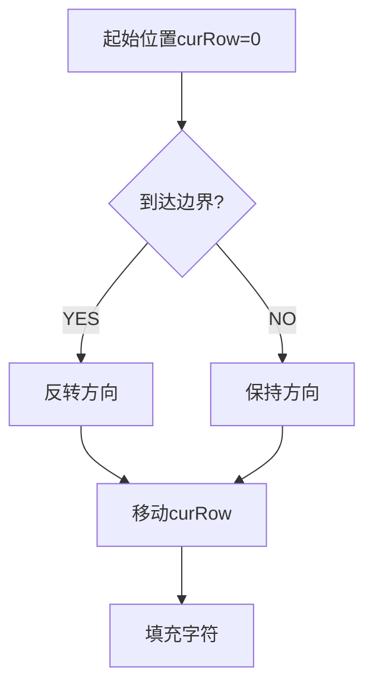
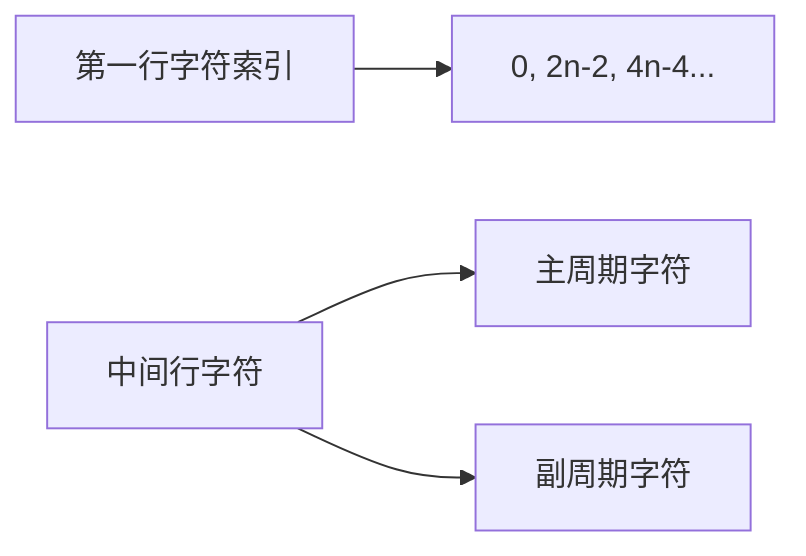

### 6. Z 字形变换（中等）
---

### 方法一：方向模拟法
#### 1️⃣ 独立思考


**卡点记录**：
1. 如何判断方向反转的时机（首行/末行）
2. 字符填充顺序的轨迹模拟（类似电梯上下运行）

#### 2️⃣ 关键解题思路
```cpp
vector<string> rows(min(numRows, int(s.size())));
int curRow = 0;
bool goingDown = false;

for (char c : s) {
    rows[curRow] += c;
    if (curRow == 0 || curRow == numRows - 1) goingDown = !goingDown;
    curRow += goingDown ? 1 : -1;
}
```

#### 3️⃣ 复杂度分析
- 时间复杂度：O(n)  
  - 每个字符仅处理1次
- 空间复杂度：O(n)  
  - 存储所有字符的临时空间

---

### 方法二：数学规律法
#### 1️⃣ 独立思考


**卡点记录**：
1. 发现中间行的双字符周期规律（主周期j和副周期k）
2. 处理最后一行的特殊情况

#### 2️⃣ 关键解题思路
```cpp
for(int i = 0; i < numRows; i++){
    if(i == 0 || i == numRows - 1) {
        for(int j = i; j < s.size(); j += cycle)
            res += s[j];
    }else {
        for(int j = i, k = cycle - i; 
            j < s.size() || k < s.size(); 
            j += cycle, k += cycle) 
        {
            if(j < s.size()) res += s[j];
            if(k < s.size()) res += s[k];
        }
    }
}
```

#### 3️⃣ 复杂度分析
- 时间复杂度：O(n)  
  - 每个字符仅访问1次
- 空间复杂度：O(1)（不计结果存储空间）
  - 仅使用固定变量

---

### 面试模拟
**面试官视角话术**：
1. "这个问题本质上是坐标映射问题，两种思路：直接模拟轨迹或寻找数学规律..."
2. "特别注意numRows=1的特殊情况处理，比如输入字符串长度小于行数时直接返回..."
3. "数学方法中周期计算是关键，2n-2的推导：n行时有n-1个下降步和n-1个上升步组成完整周期"

**常见追问**：
- 如果要求原地修改如何实现？（答：数学方法可直接操作原字符串）
- 两种方法在内存受限环境下的选择？（答：优先选择数学规律法）

---

### 提升备忘录
💡 **核心技巧**：
- 方向标志位控制移动轨迹
- 周期计算公式：cycle = 2*numRows-2

⚠️ **易错点**：
- 未处理numRows=1的边界条件
- 中间行的双周期字符顺序错误

🚩 **高频考点**：
- 字符串操作
- 数学规律发现
- 边界条件处理

**改进计划**：
1. 同类题练习：68. 文本左右对齐
2. 周期规律专题训练

