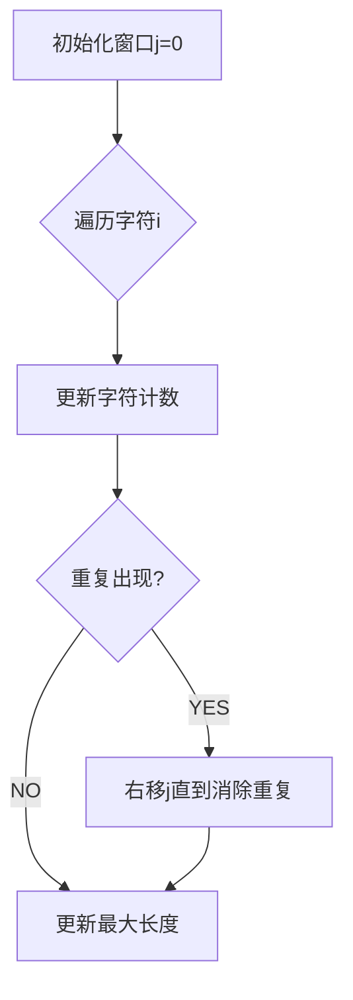

### 3. 无重复字符的最长子串（中等）
---

### 方法一：滑动窗口+哈希计数
#### 1️⃣ 独立思考


**卡点记录**：
1. 窗口收缩条件的理解（while循环的必要性）
2. 哈希表存储字符计数而非索引的取舍

#### 2️⃣ 关键解题思路
```cpp
unordered_map<char, int> heap;
int res = 0, j = 0;
for(int i = 0; i < s.size(); i++){
    heap[s[i]]++;
    while(heap[s[i]] > 1){
        heap[s[j]]--;
        j++;
    }
    res = max(res, i-j+1);
}
```

#### 3️⃣ 复杂度分析
- 时间复杂度：O(n) ⭐  （每个字符最多被j和i各访问一次）
- 空间复杂度：O(∣Σ∣)  （字符集大小）

---

### 方法二：哈希索引跳跃法
#### 1️⃣ 核心思路
```cpp
unordered_map<char, int> index;
int res = 0;
for(int i=0, j=0; i<s.size(); i++){
    if(index.find(s[i]) != index.end()){
        j = max(j, index[s[i]] + 1);  // 关键跳跃
    }
    index[s[i]] = i;
    res = max(res, i-j+1);
}
```

#### 2️⃣ 复杂度对比
- 时间复杂度：O(n) → 消除内循环
- 空间复杂度：相同但更高效

---

### 面试模拟
**面试官追问**：
Q：为什么方法一的时间复杂度是O(n)？
A：虽然存在while循环，但每个字符最多被j和i各访问一次，总操作次数2n → O(n)

Q：如何处理全唯一字符的情况？
A：窗口会一直扩展到整个字符串，时间复杂度最优

**陷阱提醒**：
- 更新窗口时忘记先计算长度
- 处理空字符串的特殊情况

---

### 提升备忘录
💡 **核心技巧**：
- 滑动窗口双指针模板
- 空间换时间思想

⚠️ **易错点**：
- 窗口右边界更新顺序
- 哈希表初始化值处理

🚩 **高频变种**：
- 最多允许k次重复（LeetCode 340）
- 包含所有字符的最短子串（LeetCode 76）

**改进计划**：
1. 实现索引跳跃法版本
2. 练习相关扩展题：
   - 159. 至多包含两个不同字符的最长子串
   - 340. 至多包含 K 个不同字符的最长子串