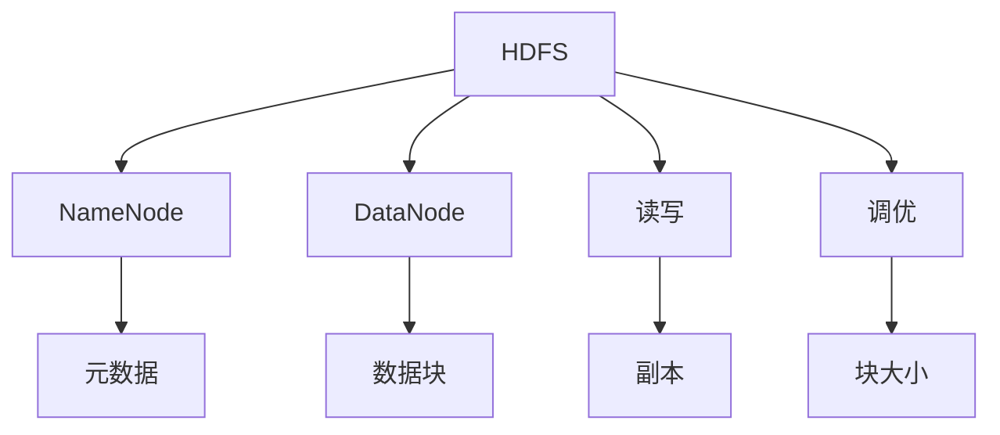

### Hadoop HDFS
------
#### **1. HDFS 体系架构（NameNode、DataNode、Secondary NameNode）**
**🔑 知识点详解**
- **NameNode**：
  - **核心定义**：HDFS 的主节点，管理文件系统命名空间和元数据。
  - **重要特性**：存储元数据（如文件名、块位置），运行于内存，单点故障风险。
  - **关键机制**：维护 FsImage（文件系统快照）和 EditLog（变更日志），通过心跳和块报告与 DataNode 通信。
    - **细节**：元数据约占 150 字节/文件，内存需求高。
    👉 **注意**：若宕机，集群不可用，需高可用（HA）配置。
- **DataNode**：
  - **主要内容**：从节点，存储实际数据块。
  - **核心特点**：支持读写请求，执行块创建、删除和复制。
  - **实现原理**：块存储于本地文件系统（如 ext4），定期发送心跳（3秒）和块报告。
    - **细节**：硬件要求低，扩展性强。
    👉 **注意**：故障不影响整体可用性，因副本机制。
- **Secondary NameNode**：
  - **主要内容**：辅助 NameNode，定期合并 FsImage 和 EditLog。
  - **核心特点**：非热备，减轻 NameNode 重启负担。
  - **实现原理**：检查点机制，周期性同步元数据。
    - **细节**：不接管 NameNode，仅备份。
    👉 **注意**：HA 模式下可替代为 Standby NameNode。

**🔥 面试高频题**
1. NameNode 和 DataNode 的角色是什么？
   - **一句话答案**：NameNode 管理元数据，DataNode 存储数据块。
   - **深入回答**：NameNode 维护文件树和块映射，DataNode 处理客户端读写并报告状态。两者通过心跳协作。
2. Secondary NameNode 的作用是什么？
   - **一句话答案**：合并 FsImage 和 EditLog，辅助 NameNode。
   - **深入回答**：周期性检查点减少 NameNode 重启时间，非 HA 模式下手动恢复元数据。
3. NameNode 是单点故障如何解决？
   - **一句话答案**：配置高可用（HA）使用 Standby NameNode。
   - **深入回答**：HA 引入备用 NameNode 和 Journal Node，共享 EditLog 实现故障切换，时间毫秒级。

---

#### **2. HDFS 读写数据流程**
**🔑 知识点详解**
- **读流程**：
  - **主要内容**：客户端通过 NameNode 获取块位置，直接从 DataNode 读取。
  - **核心特点**：并行读取，数据直流（DataNode 到客户端）。
  - **实现原理**：
    1. 客户端请求 NameNode 获取元数据。
    2. NameNode 返回块列表和 DataNode 地址。
    3. 客户端并行读取块，合并为文件。
    - **细节**：若某 DataNode 故障，客户端切换副本。
    👉 **注意**：依赖架感知优化网络。
- **写流程**：
  - **主要内容**：客户端写入 DataNode，DataNode 间复制完成副本。
  - **核心特点**：流水线复制，事务确认。
  - **实现原理**：
    1. 客户端请求 NameNode 分配块和 DataNode。
    2. 客户端写入第一 DataNode。
    3. DataNode 串行复制至其他节点（默认 3 副本）。
    4. 确认后 NameNode 更新元数据。
    - **细节**：写单线程，遵循“一次写入多次读取”。
    👉 **注意**：网络带宽影响复制效率。

**🔥 面试高频题**
1. HDFS 读数据的流程是什么？
   - **一句话答案**：客户端从 NameNode 获元数据，直接从 DataNode 并行读取。
   - **深入回答**：NameNode 提供块位置，客户端根据架感知选择最近 DataNode，读取后合并，时间 O(块数)。
2. HDFS 写数据的流水线如何工作？
   - **一句话答案**：客户端写首节点，节点间串行复制。
   - **深入回答**：如复制因子 3，客户端写 DataNode1，DataNode1 传 DataNode2，再传 DataNode3，确认后完成。
3. 读写流程中 NameNode 的作用是什么？
   - **一句话答案**：提供元数据和块分配。
   - **深入回答**：读时返回块位置，写时分配 DataNode 并记录映射，不参与数据传输。

---

#### **3. 副本机制与数据一致性（CAP 定理）**
**🔑 知识点详解**
- **副本机制**：
  - **核心定义**：数据块多份存储（默认 3），提升容错和高可用。
  - **重要特性**：架感知分配副本，故障时自动修复。
  - **关键机制**：NameNode 监控副本数，心跳检测 DataNode 状态，缺失时重新复制。
    - **细节**：如因子 3，第一副本本地，第二同架，第三异架。
    👉 **注意**：副本过多增加存储成本。
- **数据一致性**：
  - **主要内容**：HDFS 保证强一致性，写后可见。
  - **核心特点**：单写多读，元数据集中管理。
  - **实现原理**：NameNode 同步更新元数据，写操作完成才确认。
    - **细节**：不支持并发写，依赖租约机制。
    👉 **注意**：一致性依赖 NameNode 可用性。
- **CAP 定理**：
  - **主要内容**：分布式系统三选二：一致性（C）、可用性（A）、分区容忍性（P）。
  - **实现原理**：HDFS 偏 CP，优先一致性和分区容忍性。
    - **细节**：NameNode 故障暂停服务（牺牲 A），副本机制支持 P。
    👉 **注意**：HA 模式下更接近 CA。

**🔥 面试高频题**
1. HDFS 副本机制如何保证容错？
   - **一句话答案**：多份存储，故障时切换或重制副本。
   - **深入回答**：NameNode 检测 DataNode 心跳，少于复制因子时从其他节点复制，架感知优化带宽。
2. HDFS 数据一致性如何实现？
   - **一句话答案**：单写者模型和 NameNode 元数据管理。
   - **深入回答**：写操作获租约，完成后更新元数据，所有读见最新数据，强一致性。
3. HDFS 在 CAP 定理中属于哪类？
   - **一句话答案**：CP 系统。
   - **深入回答**：NameNode 集中控制一致性，分区时副本容错，但故障期间不可用，HA 提升 A。
4. 副本放置策略是什么？
   - **一句话答案**：架感知分配，优化容错和性能。
   - **深入回答**：如因子 3，第一本地，第二同架异节点，第三异架，减少跨架写入。

---

#### **4. HDFS 调优**
**🔑 知识点详解**
- **调优目标**：
  - **核心定义**：提升性能、可靠性和资源利用率。
  - **重要特性**：调整参数、优化硬件、改进策略。
  - **关键机制**：
    - **块大小**：默认 128MB，调大减少元数据开销。
    - **复制因子**：平衡容错与存储，调低节省空间。
    - **心跳间隔**：缩短（如 1 秒）加快故障检测。
    - **缓存**：启用短路读（Short-Circuit Read）绕过网络。
    - **细节**：如 `dfs.blocksize`、`dfs.replication`。
    👉 **注意**：调优需测试验证。
- **使用场景**：
  - **大文件**：增大块大小，提升吞吐。
  - **高可用**：配置 HA，优化切换。
  - **读密集**：增加副本，启用缓存。

**🔥 面试高频题**
1. 如何优化 HDFS 性能？
   - **一句话答案**：调整块大小、复制因子和缓存。
   - **深入回答**：块大（如 256MB）减元数据，心跳短（如 1 秒）快恢复，短路读提速本地访问。
2. 增大块大小的优缺点是什么？
   - **一句话答案**：提升吞吐但增加延迟。
   - **深入回答**：减少 NameNode 负担和网络请求，但小文件浪费空间，需匹配场景。
3. HDFS 如何减少 NameNode 压力？
   - **一句话答案**：增大块大小、启用检查点。
   - **深入回答**：块大减元数据量，Secondary NameNode 或 HA 定期合并日志，降低内存需求。
4. HA 如何优化 HDFS？
   - **一句话答案**：引入 Standby NameNode 提升可用性。
   - **深入回答**：双 NameNode 共享日志，故障切换快（毫秒级），避免单点瓶颈。

**🌟 重点提醒**
- **要点一**：NameNode 是核心，DataNode 承载数据。
- **要点二**：读写流程依赖架感知和副本。
- **要点三**：一致性强，调优需平衡性能与成本。

**📝 实践经验**
```python
# 检查 HDFS 文件状态（元数据）
import subprocess
subprocess.run(["hdfs", "dfs", "-ls", "/path"])  # 查看文件信息

# 模拟短路读配置（需底层支持）
# hdfs-site.xml: dfs.client.read.shortcircuit=true

# 设置块大小和复制因子
subprocess.run(["hdfs", "dfs", "-put", "-Ddfs.blocksize=268435456", "-Ddfs.replication=2", "localfile", "/hdfs/path"])
```

**🔧 工具辅助**


**💡 复习建议**
1. 手写读写流程图。
2. 理解副本分配和 CAP 权衡。
3. 实践调优参数配置。
