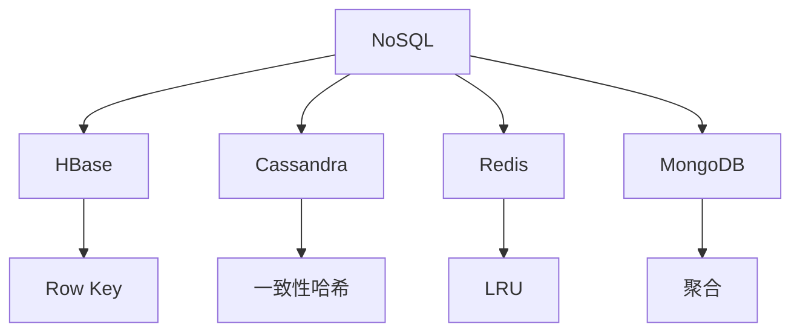

### NoSQL 数据库
------
#### **1. HBase（列存储数据库）：数据模型、Row Key 设计、HBase vs HDFS**
**🔑 知识点详解**
- **数据模型**：
  - **核心定义**：分布式列存储数据库，基于 HDFS，面向列族。
  - **重要特性**：稀疏、多版本、动态列，适合大数据随机读写。
  - **关键机制**：表结构为 Row Key + 列族 + 列限定符 + 时间戳，数据按 Row Key 排序存储。
    - **细节**：如 `{row1: {cf1: {col1: val, ts1}}}`。
    👉 **注意**：列族需预定义，列可动态添加。
- **Row Key 设计**：
  - **主要内容**：唯一标识行，影响查询和分布。
  - **核心特点**：顺序存储，需均匀分布避免热点。
  - **实现原理**：如加盐（Salt）、反转、时间前缀。
    - **细节**：设计如 `userID_timestamp` 优化范围查询。
    👉 **注意**：热点问题（如顺序递增）需分散。
- **HBase vs HDFS**：
  - **具体说明**：HBase 提供随机读写，HDFS 优化顺序读写。
  - **使用场景**：HBase 实时查询，HDFS 批处理。
    👉 **辨析**：HBase 依赖 HDFS，增加索引和一致性。

**🔥 面试高频题**
1. HBase 的数据模型是什么？
   - **一句话答案**：行键 + 列族 + 列限定符 + 时间戳。
   - **深入回答**：稀疏表，列族分组存储，多版本通过时间戳区分，适合高并发读写。
2. Row Key 设计有哪些原则？
   - **一句话答案**：唯一、均匀分布、支持查询。
   - **深入回答**：避免热点（如递增 ID 加盐），长度短，支持范围扫描（如时间前缀），如 `region_userID`。
3. HBase 和 HDFS 的区别是什么？
   - **一句话答案**：HBase 随机访问，HDFS 顺序处理。
   - **深入回答**：HBase 建于 HDFS，增加 RegionServer 和索引，适合 OLTP；HDFS 适合大文件批处理。
4. HBase 如何处理热点问题？
   - **一句话答案**：通过 Row Key 加盐或散列。
   - **深入回答**：如 `hash(userID) % n + userID`，分散数据到多 Region，均衡负载。

---

#### **2. Cassandra（分布式 KV 存储）：一致性哈希、复制策略**
**🔑 知识点详解**
- **一致性哈希**：
  - **核心定义**：分布式哈希算法，均匀分配数据并减少重分配。
  - **重要特性**：动态扩展性，故障容忍。
  - **关键机制**：节点和键映射到环上，顺时针找到负责节点。
    - **细节**：虚拟节点（VNode）优化分布。
    👉 **注意**：比普通哈希减少迁移成本。
- **复制策略**：
  - **主要内容**：多副本保证高可用和容错。
  - **核心特点**：可调一致性（如 quorum）。
  - **实现原理**：
    - **SimpleStrategy**：按环顺序复制。
    - **NetworkTopologyStrategy**：跨数据中心分配。
    - **细节**：复制因子（如 3），读写一致性级别（ANY、QUORUM）。
    👉 **注意**：一致性影响性能。
- **使用场景**：
  - **一致性哈希**：负载均衡。
  - **复制**：高可用写密集应用。

**🔥 面试高频题**
1. 一致性哈希的优点是什么？
   - **一句话答案**：减少节点变化时的数据迁移。
   - **深入回答**：环形分布，节点增删只影响邻近部分，虚拟节点进一步均衡，优于模运算。
2. Cassandra 的复制策略如何工作？
   - **一句话答案**：按复制因子分配副本到环上节点。
   - **深入回答**：如因子 3，顺时针选 3 个节点，跨架感知优化（如 NetworkTopologyStrategy）。
3. Cassandra 如何保证一致性？
   - **一句话答案**：通过可调一致性级别。
   - **深入回答**：写时 QUORUM 需多数节点确认，读时 QUORUM 取最新，牺牲部分可用性换一致性。
4. Cassandra 和 HBase 的区别是什么？
   - **一句话答案**：Cassandra 去中心化，HBase 依赖 NameNode。
   - **深入回答**：Cassandra 无单点，AP 系统，写快；HBase CP 系统，随机读写强。

---

#### **3. Redis（缓存+持久化）：数据结构、LRU 淘汰策略**
**🔑 知识点详解**
- **数据结构**：
  - **核心定义**：内存键值存储，支持丰富数据类型。
  - **重要特性**：高性能，单线程，类型如 String、Hash、List、Set、ZSet。
  - **关键机制**：底层用 SDS（简单动态字符串）、跳表（ZSet）、哈希表。
    - **细节**：如 ZSet 结合跳表和字典实现排序。
    👉 **注意**：内存操作，速度快但容量受限。
- **LRU 淘汰策略**：
  - **主要内容**：内存满时移除最近最少使用键。
  - **核心特点**：近似 LRU，默认配置可选。
  - **实现原理**：随机采样（如 5 个键）淘汰最旧，配置如 `maxmemory-policy volatile-lru`。
    - **细节**：精确 LRU 用双向链表，Redis 优化为采样。
    👉 **注意**：其他策略如 LFU、TTL。
- **使用场景**：
  - **数据结构**：缓存、排行榜、会话。
  - **LRU**：内存管理。

**🔥 面试高频题**
1. Redis 支持哪些数据结构？
   - **一句话答案**：String、Hash、List、Set、ZSet。
   - **深入回答**：String 存键值，Hash 存对象，List 队列，Set 无序集合，ZSet 有序排行，丰富场景支持。
2. Redis 的 LRU 如何实现？
   - **一句话答案**：随机采样淘汰最旧键。
   - **深入回答**：记录访问时间，内存满时采样 n 个键，移除最久未用，近似 O(1)，配置 `maxmemory-samples`。
3. Redis 为什么快？
   - **一句话答案**：内存操作和单线程。
   - **深入回答**：数据存 RAM，单线程无锁竞争，事件驱动处理高并发，延迟微秒级。
4. Redis 持久化方式有哪些？
   - **一句话答案**：RDB 和 AOF。
   - **深入回答**：RDB 定时快照，AOF 记录操作日志，混合模式兼顾速度和可靠性。

---

#### **4. MongoDB（文档数据库）：索引、聚合框架**
**🔑 知识点详解**
- **索引**：
  - **核心定义**：加速查询的 B+ 树结构。
  - **重要特性**：支持单字段、复合、多键索引。
  - **关键机制**：如 `db.collection.createIndex({field: 1})`，查询走索引。
    - **细节**：B+ 树叶子节点存数据指针。
    👉 **注意**：索引过多增加写开销。
- **聚合框架**：
  - **主要内容**：管道式数据处理，类似 SQL GROUP BY。
  - **核心特点**：多阶段操作，如 `$match`、`$group`、`$sort`。
  - **实现原理**：每个阶段变换文档流，输出聚合结果。
    - **细节**：如 `$sum` 计算总数。
    👉 **注意**：性能依赖索引支持。
- **使用场景**：
  - **索引**：频繁查询字段。
  - **聚合**：报表、统计分析。

**🔥 面试高频题**
1. MongoDB 索引的作用是什么？
   - **一句话答案**：加速查询和排序。
   - **深入回答**：B+ 树索引将 O(n) 降至 O(log n)，支持范围查询，但写操作需更新索引。
2. 聚合框架如何工作？
   - **一句话答案**：管道处理文档流。
   - **深入回答**：如 `$match` 过滤，`$group` 聚合，`$project` 投影，灵活组合实现复杂查询。
3. MongoDB 和 Redis 的区别是什么？
   - **一句话答案**：MongoDB 文档存储，Redis 键值缓存。
   - **深入回答**：MongoDB 磁盘持久化，适合复杂查询；Redis 内存存储，适合高速缓存。
4. 如何优化 MongoDB 查询？
   - **一句话答案**：添加索引，优化聚合。
   - **深入回答**：针对查询字段建索引，用 `explain()` 分析执行计划，避免全表扫描。

**🌟 重点提醒**
- **要点一**：HBase 列存储，Row Key 关键。
- **要点二**：Cassandra 去中心化，Redis 高性能。
- **要点三**：MongoDB 灵活，索引和聚合核心。

**📝 实践经验**
```python
# HBase（需安装 happybase）
import happybase
connection = happybase.Connection('localhost')
table = connection.table('mytable')
table.put('row1', {'cf1:col1': 'value1'})

# Redis
import redis
r = redis.Redis(host='localhost', port=6379)
r.set('key', 'value')
r.lpush('mylist', 'item1', 'item2')
print(r.lrange('mylist', 0, -1))  # 输出 [b'item2', b'item1']

# MongoDB
from pymongo import MongoClient
client = MongoClient('localhost', 27017)
db = client['mydb']
collection = db['mycol']
collection.insert_one({'name': 'Alice', 'age': 25})
collection.create_index([('name', 1)])
result = collection.aggregate([{'$match': {'age': 25}}, {'$group': {'_id': '$name', 'count': {'$sum': 1}}}])
print(list(result))
```

**🔧 工具辅助**


**💡 复习建议**
1. 理解 HBase Row Key 和 Cassandra 哈希。
2. 实践 Redis 数据结构和 MongoDB 聚合。
3. 对比 NoSQL 数据库的优劣。

---

