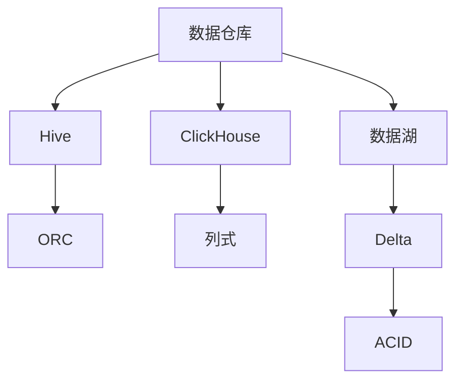

### 数据仓库 & 数据湖
------
#### **1. Hive（SQL on Hadoop）：元数据管理、存储格式（ORC, Parquet）、分区 & 分桶**
**🔑 知识点详解**
- **元数据管理**：
  - **核心定义**：Hive 是 Hadoop 上的数据仓库工具，管理元数据并支持 SQL 查询。
  - **重要特性**：存储于 Metastore（如 MySQL），映射 HDFS 文件到表。
  - **关键机制**：元数据包括表名、分区、列类型，执行时翻译为 MapReduce 或 Tez。
    - **细节**：如 `CREATE TABLE` 定义 schema。
    👉 **注意**：Metastore 是单点，需高可用。
- **存储格式（ORC, Parquet）**：
  - **主要内容**：列式存储，优化查询性能。
  - **核心特点**：
    - **ORC**：压缩高，支持谓词下推，内置索引。
    - **Parquet**：跨平台，列压缩，适合复杂分析。
    - **细节**：ORC 内置统计信息，Parquet 用 Snappy 压缩。
    👉 **注意**：比文本格式（如 CSV）节省空间。
- **分区 & 分桶**：
  - **主要内容**：优化数据查询和处理。
  - **核心特点**：
    - **分区**：按列（如日期）分目录，减少扫描。
    - **分桶**：按列（如 ID）哈希分文件，加速 join。
    - **细节**：如 `PARTITIONED BY (dt STRING)`。
    👉 **注意**：分区过多增加元数据负担。
- **使用场景**：批处理、ETL、大规模分析。

**🔥 面试高频题**
1. Hive 的元数据管理如何实现？
   - **一句话答案**：通过 Metastore 存储表结构并映射 HDFS。
   - **深入回答**：Metastore（如 MySQL）存表、分区信息，Hive 将 SQL 转为 MapReduce，查询时解析元数据定位数据。
2. ORC 和 Parquet 的区别是什么？
   - **一句话答案**：ORC 专为 Hadoop 优化，Parquet 跨平台通用。
   - **深入回答**：ORC 支持谓词下推和索引，Parquet 压缩更灵活，Parquet 更适合 Spark。
3. 分区和分桶的区别是什么？
   - **一句话答案**：分区分目录，分桶分文件。
   - **深入回答**：分区按值（如日期）物理分割，分桶哈希（如 ID）均匀分布，分桶适合 join，分区适合过滤。
4. Hive 的性能如何优化？
   - **一句话答案**：用分区、分桶、列存储和引擎切换。
   - **深入回答**：分区减少扫描，ORC/Parquet 提速查询，Tez 或 Spark 替换 MapReduce。

---

#### **2. ClickHouse（列式数据库）：高性能 OLAP 方案**
**🔑 知识点详解**
- **高性能 OLAP 方案**：
  - **核心定义**：列式存储数据库，专为实时分析设计。
  - **重要特性**：高吞吐、低延迟，单机性能强。
  - **关键机制**：
    - **列式存储**：按列存，压缩率高，查询只读相关列。
    - **向量化执行**：批量处理，充分利用 CPU。
    - **索引**：主键稀疏索引，加速过滤。
    - **细节**：如 MergeTree 引擎支持高效插入。
    👉 **注意**：写性能弱，适合读多写少。
- **使用场景**：实时报表、日志分析、时间序列。

**🔥 面试高频题**
1. ClickHouse 为什么适合 OLAP？
   - **一句话答案**：列式存储和向量化执行。
   - **深入回答**：列存减少 I/O，向量化批量计算，稀疏索引加速过滤，单查询可达亿级/秒。
2. ClickHouse 和 Hive 的区别是什么？
   - **一句话答案**：ClickHouse 实时单机强，Hive 批处理分布式。
   - **深入回答**：ClickHouse 内存优化，延迟低，Hive 依赖 Hadoop，吞吐高但慢。
3. ClickHouse 的索引如何工作？
   - **一句话答案**：稀疏主键索引定位数据块。
   - **深入回答**：每 n 行存一索引，查询时跳跃扫描，结合列存减少读取量。
4. ClickHouse 的局限性是什么？
   - **一句话答案**：写性能低，不支持事务。
   - **深入回答**：批量插入快但单次写慢，无 ACID，适合分析而非事务场景。

---

#### **3. Delta Lake / Iceberg / Hudi（数据湖架构）：ACID 事务支持**
**🔑 知识点详解**
- **Delta Lake**：
  - **核心定义**：基于 Spark 的数据湖，增加事务支持。
  - **重要特性**：ACID、时间旅行、Schema 演进。
  - **关键机制**：事务日志（Delta Log）记录操作， parquet 存数据。
    - **细节**：如 `UPDATE` 写新版本，保留旧数据。
    👉 **注意**：依赖 Spark 执行。
- **Iceberg**：
  - **主要内容**：开源数据湖表格式，解耦存储与计算。
  - **核心特点**：隐藏分区、快照管理、跨引擎支持。
  - **实现原理**：元数据树追踪快照，文件级管理。
    - **细节**：支持 Spark、Flink、Presto。
    👉 **注意**：元数据开销较高。
- **Hudi**：
  - **主要内容**：流式数据湖，支持增量更新。
  - **核心特点**：COW（写时复制）与 MOR（读时合并）。
  - **实现原理**：时间线管理更新，索引加速查询。
    - **细节**：如 upsert 操作。
    👉 **注意**：写延迟高。
- **ACID 事务支持**：
  - **具体说明**：日志记录操作，隔离读写。
  - **使用场景**：数据一致性、批流一体。

**🔥 面试高频题**
1. Delta Lake 如何实现 ACID？
   - **一句话答案**：通过事务日志和版本控制。
   - **深入回答**：Delta Log 记录每步操作（如 INSERT），读隔离旧版本，写追加新文件，保证一致性。
2. Iceberg 和 Delta Lake 的区别是什么？
   - **一句话答案**：Iceberg 跨引擎，Delta 依赖 Spark。
   - **深入回答**：Iceberg 元数据独立，支持多计算引擎，Delta 集成 Spark，时间旅行更简单。
3. Hudi 的 COW 和 MOR 有什么不同？
   - **一句话答案**：COW 写新文件，MOR 合并读。
   - **深入回答**：COW 写时复制，读快写慢；MOR 实时更新，读需合并，适合流式。
4. 数据湖为何需要 ACID？
   - **一句话答案**：保证一致性和可靠性。
   - **深入回答**：传统湖（如 HDFS）无事务，更新易出错，ACID 支持并发写和错误恢复。

**🌟 重点提醒**
- **要点一**：Hive 批处理，元数据和格式关键。
- **要点二**：ClickHouse 实时，列式高性能。
- **要点三**：数据湖架构弥补湖不足，ACID 是核心。

**🔧 工具辅助**

**💡 复习建议**
1. 理解 Hive 分区和 ClickHouse 索引。
2. 实践 Delta Lake 事务操作。
3. 对比湖架构的优劣。

