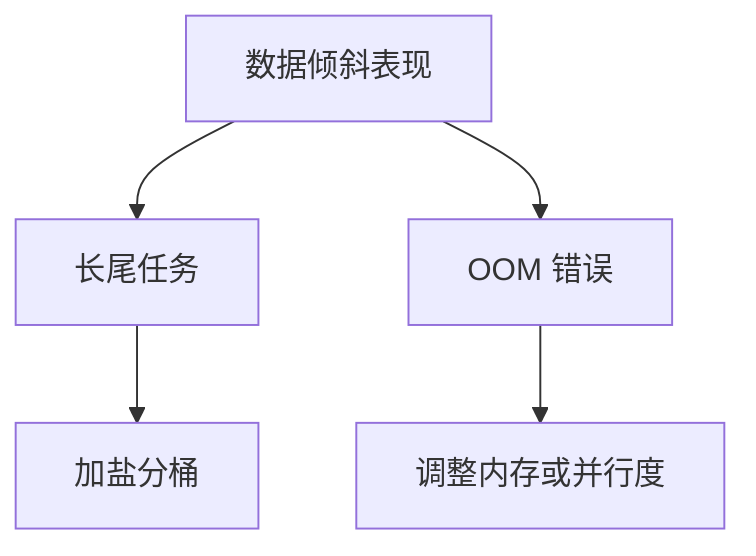

### 分布式计算框架  
------
#### **1. 批处理 - Batch Processing**  
**🔑 知识点详解**  
- **MapReduce**：  
  - **编程模型**：  
    - **Map 阶段**：输入数据分片，生成 `<key, value>` 中间结果  
    - **Reduce 阶段**：合并相同 key 的值（如求和、计数）  
  - **执行流程**：  
    
    ```mermaid
    graph LR  
    A[Input Splits] --> B[Map Task]  
    B --> C[Combiner]  
    C --> D[Partitioner & Shuffle]  
    D --> E[Reduce Task]  
    E --> F[Output]  
    ```
  - **优化技巧**：  
    - **Combiner**：本地聚合减少 Shuffle 数据传输（如 WordCount 中的预求和）  
    - **Shuffle 机制**：数据分区排序后发送到 Reducer，磁盘 I/O 密集型操作  

**🔥 面试高频题**  
1. **Combiner 和 Reducer 的区别？**  
   - **一句话答案**：Combiner 是本地优化，Reducer 是全局聚合。  
   - **深入回答**：Combiner 在 Map 端运行，处理同一 Map Task 的中间结果；Reducer 处理所有 Map 任务的输出，保证全局正确性。  

------
- **Spark（RDD、DataFrame、Dataset API）**：  
  - **核心抽象**：  
    | 抽象类型      | 特性                             | 适用场景                 |
    | ------------- | -------------------------------- | ------------------------ |
    | **RDD**       | 弹性分布式数据集，支持容错       | 底层操作，自定义计算逻辑 |
    | **DataFrame** | 结构化数据（类似表格），支持 SQL | ETL、交互式查询          |
    | **Dataset**   | 类型安全 API（Scala/Java 特有）  | 强类型数据处理           |
  - **执行优化**：  
    - **内存计算**：缓存中间结果（`cache()`/`persist()`）  
    - **DAG 调度**：将任务拆分为 Stage，优化执行顺序  

**📝 代码示例**  
```python  
# Spark RDD 操作示例  
rdd = sc.textFile("hdfs://data.txt")  
word_counts = rdd.flatMap(lambda line: line.split()) \  
                 .map(lambda word: (word, 1)) \  
                 .reduceByKey(lambda a, b: a + b)  
```

------
#### **2. 流式计算 - Stream Processing**  
**🔑 知识点详解**  
- **Flink**：  
  - **时间语义**：  
    - **事件时间（Event Time）**：基于数据自带时间戳（需处理乱序）  
    - **处理时间（Processing Time）**：基于系统时钟（低延迟但可能不准确）  
  - **状态管理**：  
    - **Operator State**：绑定到算子的并行实例（如窗口聚合结果）  
    - **Checkpoint**：周期快照状态到持久存储（支持 Exactly-Once 语义）  

**🌟 窗口类型**  
```python  
# Flink 滚动窗口示例  
data_stream.key_by("user_id") \  
           .window(TumblingEventTimeWindows.of(Time.minutes(5))) \  
           .sum("click_count")  
```

------
- **Kafka Streams**：  
  - **核心特性**：  
    - **轻量级库**：无需独立集群，直接集成到 Kafka  
    - **状态存储**：使用 RocksDB 或内存存储中间状态  
  - **流表连接**：支持 `KStream`（流）与 `KTable`（表）的 Join  

**🔥 面试高频题**  
1. **Flink 如何保证 Exactly-Once 语义？**  
   - **一句话答案**：通过 Checkpoint 快照 + 两阶段提交（2PC）。  
   - **深入回答**：Checkpoint 记录算子状态和偏移量，故障时从最近检查点恢复；Sink 端通过 2PC 确保事务一致性。  

------
#### **3. 计算优化**  
**🔑 知识点详解**  
- **数据倾斜处理**：  
  - **Join 优化**：  
    - **广播小表**：使用 `Broadcast Variables`（Spark）避免 Shuffle  
    - **分桶 Join**：预先对数据分桶（如按 Hash 值），减少跨节点传输  
  - **倾斜 Key 隔离**：将热点 Key 单独处理（如拆分或加盐）  

- **任务调优**：  
  - **并行度设置**：根据数据量和集群资源调整（避免过多小任务）  
  - **内存管理**：  
    - **Spark**：调整 `executor-memory` 和 `executor-cores`  
    - **Flink**：配置 `taskmanager.memory.process.size`  

**🔧 工具辅助**  



**💡 复习建议**  
1. 掌握 **MapReduce Shuffle 过程**与 **Spark Shuffle 优化**（Sort vs Tungsten）  
2. 熟悉 **Flink 时间语义**与 **Watermark 生成机制**  
3. 实践 **Spark 数据倾斜场景调试**（利用 Web UI 分析 Stage）  
4. 对比 **Kafka Streams 与 Flink** 的适用场景（轻量级 vs 全功能）