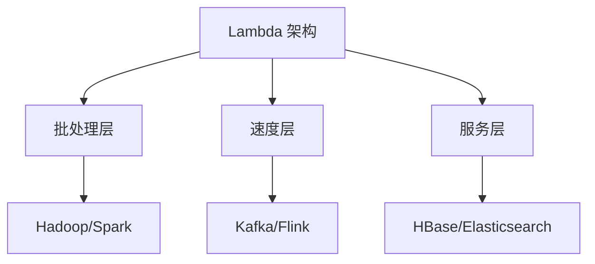
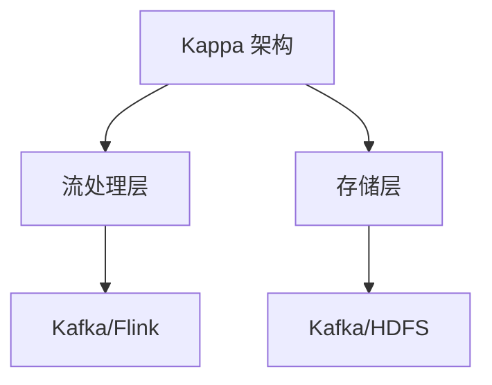
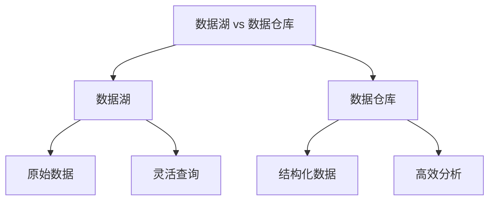
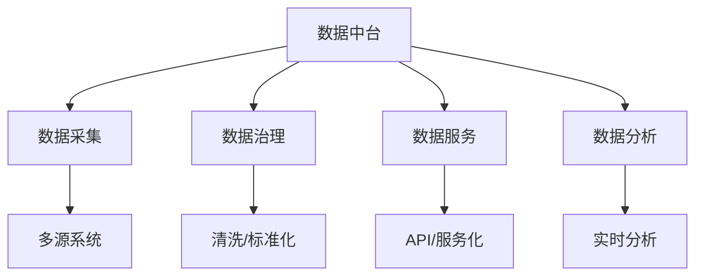

### 大数据架构
------
#### **1. Lambda 架构（批处理 + 流处理的结合）**
**🔑 知识点详解**
- **Lambda 架构的定义**：
  - **定义**：Lambda 架构是一种大数据处理架构，结合了批处理和流处理两种模式，旨在同时支持低延迟和高吞吐的数据处理。
  - **核心思想**：通过三层架构（批处理层、速度层、服务层）实现数据的高效处理和查询。
    👉 **注意**：Lambda 架构解决了实时性和准确性之间的权衡问题。

- **架构组成**：
  - **批处理层（Batch Layer）**：
    - **定义**：负责处理历史数据，生成准确但延迟较高的结果。
    - **核心组件**：Hadoop、Spark 等批处理框架。
  - **速度层（Speed Layer）**：
    - **定义**：负责处理实时数据流，生成低延迟但可能不完全准确的结果。
    - **核心组件**：Kafka、Flink、Storm 等流处理框架。
  - **服务层（Serving Layer）**：
    - **定义**：将批处理层和速度层的结果合并，提供统一的查询接口。
    - **核心组件**：HBase、Cassandra、Elasticsearch 等存储系统。

**🔥 面试高频题**
1. Lambda 架构的核心思想是什么？如何实现？
   - **一句话答案**：Lambda 架构通过批处理层和速度层的结合，兼顾实时性和准确性。
   - **深入回答**：Lambda 架构的核心思想是通过三层架构实现数据的高效处理和查询。具体实现步骤如下：
     1. **批处理层**：使用 Hadoop 或 Spark 处理历史数据，生成准确的结果。
     2. **速度层**：使用 Kafka 或 Flink 处理实时数据流，生成低延迟的结果。
     3. **服务层**：将批处理层和速度层的结果合并，通过 HBase 或 Elasticsearch 提供统一的查询接口。
     ```plaintext
     批处理层 -> 历史数据 -> 准确结果
     速度层 -> 实时数据 -> 低延迟结果
     服务层 -> 合并结果 -> 查询接口
     ```

2. Lambda 架构的优缺点是什么？
   - **一句话答案**：Lambda 架构兼顾实时性和准确性，但复杂度较高。
   - **深入回答**：Lambda 架构的优点和缺点如下：
     - **优点**：
       - 支持低延迟和高吞吐的数据处理。
       - 兼顾实时性和准确性。
       - 适合需要长期存储和分析的历史数据场景。
     - **缺点**：
       - 架构复杂，维护成本高。
       - 批处理层和速度层可能存在冗余计算。
       - 数据一致性需要额外处理。

**🌟 重点提醒**
- **要点一**：Lambda 架构通过批处理层和速度层的结合，兼顾实时性和准确性。
- **要点二**：服务层负责合并结果，提供统一查询接口。
- **要点三**：Lambda 架构适合需要长期存储和分析的历史数据场景。

**📝 实践经验**
```plaintext
# 示例：Lambda 架构中的技术栈
批处理层：Apache Spark
速度层：Apache Flink
服务层：Apache HBase
```

**🔧 工具辅助**


------
#### **2. Kappa 架构（纯流处理）**
**🔑 知识点详解**
- **Kappa 架构的定义**：
  - **定义**：Kappa 架构是一种基于纯流处理的大数据处理架构，所有数据都以流的形式处理。
  - **核心思想**：通过流处理框架实现数据的实时处理和存储，避免批处理层的冗余。
    👉 **注意**：Kappa 架构简化了架构设计，但对流处理系统的性能要求较高。

- **架构组成**：
  - **流处理层（Stream Processing Layer）**：
    - **定义**：负责处理所有数据流，包括实时数据和历史数据。
    - **核心组件**：Kafka、Flink、Kafka Streams 等流处理框架。
  - **存储层（Storage Layer）**：
    - **定义**：负责存储流处理的结果，支持高效的查询。
    - **核心组件**：Kafka、HDFS、Elasticsearch 等存储系统。

**🔥 面试高频题**
1. Kappa 架构的核心思想是什么？与 Lambda 架构的区别是什么？
   - **一句话答案**：Kappa 架构基于纯流处理，避免批处理层的冗余；Lambda 架构结合批处理和流处理。
   - **深入回答**：Kappa 架构的核心思想是通过流处理框架处理所有数据流，包括实时数据和历史数据，避免批处理层的冗余。与 Lambda 架构的区别如下：
     - **Lambda 架构**：
       - 结合批处理和流处理，兼顾实时性和准确性。
       - 架构复杂，维护成本高。
     - **Kappa 架构**：
       - 基于纯流处理，简化架构设计。
       - 对流处理系统的性能要求较高。
     ```plaintext
     Lambda 架构：批处理层 + 速度层
     Kappa 架构：纯流处理层
     ```

2. 如何选择 Lambda 架构或 Kappa 架构？
   - **一句话答案**：根据业务需求和系统性能选择合适的架构。
   - **深入回答**：选择架构时需要考虑以下因素：
     - **Lambda 架构**：
       - 适合需要长期存储和分析的历史数据场景。
       - 对实时性要求不高，但对准确性要求较高。
     - **Kappa 架构**：
       - 适合对实时性要求较高的场景。
       - 对流处理系统的性能要求较高。

**🌟 重点提醒**
- **要点一**：Kappa 架构基于纯流处理，避免批处理层的冗余。
- **要点二**：Kappa 架构简化了架构设计，但对流处理系统的性能要求较高。
- **要点三**：选择架构需根据业务需求和系统性能。

**📝 实践经验**
```plaintext
# 示例：Kappa 架构中的技术栈
流处理层：Apache Flink
存储层：Apache Kafka
```

**🔧 工具辅助**


------
#### **3. 数据湖（Data Lake） vs 数据仓库（Data Warehouse）**
**🔑 知识点详解**
- **数据湖的定义**：
  - **定义**：数据湖是一种存储大规模原始数据的系统，支持多种数据格式（如结构化、半结构化、非结构化）。
  - **核心思想**：通过低成本存储和灵活查询，支持多样化的数据分析需求。
    👉 **注意**：数据湖通常用于探索性分析和机器学习。

- **数据仓库的定义**：
  - **定义**：数据仓库是一种存储结构化数据的系统，支持高效的查询和分析。
  - **核心思想**：通过预处理和优化，支持业务智能（BI）和报表分析。
    👉 **注意**：数据仓库通常用于固定模式的分析场景。

**🔥 面试高频题**
1. 数据湖和数据仓库的区别是什么？
   - **一句话答案**：数据湖存储原始数据，支持灵活查询；数据仓库存储结构化数据，支持高效分析。
   - **深入回答**：数据湖和数据仓库的主要区别如下：
     - **数据湖**：
       - 存储原始数据，支持多种数据格式（如 JSON、CSV、图片）。
       - 适合探索性分析和机器学习。
       - 查询性能较低，灵活性较高。
     - **数据仓库**：
       - 存储结构化数据，经过预处理和优化。
       - 适合固定模式的分析场景（如 BI 报表）。
       - 查询性能较高，灵活性较低。
     ```plaintext
     数据湖：原始数据 -> 探索性分析
     数据仓库：结构化数据 -> 固定模式分析
     ```

2. 如何选择数据湖或数据仓库？
   - **一句话答案**：根据数据类型和分析需求选择合适的技术。
   - **深入回答**：选择数据湖或数据仓库时需要考虑以下因素：
     - **数据湖**：
       - 适合存储多种格式的原始数据。
       - 适合探索性分析和机器学习。
     - **数据仓库**：
       - 适合存储结构化数据。
       - 适合固定模式的分析场景（如 BI 报表）。

**🌟 重点提醒**
- **要点一**：数据湖存储原始数据，支持灵活查询。
- **要点二**：数据仓库存储结构化数据，支持高效分析。
- **要点三**：选择技术需根据数据类型和分析需求。

**📝 实践经验**
```plaintext
# 示例：数据湖和数据仓库的技术栈
数据湖：Amazon S3, Apache Hadoop
数据仓库：Snowflake, Amazon Redshift
```

**🔧 工具辅助**


------
#### **4. 数据中台（Data Middle Platform）**
**🔑 知识点详解**
- **数据中台的定义**：
  - **定义**：数据中台是一种企业级数据管理平台，旨在整合多源数据，提供统一的数据服务。
  - **核心思想**：通过数据标准化、治理和服务化，提升数据的价值和复用性。
    👉 **注意**：数据中台强调数据的共享和复用，支持业务创新。

- **核心功能**：
  - **数据采集**：从多源系统采集数据。
  - **数据治理**：清洗、标准化和质量管理。
  - **数据服务**：提供统一的 API 和数据服务。
  - **数据分析**：支持实时分析和可视化。

**🔥 面试高频题**
1. 数据中台的核心价值是什么？
   - **一句话答案**：数据中台通过数据整合和治理，提升数据的价值和复用性。
   - **深入回答**：数据中台的核心价值体现在以下几个方面：
     - **数据整合**：从多源系统采集数据，打破数据孤岛。
     - **数据治理**：通过清洗、标准化和质量管理，确保数据的准确性和一致性。
     - **数据服务**：提供统一的 API 和数据服务，支持业务创新。
     - **数据分析**：支持实时分析和可视化，提升决策效率。
     ```plaintext
     数据中台：整合 -> 治理 -> 服务 -> 分析
     ```

2. 数据中台与数据仓库的区别是什么？
   - **一句话答案**：数据中台强调数据的共享和复用，数据仓库专注于结构化数据的分析。
   - **深入回答**：数据中台和数据仓库的主要区别如下：
     - **数据中台**：
       - 整合多源数据，提供统一的数据服务。
       - 强调数据的共享和复用。
       - 支持实时分析和业务创新。
     - **数据仓库**：
       - 存储结构化数据，支持高效分析。
       - 专注于固定模式的分析场景（如 BI 报表）。

**🌟 重点提醒**
- **要点一**：数据中台通过数据整合和治理，提升数据的价值和复用性。
- **要点二**：数据中台强调数据的共享和复用。
- **要点三**：数据中台适合企业级数据管理场景。

**📝 实践经验**
```plaintext
# 示例：数据中台的技术栈
数据采集：Apache Nifi, Logstash
数据治理：Apache Atlas, Talend
数据服务：RESTful API, GraphQL
数据分析：Tableau, Power BI
```

**🔧 工具辅助**


------
#### **💡 复习建议**
1. 掌握 Lambda 架构和 Kappa 架构的核心思想及其适用场景。
2. 理解数据湖和数据仓库的区别及各自的应用场景。
3. 学习数据中台的核心功能及其对企业数据管理的价值。
4. 结合实际案例，理解不同架构和技术在大数据处理中的应用。