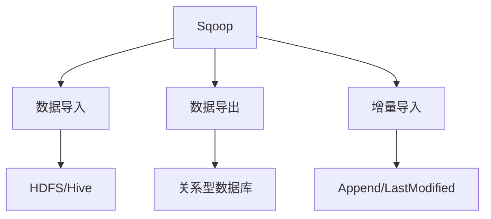
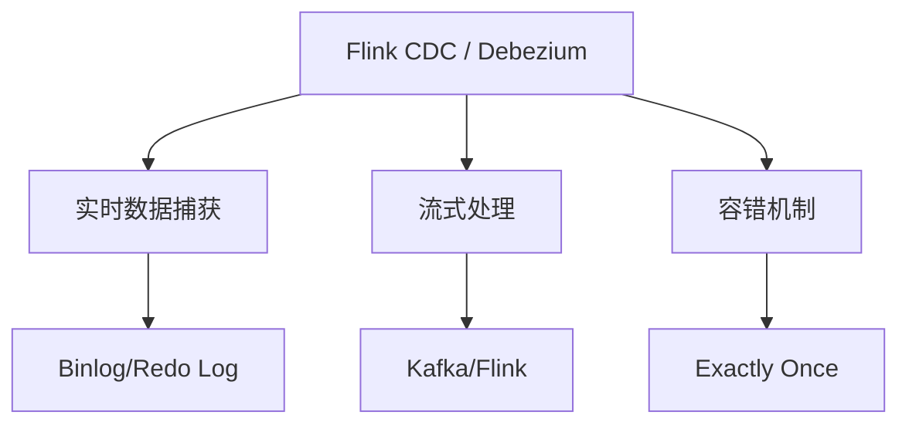
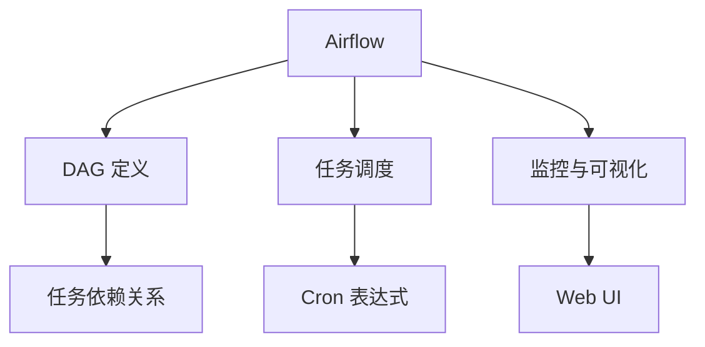

### 数据同步 & ETL 
------
#### **1. Sqoop（关系数据库 <-> Hadoop 数据迁移）**
**🔑 知识点详解**
- **Sqoop 的定义**：
  - **定义**：Sqoop 是一个用于在关系型数据库（如 MySQL、PostgreSQL）和 Hadoop 生态系统（如 HDFS、Hive）之间进行数据迁移的工具。
  - **核心思想**：通过命令行操作实现批量数据导入和导出，支持全量和增量数据同步。
    👉 **注意**：Sqoop 广泛应用于大数据场景中的离线数据同步。

- **核心功能**：
  1. **数据导入**：
     - **定义**：将关系型数据库中的数据导入到 Hadoop 生态系统中（如 HDFS、Hive）。
     - **核心特性**：
       - 支持全量导入和增量导入。
       - 自动将表结构映射为 Hive 表。
  2. **数据导出**：
     - **定义**：将 Hadoop 生态系统中的数据导出到关系型数据库中。
     - **核心特性**：
       - 支持批量导出，提升性能。
       - 可配置导出目标表的字段映射。
  3. **并行处理**：
     - **定义**：通过多线程并行处理数据，提升数据迁移效率。
     - **核心特性**：
       - 支持分片（Split）机制，按主键范围分割数据。
       - 提高大规模数据迁移的吞吐量。

**🔥 面试高频题**
1. Sqoop 的作用是什么？如何实现数据导入和导出？
   - **一句话答案**：Sqoop 用于在关系型数据库和 Hadoop 生态系统之间进行数据迁移，通过命令行实现数据导入和导出。
   - **深入回答**：Sqoop 的核心作用及其实现方式如下：
     - **数据导入**：
       - 将关系型数据库中的数据导入到 HDFS 或 Hive。
       - 示例命令：
         ```bash
         sqoop import --connect jdbc:mysql://localhost/db_name --username root --password password --table table_name --target-dir /user/hdfs/table_name
         ```
     - **数据导出**：
       - 将 HDFS 中的数据导出到关系型数据库。
       - 示例命令：
         ```bash
         sqoop export --connect jdbc:mysql://localhost/db_name --username root --password password --table table_name --export-dir /user/hdfs/table_name
         ```

2. Sqoop 的增量导入是如何工作的？
   - **一句话答案**：Sqoop 的增量导入通过指定增量列和上次同步的时间戳或主键值，仅导入新增或更新的数据。
   - **深入回答**：Sqoop 的增量导入工作原理如下：
     - **增量列**：指定一个列（如时间戳或主键）作为增量标识。
     - **增量模式**：
       - **Append 模式**：仅导入新增的数据（基于主键）。
       - **LastModified 模式**：仅导入更新的数据（基于时间戳）。
     - 示例命令：
       ```bash
       sqoop import --connect jdbc:mysql://localhost/db_name --username root --password password --table table_name --incremental append --check-column id --last-value 1000
       ```

**🌟 重点提醒**
- **要点一**：Sqoop 用于关系型数据库和 Hadoop 生态系统之间的数据迁移。
- **要点二**：支持全量和增量数据同步。
- **要点三**：通过并行处理提升数据迁移效率。

**📝 实践经验**
```plaintext
# 示例：Sqoop 数据导入和导出
数据导入：sqoop import --connect jdbc:mysql://localhost/db_name --username root --password password --table table_name --target-dir /user/hdfs/table_name
数据导出：sqoop export --connect jdbc:mysql://localhost/db_name --username root --password password --table table_name --export-dir /user/hdfs/table_name
```

**🔧 工具辅助**


------
#### **2. Flink CDC / Debezium（实时数据同步）**
**🔑 知识点详解**
- **Flink CDC 的定义**：
  - **定义**：Flink CDC 是一种基于 Apache Flink 的实时数据同步工具，通过捕获数据库的变更日志（Change Data Capture, CDC）实现实时数据同步。
  - **核心思想**：通过监听数据库的 Binlog 或 Redo Log，捕获插入、更新和删除操作，并将其转化为流式数据。
    👉 **注意**：Flink CDC 广泛应用于实时数仓和实时分析场景。

- **Debezium 的定义**：
  - **定义**：Debezium 是一个开源的分布式 CDC 工具，支持多种数据库（如 MySQL、PostgreSQL、MongoDB）的变更日志捕获。
  - **核心思想**：通过数据库的 Binlog 或 Redo Log 实现低延迟的数据同步。
    👉 **注意**：Debezium 通常与 Kafka 结合使用，构建实时数据管道。

- **核心功能**：
  1. **实时数据捕获**：
     - **定义**：通过监听数据库的日志文件，捕获数据的变更事件。
     - **核心特性**：
       - 支持插入、更新和删除操作。
       - 低延迟，适合实时场景。
  2. **流式处理**：
     - **定义**：将捕获的变更事件转化为流式数据，供下游系统消费。
     - **核心特性**：
       - 支持复杂的数据转换和聚合。
       - 可与其他流处理框架（如 Flink、Kafka Streams）集成。
  3. **容错机制**：
     - **定义**：通过检查点（Checkpoint）和状态管理确保数据一致性。
     - **核心特性**：
       - 支持 Exactly Once 语义。
       - 在故障恢复时重新处理未完成的事件。

**🔥 面试高频题**
1. Flink CDC 和 Debezium 的区别是什么？
   - **一句话答案**：Flink CDC 是基于 Flink 的实时数据同步工具，Debezium 是独立的 CDC 工具，通常与 Kafka 集成。
   - **深入回答**：Flink CDC 和 Debezium 的主要区别如下：
     - **Flink CDC**：
       - 基于 Apache Flink，直接支持流式处理。
       - 适合实时数仓和实时分析场景。
     - **Debezium**：
       - 独立的 CDC 工具，通常与 Kafka 集成。
       - 适合构建实时数据管道和事件驱动架构。

2. 如何实现基于 Flink CDC 的实时数据同步？
   - **一句话答案**：通过监听数据库的 Binlog 或 Redo Log，捕获数据变更并转化为流式数据。
   - **深入回答**：基于 Flink CDC 的实时数据同步实现步骤如下：
     1. **配置数据源**：指定数据库连接信息和表名。
     2. **捕获变更事件**：通过 Flink CDC 监听数据库的 Binlog 或 Redo Log。
     3. **流式处理**：对捕获的变更事件进行转换和聚合。
     4. **写入目标系统**：将处理后的数据写入目标系统（如 Kafka、HDFS）。
     ```java
     // 示例代码
     MySqlSource<String> mySqlSource = MySqlSource.<String>builder()
         .hostname("localhost")
         .port(3306)
         .databaseList("db_name")
         .tableList("db_name.table_name")
         .username("root")
         .password("password")
         .deserializer(new JsonDebeziumDeserializationSchema())
         .build();
     ```

**🌟 重点提醒**
- **要点一**：Flink CDC 和 Debezium 都通过监听数据库日志实现实时数据同步。
- **要点二**：Flink CDC 更适合实时数仓，Debezium 更适合事件驱动架构。
- **要点三**：支持 Exactly Once 语义，确保数据一致性。

**📝 实践经验**
```plaintext
# 示例：Flink CDC 数据同步
监听 MySQL Binlog -> 捕获变更事件 -> 流式处理 -> 写入 Kafka
```

**🔧 工具辅助**


------
#### **3. Airflow（ETL 工作流调度）**
**🔑 知识点详解**
- **Airflow 的定义**：
  - **定义**：Apache Airflow 是一个开源的工作流调度工具，用于编排复杂的 ETL 任务。
  - **核心思想**：通过 DAG（Directed Acyclic Graph）定义任务依赖关系，支持任务的自动化执行和监控。
    👉 **注意**：Airflow 广泛应用于数据管道管理和批处理任务调度。

- **核心功能**：
  1. **DAG 定义**：
     - **定义**：通过 Python 脚本定义任务及其依赖关系。
     - **核心特性**：
       - 支持任务的顺序执行、并行执行和条件分支。
       - 提供丰富的内置算子（Operator），如 BashOperator、PythonOperator。
  2. **任务调度**：
     - **定义**：根据 DAG 定义的任务依赖关系，自动调度任务执行。
     - **核心特性**：
       - 支持定时调度（如 Cron 表达式）。
       - 提供重试机制和失败告警。
  3. **监控与可视化**：
     - **定义**：通过 Web UI 实时监控任务状态和执行日志。
     - **核心特性**：
       - 提供任务的运行历史记录和性能指标。
       - 支持手动触发任务和回填数据。

**🔥 面试高频题**
1. Airflow 的核心功能是什么？如何定义 DAG？
   - **一句话答案**：Airflow 通过 DAG 定义任务依赖关系，支持任务的自动化执行和监控。
   - **深入回答**：Airflow 的核心功能及 DAG 定义方式如下：
     - **DAG 定义**：
       - 使用 Python 脚本定义 DAG，包括任务及其依赖关系。
       - 示例代码：
         ```python
         from airflow import DAG
         from airflow.operators.bash import BashOperator
         from datetime import datetime
         
         with DAG('example_dag', start_date=datetime(2023, 1, 1), schedule_interval='@daily') as dag:
             task1 = BashOperator(task_id='task1', bash_command='echo "Task 1"')
             task2 = BashOperator(task_id='task2', bash_command='echo "Task 2"')
             task1 >> task2
         ```
     - **任务调度**：
       - 根据 DAG 定义的任务依赖关系，自动调度任务执行。
       - 支持定时调度和重试机制。

2. 如何监控和优化 Airflow 的任务执行？
   - **一句话答案**：通过 Web UI 监控任务状态，优化 DAG 定义和资源配置。
   - **深入回答**：监控和优化 Airflow 任务执行的方法如下：
     - **监控**：
       - 使用 Web UI 查看任务的运行状态和日志。
       - 设置告警机制，及时发现任务失败。
     - **优化**：
       - 合理设计 DAG，避免任务间的循环依赖。
       - 调整任务的并发度和资源分配，提升执行效率。
       - 使用 XCom 共享任务间的数据，减少重复计算。

**🌟 重点提醒**
- **要点一**：Airflow 通过 DAG 定义任务依赖关系，支持任务的自动化执行。
- **要点二**：支持定时调度、重试机制和失败告警。
- **要点三**：通过 Web UI 实时监控任务状态和执行日志。

**📝 实践经验**
```plaintext
# 示例：Airflow DAG 定义
from airflow import DAG
from airflow.operators.bash import BashOperator
from datetime import datetime

with DAG('example_dag', start_date=datetime(2023, 1, 1), schedule_interval='@daily') as dag:
    task1 = BashOperator(task_id='task1', bash_command='echo "Task 1"')
    task2 = BashOperator(task_id='task2', bash_command='echo "Task 2"')
    task1 >> task2
```

**🔧 工具辅助**


------
#### **💡 复习建议**
1. 掌握 Sqoop 的核心功能及其实现方式（数据导入、导出、增量同步）。
2. 理解 Flink CDC 和 Debezium 的工作原理及适用场景。
3. 学习 Airflow 的 DAG 定义、任务调度和监控方法。
4. 结合实际案例，理解数据同步和 ETL 工具在大数据场景中的应用。