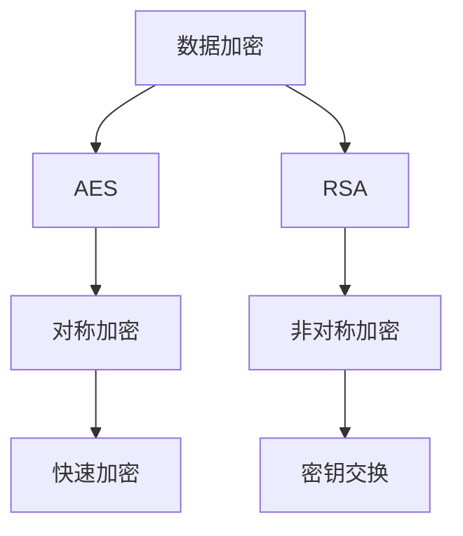
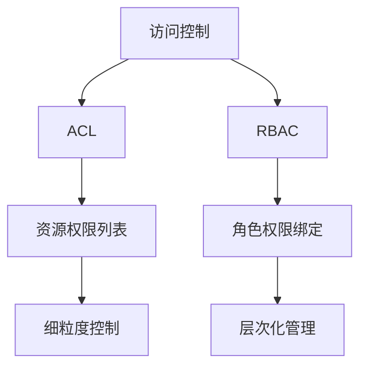
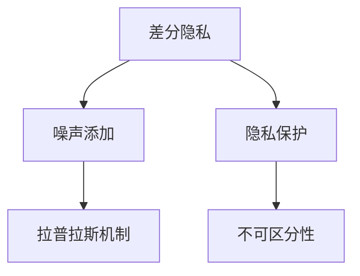

### 数据安全 & 隐私保护
------
#### **1. 数据加密（AES, RSA）**
**🔑 知识点详解**
- **数据加密的定义**：
  - **定义**：数据加密是通过算法将明文转换为密文，确保数据在传输和存储过程中的安全性。
  - **核心思想**：通过加密算法和密钥管理，防止未经授权的访问和篡改。
    👉 **注意**：加密分为对称加密（如 AES）和非对称加密（如 RSA）。

- **AES（Advanced Encryption Standard）**：
  - **定义**：AES 是一种对称加密算法，广泛应用于数据加密。
  - **核心特性**：
    - **密钥长度**：支持 128 位、192 位和 256 位密钥。
    - **加密模式**：常见模式包括 ECB（Electronic Codebook）、CBC（Cipher Block Chaining）。
    - **应用场景**：文件加密、网络通信加密。
    ```plaintext
    示例：使用 AES 加密用户密码 -> 密文存储到数据库
    ```

- **RSA（Rivest-Shamir-Adleman）**：
  - **定义**：RSA 是一种非对称加密算法，基于大整数分解的数学难题。
  - **核心特性**：
    - **公钥/私钥**：公钥用于加密，私钥用于解密。
    - **密钥长度**：通常使用 2048 位或更高。
    - **应用场景**：数字签名、密钥交换。
    ```plaintext
    示例：使用 RSA 加密会话密钥 -> 安全传输到客户端
    ```

**🔥 面试高频题**
1. 对称加密和非对称加密的区别是什么？
   - **一句话答案**：对称加密使用相同密钥进行加密和解密，非对称加密使用公钥加密、私钥解密。
   - **深入回答**：对称加密和非对称加密的主要区别如下：
     - **对称加密**：
       - 使用相同密钥进行加密和解密。
       - 加密速度快，适合大规模数据加密。
       - 常见算法：AES、DES。
     - **非对称加密**：
       - 使用公钥加密、私钥解密。
       - 加密速度慢，适合小规模数据加密。
       - 常见算法：RSA、ECC。

2. 如何选择 AES 和 RSA 的使用场景？
   - **一句话答案**：AES 适合大规模数据加密，RSA 适合密钥交换和数字签名。
   - **深入回答**：AES 和 RSA 的适用场景如下：
     - **AES**：
       - 适合加密大量数据（如文件、数据库）。
       - 加密速度快，性能优越。
     - **RSA**：
       - 适合加密小规模数据（如会话密钥）。
       - 提供更高的安全性，常用于密钥交换和数字签名。
       ```plaintext
       示例：AES 加密用户数据，RSA 加密 AES 密钥
       ```

**🌟 重点提醒**
- **要点一**：对称加密使用相同密钥，非对称加密使用公钥/私钥。
- **要点二**：AES 适合大规模数据加密，RSA 适合密钥交换和数字签名。
- **要点三**：加密算法的选择需根据场景需求权衡性能和安全性。

**📝 实践经验**
```plaintext
# 示例：AES 和 RSA 的使用
AES：加密用户密码 -> 存储到数据库
RSA：加密会话密钥 -> 安全传输到客户端
```

**🔧 工具辅助**


------
#### **2. 访问控制（ACL, RBAC）**
**🔑 知识点详解**
- **访问控制的定义**：
  - **定义**：访问控制是通过策略限制用户对资源的访问权限，确保数据的安全性。
  - **核心思想**：通过身份验证和授权机制，防止未经授权的访问。
    👉 **注意**：常见的访问控制模型包括 ACL（Access Control List）和 RBAC（Role-Based Access Control）。

- **ACL（Access Control List）**：
  - **定义**：ACL 是一种基于资源的访问控制模型，为每个资源维护一个权限列表。
  - **核心特性**：
    - **权限列表**：明确列出哪些用户或组可以访问资源。
    - **粒度**：细粒度控制，适合小型系统。
    - **应用场景**：文件系统权限管理。
    ```plaintext
    示例：文件 A 的 ACL -> 用户 A 可读写，用户 B 只读
    ```

- **RBAC（Role-Based Access Control）**：
  - **定义**：RBAC 是一种基于角色的访问控制模型，通过角色分配权限。
  - **核心特性**：
    - **角色定义**：将权限与角色绑定，用户通过角色获得权限。
    - **层次化**：支持角色继承，适合大型系统。
    - **应用场景**：企业级权限管理。
    ```plaintext
    示例：角色“管理员” -> 拥有所有权限，用户 A 属于“管理员”
    ```

**🔥 面试高频题**
1. ACL 和 RBAC 的区别是什么？如何选择？
   - **一句话答案**：ACL 基于资源管理权限，RBAC 基于角色分配权限；ACL 适合小型系统，RBAC 适合大型系统。
   - **深入回答**：ACL 和 RBAC 的主要区别及选择方式如下：
     - **ACL**：
       - 基于资源管理权限，为每个资源维护一个权限列表。
       - 适合小型系统，权限管理简单直观。
     - **RBAC**：
       - 基于角色分配权限，通过角色继承实现层次化管理。
       - 适合大型系统，权限管理灵活且易于扩展。
     ```plaintext
     示例：小型系统 -> 使用 ACL 管理文件权限
     大型系统 -> 使用 RBAC 管理企业权限
     ```

2. 如何设计一个基于 RBAC 的权限管理系统？
   - **一句话答案**：通过角色定义、权限分配和用户关联，实现灵活的权限管理。
   - **深入回答**：基于 RBAC 的权限管理系统设计步骤如下：
     1. **角色定义**：定义系统中的角色（如管理员、普通用户）。
     2. **权限分配**：将权限与角色绑定（如“管理员”拥有所有权限）。
     3. **用户关联**：将用户分配到对应的角色。
     4. **动态调整**：支持角色和权限的动态调整。
     ```plaintext
     示例：角色“管理员” -> 权限“增删改查”，用户 A 属于“管理员”
     ```

**🌟 重点提醒**
- **要点一**：ACL 基于资源管理权限，RBAC 基于角色分配权限。
- **要点二**：ACL 适合小型系统，RBAC 适合大型系统。
- **要点三**：RBAC 支持角色继承，权限管理更灵活。

**📝 实践经验**
```plaintext
# 示例：ACL 和 RBAC 的使用
ACL：文件 A -> 用户 A 可读写，用户 B 只读
RBAC：角色“管理员” -> 拥有所有权限，用户 A 属于“管理员”
```

**🔧 工具辅助**


------
#### **3. 差分隐私（Differential Privacy）**
**🔑 知识点详解**
- **差分隐私的定义**：
  - **定义**：差分隐私是一种隐私保护技术，通过在数据中添加噪声，确保个体数据无法被推断。
  - **核心思想**：在数据分析过程中引入随机性，保护敏感信息。
    👉 **注意**：差分隐私广泛应用于统计分析和机器学习。

- **核心原理**：
  1. **噪声添加**：
     - **定义**：在查询结果中添加随机噪声，掩盖个体数据的影响。
     - **核心特性**：
       - **隐私预算（ε）**：控制噪声强度，平衡隐私性和准确性。
       - **拉普拉斯机制**：常用噪声分布，适合数值型数据。
  2. **隐私保护**：
     - **定义**：确保攻击者无法通过查询结果推断个体数据。
     - **核心特性**：
       - **不可区分性**：无论是否包含某个个体，查询结果的分布相似。
       - **适用场景**：人口普查、医疗数据分析。

**🔥 面试高频题**
1. 差分隐私的作用是什么？如何实现？
   - **一句话答案**：差分隐私通过在数据中添加噪声，确保个体数据无法被推断。
   - **深入回答**：差分隐私的作用及其实现方式如下：
     - **作用**：
       - **隐私保护**：防止攻击者通过查询结果推断个体数据。
       - **数据分析**：在保护隐私的同时支持统计分析。
     - **实现方式**：
       - **噪声添加**：在查询结果中添加随机噪声（如拉普拉斯噪声）。
       - **隐私预算（ε）**：控制噪声强度，平衡隐私性和准确性。
       ```plaintext
       示例：人口普查数据 -> 添加噪声 -> 发布统计结果
       ```

2. 差分隐私的优缺点是什么？
   - **一句话答案**：差分隐私的优点是保护个体隐私，缺点是可能降低数据分析的准确性。
   - **深入回答**：差分隐私的优缺点如下：
     - **优点**：
       - **隐私保护**：确保个体数据无法被推断。
       - **广泛应用**：适用于多种数据分析场景。
     - **缺点**：
       - **准确性降低**：噪声可能导致统计结果偏离真实值。
       - **复杂性增加**：需要设计合适的噪声分布和隐私预算。

**🌟 重点提醒**
- **要点一**：差分隐私通过添加噪声保护个体隐私。
- **要点二**：隐私预算（ε）控制噪声强度，平衡隐私性和准确性。
- **要点三**：差分隐私适用于统计分析和机器学习。

**📝 实践经验**
```plaintext
# 示例：差分隐私的应用
人口普查数据 -> 添加拉普拉斯噪声 -> 发布统计结果
```

**🔧 工具辅助**


------
#### **💡 复习建议**
1. 掌握数据加密的核心算法（AES、RSA）及其适用场景。
2. 理解访问控制模型（ACL、RBAC）的区别及设计方法。
3. 学习差分隐私的原理及其在隐私保护中的应用。
4. 结合实际案例，理解数据安全和隐私保护在企业中的重要性。