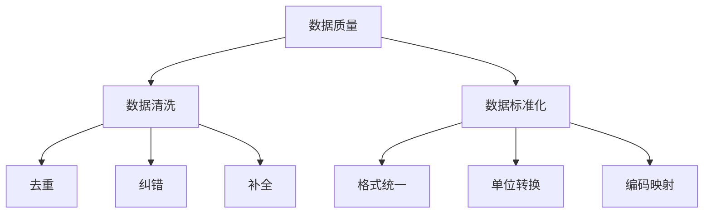
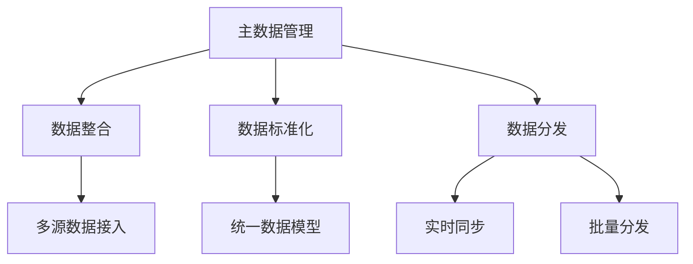
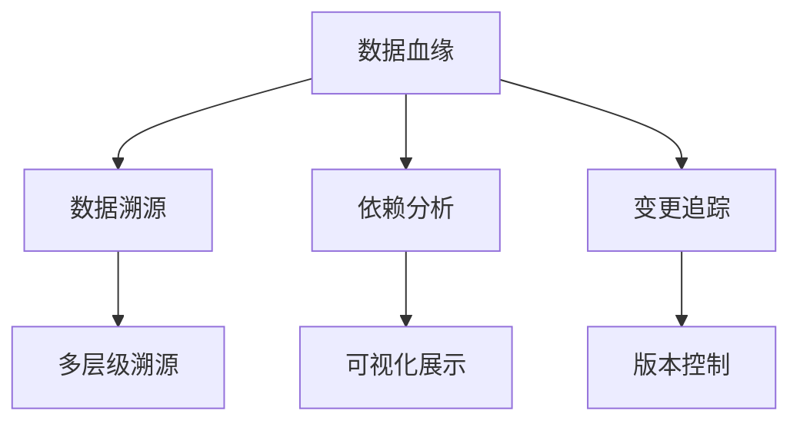
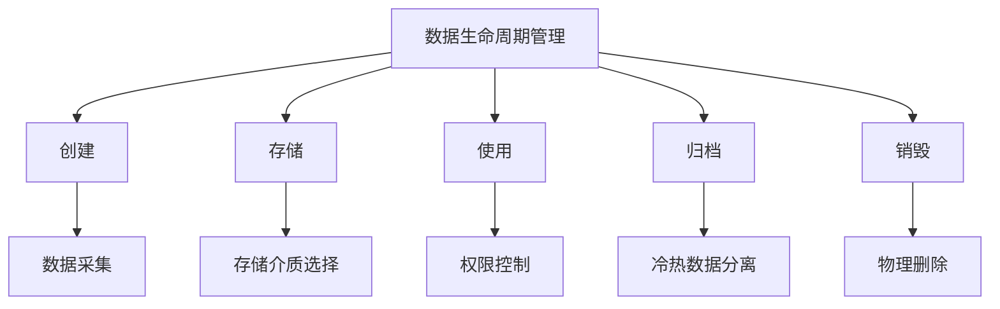

### 数据治理
------
#### **1. 数据质量（数据清洗、数据标准化）**
**🔑 知识点详解**
- **数据质量的定义**：
  - **定义**：数据质量是指数据在准确性、完整性、一致性、及时性和唯一性等方面的特性。
  - **核心思想**：通过数据清洗和标准化提升数据的可用性和可靠性。
    👉 **注意**：高质量的数据是数据分析和决策的基础。

- **数据清洗**：
  - **定义**：数据清洗是对原始数据进行处理，去除噪声、纠正错误和填补缺失值的过程。
  - **核心步骤**：
    1. **去重**：删除重复记录，确保数据唯一性。
    2. **纠错**：修正格式错误、拼写错误等。
    3. **补全**：填补缺失值，如使用均值、中位数或插值法。
    4. **验证**：检查数据是否符合业务规则和逻辑约束。
    ```plaintext
    示例：清洗客户数据 -> 删除重复记录 -> 修正电话号码格式 -> 填补缺失地址
    ```

- **数据标准化**：
  - **定义**：数据标准化是将数据转换为统一格式和单位的过程，便于后续分析和处理。
  - **核心方法**：
    1. **格式统一**：如日期格式统一为“YYYY-MM-DD”。
    2. **单位转换**：如将长度单位从英寸转换为厘米。
    3. **编码映射**：如将性别字段的“男/女”映射为“M/F”。
    ```plaintext
    示例：标准化订单数据 -> 统一日期格式 -> 转换货币单位 -> 映射状态码
    ```

**🔥 面试高频题**
1. 数据质量的重要性是什么？如何提升数据质量？
   - **一句话答案**：数据质量直接影响分析结果和决策，通过数据清洗和标准化提升数据质量。
   - **深入回答**：数据质量的重要性及提升方法如下：
     - **重要性**：
       - **准确性**：确保数据真实反映业务情况。
       - **完整性**：避免因数据缺失导致分析偏差。
       - **一致性**：保证不同来源的数据具有一致性。
     - **提升方法**：
       - **数据清洗**：去重、纠错、补全和验证。
       - **数据标准化**：格式统一、单位转换和编码映射。
       - **自动化工具**：使用 ETL 工具（如 Talend、Informatica）实现自动化清洗和标准化。

2. 数据清洗和数据标准化的区别是什么？
   - **一句话答案**：数据清洗关注数据的准确性和完整性，数据标准化关注数据的格式和单位统一。
   - **深入回答**：数据清洗和数据标准化的主要区别如下：
     - **数据清洗**：
       - 目标：去除噪声、纠正错误和填补缺失值。
       - 方法：去重、纠错、补全和验证。
     - **数据标准化**：
       - 目标：将数据转换为统一格式和单位。
       - 方法：格式统一、单位转换和编码映射。

**🌟 重点提醒**
- **要点一**：数据质量直接影响分析结果和决策。
- **要点二**：数据清洗关注数据的准确性和完整性。
- **要点三**：数据标准化关注数据的格式和单位统一。

**📝 实践经验**
```plaintext
# 示例：数据清洗和标准化
数据清洗：删除重复记录 -> 修正格式错误 -> 填补缺失值
数据标准化：统一日期格式 -> 转换货币单位 -> 映射状态码
```

**🔧 工具辅助**


------
#### **2. 主数据管理（MDM）**
**🔑 知识点详解**
- **主数据管理的定义**：
  - **定义**：主数据管理（Master Data Management, MDM）是对企业核心数据（如客户、产品、供应商）进行集中管理和标准化的过程。
  - **核心思想**：通过统一主数据，消除数据孤岛，提升数据一致性和复用性。
    👉 **注意**：主数据是跨部门共享的核心数据。

- **核心功能**：
  1. **数据整合**：
     - **定义**：将分散在不同系统中的主数据整合到统一平台。
     - **核心特性**：
       - 支持多源数据接入。
       - 提供数据映射和转换功能。
  2. **数据标准化**：
     - **定义**：对主数据进行标准化处理，确保数据一致性。
     - **核心特性**：
       - 定义统一的数据模型。
       - 提供数据校验和清洗功能。
  3. **数据分发**：
     - **定义**：将标准化后的主数据分发到下游系统。
     - **核心特性**：
       - 支持实时同步和批量分发。
       - 提供数据订阅和通知机制。

**🔥 面试高频题**
1. 主数据管理的作用是什么？如何实现？
   - **一句话答案**：主数据管理通过集中管理和标准化核心数据，消除数据孤岛，提升数据一致性和复用性。
   - **深入回答**：主数据管理的作用及其实现方式如下：
     - **作用**：
       - **消除数据孤岛**：整合分散在不同系统中的主数据。
       - **提升一致性**：通过标准化处理确保数据一致性。
       - **增强复用性**：为主数据提供统一访问接口。
     - **实现方式**：
       - **数据整合**：将多源数据接入统一平台。
       - **数据标准化**：定义统一的数据模型并进行清洗。
       - **数据分发**：将标准化后的主数据分发到下游系统。
       ```plaintext
       示例：整合客户数据 -> 标准化客户信息 -> 分发到 CRM 和 ERP 系统
       ```

2. 主数据管理与数据仓库的区别是什么？
   - **一句话答案**：主数据管理关注核心数据的集中管理和标准化，数据仓库关注历史数据的存储和分析。
   - **深入回答**：主数据管理和数据仓库的主要区别如下：
     - **主数据管理**：
       - 关注核心数据（如客户、产品、供应商）。
       - 强调数据的一致性和复用性。
       - 提供实时数据分发能力。
     - **数据仓库**：
       - 关注历史数据的存储和分析。
       - 强调数据的查询性能和分析能力。
       - 通常用于报表和 BI 场景。

**🌟 重点提醒**
- **要点一**：主数据管理通过集中管理和标准化核心数据，消除数据孤岛。
- **要点二**：主数据是跨部门共享的核心数据。
- **要点三**：主数据管理与数据仓库的关注点不同。

**📝 实践经验**
```plaintext
# 示例：主数据管理流程
数据整合：接入 CRM 和 ERP 系统中的客户数据
数据标准化：统一客户信息格式和编码
数据分发：将标准化后的客户数据分发到下游系统
```

**🔧 工具辅助**


------
#### **3. 数据血缘（Data Lineage）**
**🔑 知识点详解**
- **数据血缘的定义**：
  - **定义**：数据血缘（Data Lineage）是描述数据从源头到目标的流转路径和依赖关系的过程。
  - **核心思想**：通过追踪数据的来源和变化，提升数据的透明性和可追溯性。
    👉 **注意**：数据血缘广泛应用于数据治理和合规性审计。

- **核心功能**：
  1. **数据溯源**：
     - **定义**：追踪数据的来源和生成过程。
     - **核心特性**：
       - 支持多层级溯源。
       - 提供详细的元数据信息。
  2. **依赖分析**：
     - **定义**：分析数据之间的依赖关系，识别关键节点。
     - **核心特性**：
       - 支持可视化展示。
       - 提供影响分析功能。
  3. **变更追踪**：
     - **定义**：记录数据的变化历史，便于回溯和审计。
     - **核心特性**：
       - 支持版本控制。
       - 提供变更日志。

**🔥 面试高频题**
1. 数据血缘的作用是什么？如何实现？
   - **一句话答案**：数据血缘通过追踪数据的来源和变化，提升数据的透明性和可追溯性。
   - **深入回答**：数据血缘的作用及其实现方式如下：
     - **作用**：
       - **数据溯源**：追踪数据的来源和生成过程。
       - **依赖分析**：识别数据之间的依赖关系。
       - **变更追踪**：记录数据的变化历史。
     - **实现方式**：
       - **元数据管理**：收集和存储数据的元信息。
       - **可视化工具**：通过图形化界面展示数据血缘。
       - **自动化追踪**：利用工具（如 Apache Atlas、Collibra）自动捕获数据流转信息。
       ```plaintext
       示例：追踪订单数据 -> 源头为 CRM 系统 -> 中间经过 ETL 处理 -> 最终存储在数据仓库
       ```

2. 数据血缘在数据治理中的应用场景有哪些？
   - **一句话答案**：数据血缘在数据治理中用于数据溯源、依赖分析和变更追踪。
   - **深入回答**：数据血缘的应用场景如下：
     - **数据溯源**：在数据质量问题发生时，快速定位问题源头。
     - **依赖分析**：在系统升级或改造时，评估对下游系统的影响。
     - **变更追踪**：在合规性审计时，提供数据变化的历史记录。

**🌟 重点提醒**
- **要点一**：数据血缘通过追踪数据的来源和变化，提升透明性和可追溯性。
- **要点二**：数据血缘广泛应用于数据治理和合规性审计。
- **要点三**：支持数据溯源、依赖分析和变更追踪。

**📝 实践经验**
```plaintext
# 示例：数据血缘的应用
数据溯源：追踪订单数据的来源和生成过程
依赖分析：识别订单数据与库存数据的依赖关系
变更追踪：记录订单数据的变化历史
```

**🔧 工具辅助**


------
#### **4. 数据生命周期管理**
**🔑 知识点详解**
- **数据生命周期管理的定义**：
  - **定义**：数据生命周期管理（Data Lifecycle Management, DLM）是对数据从创建到销毁的全过程进行管理的过程。
  - **核心思想**：通过合理的策略管理数据的存储、使用和销毁，降低存储成本并满足合规要求。
    👉 **注意**：数据生命周期分为创建、存储、使用、归档和销毁五个阶段。

- **核心阶段**：
  1. **创建**：
     - **定义**：数据从源头生成，进入系统。
     - **核心特性**：
       - 数据采集工具（如 Kafka、Flume）。
       - 数据质量检查。
  2. **存储**：
     - **定义**：数据被存储在适当的介质中，便于后续访问。
     - **核心特性**：
       - 存储介质选择（如 HDFS、S3）。
       - 数据分区和索引优化。
  3. **使用**：
     - **定义**：数据被分析和处理，产生价值。
     - **核心特性**：
       - 数据访问权限控制。
       - 数据缓存和加速。
  4. **归档**：
     - **定义**：不常用的数据被迁移到低成本存储中。
     - **核心特性**：
       - 归档策略（如冷热数据分离）。
       - 数据压缩和加密。
  5. **销毁**：
     - **定义**：不再需要的数据被安全删除。
     - **核心特性**：
       - 数据销毁策略（如物理删除、逻辑删除）。
       - 合规性审计。

**🔥 面试高频题**
1. 数据生命周期管理的意义是什么？如何实现？
   - **一句话答案**：数据生命周期管理通过合理管理数据的存储、使用和销毁，降低存储成本并满足合规要求。
   - **深入回答**：数据生命周期管理的意义及其实现方式如下：
     - **意义**：
       - **降低成本**：通过冷热数据分离和归档策略降低存储成本。
       - **提升效率**：优化数据存储和访问策略，提升查询性能。
       - **满足合规**：确保数据销毁符合法律法规。
     - **实现方式**：
       - **创建**：使用数据采集工具并进行质量检查。
       - **存储**：选择合适的存储介质并优化分区和索引。
       - **使用**：控制数据访问权限并加速数据访问。
       - **归档**：制定归档策略并迁移不常用数据。
       - **销毁**：实施数据销毁策略并记录销毁日志。
       ```plaintext
       示例：订单数据 -> 创建 -> 存储 -> 使用 -> 归档 -> 销毁
       ```

2. 数据归档和销毁的策略有哪些？
   - **一句话答案**：数据归档策略包括冷热数据分离和压缩加密，数据销毁策略包括物理删除和逻辑删除。
   - **深入回答**：数据归档和销毁的策略如下：
     - **归档策略**：
       - **冷热数据分离**：将不常用的数据迁移到低成本存储中。
       - **压缩加密**：减少存储空间占用并保护数据隐私。
     - **销毁策略**：
       - **物理删除**：彻底删除数据，无法恢复。
       - **逻辑删除**：标记数据为已删除，但仍保留一段时间。

**🌟 重点提醒**
- **要点一**：数据生命周期管理分为创建、存储、使用、归档和销毁五个阶段。
- **要点二**：通过冷热数据分离和归档策略降低存储成本。
- **要点三**：数据销毁需满足合规性要求。

**📝 实践经验**
```plaintext
# 示例：数据生命周期管理
创建：采集订单数据并进行质量检查
存储：存储在 HDFS 中并优化分区
使用：控制访问权限并加速查询
归档：迁移不常用数据到 S3 冷存储
销毁：实施物理删除策略并记录日志
```

**🔧 工具辅助**


------
#### **💡 复习建议**
1. 掌握数据质量的提升方法（数据清洗、数据标准化）。
2. 理解主数据管理的核心功能及其与数据仓库的区别。
3. 学习数据血缘的作用及其实现方式。
4. 掌握数据生命周期管理的五个阶段及其策略。
5. 结合实际案例，理解数据治理在企业中的应用。