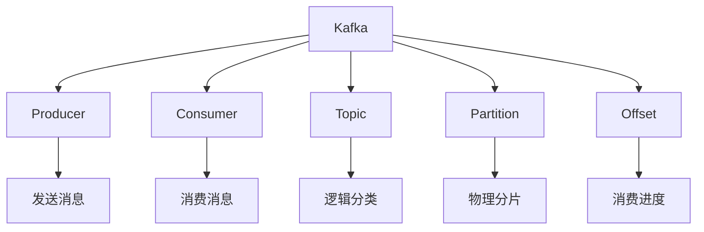
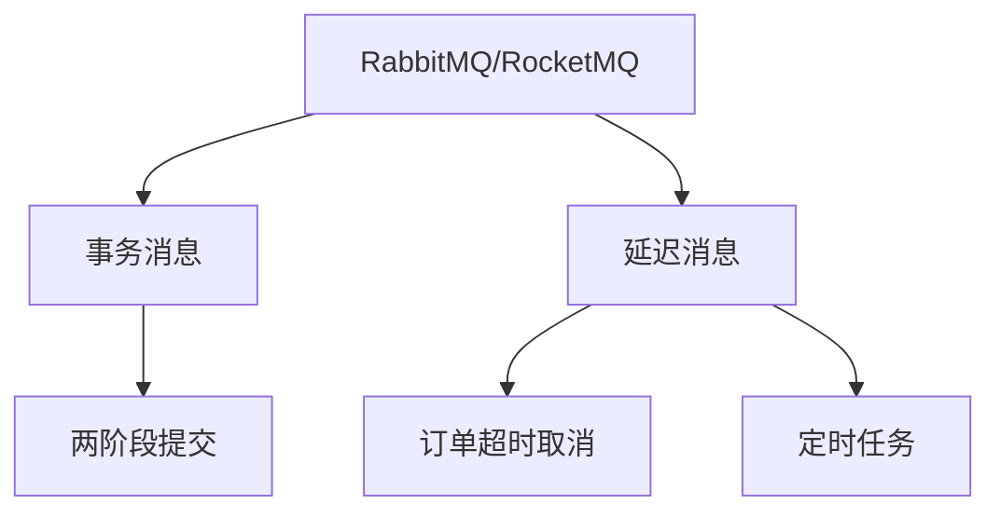

### 消息队列（MQ）
------
#### **1. Kafka（高吞吐消息队列）**
**🔑 知识点详解**
- **Kafka 的定义**：
  - **定义**：Kafka 是一种分布式流处理平台，专为高吞吐量、低延迟的消息传递设计。
  - **核心思想**：通过分区（Partition）和消费者组（Consumer Group）实现水平扩展和负载均衡。
    👉 **注意**：Kafka 广泛应用于日志收集、实时数据流处理等场景。

- **核心组件**：
  1. **Producer（生产者）**：
     - **定义**：负责向 Kafka 集群发送消息。
     - **核心特性**：
       - 支持批量发送，提升性能。
       - 可配置消息的分区策略（如轮询、哈希）。
  2. **Consumer（消费者）**：
     - **定义**：负责从 Kafka 集群消费消息。
     - **核心特性**：
       - 消费者组机制支持负载均衡。
       - 偏移量（Offset）控制消费进度。
  3. **Topic（主题）**：
     - **定义**：消息的逻辑分类，类似于数据库中的表。
     - **核心特性**：
       - 支持多分区（Partition），提升并发能力。
       - 每个分区是有序的，保证消息顺序性。
  4. **Partition（分区）**：
     - **定义**：Topic 的物理分片，每个分区存储部分消息。
     - **核心特性**：
       - 分区是 Kafka 并发的核心，支持水平扩展。
       - 每个分区只能被一个消费者组内的一个消费者消费。
  5. **Offset（偏移量）**：
     - **定义**：消息在分区中的唯一标识，用于记录消费进度。
     - **核心特性**：
       - 消费者可以手动或自动提交 Offset。
       - 支持从指定 Offset 重新消费消息。

**🔥 面试高频题**
1. Kafka 的核心组件有哪些？它们的作用是什么？
   - **一句话答案**：Kafka 的核心组件包括 Producer、Consumer、Topic、Partition 和 Offset，分别负责消息生产、消费、分类、分区和消费进度管理。
   - **深入回答**：Kafka 的核心组件及其作用如下：
     - **Producer**：负责向 Kafka 集群发送消息，支持批量发送和分区策略。
     - **Consumer**：负责从 Kafka 集群消费消息，支持消费者组和 Offset 控制。
     - **Topic**：消息的逻辑分类，支持多分区以提升并发能力。
     - **Partition**：Topic 的物理分片，保证分区内的消息顺序性。
     - **Offset**：消息在分区中的唯一标识，用于记录消费进度。

2. Kafka 如何保证高吞吐量？
   - **一句话答案**：Kafka 通过分区、批量发送和顺序写入磁盘实现高吞吐量。
   - **深入回答**：Kafka 的高吞吐量特性主要依赖以下机制：
     - **分区**：通过分区实现水平扩展，多个消费者并行处理消息。
     - **批量发送**：Producer 将多条消息打包成批次发送，减少网络开销。
     - **顺序写入磁盘**：Kafka 将消息顺序写入磁盘，避免随机 I/O 的性能瓶颈。
     - **零拷贝技术**：通过零拷贝技术减少数据在内核态和用户态之间的拷贝次数。

3. Kafka 的消费者组机制是如何工作的？
   - **一句话答案**：消费者组机制通过分区分配实现负载均衡，确保每个分区只被一个消费者消费。
   - **深入回答**：Kafka 的消费者组机制工作原理如下：
     - **消费者组**：一组消费者共同消费一个 Topic 的消息。
     - **分区分配**：Kafka 根据分区数量和消费者数量动态分配分区。
     - **负载均衡**：每个分区只能被消费者组内的一个消费者消费，避免重复消费。
     ```plaintext
     示例：Topic A 有 3 个分区，消费者组中有 2 个消费者，分区分配可能为：
     消费者 1：分区 0、分区 1
     消费者 2：分区 2
     ```

**🌟 重点提醒**
- **要点一**：Kafka 的核心组件包括 Producer、Consumer、Topic、Partition 和 Offset。
- **要点二**：Kafka 通过分区和批量发送实现高吞吐量。
- **要点三**：消费者组机制通过分区分配实现负载均衡。

**📝 实践经验**
```plaintext
# 示例：Kafka 的基本操作
Producer 发送消息：kafka-console-producer --broker-list localhost:9092 --topic test-topic
Consumer 消费消息：kafka-console-consumer --bootstrap-server localhost:9092 --topic test-topic --from-beginning
```

**🔧 工具辅助**


------
#### **2. RabbitMQ / RocketMQ（事务消息、延迟消息）**
**🔑 知识点详解**
- **RabbitMQ 的定义**：
  - **定义**：RabbitMQ 是一种轻量级的消息队列，支持多种消息协议（如 AMQP）。
  - **核心思想**：通过交换机（Exchange）和队列（Queue）实现灵活的消息路由。
    👉 **注意**：RabbitMQ 适合中小型系统，强调灵活性和可靠性。

- **RocketMQ 的定义**：
  - **定义**：RocketMQ 是阿里巴巴开源的分布式消息中间件，支持高吞吐量和事务消息。
  - **核心思想**：通过事务消息和延迟消息满足复杂业务需求。
    👉 **注意**：RocketMQ 适合大规模分布式系统。

- **事务消息**：
  - **定义**：事务消息是一种支持两阶段提交的消息类型，确保消息发送与本地事务的一致性。
  - **核心流程**：
    1. **准备阶段**：Producer 发送半消息（Half Message），标记为“未提交”。
    2. **执行阶段**：执行本地事务，返回成功或失败。
    3. **提交阶段**：根据本地事务结果提交或回滚半消息。
    ```plaintext
    Producer -> 半消息 -> Broker
    执行本地事务 -> 成功/失败
    提交/回滚半消息 -> Broker
    ```

- **延迟消息**：
  - **定义**：延迟消息是一种支持定时投递的消息类型，确保消息在指定时间后被消费。
  - **核心特性**：
    - 支持多种延迟级别（如 1 秒、5 秒、10 秒）。
    - 适用于订单超时取消、定时任务等场景。

**🔥 面试高频题**
1. RabbitMQ 和 RocketMQ 的区别是什么？
   - **一句话答案**：RabbitMQ 强调灵活性和可靠性，RocketMQ 强调高吞吐量和事务消息支持。
   - **深入回答**：RabbitMQ 和 RocketMQ 的主要区别如下：
     - **RabbitMQ**：
       - 轻量级，支持多种消息协议（如 AMQP）。
       - 通过交换机和队列实现灵活的消息路由。
       - 适合中小型系统。
     - **RocketMQ**：
       - 高吞吐量，支持事务消息和延迟消息。
       - 适合大规模分布式系统。
       - 在阿里巴巴内部广泛应用。

2. 事务消息是如何工作的？有哪些应用场景？
   - **一句话答案**：事务消息通过两阶段提交确保消息发送与本地事务的一致性，适用于订单支付、库存扣减等场景。
   - **深入回答**：事务消息的工作流程如下：
     1. **准备阶段**：Producer 发送半消息，标记为“未提交”。
     2. **执行阶段**：执行本地事务，返回成功或失败。
     3. **提交阶段**：根据本地事务结果提交或回滚半消息。
     应用场景包括：
     - **订单支付**：确保支付成功后通知下游系统。
     - **库存扣减**：确保库存扣减成功后生成订单。

3. 延迟消息的应用场景有哪些？如何实现？
   - **一句话答案**：延迟消息适用于订单超时取消、定时任务等场景，通过设置延迟级别实现。
   - **深入回答**：延迟消息的应用场景及其实现方式如下：
     - **应用场景**：
       - **订单超时取消**：订单创建后若未支付，在指定时间后自动取消。
       - **定时任务**：在指定时间触发任务执行。
     - **实现方式**：
       - 设置消息的延迟级别（如 1 秒、5 秒、10 秒）。
       - 消息到达延迟时间后被投递到消费者。

**🌟 重点提醒**
- **要点一**：RabbitMQ 强调灵活性和可靠性，RocketMQ 强调高吞吐量和事务消息支持。
- **要点二**：事务消息通过两阶段提交确保一致性。
- **要点三**：延迟消息适用于订单超时取消和定时任务。

**📝 实践经验**
```plaintext
# 示例：事务消息的使用
Producer 发送半消息 -> Broker
执行本地事务 -> 成功/失败
提交/回滚半消息 -> Broker

# 示例：延迟消息的使用
订单超时取消：设置延迟时间为 30 分钟
定时任务：设置延迟时间为 1 小时
```

**🔧 工具辅助**


------
#### **💡 复习建议**
1. 掌握 Kafka 的核心组件（Producer、Consumer、Topic、Partition、Offset）及其作用。
2. 理解 Kafka 的高吞吐量特性和消费者组机制。
3. 学习 RabbitMQ 和 RocketMQ 的区别及适用场景。
4. 掌握事务消息和延迟消息的工作原理及应用场景。
5. 结合实际案例，理解消息队列在分布式系统中的应用。