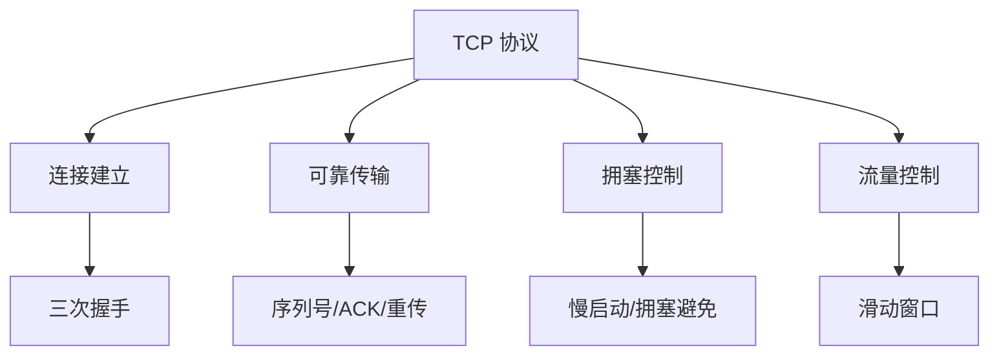
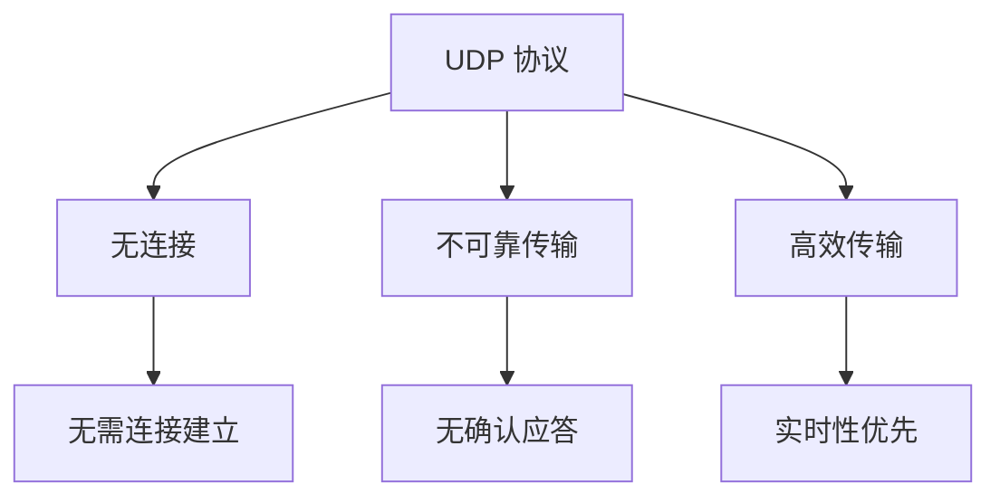

### 传输层协议
------
#### **1. TCP 协议**
**🔑 知识点详解**
- **TCP 协议的定义**：
  - **定义**：TCP（Transmission Control Protocol）是一种面向连接的、可靠的传输层协议，用于在网络中实现端到端的数据传输。
  - **核心思想**：通过连接建立、可靠传输、拥塞控制和流量控制机制，确保数据的完整性和顺序性。
    👉 **注意**：TCP 是互联网中最重要的传输协议之一，广泛应用于需要高可靠性的场景。

- **核心特性**：
  1. **连接建立（三次握手）**：
     - **定义**：通过三次握手建立连接，确保双方通信准备就绪。
     - **过程**：
       1. 客户端发送 SYN 包（同步请求），进入 SYN_SENT 状态。
       2. 服务端收到 SYN 包后回复 SYN+ACK 包（同步确认），进入 SYN_RCVD 状态。
       3. 客户端收到 SYN+ACK 包后回复 ACK 包（确认），进入 ESTABLISHED 状态。
     ```plaintext
     客户端：SYN -> 服务端
     服务端：SYN+ACK -> 客户端
     客户端：ACK -> 服务端
     ```
  2. **可靠传输**：
     - **定义**：通过序列号、确认应答（ACK）和重传机制确保数据的完整性。
     - **核心机制**：
       - **序列号**：标识每个数据段的顺序。
       - **确认应答**：接收方返回 ACK 表示已成功接收。
       - **超时重传**：发送方在未收到 ACK 时重新发送数据。
  3. **拥塞控制**：
     - **定义**：通过动态调整发送速率避免网络拥塞。
     - **核心算法**：
       - **慢启动**：初始发送速率较低，逐步增加。
       - **拥塞避免**：达到阈值后线性增长发送速率。
       - **快速重传**：连续收到三个重复 ACK 时立即重传丢失数据。
       - **快速恢复**：在快速重传后调整发送速率。
  4. **流量控制**：
     - **定义**：通过滑动窗口机制控制发送方的发送速率，避免接收方缓冲区溢出。
     - **核心机制**：
       - **窗口大小**：接收方告知发送方可接受的数据量。
       - **动态调整**：根据接收方缓冲区状态动态调整窗口大小。

**🔥 面试高频题**
1. TCP 的三次握手是如何工作的？为什么需要三次握手？
   - **一句话答案**：三次握手通过 SYN 和 ACK 包确保双方通信准备就绪，防止历史连接干扰。
   - **深入回答**：三次握手的过程如下：
     1. 客户端发送 SYN 包，表示希望与服务端建立连接。
     2. 服务端收到 SYN 包后回复 SYN+ACK 包，表示同意连接。
     3. 客户端收到 SYN+ACK 包后回复 ACK 包，完成连接建立。
     三次握手的核心目的是确保双方通信准备就绪，并防止历史连接的干扰。例如，如果只有两次握手，可能会导致服务端误认为客户端已准备好接收数据。

2. TCP 的可靠传输是如何实现的？
   - **一句话答案**：通过序列号、确认应答和重传机制确保数据的完整性和顺序性。
   - **深入回答**：TCP 的可靠传输机制包括以下内容：
     - **序列号**：每个数据段都有唯一的序列号，用于标识数据的顺序。
     - **确认应答（ACK）**：接收方返回 ACK 表示已成功接收数据段。
     - **超时重传**：发送方在未收到 ACK 时重新发送数据段。
     - **校验和**：通过校验和检测数据传输中的错误。

3. TCP 的拥塞控制有哪些算法？它们的作用是什么？
   - **一句话答案**：TCP 的拥塞控制算法包括慢启动、拥塞避免、快速重传和快速恢复，用于动态调整发送速率。
   - **深入回答**：TCP 的拥塞控制算法及其作用如下：
     - **慢启动**：初始发送速率较低，逐步增加，避免网络过载。
     - **拥塞避免**：达到阈值后线性增长发送速率，避免过度占用带宽。
     - **快速重传**：连续收到三个重复 ACK 时立即重传丢失数据，减少延迟。
     - **快速恢复**：在快速重传后调整发送速率，避免网络性能下降。

**🌟 重点提醒**
- **要点一**：TCP 通过三次握手建立连接，确保通信准备就绪。
- **要点二**：可靠传输通过序列号、确认应答和重传机制实现。
- **要点三**：拥塞控制通过慢启动、拥塞避免等算法动态调整发送速率。

**📝 实践经验**
```plaintext
# 示例：TCP 三次握手
客户端：SYN -> 服务端
服务端：SYN+ACK -> 客户端
客户端：ACK -> 服务端
```

**🔧 工具辅助**


------
#### **2. UDP 协议**
**🔑 知识点详解**
- **UDP 协议的定义**：
  - **定义**：UDP（User Datagram Protocol）是一种无连接的、不可靠的传输层协议，用于在网络中实现简单的数据传输。
  - **核心思想**：通过无连接和轻量化设计提升传输效率，但不保证数据的可靠性。
    👉 **注意**：UDP 适合对实时性要求较高的场景。

- **核心特性**：
  1. **无连接**：
     - **定义**：无需建立连接即可直接发送数据。
     - **优点**：减少了连接建立的开销，提升了传输效率。
     - **缺点**：无法保证数据的可靠性。
  2. **不保证可靠性**：
     - **定义**：不提供确认应答、重传和顺序控制机制。
     - **适用场景**：对实时性要求较高且可容忍少量数据丢失的场景（如视频通话、在线游戏）。

**🔥 面试高频题**
1. UDP 的特点是什么？与 TCP 的区别是什么？
   - **一句话答案**：UDP 是无连接、不可靠的协议，适合实时性要求高的场景；TCP 是面向连接、可靠的协议。
   - **深入回答**：UDP 的主要特点及其与 TCP 的区别如下：
     - **UDP 特点**：
       - **无连接**：无需建立连接即可发送数据。
       - **不可靠**：不提供确认应答、重传和顺序控制机制。
       - **高效**：减少了连接建立和维护的开销。
     - **与 TCP 的区别**：
       - **可靠性**：TCP 提供可靠传输，UDP 不提供。
       - **连接性**：TCP 是面向连接的，UDP 是无连接的。
       - **适用场景**：TCP 适合需要高可靠性的场景（如文件传输），UDP 适合实时性要求高的场景（如视频通话）。

2. 在什么场景下选择 UDP 而不是 TCP？
   - **一句话答案**：在对实时性要求较高且可容忍少量数据丢失的场景下选择 UDP。
   - **深入回答**：选择 UDP 的典型场景包括：
     - **视频通话**：实时性优先，少量数据丢失不会影响用户体验。
     - **在线游戏**：需要快速传输游戏状态，少量丢包可通过算法补偿。
     - **DNS 查询**：查询响应时间短，无需可靠传输。

**🌟 重点提醒**
- **要点一**：UDP 是无连接、不可靠的协议。
- **要点二**：UDP 适合对实时性要求较高的场景。
- **要点三**：TCP 提供可靠传输，UDP 提供高效传输。

**📝 实践经验**
```plaintext
# 示例：UDP 的应用场景
视频通话：实时性优先，少量丢包不影响体验
在线游戏：快速传输游戏状态，丢包可通过算法补偿
DNS 查询：查询响应时间短，无需可靠传输
```

**🔧 工具辅助**


------
#### **💡 复习建议**
1. 掌握 TCP 的三次握手、可靠传输、拥塞控制和流量控制机制。
2. 理解 UDP 的无连接特性和不可靠传输的特点。
3. 学习 TCP 和 UDP 的区别及其适用场景。
4. 结合实际案例，理解传输层协议在不同场景中的应用。