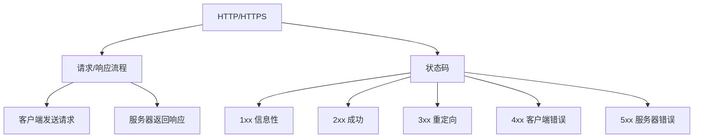
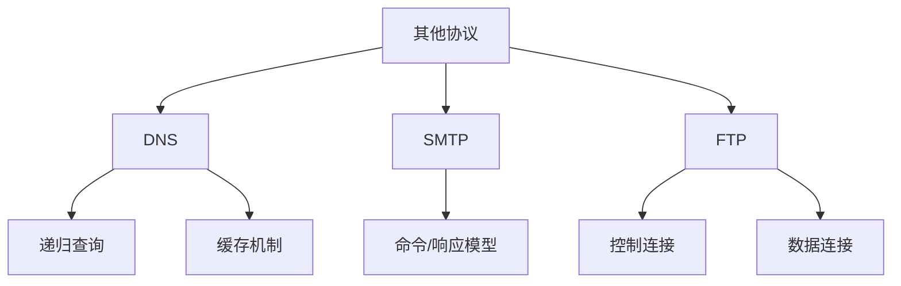

### 应用层协议
------
#### **1. HTTP/HTTPS：请求/响应流程、状态码**
**🔑 知识点详解**
- **HTTP 协议的定义**：
  - **定义**：HTTP（HyperText Transfer Protocol）是应用层协议，用于在客户端和服务器之间传输超文本数据。
  - **核心思想**：通过请求/响应模型实现资源的获取和交互。
    👉 **注意**：HTTP 是无状态的协议，每次请求独立处理。

- **HTTPS 协议的定义**：
  - **定义**：HTTPS（HTTP Secure）是基于 SSL/TLS 加密的 HTTP 协议，确保数据传输的安全性。
  - **核心思想**：通过加密机制保护数据隐私和完整性。
    👉 **注意**：HTTPS 使用 443 端口，默认支持 TLS 加密。

- **请求/响应流程**：
  1. **请求流程**：
     - 客户端发送 HTTP 请求到服务器，包含方法（如 GET、POST）、URL、头部信息和可选的请求体。
     ```plaintext
     GET /index.html HTTP/1.1
     Host: www.example.com
     ```
  2. **响应流程**：
     - 服务器返回 HTTP 响应，包含状态码、头部信息和响应体。
     ```plaintext
     HTTP/1.1 200 OK
     Content-Type: text/html
     <html>...</html>
     ```

- **常见状态码**：
  - **1xx（信息性状态码）**：表示请求已接收，继续处理。
    - **100 Continue**：客户端可以继续发送请求。
  - **2xx（成功状态码）**：
    - **200 OK**：请求成功。
    - **201 Created**：资源创建成功。
  - **3xx（重定向状态码）**：
    - **301 Moved Permanently**：资源永久移动。
    - **302 Found**：资源临时移动。
  - **4xx（客户端错误状态码）**：
    - **400 Bad Request**：请求语法错误。
    - **401 Unauthorized**：未授权访问。
    - **403 Forbidden**：禁止访问。
    - **404 Not Found**：资源未找到。
  - **5xx（服务器错误状态码）**：
    - **500 Internal Server Error**：服务器内部错误。
    - **502 Bad Gateway**：网关错误。
    - **503 Service Unavailable**：服务不可用。

**🔥 面试高频题**
1. HTTP 和 HTTPS 的区别是什么？
   - **一句话答案**：HTTP 是明文传输，HTTPS 是基于 SSL/TLS 加密的安全传输。
   - **深入回答**：HTTP 和 HTTPS 的主要区别如下：
     - **安全性**：
       - HTTP 是明文传输，容易被窃听或篡改。
       - HTTPS 使用 SSL/TLS 加密，确保数据隐私和完整性。
     - **端口号**：
       - HTTP 使用 80 端口。
       - HTTPS 使用 443 端口。
     - **性能**：
       - HTTPS 因加密和解密操作，性能略低于 HTTP。
       - 现代硬件和优化技术已大幅降低性能差距。

2. HTTP 请求/响应流程是如何工作的？
   - **一句话答案**：客户端发送 HTTP 请求，服务器返回 HTTP 响应。
   - **深入回答**：HTTP 请求/响应流程包括以下步骤：
     1. **请求**：
        - 客户端发送请求行（方法、URL、协议版本）。
        - 添加头部信息（如 Host、Content-Type）。
        - 可选地附加请求体（如 POST 数据）。
     2. **处理**：
        - 服务器解析请求，执行相应逻辑。
     3. **响应**：
        - 服务器返回状态码、头部信息和响应体。
        - 客户端根据状态码处理响应内容。

3. 常见 HTTP 状态码有哪些？如何分类？
   - **一句话答案**：HTTP 状态码分为五类：信息性、成功、重定向、客户端错误和服务器错误。
   - **深入回答**：HTTP 状态码的分类及其常见示例如下：
     - **1xx（信息性状态码）**：表示请求已接收，继续处理。
       - **100 Continue**：客户端可以继续发送请求。
     - **2xx（成功状态码）**：
       - **200 OK**：请求成功。
       - **201 Created**：资源创建成功。
     - **3xx（重定向状态码）**：
       - **301 Moved Permanently**：资源永久移动。
       - **302 Found**：资源临时移动。
     - **4xx（客户端错误状态码）**：
       - **400 Bad Request**：请求语法错误。
       - **401 Unauthorized**：未授权访问。
       - **403 Forbidden**：禁止访问。
       - **404 Not Found**：资源未找到。
     - **5xx（服务器错误状态码）**：
       - **500 Internal Server Error**：服务器内部错误。
       - **502 Bad Gateway**：网关错误。
       - **503 Service Unavailable**：服务不可用。

**🌟 重点提醒**
- **要点一**：HTTP 是无状态协议，HTTPS 基于 SSL/TLS 加密。
- **要点二**：HTTP 请求/响应流程包括请求、处理和响应。
- **要点三**：HTTP 状态码分为五类，涵盖信息性、成功、重定向、客户端错误和服务器错误。

**📝 实践经验**
```plaintext
# 示例：HTTP 请求和响应
请求：
GET /index.html HTTP/1.1
Host: www.example.com

响应：
HTTP/1.1 200 OK
Content-Type: text/html
<html>...</html>
```

**🔧 工具辅助**


------
#### **2. 其他协议：DNS、SMTP、FTP 等基础原理**
**🔑 知识点详解**
- **DNS（Domain Name System）**：
  - **定义**：DNS 是一种分布式系统，用于将域名解析为 IP 地址。
  - **核心思想**：通过递归查询和缓存机制提升解析效率。
    👉 **注意**：DNS 使用 UDP 协议（默认端口 53），支持快速解析。

- **SMTP（Simple Mail Transfer Protocol）**：
  - **定义**：SMTP 是一种电子邮件传输协议，用于在邮件服务器之间传递邮件。
  - **核心思想**：通过命令和响应模型实现邮件的发送和转发。
    👉 **注意**：SMTP 使用 TCP 协议（默认端口 25）。

- **FTP（File Transfer Protocol）**：
  - **定义**：FTP 是一种文件传输协议，用于在客户端和服务器之间传输文件。
  - **核心思想**：通过控制连接和数据连接分离实现高效传输。
    👉 **注意**：FTP 使用两个端口（21 控制连接，20 数据连接）。

**🔥 面试高频题**
1. DNS 的工作原理是什么？
   - **一句话答案**：DNS 通过递归查询和缓存机制将域名解析为 IP 地址。
   - **深入回答**：DNS 的工作原理包括以下步骤：
     1. **递归查询**：
        - 客户端向本地 DNS 服务器发送查询请求。
        - 如果本地 DNS 服务器没有缓存，则向根服务器、顶级域服务器和权威服务器依次查询。
     2. **缓存机制**：
        - DNS 服务器缓存查询结果，减少重复查询的开销。
     ```plaintext
     客户端 -> 本地 DNS 服务器 -> 根服务器 -> TLD 服务器 -> 权威服务器
     ```

2. SMTP 的作用是什么？如何发送邮件？
   - **一句话答案**：SMTP 是电子邮件传输协议，通过命令和响应模型发送邮件。
   - **深入回答**：SMTP 的核心作用是实现邮件的发送和转发。发送邮件的基本流程如下：
     1. **建立连接**：客户端与邮件服务器建立 TCP 连接。
     2. **身份验证**：客户端发送用户名和密码进行身份验证。
     3. **发送邮件**：客户端发送 MAIL FROM 和 RCPT TO 命令指定发件人和收件人。
     4. **传输内容**：客户端发送 DATA 命令传输邮件内容。
     ```plaintext
     MAIL FROM:<sender@example.com>
     RCPT TO:<recipient@example.com>
     DATA
     From: sender@example.com
     To: recipient@example.com
     Subject: Test Email
     Hello, this is a test email.
     .
     ```

3. FTP 的控制连接和数据连接有什么区别？
   - **一句话答案**：控制连接用于发送命令，数据连接用于传输文件。
   - **深入回答**：FTP 的两种连接及其区别如下：
     - **控制连接**：
       - 使用端口 21。
       - 用于发送命令（如登录、目录切换）。
     - **数据连接**：
       - 使用端口 20 或动态端口。
       - 用于传输文件内容或目录列表。
     ```plaintext
     控制连接：PORT 21
     数据连接：PORT 20 或动态端口
     ```

**🌟 重点提醒**
- **要点一**：DNS 通过递归查询和缓存机制解析域名。
- **要点二**：SMTP 通过命令和响应模型发送邮件。
- **要点三**：FTP 使用控制连接和数据连接分离。

**📝 实践经验**
```plaintext
# 示例：DNS 查询
客户端 -> 本地 DNS 服务器 -> 根服务器 -> TLD 服务器 -> 权威服务器

# 示例：SMTP 发送邮件
MAIL FROM:<sender@example.com>
RCPT TO:<recipient@example.com>
DATA
From: sender@example.com
To: recipient@example.com
Subject: Test Email
Hello, this is a test email.
.

# 示例：FTP 连接
控制连接：PORT 21
数据连接：PORT 20
```

**🔧 工具辅助**


------
#### **💡 复习建议**
1. 掌握 HTTP/HTTPS 的请求/响应流程及常见状态码。
2. 理解 DNS 的工作原理及递归查询机制。
3. 学习 SMTP 的邮件发送流程及 FTP 的控制连接和数据连接。
4. 结合实际案例，理解应用层协议在通信中的应用。