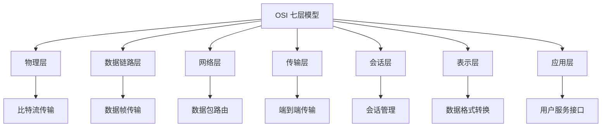
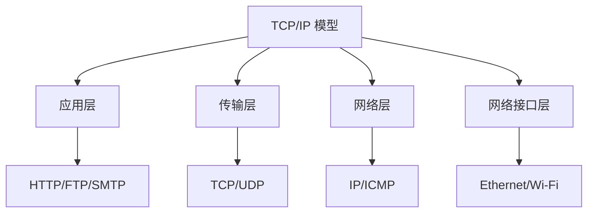

### 网络基础与模型
------
#### **1. OSI 七层模型：各层功能与典型协议**
**🔑 知识点详解**
- **OSI 七层模型的定义**：
  - **定义**：OSI（Open Systems Interconnection）七层模型是一种网络通信的标准框架，将网络通信分为七个层次，每一层完成特定的功能。
  - **核心思想**：通过分层设计实现模块化开发和维护，提升网络通信的灵活性和可扩展性。
    👉 **注意**：OSI 模型是理论模型，实际应用中更多使用 TCP/IP 模型。

- **各层功能与典型协议**：
  1. **物理层（Physical Layer）**：
     - **功能**：负责比特流的传输，定义物理介质、信号类型和传输速率。
     - **典型协议**：以太网（Ethernet）、光纤通信（Fiber Optic）。
  2. **数据链路层（Data Link Layer）**：
     - **功能**：负责节点间的数据帧传输，提供错误检测和流量控制。
     - **典型协议**：以太网（Ethernet）、PPP（Point-to-Point Protocol）。
  3. **网络层（Network Layer）**：
     - **功能**：负责数据包的路由和转发，确保数据从源地址到达目标地址。
     - **典型协议**：IP（Internet Protocol）、ICMP（Internet Control Message Protocol）。
  4. **传输层（Transport Layer）**：
     - **功能**：负责端到端的可靠数据传输，提供流量控制和错误恢复。
     - **典型协议**：TCP（Transmission Control Protocol）、UDP（User Datagram Protocol）。
  5. **会话层（Session Layer）**：
     - **功能**：负责建立、管理和终止会话，支持会话同步和检查点。
     - **典型协议**：NetBIOS、RPC（Remote Procedure Call）。
  6. **表示层（Presentation Layer）**：
     - **功能**：负责数据格式转换、加密解密和压缩解压。
     - **典型协议**：SSL/TLS、JPEG、MPEG。
  7. **应用层（Application Layer）**：
     - **功能**：直接面向用户，提供网络服务接口。
     - **典型协议**：HTTP、FTP、SMTP、DNS。

**🔥 面试高频题**
1. OSI 七层模型的各层功能是什么？有哪些典型协议？
   - **一句话答案**：OSI 七层模型将网络通信分为物理层、数据链路层、网络层、传输层、会话层、表示层和应用层，每层完成特定功能并使用典型协议。
   - **深入回答**：OSI 七层模型的各层功能及典型协议如下：
     1. **物理层**：负责比特流的传输，典型协议包括以太网和光纤通信。
     2. **数据链路层**：负责数据帧的传输，典型协议包括以太网和 PPP。
     3. **网络层**：负责数据包的路由和转发，典型协议包括 IP 和 ICMP。
     4. **传输层**：负责端到端的可靠数据传输，典型协议包括 TCP 和 UDP。
     5. **会话层**：负责会话的建立和管理，典型协议包括 NetBIOS 和 RPC。
     6. **表示层**：负责数据格式转换和加密解密，典型协议包括 SSL/TLS 和 JPEG。
     7. **应用层**：直接面向用户，典型协议包括 HTTP、FTP 和 SMTP。

2. 如何理解 OSI 模型的分层设计？
   - **一句话答案**：OSI 模型通过分层设计实现模块化开发和维护。
   - **深入回答**：OSI 模型的核心思想是通过分层设计实现模块化开发和维护。每一层专注于特定功能，并通过标准化接口与其他层交互。这种设计的好处包括：
     - **模块化**：每一层独立开发和维护，降低复杂度。
     - **灵活性**：支持不同协议和技术的替换和升级。
     - **互操作性**：通过标准化接口实现不同系统间的通信。

**🌟 重点提醒**
- **要点一**：OSI 七层模型分为物理层、数据链路层、网络层、传输层、会话层、表示层和应用层。
- **要点二**：每一层完成特定功能并使用典型协议。
- **要点三**：分层设计提升模块化和灵活性。

**📝 实践经验**
```plaintext
# 示例：OSI 七层模型的应用
物理层：光纤通信
数据链路层：以太网
网络层：IP 协议
传输层：TCP 协议
应用层：HTTP 协议
```

**🔧 工具辅助**


------
#### **2. TCP/IP 模型：层级划分及应用**
**🔑 知识点详解**
- **TCP/IP 模型的定义**：
  - **定义**：TCP/IP（Transmission Control Protocol/Internet Protocol）模型是一种实际使用的网络通信模型，分为四层，简化了 OSI 七层模型。
  - **核心思想**：通过分层设计实现互联网通信的标准化和高效性。
    👉 **注意**：TCP/IP 模型是互联网的基础架构。

- **层级划分及功能**：
  1. **应用层（Application Layer）**：
     - **功能**：直接面向用户，提供网络服务接口。
     - **典型协议**：HTTP、FTP、SMTP、DNS。
  2. **传输层（Transport Layer）**：
     - **功能**：负责端到端的可靠数据传输，提供流量控制和错误恢复。
     - **典型协议**：TCP、UDP。
  3. **网络层（Internet Layer）**：
     - **功能**：负责数据包的路由和转发，确保数据从源地址到达目标地址。
     - **典型协议**：IP、ICMP、ARP。
  4. **网络接口层（Link Layer）**：
     - **功能**：负责数据帧的传输，定义物理介质和链路协议。
     - **典型协议**：以太网（Ethernet）、Wi-Fi。

**🔥 面试高频题**
1. TCP/IP 模型的层级划分是什么？与 OSI 模型的区别是什么？
   - **一句话答案**：TCP/IP 模型分为应用层、传输层、网络层和网络接口层；与 OSI 模型相比更简洁实用。
   - **深入回答**：TCP/IP 模型的层级划分及其与 OSI 模型的区别如下：
     - **TCP/IP 模型**：
       1. **应用层**：直接面向用户，典型协议包括 HTTP、FTP 和 SMTP。
       2. **传输层**：负责端到端的可靠数据传输，典型协议包括 TCP 和 UDP。
       3. **网络层**：负责数据包的路由和转发，典型协议包括 IP 和 ICMP。
       4. **网络接口层**：负责数据帧的传输，典型协议包括以太网和 Wi-Fi。
     - **与 OSI 模型的区别**：
       - **层次数量**：TCP/IP 模型只有四层，OSI 模型有七层。
       - **实际应用**：TCP/IP 模型是互联网的实际标准，OSI 模型更多用于理论分析。
       - **协议覆盖**：TCP/IP 模型的协议覆盖范围更广。

2. TCP 和 UDP 的区别是什么？
   - **一句话答案**：TCP 提供可靠的面向连接的传输，UDP 提供不可靠的无连接传输。
   - **深入回答**：TCP 和 UDP 是传输层的两种协议，它们的主要区别如下：
     - **TCP**：
       - 提供可靠的面向连接的传输。
       - 支持流量控制、拥塞控制和错误恢复。
       - 适合需要高可靠性的场景（如文件传输、网页浏览）。
     - **UDP**：
       - 提供不可靠的无连接传输。
       - 不支持流量控制和错误恢复。
       - 适合对实时性要求较高的场景（如视频通话、在线游戏）。

**🌟 重点提醒**
- **要点一**：TCP/IP 模型分为应用层、传输层、网络层和网络接口层。
- **要点二**：TCP 提供可靠的面向连接传输，UDP 提供不可靠的无连接传输。
- **要点三**：TCP/IP 模型是互联网的实际标准。

**📝 实践经验**
```plaintext
# 示例：TCP/IP 模型的应用
应用层：HTTP 协议
传输层：TCP 协议
网络层：IP 协议
网络接口层：以太网
```

**🔧 工具辅助**


------
#### **💡 复习建议**
1. 掌握 OSI 七层模型的各层功能及典型协议。
2. 理解 TCP/IP 模型的层级划分及其与 OSI 模型的区别。
3. 学习 TCP 和 UDP 的特点及其适用场景。
4. 结合实际案例，理解网络模型在通信中的应用。