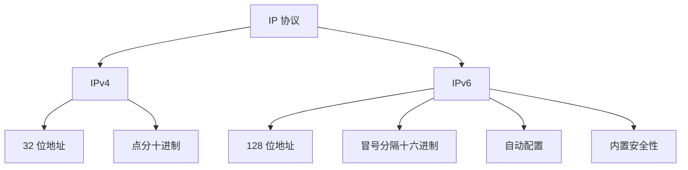
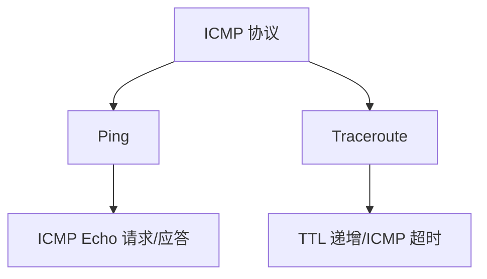
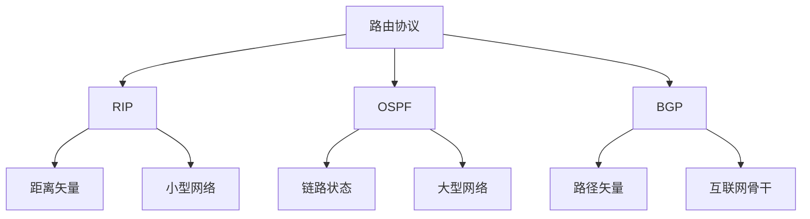

### 网络层与路由
------
#### **1. IP 协议：IPv4/IPv6 基本概念**
**🔑 知识点详解**
- **IP 协议的定义**：
  - **定义**：IP（Internet Protocol）是网络层的核心协议，用于在网络中传输数据包。
  - **核心思想**：通过 IP 地址标识设备，并将数据包从源地址路由到目标地址。
    👉 **注意**：IP 协议分为 IPv4 和 IPv6 两个版本。

- **IPv4 基本概念**：
  - **定义**：IPv4 是基于 32 位地址的协议，支持约 43 亿个唯一地址。
  - **核心特性**：
    - **地址格式**：点分十进制表示法（如 `192.168.0.1`）。
    - **地址分类**：A、B、C、D、E 类地址。
    - **子网划分**：通过子网掩码划分网络和主机部分。
    - **NAT 技术**：通过地址转换缓解地址枯竭问题。
  - **局限性**：地址空间有限，难以满足现代互联网的需求。

- **IPv6 基本概念**：
  - **定义**：IPv6 是基于 128 位地址的协议，支持约 \(2^{128}\) 个唯一地址。
  - **核心特性**：
    - **地址格式**：冒号分隔的十六进制表示法（如 `2001:0db8::1`）。
    - **自动配置**：支持无状态地址自动配置（SLAAC）。
    - **安全性**：内置 IPsec 支持。
    - **扩展性**：支持更大的地址空间和更高效的路由。

**🔥 面试高频题**
1. IPv4 和 IPv6 的主要区别是什么？
   - **一句话答案**：IPv4 使用 32 位地址，地址空间有限；IPv6 使用 128 位地址，地址空间极大。
   - **深入回答**：IPv4 和 IPv6 的主要区别如下：
     - **地址空间**：
       - IPv4：32 位地址，约 43 亿个唯一地址。
       - IPv6：128 位地址，约 \(2^{128}\) 个唯一地址。
     - **地址格式**：
       - IPv4：点分十进制表示法（如 `192.168.0.1`）。
       - IPv6：冒号分隔的十六进制表示法（如 `2001:0db8::1`）。
     - **功能特性**：
       - IPv4：需要 NAT 技术缓解地址枯竭问题。
       - IPv6：支持自动配置和内置安全性（IPsec）。
     - **应用场景**：IPv4 广泛应用于现有网络，IPv6 逐渐推广以解决地址枯竭问题。

2. 为什么需要从 IPv4 过渡到 IPv6？
   - **一句话答案**：IPv4 地址空间不足，IPv6 提供更大的地址空间和更高效的功能。
   - **深入回答**：IPv4 的地址空间有限（约 43 亿个地址），无法满足现代互联网的需求。IPv6 的优势包括：
     - **更大的地址空间**：支持约 \(2^{128}\) 个唯一地址。
     - **自动配置**：简化设备接入网络的过程。
     - **内置安全性**：支持 IPsec，提升通信安全性。
     - **更高效的路由**：减少路由表大小，提升转发效率。

**🌟 重点提醒**
- **要点一**：IPv4 使用 32 位地址，IPv6 使用 128 位地址。
- **要点二**：IPv6 提供更大的地址空间和更高效的功能。
- **要点三**：IPv6 支持自动配置和内置安全性。

**📝 实践经验**
```plaintext
# 示例：IPv4 和 IPv6 地址
IPv4 地址：192.168.0.1
IPv6 地址：2001:0db8::1
```

**🔧 工具辅助**


------
#### **2. ICMP 协议：Ping、Traceroute**
**🔑 知识点详解**
- **ICMP 协议的定义**：
  - **定义**：ICMP（Internet Control Message Protocol）是网络层的辅助协议，用于传递控制信息和错误消息。
  - **核心思想**：通过 ICMP 消息实现网络诊断和故障排查。
    👉 **注意**：ICMP 是 IP 协议的补充，常用于工具如 Ping 和 Traceroute。

- **Ping 的定义与原理**：
  - **定义**：Ping 是一种网络诊断工具，用于测试主机之间的连通性。
  - **核心原理**：
    - 发送 ICMP Echo 请求消息到目标主机。
    - 接收 ICMP Echo 应答消息，计算往返时间（RTT）。
    ```plaintext
    客户端：发送 ICMP Echo 请求 -> 目标主机
    目标主机：返回 ICMP Echo 应答 -> 客户端
    ```

- **Traceroute 的定义与原理**：
  - **定义**：Traceroute 是一种网络诊断工具，用于显示数据包从源到目标的路径。
  - **核心原理**：
    - 发送 TTL（Time To Live）递增的数据包。
    - 每个中间路由器返回 ICMP 超时消息，记录路径信息。
    ```plaintext
    客户端：发送 TTL=1 数据包 -> 第一跳路由器
    第一跳路由器：返回 ICMP 超时消息 -> 客户端
    客户端：发送 TTL=2 数据包 -> 第二跳路由器
    ...
    ```

**🔥 面试高频题**
1. Ping 和 Traceroute 的工作原理是什么？
   - **一句话答案**：Ping 测试连通性，Traceroute 显示路径。
   - **深入回答**：
     - **Ping**：
       - 发送 ICMP Echo 请求消息到目标主机。
       - 接收 ICMP Echo 应答消息，计算往返时间（RTT）。
       - 如果未收到应答消息，则表示目标不可达。
     - **Traceroute**：
       - 发送 TTL 递增的数据包，每个中间路由器返回 ICMP 超时消息。
       - 记录每跳的 IP 地址和延迟，显示完整路径。

2. ICMP 协议的作用是什么？有哪些常见消息类型？
   - **一句话答案**：ICMP 用于传递控制信息和错误消息，常见类型包括 Echo 请求/应答和超时消息。
   - **深入回答**：ICMP 协议的主要作用及其常见消息类型如下：
     - **作用**：
       - 传递网络诊断信息（如 Ping 和 Traceroute）。
       - 报告错误消息（如目标不可达、超时）。
     - **常见消息类型**：
       - **Echo 请求/应答**：用于 Ping 测试。
       - **超时消息**：用于 Traceroute 显示路径。
       - **目标不可达**：通知发送方目标主机或网络不可达。

**🌟 重点提醒**
- **要点一**：Ping 测试连通性，Traceroute 显示路径。
- **要点二**：ICMP 是 IP 协议的补充，用于传递控制信息和错误消息。
- **要点三**：常见 ICMP 消息类型包括 Echo 请求/应答和超时消息。

**📝 实践经验**
```plaintext
# 示例：Ping 和 Traceroute 的使用
Ping：ping www.example.com
Traceroute：traceroute www.example.com
```

**🔧 工具辅助**


------
#### **3. 路由协议：RIP、OSPF、BGP 基础**
**🔑 知识点详解**
- **路由协议的定义**：
  - **定义**：路由协议是网络层的协议，用于动态更新路由表，确保数据包能够正确到达目标地址。
  - **核心思想**：通过算法计算最佳路径，并在路由器之间交换路由信息。
    👉 **注意**：路由协议分为内部网关协议（IGP）和外部网关协议（EGP）。

- **RIP（Routing Information Protocol）**：
  - **定义**：RIP 是一种距离矢量路由协议，基于跳数选择路径。
  - **核心特性**：
    - **最大跳数**：15 跳，超过视为不可达。
    - **更新周期**：每隔 30 秒广播路由表。
    - **适用场景**：小型网络。

- **OSPF（Open Shortest Path First）**：
  - **定义**：OSPF 是一种链路状态路由协议，基于 Dijkstra 算法计算最短路径。
  - **核心特性**：
    - **区域划分**：支持多区域设计，优化路由表规模。
    - **快速收敛**：检测拓扑变化后快速更新路由表。
    - **适用场景**：大型企业网络。

- **BGP（Border Gateway Protocol）**：
  - **定义**：BGP 是一种路径矢量路由协议，用于自治系统（AS）之间的路由。
  - **核心特性**：
    - **路径选择**：基于策略选择最佳路径。
    - **稳定性**：支持大规模网络的稳定路由。
    - **适用场景**：互联网骨干网络。

**🔥 面试高频题**
1. RIP、OSPF 和 BGP 的区别是什么？
   - **一句话答案**：RIP 是简单的距离矢量协议，OSPF 是高效的链路状态协议，BGP 是复杂的路径矢量协议。
   - **深入回答**：RIP、OSPF 和 BGP 的主要区别如下：
     - **RIP**：
       - 基于跳数选择路径，最大跳数为 15。
       - 更新周期较长，适合小型网络。
     - **OSPF**：
       - 基于 Dijkstra 算法计算最短路径。
       - 支持多区域设计和快速收敛，适合大型网络。
     - **BGP**：
       - 基于策略选择路径，支持自治系统间的路由。
       - 适用于互联网骨干网络。

2. 如何选择合适的路由协议？
   - **一句话答案**：根据网络规模和需求选择 RIP、OSPF 或 BGP。
   - **深入回答**：选择路由协议时需要考虑以下因素：
     - **小型网络**：选择 RIP，简单易用。
     - **大型企业网络**：选择 OSPF，支持多区域设计和快速收敛。
     - **互联网骨干网络**：选择 BGP，支持大规模网络的稳定路由。

**🌟 重点提醒**
- **要点一**：RIP 是简单的距离矢量协议，适合小型网络。
- **要点二**：OSPF 是高效的链路状态协议，适合大型网络。
- **要点三**：BGP 是复杂的路径矢量协议，适合互联网骨干网络。

**📝 实践经验**
```plaintext
# 示例：路由协议的选择
小型网络：RIP
大型企业网络：OSPF
互联网骨干网络：BGP
```

**🔧 工具辅助**


------
#### **💡 复习建议**
1. 掌握 IPv4 和 IPv6 的基本概念及其区别。
2. 理解 ICMP 协议的工作原理及常见工具（如 Ping 和 Traceroute）。
3. 学习 RIP、OSPF 和 BGP 的特点及其适用场景。