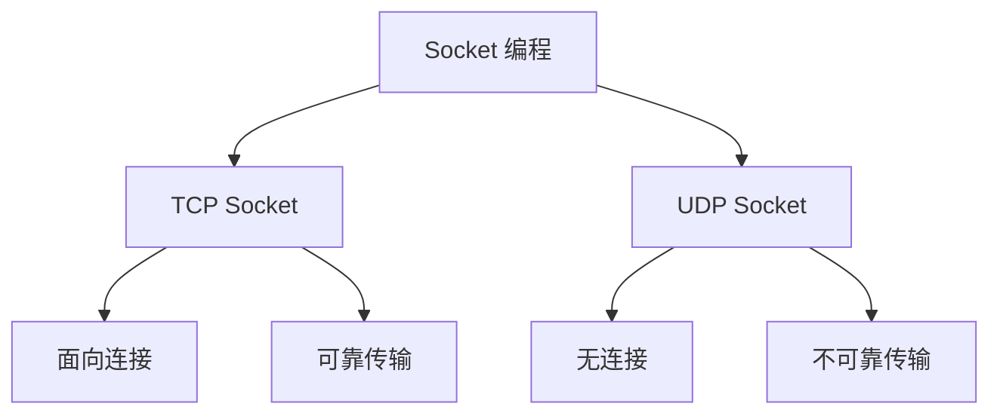
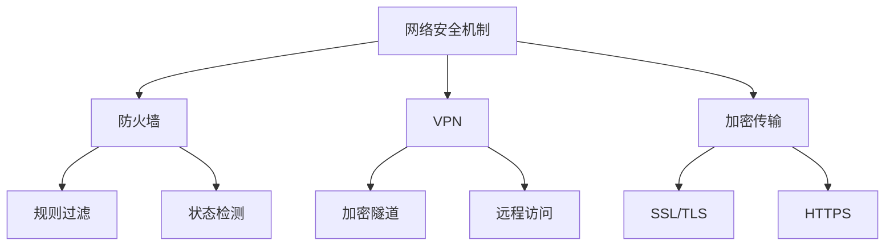

### 网络编程基础
------
#### **1. Socket 编程：TCP/UDP Socket 的基本使用**
**🔑 知识点详解**
- **Socket 的定义**：
  - **定义**：Socket 是网络通信的端点，用于实现进程间的通信。
  - **核心思想**：通过 Socket API 实现客户端与服务器之间的数据传输。
    👉 **注意**：Socket 支持 TCP 和 UDP 两种协议。

- **TCP Socket 基本使用**：
  - **定义**：TCP Socket 提供面向连接的可靠通信。
  - **核心流程**：
    1. **服务器端**：
       - 创建 `ServerSocket` 监听指定端口。
       - 调用 `accept()` 方法等待客户端连接。
       - 获取输入输出流进行数据交互。
    2. **客户端**：
       - 创建 `Socket` 连接服务器。
       - 获取输入输出流进行数据交互。
    ```java
    // TCP 服务器端示例
    ServerSocket serverSocket = new ServerSocket(8080);
    Socket clientSocket = serverSocket.accept();
    BufferedReader in = new BufferedReader(new InputStreamReader(clientSocket.getInputStream()));
    PrintWriter out = new PrintWriter(clientSocket.getOutputStream(), true);
    String message = in.readLine();
    out.println("Echo: " + message);
    
    // TCP 客户端示例
    Socket socket = new Socket("localhost", 8080);
    PrintWriter out = new PrintWriter(socket.getOutputStream(), true);
    BufferedReader in = new BufferedReader(new InputStreamReader(socket.getInputStream()));
    out.println("Hello, Server!");
    String response = in.readLine();
    ```

- **UDP Socket 基本使用**：
  - **定义**：UDP Socket 提供无连接的不可靠通信。
  - **核心流程**：
    1. **服务器端**：
       - 创建 `DatagramSocket` 绑定指定端口。
       - 接收和发送 `DatagramPacket` 数据包。
    2. **客户端**：
       - 创建 `DatagramSocket`。
       - 发送和接收 `DatagramPacket` 数据包。
    ```java
    // UDP 服务器端示例
    DatagramSocket socket = new DatagramSocket(9090);
    byte[] buffer = new byte[1024];
    DatagramPacket packet = new DatagramPacket(buffer, buffer.length);
    socket.receive(packet);
    String message = new String(packet.getData(), 0, packet.getLength());
    System.out.println("Received: " + message);
    
    // UDP 客户端示例
    DatagramSocket socket = new DatagramSocket();
    String message = "Hello, Server!";
    byte[] buffer = message.getBytes();
    DatagramPacket packet = new DatagramPacket(buffer, buffer.length, InetAddress.getByName("localhost"), 9090);
    socket.send(packet);
    ```

**🔥 面试高频题**
1. TCP 和 UDP Socket 的区别是什么？
   - **一句话答案**：TCP Socket 提供面向连接的可靠通信，UDP Socket 提供无连接的不可靠通信。
   - **深入回答**：TCP 和 UDP Socket 的主要区别如下：
     - **TCP Socket**：
       - 面向连接，需建立三次握手。
       - 提供可靠传输，支持流量控制和拥塞控制。
       - 适合需要高可靠性的场景（如文件传输、网页浏览）。
     - **UDP Socket**：
       - 无连接，无需建立连接。
       - 不保证可靠性，但传输效率更高。
       - 适合对实时性要求较高的场景（如视频通话、在线游戏）。

2. 如何实现一个简单的 TCP Socket 通信？
   - **一句话答案**：通过 `ServerSocket` 和 `Socket` 实现服务器和客户端的通信。
   - **深入回答**：实现 TCP Socket 通信的基本步骤如下：
     1. **服务器端**：
        - 创建 `ServerSocket` 并绑定端口。
        - 调用 `accept()` 方法等待客户端连接。
        - 使用输入输出流进行数据交互。
     2. **客户端**：
        - 创建 `Socket` 连接服务器。
        - 使用输入输出流进行数据交互。
     ```java
     // 示例代码见上文
     ```

3. 如何实现一个简单的 UDP Socket 通信？
   - **一句话答案**：通过 `DatagramSocket` 和 `DatagramPacket` 实现无连接的数据传输。
   - **深入回答**：实现 UDP Socket 通信的基本步骤如下：
     1. **服务器端**：
        - 创建 `DatagramSocket` 并绑定端口。
        - 接收和发送 `DatagramPacket` 数据包。
     2. **客户端**：
        - 创建 `DatagramSocket`。
        - 发送和接收 `DatagramPacket` 数据包。
     ```java
     // 示例代码见上文
     ```

**🌟 重点提醒**
- **要点一**：TCP Socket 提供面向连接的可靠通信。
- **要点二**：UDP Socket 提供无连接的不可靠通信。
- **要点三**：根据需求选择 TCP 或 UDP Socket。

**📝 实践经验**
```plaintext
# 示例：TCP 和 UDP 的应用场景
TCP：文件传输、网页浏览
UDP：视频通话、在线游戏
```

**🔧 工具辅助**


------
#### **2. 常见网络安全机制：防火墙、VPN、加密传输**
**🔑 知识点详解**
- **防火墙（Firewall）**：
  - **定义**：防火墙是一种网络安全设备或软件，用于监控和控制进出网络的数据流。
  - **核心思想**：通过规则过滤流量，防止未经授权的访问。
    👉 **注意**：防火墙分为硬件防火墙和软件防火墙。

- **VPN（Virtual Private Network）**：
  - **定义**：VPN 是一种通过公共网络建立安全连接的技术。
  - **核心思想**：通过加密隧道保护数据隐私，实现远程访问。
    👉 **注意**：常见协议包括 IPsec 和 OpenVPN。

- **加密传输**：
  - **定义**：加密传输是通过加密算法保护数据在传输过程中的安全性。
  - **核心思想**：通过 SSL/TLS 协议实现 HTTPS 加密。
    👉 **注意**：加密传输广泛应用于 Web 应用和电子邮件。

**🔥 面试高频题**
1. 防火墙的作用是什么？如何工作？
   - **一句话答案**：防火墙通过规则过滤流量，防止未经授权的访问。
   - **深入回答**：防火墙的核心作用是监控和控制进出网络的数据流。其工作原理如下：
     - **包过滤**：基于源地址、目标地址和端口号过滤流量。
     - **状态检测**：跟踪连接状态，允许合法流量通过。
     - **应用网关**：代理应用程序流量，提供更细粒度的控制。

2. VPN 的作用是什么？如何实现？
   - **一句话答案**：VPN 通过加密隧道保护数据隐私，实现远程访问。
   - **深入回答**：VPN 的核心作用是通过公共网络建立安全连接。其实现方式如下：
     - **隧道技术**：将数据封装在加密隧道中传输。
     - **加密协议**：使用 IPsec 或 OpenVPN 协议保护数据。
     - **身份验证**：通过用户名、密码或证书验证用户身份。

3. 加密传输是如何实现的？有哪些常见协议？
   - **一句话答案**：加密传输通过 SSL/TLS 协议实现 HTTPS 加密。
   - **深入回答**：加密传输的核心是通过加密算法保护数据隐私。其实现方式如下：
     - **SSL/TLS 协议**：在传输层加密数据，确保数据完整性和机密性。
     - **HTTPS**：基于 SSL/TLS 的 HTTP 协议，广泛应用于 Web 应用。
     - **常见协议**：
       - **IPsec**：用于 VPN 加密。
       - **OpenVPN**：开源的 VPN 协议。
       - **TLS**：现代加密传输的标准。

**🌟 重点提醒**
- **要点一**：防火墙通过规则过滤流量，防止未经授权的访问。
- **要点二**：VPN 通过加密隧道保护数据隐私，实现远程访问。
- **要点三**：加密传输通过 SSL/TLS 协议实现 HTTPS 加密。

**📝 实践经验**
```plaintext
# 示例：网络安全机制的应用
防火墙：过滤恶意流量，保护内网安全
VPN：远程办公，安全访问公司资源
加密传输：HTTPS 加密 Web 流量
```

**🔧 工具辅助**


------
#### **💡 复习建议**
1. 掌握 TCP 和 UDP Socket 的基本使用及其区别。
2. 理解防火墙的工作原理及作用。
3. 学习 VPN 的实现方式及其应用场景。
4. 掌握加密传输的实现方式及常见协议。
5. 结合实际案例，理解网络安全机制的重要性。