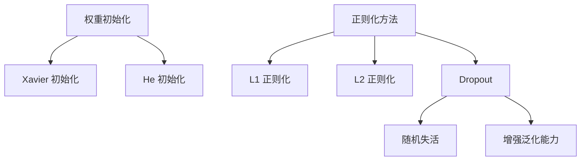
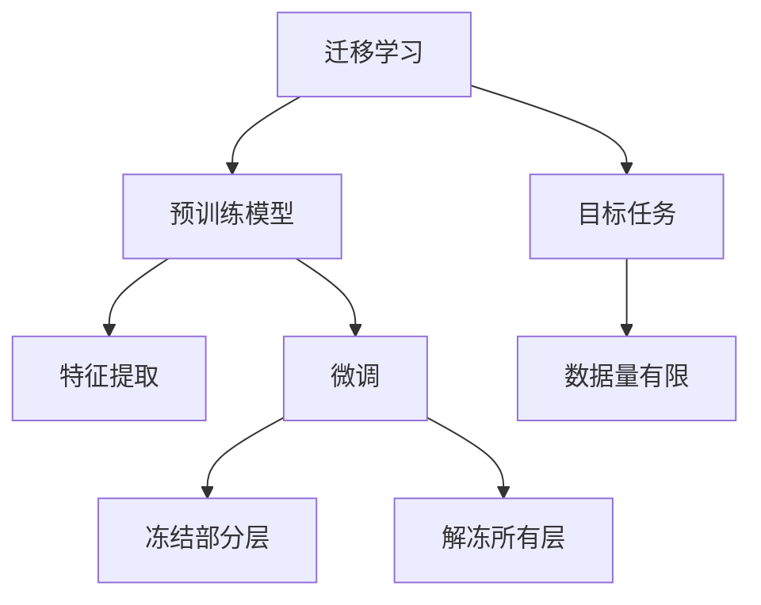
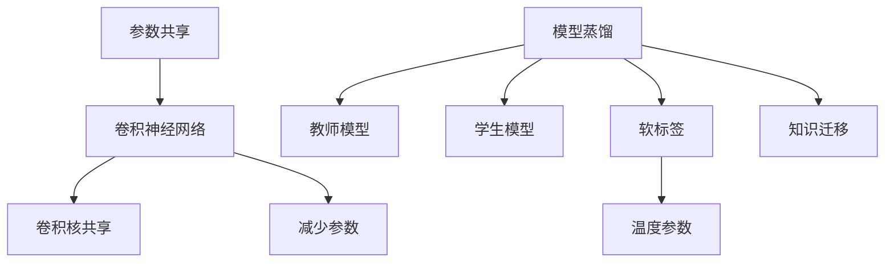

### 优化方法
------
#### **1. 权重初始化方法**
**🔑 知识点详解**
- **权重初始化的重要性**：
  - 权重初始化决定了神经网络训练的起点，直接影响模型的收敛速度和最终性能。
  - 不恰当的初始化可能导致梯度消失或梯度爆炸问题。
    👉 **注意**：初始化的目标是使每一层的输入和输出保持相似的分布，从而避免信号在传播过程中被放大或削弱。
- **Xavier 初始化**：
  - 定义：Xavier 初始化（也称Glorot初始化）通过控制权重的方差来确保输入和输出的分布一致。公式为 $ W \sim U[-\sqrt{\frac{6}{n_{in} + n_{out}}}, \sqrt{\frac{6}{n_{in} + n_{out}}}] $ 或 $ W \sim N(0, \sqrt{\frac{2}{n_{in} + n_{out}}}) $。
  - 特性：适用于Sigmoid和Tanh等激活函数，能够有效缓解梯度消失问题。
  - 使用场景：常用于浅层网络或使用Sigmoid/Tanh激活函数的网络。
    👉 **注意**：Xavier 初始化假设激活函数的输入和输出分布是对称的，因此不适合ReLU及其变体。
- **He 初始化**：
  - 定义：He 初始化针对ReLU激活函数设计，公式为 $ W \sim N(0, \sqrt{\frac{2}{n_{in}}}) $。
  - 特性：通过调整权重的方差，使ReLU激活后的输出分布更加稳定。
  - 使用场景：广泛应用于深度网络和使用ReLU激活函数的模型。
    👉 **注意**：He 初始化特别适合ReLU及其变体（如Leaky ReLU），但不适用于Sigmoid或Tanh。

**🔥 面试高频题**
1. Xavier 和 He 初始化的区别是什么？
   - **一句话答案**：Xavier 初始化适用于Sigmoid/Tanh激活函数，而He 初始化更适合ReLU及其变体。
   - **深入回答**：Xavier 初始化通过考虑输入和输出节点数的平均值来调整权重的方差，适用于对称分布的激活函数（如Sigmoid和Tanh）。而He 初始化仅考虑输入节点数，针对ReLU激活函数设计，能够更好地适应ReLU的非对称特性。选择合适的初始化方法可以显著提升模型的训练效果。

2. 如果不进行权重初始化会有什么后果？
   - **一句话答案**：权重初始化不当可能导致梯度消失或梯度爆炸，影响模型收敛。
   - **深入回答**：如果权重初始化过大，可能会导致激活值迅速饱和，梯度接近于零（梯度消失）；如果初始化过小，信号在深层网络中逐渐衰减，同样会导致梯度消失。此外，不合理的初始化可能使权重集中在某些特定值附近，导致模型无法有效学习特征。

------
#### **2. 过拟合与正则化**
**🔑 知识点详解**
- **过拟合现象**：
  - 定义：过拟合是指模型在训练集上表现良好，但在测试集上泛化能力较差的现象。
  - 原因：模型过于复杂，过度拟合了训练数据中的噪声和细节。
    👉 **注意**：过拟合通常发生在训练数据量不足或模型容量过大的情况下。
- **L1 正则化**：
  - 定义：L1 正则化通过在损失函数中加入权重的绝对值惩罚项，公式为 $ L = Loss + \lambda \sum |W| $。
  - 特性：L1 正则化倾向于产生稀疏权重矩阵，即部分权重被置为零。
  - 使用场景：适用于需要特征选择的任务。
    👉 **注意**：L1 正则化的稀疏性有助于解释模型，但可能导致模型不稳定。
- **L2 正则化**：
  - 定义：L2 正则化通过在损失函数中加入权重的平方和惩罚项，公式为 $ L = Loss + \lambda \sum W^2 $。
  - 特性：L2 正则化使权重趋于平滑，避免过大的权重值。
  - 使用场景：广泛应用于各种深度学习任务。
    👉 **注意**：L2 正则化不会产生稀疏解，但能有效防止权重过大。
- **Dropout**：
  - 定义：Dropout 是一种随机失活技术，在训练过程中以一定概率（如0.5）随机丢弃部分神经元。
  - 特性：通过减少神经元之间的依赖关系，增强模型的鲁棒性和泛化能力。
  - 使用场景：适用于深层神经网络，特别是全连接层。
    👉 **注意**：Dropout 在训练时随机丢弃神经元，但在推理时需要恢复所有神经元并乘以保留概率。

**🔥 面试高频题**
1. L1 和 L2 正则化的区别是什么？
   - **一句话答案**：L1 正则化倾向于稀疏解，而L2 正则化使权重更平滑。
   - **深入回答**：L1 正则化通过绝对值惩罚项鼓励权重向零收缩，最终可能导致部分权重完全为零，从而实现特征选择。L2 正则化通过平方和惩罚项限制权重的大小，使权重分布更加均匀，避免过大的权重值。L1 更适合高维稀疏数据，而L2 更通用。

2. Dropout 的工作原理是什么？如何设置合适的丢弃率？
   - **一句话答案**：Dropout 通过随机丢弃神经元减少过拟合，丢弃率通常设置为0.2到0.5。
   - **深入回答**：Dropout 在训练时随机关闭一部分神经元，从而强制模型学习更鲁棒的特征表示。在推理阶段，所有神经元都参与计算，并将输出乘以保留概率（如0.5）。丢弃率的选择需要根据任务复杂度和模型容量调整，过高的丢弃率可能导致欠拟合，而过低则可能无法有效防止过拟合。

**🌟 重点提醒**
- **要点一**：权重初始化是深度学习模型训练的基础，选择合适的初始化方法至关重要。
- **要点二**：L1 和 L2 正则化各有优劣，应根据任务需求选择。
- **要点三**：Dropout 是一种简单有效的正则化方法，但需要合理设置丢弃率。

**📝 实践经验**
```python
import torch
import torch.nn as nn

# Xavier 初始化
linear_xavier = nn.Linear(10, 5)
nn.init.xavier_uniform_(linear_xavier.weight)

# He 初始化
linear_he = nn.Linear(10, 5)
nn.init.kaiming_normal_(linear_he.weight, nonlinearity='relu')

# L2 正则化（通过优化器实现）
optimizer = torch.optim.SGD(model.parameters(), lr=0.01, weight_decay=1e-4)

# Dropout 层
dropout_layer = nn.Dropout(p=0.5)
```

**🔧 工具辅助**


**💡 复习建议**
1. 掌握权重初始化的基本原理，理解Xavier和He初始化的适用场景。
2. 熟悉L1和L2正则化的差异及其在不同任务中的应用。
3. 学会使用Dropout进行正则化，并通过实验调整丢弃率以优化模型性能。

------
#### **3. 迁移学习（Transfer Learning）与微调（Fine-tuning）**
**🔑 知识点详解**
- **迁移学习的定义**：
  - 定义：迁移学习是一种利用预训练模型的知识来解决新任务的技术。
  - 核心思想：通过在大规模数据集上预训练的模型提取通用特征，然后将其迁移到目标任务中。
    👉 **注意**：迁移学习特别适用于目标任务数据量较少的情况。
- **迁移学习的优势**：
  - 减少训练时间和计算资源需求。
  - 提高模型在小数据集上的泛化能力。
  - 借助预训练模型的强大特征提取能力，快速构建高性能模型。
- **微调（Fine-tuning）**：
  - 定义：微调是指在迁移学习的基础上，对预训练模型的部分或全部参数进行重新训练。
  - 实现方式：
    - 冻结部分层（如卷积层），仅训练最后几层（如全连接层）。
    - 解冻所有层，并以较小的学习率对整个模型进行训练。
    👉 **注意**：微调时需要根据目标任务的数据量和复杂度调整学习率和训练策略。

**🔥 面试高频题**
1. 迁移学习的核心思想是什么？如何选择合适的预训练模型？
   - **一句话答案**：迁移学习通过复用预训练模型的知识提升目标任务性能，选择预训练模型时需考虑任务相似性和数据分布。
   - **深入回答**：迁移学习的核心在于利用预训练模型在大规模数据上学习到的通用特征。例如，在图像分类任务中，可以选择在ImageNet上预训练的ResNet或VGG模型。如果目标任务与预训练任务相似（如同样是图像分类），迁移效果会更好；如果差异较大（如从图像分类迁移到文本分类），则需要更谨慎地设计迁移策略。

2. 微调时如何决定冻结哪些层？
   - **一句话答案**：通常冻结底层特征提取层，仅微调高层任务相关层。
   - **深入回答**：底层网络通常学习到的是通用特征（如边缘、纹理等），这些特征在不同任务间具有较高的可迁移性，因此可以冻结。而高层网络更关注特定任务的特征，因此需要根据目标任务的需求进行微调。此外，当目标任务数据量较小时，建议冻结更多层以避免过拟合。

**🌟 重点提醒**
- **要点一**：迁移学习是深度学习中一种高效的模型优化方法，尤其适合数据量有限的任务。
- **要点二**：微调时需要根据目标任务的数据量和复杂度调整学习率和训练策略。
- **要点三**：选择预训练模型时，优先考虑与目标任务相似的模型。

**📝 实践经验**
```python
import torch
import torchvision.models as models

# 加载预训练模型
model = models.resnet18(pretrained=True)

# 冻结所有层
for param in model.parameters():
    param.requires_grad = False

# 替换最后的全连接层
model.fc = torch.nn.Linear(model.fc.in_features, num_classes)

# 定义优化器，仅更新最后的全连接层
optimizer = torch.optim.Adam(model.fc.parameters(), lr=0.001)
```

**🔧 工具辅助**


------
#### **4. 参数共享与模型蒸馏（Model Distillation）**
**🔑 知识点详解**
- **参数共享**：
  - 定义：参数共享是指在模型的不同部分之间复用相同的权重参数。
  - 典型应用：卷积神经网络（CNN）中的卷积核在输入的不同位置共享权重。
  - 优势：
    - 减少模型参数数量，降低计算成本。
    - 提高模型的泛化能力，减少过拟合风险。
    👉 **注意**：参数共享特别适合处理具有局部相关性的数据（如图像和序列数据）。
- **模型蒸馏（Model Distillation）**：
  - 定义：模型蒸馏是一种将大模型（Teacher Model）的知识迁移到小模型（Student Model）的技术。
  - 核心思想：通过让小模型学习大模型的输出（软标签）而非原始标签，提升小模型的性能。
  - 关键机制：
    - 使用温度参数 $ T $ 调整Softmax输出的平滑程度，公式为 $ q_i = \frac{\exp(z_i / T)}{\sum_j \exp(z_j / T)} $。
    - 小模型的目标是最小化与大模型输出之间的差异（如KL散度）。
    👉 **注意**：模型蒸馏特别适合部署资源受限的场景（如移动设备）。

**🔥 面试高频题**
1. 模型蒸馏的核心思想是什么？如何实现？
   - **一句话答案**：模型蒸馏通过让小模型学习大模型的输出分布，从而提升小模型的性能。
   - **深入回答**：模型蒸馏的核心在于利用大模型的“软标签”（即经过温度调整的Softmax输出）作为监督信号，指导小模型的学习。相比直接使用原始标签，软标签包含了更多的类别间关系信息，有助于小模型更好地捕捉数据分布。实现时，可以通过增加一个蒸馏损失项（如KL散度）来优化小模型。

2. 参数共享在深度学习中的作用是什么？
   - **一句话答案**：参数共享减少了模型参数数量，提高了计算效率和泛化能力。
   - **深入回答**：参数共享在卷积神经网络中尤为常见，通过在输入的不同位置共享卷积核权重，模型能够以较少的参数捕获全局特征。此外，参数共享还降低了模型的存储需求，使其更适合部署在资源受限的环境中。

**🌟 重点提醒**
- **要点一**：参数共享是卷积神经网络的核心机制之一，显著提升了模型的效率和泛化能力。
- **要点二**：模型蒸馏是一种有效的模型压缩技术，特别适合资源受限的场景。
- **要点三**：在模型蒸馏中，温度参数的选择对软标签的质量有重要影响。

**📝 实践经验**
```python
import torch
import torch.nn as nn
import torch.nn.functional as F

# 定义教师模型和学生模型
teacher_model = ...  # 大模型
student_model = ...  # 小模型

# 温度参数
T = 5.0

# 计算软标签
def soft_labels(logits, T):
    return F.softmax(logits / T, dim=1)

# 蒸馏损失（KL散度）
def distillation_loss(student_logits, teacher_logits, T):
    student_probs = soft_labels(student_logits, T)
    teacher_probs = soft_labels(teacher_logits, T)
    return F.kl_div(student_probs.log(), teacher_probs, reduction='batchmean')

# 总损失
criterion = nn.CrossEntropyLoss()
alpha = 0.5  # 权重系数
loss = alpha * criterion(student_logits, labels) + (1 - alpha) * distillation_loss(student_logits, teacher_logits, T)
```

**🔧 工具辅助**


**💡 复习建议**
1. 理解迁移学习的基本原理，掌握如何选择预训练模型并进行微调。
2. 学习模型蒸馏的核心思想，尝试实现简单的蒸馏过程。
3. 掌握参数共享的作用及其在卷积神经网络中的应用。