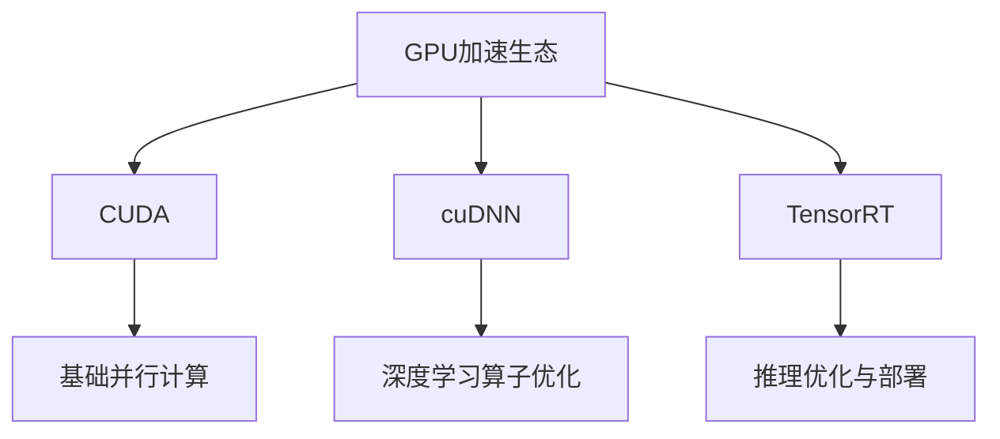

### 深度学习框架对比与加速技术  
------
#### **1. PyTorch、TensorFlow、Keras 基本用法对比**  
**🔑 知识点详解**  
- **核心框架特性**：  
  - **PyTorch**：  
    - **动态计算图**（即时执行，便于调试）  
    - **面向对象设计**（`nn.Module` 类封装模型）  
    - **社区生态**：研究领域广泛使用  
    👉 **注意**：动态图在部署时需转换为静态图（TorchScript）  
  - **TensorFlow**：  
    - **静态计算图**（早期版本，需先定义后执行）  
    - **灵活性**：支持 `tf.function` 动态/静态混合模式  
    - **生产部署**：TensorFlow Serving、TFLite 支持完善  
  - **Keras**：  
    - **高阶API**（简化模型构建，默认集成于 TensorFlow）  
    - **快速原型设计**（`Sequential`/`Functional` API）  
    👉 **辨析**：Keras 是接口规范，TensorFlow/Keras 是具体实现。  

- **关键代码对比**：  
  ```python  
  # PyTorch 模型定义  
  class Model(nn.Module):  
      def __init__(self):  
          super().__init__()  
          self.layer = nn.Linear(10, 1)  
      def forward(self, x):  
          return self.layer(x)  
  
  # TensorFlow/Keras 模型定义  
  model = tf.keras.Sequential([tf.keras.layers.Dense(1, input_shape=(10,))])  
  ```

**🔥 面试高频题**  
1. **PyTorch 和 TensorFlow 的核心区别是什么？**  
   - **一句话答案**：PyTorch 使用动态图，适合研究与调试；TensorFlow 早期静态图优化部署。  
   - **深入回答**：动态图允许逐行执行，便于调试和动态控制流；静态图通过预定义计算图优化性能，适合生产环境。TensorFlow 2.x 引入 Eager Execution 支持动态图，但通过 `tf.function` 可转为静态图优化。  

------
#### **2. 动态计算图 vs 静态计算图**  
**🔑 知识点详解**  
- **动态计算图（PyTorch）**：  
  - **即时执行**：代码即计算图，运行时构建  
  - **调试友好**：支持断点调试和实时打印  
  - **灵活性**：适用于RNN等动态结构  
  👉 **注意**：动态图可能导致性能损失，需结合 JIT 编译优化  

- **静态计算图（TensorFlow 1.x）**：  
  - **预定义结构**：先定义图，后通过会话执行  
  - **优化潜力**：编译器可全局优化（如算子融合）  
  - **部署优势**：支持跨平台导出（ONNX、TensorRT）  
  👉 **辨析**：静态图性能高但调试困难，动态图反之。  

**🌟 重点提醒**  
- **性能与灵活性权衡**：动态图适合实验，静态图适合部署  
- **混合模式**：TensorFlow 的 `tf.function` 和 PyTorch 的 `torch.jit` 提供两者结合方案  

**📝 实践经验**  
```python  
# TensorFlow 静态图转换示例  
@tf.function  
def train_step(x, y):  
    with tf.GradientTape() as tape:  
        pred = model(x)  
        loss = loss_fn(y, pred)  
    gradients = tape.gradient(loss, model.trainable_variables)  
    optimizer.apply_gradients(zip(gradients, model.trainable_variables))  
```

------
#### **3. GPU 加速计算（CUDA, cuDNN, TensorRT）**  
**🔑 知识点详解**  
- **核心工具链**：  
  - **CUDA**：NVIDIA GPU 通用计算平台  
  - **cuDNN**：深度神经网络加速库（卷积、RNN 优化）  
  - **TensorRT**：高性能推理优化器（量化、图优化）  

- **框架支持**：  
  - **PyTorch**：`torch.cuda` 模块，`.to('cuda')` 显式迁移数据  
  - **TensorFlow**：自动检测 GPU，`tf.config.list_physical_devices('GPU')`  
  - **Keras**：与 TensorFlow GPU 配置一致  

**🔥 面试高频题**  
1. **如何在 PyTorch 中启用 GPU 训练？**  
   - **一句话答案**：使用 `.to(device)` 迁移模型和数据到 GPU。  
   - **深入回答**：需显式指定设备（如 `device = 'cuda:0'`），并确保所有张量在同一设备；多 GPU 使用 `DataParallel` 或 `DistributedDataParallel`。  

**🔧 工具辅助**  



**💡 复习建议**  

1. 理解动态图与静态图的实现原理与适用场景  
2. 掌握 PyTorch/TensorFlow 的 GPU 配置与多卡训练  
3. 熟悉 TensorRT 的模型优化流程（ONNX 导出、层融合、量化）


