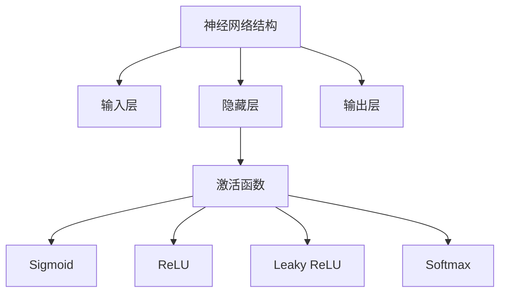
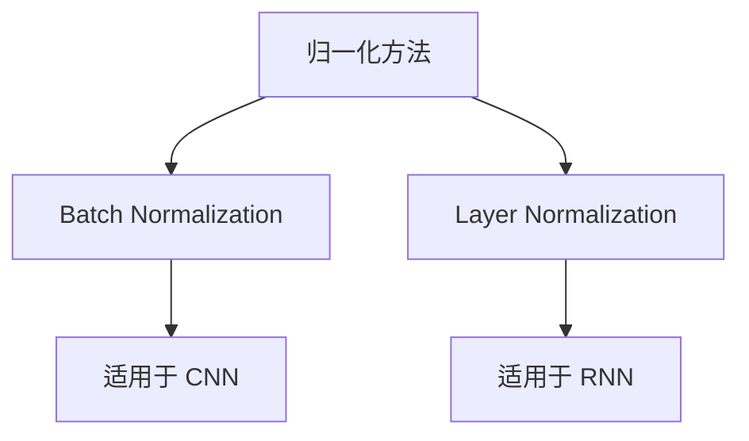

### 神经网络结构
------
#### **1. 神经网络的基本结构**
**🔑 知识点详解**
- **神经网络的组成**：
  - 神经网络通常由输入层、隐藏层和输出层三部分组成。
  - 输入层负责接收数据，隐藏层对数据进行特征提取和非线性变换，输出层生成最终结果。
  - 每一层由多个神经元（节点）组成，神经元之间通过权重连接。
    👉 **注意**：隐藏层的数量和每层的神经元数量会直接影响模型的复杂度和性能。
- **相关概念**：
  - 输入层：直接与原始数据相连，通常不对数据进行任何处理。
  - 隐藏层：可以有多层，每层通过激活函数引入非线性能力。
  - 输出层：根据任务类型（分类、回归等）选择不同的激活函数（如Softmax用于多分类）。
    👉 **辨析**：输入层和隐藏层的区别在于输入层不参与计算，而隐藏层通过权重和偏置进行复杂的特征学习。

**🔥 面试高频题**
1. 神经网络中隐藏层的作用是什么？
   - **一句话答案**：隐藏层通过对输入数据进行非线性变换，提取高层次的特征表示。
   - **深入回答**：隐藏层是神经网络的核心部分，它通过权重矩阵和激活函数实现对输入数据的特征提取。随着隐藏层数量的增加，模型能够学习到更加复杂的模式，但也会带来过拟合的风险。因此，设计时需要权衡模型复杂度和数据规模。

2. 如何决定隐藏层的数量和神经元的数量？
   - **一句话答案**：隐藏层和神经元的数量应根据数据复杂度和任务需求进行调整。
   - **深入回答**：一般来说，简单的任务可以用较少的隐藏层和神经元，而复杂的任务（如图像识别）可能需要更深的网络。可以通过实验或使用正则化技术（如Dropout）来避免过拟合。

------
#### **2. 激活函数**
**🔑 知识点详解**
- **Sigmoid**：
  - 定义：Sigmoid函数将输入映射到(0, 1)区间，公式为 $ f(x) = \frac{1}{1 + e^{-x}} $。
  - 特性：平滑且易于求导，但容易导致梯度消失问题。
  - 使用场景：早期神经网络中常用作激活函数，现在更多用于概率输出。
    👉 **注意**：Sigmoid在深层网络中可能导致梯度饱和，影响训练效率。
- **ReLU（Rectified Linear Unit）**：
  - 定义：ReLU函数定义为 $ f(x) = \max(0, x) $。
  - 特性：计算简单且有效缓解梯度消失问题，但可能存在“死亡ReLU”现象。
  - 使用场景：广泛应用于现代深度学习模型中。
    👉 **注意**：当输入为负值时，ReLU的梯度为0，可能导致部分神经元永久失活。
- **Leaky ReLU**：
  - 定义：Leaky ReLU是对ReLU的改进，定义为 $ f(x) = \max(\alpha x, x) $，其中 $\alpha$ 是一个小的正数。
  - 特性：解决了ReLU的“死亡”问题，允许负值输入有小梯度。
  - 使用场景：适用于需要更鲁棒激活函数的任务。
- **Softmax**：
  - 定义：Softmax函数将输入转换为概率分布，公式为 $ f(x_i) = \frac{e^{x_i}}{\sum_{j} e^{x_j}} $。
  - 特性：常用于多分类任务的输出层。
  - 使用场景：适用于需要输出类别概率的任务。
    👉 **注意**：Softmax对输入的数值范围敏感，可能需要先进行归一化处理。

**🔥 面试高频题**
1. 为什么ReLU比Sigmoid更适合深层网络？
   - **一句话答案**：ReLU计算简单且能有效缓解梯度消失问题。
   - **深入回答**：Sigmoid函数在输入较大或较小时梯度接近于0，导致深层网络中的梯度逐渐消失。而ReLU在正区间梯度恒为1，避免了这一问题，同时计算效率更高。不过，ReLU也可能存在“死亡ReLU”问题，可以通过Leaky ReLU等变体解决。

2. Softmax函数的作用是什么？如何避免数值溢出？
   - **一句话答案**：Softmax将输入转换为概率分布，适用于多分类任务。
   - **深入回答**：Softmax通过指数运算将输入映射到(0, 1)区间，并保证所有输出的和为1。为了避免指数运算导致的数值溢出，可以在计算前减去输入的最大值（即使用 $ e^{x_i - \max(x)} $ 替代 $ e^{x_i} $）。

**🌟 重点提醒**
- **要点一**：选择合适的激活函数对模型性能至关重要。
- **要点二**：ReLU及其变体是现代深度学习中最常用的激活函数。
- **要点三**：Softmax适用于多分类任务，但需要注意数值稳定性。

**📝 实践经验**
```python
import numpy as np

# Sigmoid函数实现
def sigmoid(x):
    return 1 / (1 + np.exp(-x))

# ReLU函数实现
def relu(x):
    return np.maximum(0, x)

# Leaky ReLU函数实现
def leaky_relu(x, alpha=0.01):
    return np.where(x > 0, x, alpha * x)

# Softmax函数实现
def softmax(x):
    exp_x = np.exp(x - np.max(x))  # 防止数值溢出
    return exp_x / np.sum(exp_x)
```

**🔧 工具辅助**


**💡 复习建议**
1. 理解神经网络的基本结构，掌握输入层、隐藏层和输出层的功能。
2. 熟悉常见激活函数的特点及其适用场景，特别是ReLU和Softmax。
3. 动手实现常见的激活函数，并结合实际任务进行测试和调优。

---

### 反向传播（Backpropagation）与梯度计算

------

#### **1. 反向传播（Backpropagation）**

**🔑 知识点详解**

- 反向传播（Backpropagation）：
  - **核心定义**：反向传播（BP）是一种计算神经网络权重梯度的优化算法，通过链式法则计算误差对每层权重的偏导数，以最小化损失函数。
  - 重要特性：
    - 依赖梯度下降优化算法进行权重更新。
    - 采用链式法则计算梯度。
    - 需要前向传播计算输出，再进行误差反向传播。
  - 关键机制：
    1. **前向传播**：计算网络输出。
    2. **计算损失**：基于目标函数计算误差。
    3. 反向传播：
       - 计算输出层梯度（∂L/∂y）。
       - 通过链式法则传播梯度至隐藏层。
       - 计算每层权重梯度（∂L/∂W）。
    4. **参数更新**：使用梯度下降等优化算法更新权重。 👉 **注意**：梯度消失问题可能导致深层网络训练困难。
- 相关概念：
  - 链式法则：
    - 反向传播利用链式法则计算梯度。
    - 计算复杂网络的误差传播路径。
  - 梯度消失与梯度爆炸：
    - 深层网络可能导致梯度指数级缩小或增大。
    - 影响权重更新，使训练变慢或不稳定。 👉 **辨析**：梯度消失通常发生在sigmoid/tanh等激活函数中，ReLU及其变体可缓解问题。

 **🔥 面试高频题**

1. 什么是反向传播（Backpropagation）？
   - **一句话答案**：反向传播是一种计算神经网络梯度的方法，通过误差反传更新权重。
   - **深入回答**：反向传播利用链式法则计算损失对每个权重的梯度，然后使用梯度下降等优化算法更新参数。它包括前向传播、误差计算、梯度传播和参数更新四个步骤。

------

#### **2. 归一化技术（Batch Normalization、Layer Normalization）**

**🔑 知识点详解**

- Batch Normalization（BN）：
  - 主要内容：
    - 在每个mini-batch内对输入数据进行归一化，使其均值接近0，方差接近1。
    - 通过可训练参数（γ, β）恢复数据分布。
  - 核心特点：
    - 加速训练，提高收敛速度。
    - 缓解梯度消失问题。
    - 降低模型对初始参数的敏感性。
  - 实现原理：
    1. 计算mini-batch均值 $$μ_B$$ 和方差$$σ_B^2$$。
    2. 归一化：$$ŷ_i = (x_i - μ_B) / (√(σ_B^2 + ε))$$。
    3. 线性变换：$$y_i = γ ŷ_i + β$$。 👉 **注意**：BN 在小batch时可能不稳定，Layer Normalization更适用。
- Layer Normalization（LN）：
  - 主要内容：
    - 对单个样本在特征维度上进行归一化。
    - 计算每个样本的均值和方差，而非batch均值。
  - 核心特点：
    - 适用于RNN等序列模型。
    - 独立于batch size，适用于小batch训练。
  - 实现原理：
    - 计算每个样本的均值和方差。
    - 归一化并使用可学习参数调整分布。 👉 **注意**：LN不会受到batch size影响，但可能不如BN稳定。 **🔥 面试高频题**

1. Batch Normalization 和 Layer Normalization 的区别？
   - **一句话答案**：BN 在 batch 维度归一化，LN 在特征维度归一化。
   - **深入回答**：BN 计算 mini-batch 统计量，在大 batch 训练时效果较好，而 LN 在特征维度归一化，不依赖 batch size，更适用于 RNN。
2. 为什么 BN 可以加速训练？
   - **一句话答案**：归一化输入分布，使梯度传播更稳定，提高收敛速度。
   - **深入回答**：BN 使输入分布稳定，有助于缓解梯度消失，加快收敛，同时减少对初始化的依赖。 **🌟 重点提醒**

- **梯度消失问题**：深层网络训练可能遇到梯度消失，BN 和 LN 可缓解。
- **BN 适用于 CNN，LN 适用于 RNN**。
- **BN 依赖 batch 统计信息，LN 依赖样本内特征统计信息**。 **📝 实践经验**

```python
import torch
import torch.nn as nn

# Batch Normalization 示例
bn = nn.BatchNorm1d(10)
x = torch.randn(16, 10)
y = bn(x)

# Layer Normalization 示例
ln = nn.LayerNorm(10)\y_ln = ln(x)
```

**🔧 工具辅助**



**💡 复习建议**

1. 熟练掌握反向传播计算步骤。
2. 理解梯度消失问题及 BN/LN 解决方法。
3. 掌握 BN/LN 适用场景及代码实现。

------