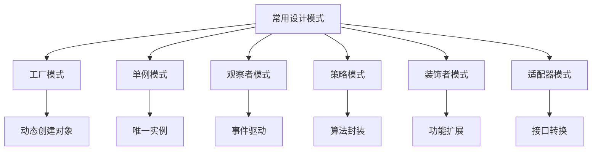
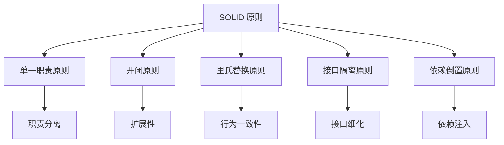
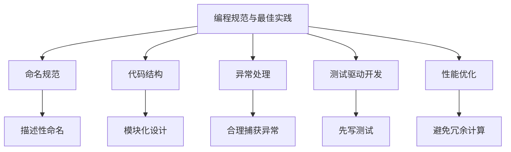
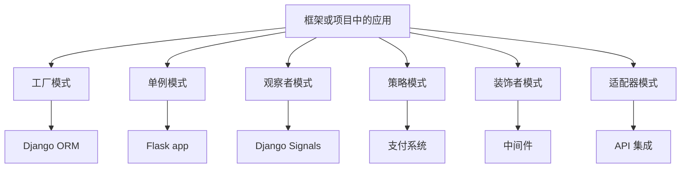

### 设计模式

------
#### **1. 常用设计模式**
**🔑 知识点详解**
- **工厂模式（Factory Pattern）**：
  - **定义**：通过一个工厂类或方法创建对象，而无需指定具体的类。
  - **核心思想**：将对象的创建与使用分离，提升代码的灵活性和可扩展性。
    👉 **注意**：适用于需要动态创建对象的场景。
- **单例模式（Singleton Pattern）**：
  - **定义**：确保一个类只有一个实例，并提供全局访问点。
  - **核心思想**：通过控制实例化过程，避免重复创建对象。
    👉 **注意**：常用于管理共享资源（如配置、日志）。
- **观察者模式（Observer Pattern）**：
  - **定义**：定义对象间的一对多依赖关系，当一个对象的状态发生变化时，所有依赖它的对象都会收到通知。
  - **核心思想**：实现事件驱动的松耦合架构。
    👉 **注意**：适用于事件监听和发布-订阅系统。
- **策略模式（Strategy Pattern）**：
  - **定义**：定义一系列算法，并将它们封装为独立的类，使它们可以互换。
  - **核心思想**：通过组合而非继承实现行为的动态切换。
    👉 **注意**：适用于需要灵活切换算法的场景。
- **装饰者模式（Decorator Pattern）**：
  - **定义**：在不改变对象接口的前提下，动态地为对象添加功能。
  - **核心思想**：通过包装器类实现功能扩展。
    👉 **注意**：适用于需要动态增强功能的场景。
- **适配器模式（Adapter Pattern）**：
  - **定义**：将一个类的接口转换为另一个接口，以满足客户端的需求。
  - **核心思想**：通过适配器类实现接口兼容。
    👉 **注意**：适用于集成不同接口的系统。

**🔥 面试高频题**
1. 工厂模式和单例模式的区别是什么？
   - **一句话答案**：工厂模式用于动态创建对象，单例模式用于确保类只有一个实例。
   - **深入回答**：工厂模式的核心作用是通过一个工厂类或方法创建对象，而无需指定具体的类。这种方式提升了代码的灵活性和可扩展性，特别适合需要动态创建对象的场景。相比之下，单例模式的核心作用是确保一个类只有一个实例，并提供全局访问点。这种方式常用于管理共享资源（如配置、日志）。例如：
     ```python
     # 工厂模式示例
     class Dog:
         def speak(self):
             return "Woof!"
     
     class Cat:
         def speak(self):
             return "Meow!"
     
     class AnimalFactory:
         @staticmethod
         def create_animal(animal_type):
             if animal_type == "dog":
                 return Dog()
             elif animal_type == "cat":
                 return Cat()
     
     animal = AnimalFactory.create_animal("dog")
     print(animal.speak())  # 输出: Woof!
     
     # 单例模式示例
     class Singleton:
         _instance = None
     
         def __new__(cls, *args, **kwargs):
             if not cls._instance:
                 cls._instance = super().__new__(cls, *args, **kwargs)
             return cls._instance
     
     s1 = Singleton()
     s2 = Singleton()
     print(s1 is s2)  # 输出: True
     ```

2. 观察者模式的核心思想是什么？如何实现？
   - **一句话答案**：观察者模式通过一对多依赖关系实现事件驱动的松耦合架构。
   - **深入回答**：观察者模式的核心思想是定义对象间的一对多依赖关系，当一个对象的状态发生变化时，所有依赖它的对象都会收到通知。这种方式实现了事件驱动的松耦合架构，特别适合事件监听和发布-订阅系统。例如：
     ```python
     class Subject:
         def __init__(self):
             self.observers = []
     
         def attach(self, observer):
             self.observers.append(observer)
     
         def notify(self, message):
             for observer in self.observers:
                 observer.update(message)
     
     class Observer:
         def update(self, message):
             print(f"Received message: {message}")
     
     subject = Subject()
     observer1 = Observer()
     observer2 = Observer()
     subject.attach(observer1)
     subject.attach(observer2)
     subject.notify("Hello, Observers!")
     # 输出:
     # Received message: Hello, Observers!
     # Received message: Hello, Observers!
     ```

**🌟 重点提醒**
- **要点一**：工厂模式用于动态创建对象。
- **要点二**：单例模式确保类只有一个实例。
- **要点三**：观察者模式实现事件驱动的松耦合架构。

**📝 实践经验**
```python
# 策略模式示例
class StrategyA:
    def execute(self):
        return "Executing Strategy A"

class StrategyB:
    def execute(self):
        return "Executing Strategy B"

class Context:
    def __init__(self, strategy):
        self.strategy = strategy

    def set_strategy(self, strategy):
        self.strategy = strategy

    def execute_strategy(self):
        return self.strategy.execute()

context = Context(StrategyA())
print(context.execute_strategy())  # 输出: Executing Strategy A
context.set_strategy(StrategyB())
print(context.execute_strategy())  # 输出: Executing Strategy B

# 装饰者模式示例
class Component:
    def operation(self):
        return "Base operation"

class Decorator:
    def __init__(self, component):
        self.component = component

    def operation(self):
        return f"{self.component.operation()} with enhancement"

component = Component()
decorated = Decorator(component)
print(decorated.operation())  # 输出: Base operation with enhancement

# 适配器模式示例
class LegacyPrinter:
    def print_old(self, text):
        return f"Legacy Printer: {text}"

class ModernPrinter:
    def print_new(self, text):
        return f"Modern Printer: {text}"

class PrinterAdapter:
    def __init__(self, legacy_printer):
        self.legacy_printer = legacy_printer

    def print_new(self, text):
        return self.legacy_printer.print_old(text)

legacy = LegacyPrinter()
adapter = PrinterAdapter(legacy)
print(adapter.print_new("Hello"))  # 输出: Legacy Printer: Hello
```

**🔧 工具辅助**


------
#### **2. 面向对象设计原则（SOLID）**
**🔑 知识点详解**
- **单一职责原则（SRP）**：
  - **定义**：一个类应该只有一个引起它变化的原因。
  - **核心思想**：通过职责分离提升代码的可维护性。
- **开闭原则（OCP）**：
  - **定义**：软件实体应对扩展开放，对修改关闭。
  - **核心思想**：通过抽象和多态实现可扩展性。
- **里氏替换原则（LSP）**：
  - **定义**：子类必须能够替换其父类而不影响程序的正确性。
  - **核心思想**：通过继承实现行为一致性。
- **接口隔离原则（ISP）**：
  - **定义**：客户端不应依赖于它们不需要的接口。
  - **核心思想**：通过细化接口提升代码的灵活性。
- **依赖倒置原则（DIP）**：
  - **定义**：高层模块不应依赖于低层模块，二者都应依赖于抽象。
  - **核心思想**：通过依赖注入实现松耦合。

**🔥 面试高频题**
1. SOLID 原则的核心思想是什么？如何应用？
   - **一句话答案**：SOLID 原则通过职责分离、扩展性和松耦合提升代码质量。
   - **深入回答**：SOLID 是面向对象设计的五大原则，旨在提升代码的可维护性、可扩展性和灵活性。具体来说：
     - **SRP**：通过职责分离，避免类承担过多功能。
     - **OCP**：通过抽象和多态实现可扩展性，减少对现有代码的修改。
     - **LSP**：通过继承实现行为一致性，确保子类可以无缝替换父类。
     - **ISP**：通过细化接口，避免客户端依赖于不必要的功能。
     - **DIP**：通过依赖注入实现松耦合，提升模块的独立性。例如：
       ```python
       # SRP 示例
       class ReportGenerator:
           def generate(self, data):
               return f"Report: {data}"
       
       class ReportPrinter:
           def print_report(self, report):
               print(report)
       
       generator = ReportGenerator()
       printer = ReportPrinter()
       report = generator.generate("Sales Data")
       printer.print_report(report)
       
       # OCP 示例
       from abc import ABC, abstractmethod
       
       class Shape(ABC):
           @abstractmethod
           def area(self):
               pass
       
       class Circle(Shape):
           def __init__(self, radius):
               self.radius = radius
       
           def area(self):
               return 3.14 * self.radius ** 2
       
       class Rectangle(Shape):
           def __init__(self, width, height):
               self.width = width
               self.height = height
       
           def area(self):
               return self.width * self.height
       
       shapes = [Circle(5), Rectangle(4, 6)]
       for shape in shapes:
           print(shape.area())
       ```

2. 如何通过 SOLID 原则优化代码？
   - **一句话答案**：通过职责分离、抽象和依赖注入实现高内聚低耦合。
   - **深入回答**：优化代码时可以通过以下方式应用 SOLID 原则：
     - **SRP**：将复杂类拆分为多个职责单一的类。
     - **OCP**：通过抽象和多态实现可扩展性，避免直接修改现有代码。
     - **LSP**：确保子类的行为与父类一致，避免破坏继承体系。
     - **ISP**：将大接口拆分为小接口，避免客户端依赖于不必要的功能。
     - **DIP**：通过依赖注入将具体实现与抽象解耦，提升模块的独立性。

**🌟 重点提醒**
- **要点一**：SOLID 原则通过职责分离、扩展性和松耦合提升代码质量。
- **要点二**：每个原则解决特定的设计问题。
- **要点三**：实际开发中需综合考虑各原则的应用。

**📝 实践经验**
```python
# ISP 示例
from abc import ABC, abstractmethod

class Printer(ABC):
    @abstractmethod
    def print(self, document):
        pass

class Scanner(ABC):
    @abstractmethod
    def scan(self, document):
        pass

class MultiFunctionDevice(Printer, Scanner):
    def print(self, document):
        print(f"Printing {document}")

    def scan(self, document):
        print(f"Scanning {document}")

device = MultiFunctionDevice()
device.print("Document.pdf")
device.scan("Photo.jpg")

# DIP 示例
class Database:
    def save(self, data):
        print(f"Saving {data} to database")

class UserService:
    def __init__(self, db):
        self.db = db

    def add_user(self, user):
        self.db.save(user)

db = Database()
service = UserService(db)
service.add_user("Alice")
```

**🔧 工具辅助**


------
#### **3. 编程规范与最佳实践**
**🔑 知识点详解**
- **命名规范**：
  - 变量名、函数名应具有描述性，遵循 `snake_case` 或 `CamelCase`。
- **代码结构**：
  - 模块化设计，避免过长的函数和类。
- **异常处理**：
  - 使用 `try-except` 捕获异常，避免滥用裸 `except`。
- **测试驱动开发**：
  - 先编写测试用例，再实现功能。
- **性能优化**：
  - 避免不必要的计算和内存占用。

**🔥 面试高频题**
1. 如何编写高质量的代码？
   - **一句话答案**：通过命名规范、模块化设计和测试驱动开发提升代码质量。
   - **深入回答**：编写高质量代码的关键在于：
     - **命名规范**：变量名、函数名应具有描述性，便于理解。
     - **代码结构**：采用模块化设计，避免过长的函数和类。
     - **异常处理**：合理使用 `try-except` 捕获异常，避免滥用裸 `except`。
     - **测试驱动开发**：先编写测试用例，再实现功能，确保代码的正确性。
     - **性能优化**：避免不必要的计算和内存占用，提升代码效率。例如：
       ```python
       # 命名规范示例
       def calculate_area(radius):
           return 3.14 * radius ** 2
       
       # 异常处理示例
       try:
           result = 10 / 0
       except ZeroDivisionError as e:
           print(f"Error: {e}")
       ```

2. 测试驱动开发的优势是什么？
   - **一句话答案**：测试驱动开发通过先编写测试用例确保代码的正确性和可维护性。
   - **深入回答**：测试驱动开发（TDD）的核心优势在于：
     - **正确性**：通过测试用例验证功能是否符合预期。
     - **可维护性**：测试用例作为文档，便于后续维护和扩展。
     - **早期发现问题**：在开发阶段发现并修复问题，降低修复成本。
     - **提升信心**：通过自动化测试确保代码的稳定性。例如：
       ```python
       # 测试驱动开发示例
       import unittest
       
       def add(a, b):
           return a + b
       
       class TestAdd(unittest.TestCase):
           def test_add(self):
               self.assertEqual(add(2, 3), 5)
       
       if __name__ == "__main__":
           unittest.main()
       ```

**🌟 重点提醒**
- **要点一**：命名规范提升代码的可读性。
- **要点二**：模块化设计提升代码的可维护性。
- **要点三**：测试驱动开发确保代码的正确性和稳定性。

**📝 实践经验**
```python
# 性能优化示例
import time

def slow_function():
    time.sleep(2)

def optimized_function():
    pass  # 避免不必要的计算

# 测试驱动开发示例
import unittest

def multiply(a, b):
    return a * b

class TestMultiply(unittest.TestCase):
    def test_multiply(self):
        self.assertEqual(multiply(2, 3), 6)

if __name__ == "__main__":
    unittest.main()
```

**🔧 工具辅助**


------
#### **4. 在框架或项目中的应用案例**
**🔑 知识点详解**
- **工厂模式**：
  - 应用场景：Django 的 ORM 系统通过工厂模式动态创建模型实例。
- **单例模式**：
  - 应用场景：Flask 的 `app` 对象通常以单例模式实现。
- **观察者模式**：
  - 应用场景：消息队列（如 RabbitMQ）和事件总线（如 Django Signals）。
- **策略模式**：
  - 应用场景：支付系统的多种支付方式（如信用卡、PayPal）。
- **装饰者模式**：
  - 应用场景：中间件（如 Flask 和 Django 的请求/响应处理）。
- **适配器模式**：
  - 应用场景：第三方 API 集成（如支付网关适配器）。

**🔥 面试高频题**
1. 如何在框架中应用设计模式？
   - **一句话答案**：通过设计模式解决框架中的常见问题，如对象创建、事件处理和接口兼容。
   - **深入回答**：设计模式在框架中的应用非常广泛。例如：
     - **工厂模式**：Django 的 ORM 系统通过工厂模式动态创建模型实例，提升灵活性。
     - **单例模式**：Flask 的 `app` 对象通常以单例模式实现，确保全局唯一性。
     - **观察者模式**：Django Signals 通过观察者模式实现事件驱动的松耦合架构。
     - **策略模式**：支付系统通过策略模式实现多种支付方式的动态切换。
     - **装饰者模式**：Flask 和 Django 的中间件通过装饰者模式动态增强请求/响应处理。
     - **适配器模式**：第三方 API 集成通过适配器模式实现接口兼容。

2. 如何在项目中选择合适的设计模式？
   - **一句话答案**：根据需求和场景选择设计模式，解决特定问题。
   - **深入回答**：选择设计模式时需要综合考虑以下因素：
     - **需求分析**：明确需要解决的问题（如对象创建、行为扩展）。
     - **场景匹配**：根据场景选择合适的模式（如事件驱动选观察者模式）。
     - **代码复用**：优先选择提升代码复用性和可维护性的模式。
     - **团队共识**：确保团队成员熟悉所选模式，便于协作。例如，在支付系统中，策略模式适合实现多种支付方式；在日志系统中，单例模式适合管理全局日志对象。

**🌟 重点提醒**
- **要点一**：设计模式解决框架中的常见问题。
- **要点二**：根据需求和场景选择合适的设计模式。
- **要点三**：实际项目中需综合考虑模式的适用性和团队共识。

**📝 实践经验**
```python
# Django Signals 示例（观察者模式）
from django.db.models.signals import post_save
from django.dispatch import receiver
from myapp.models import MyModel

@receiver(post_save, sender=MyModel)
def my_handler(sender, **kwargs):
    print("MyModel instance saved!")

# Flask 中间件示例（装饰者模式）
from flask import Flask, request

app = Flask(__name__)

@app.before_request
def log_request_info():
    print(f"Request method: {request.method}, URL: {request.url}")

@app.route("/")
def home():
    return "Hello, World!"
```

**🔧 工具辅助**


**💡 复习建议**
1. 掌握常用设计模式的核心思想及其应用场景。
2. 学习 SOLID 原则的基本概念及其在代码优化中的应用。
3. 熟悉编程规范与最佳实践，提升代码质量和可维护性。
4. 结合框架或项目案例，理解设计模式的实际应用价值。