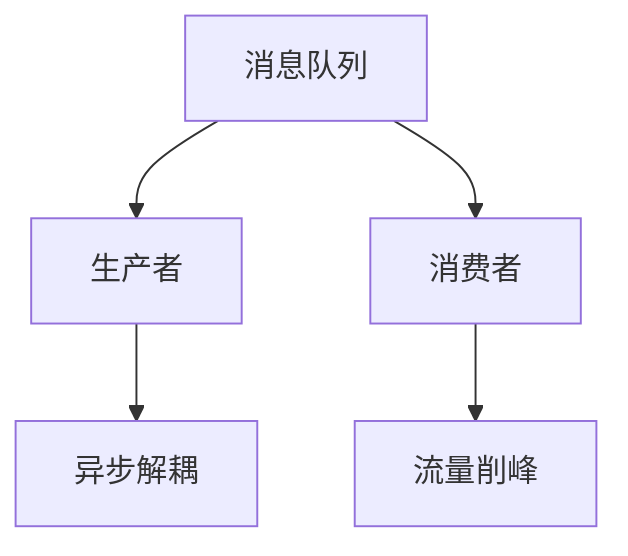

### 微服务架构设计
------
#### **1. 微服务核心与拆分原则**
**🔑 知识点详解**
- **微服务定义**：
  - **核心定义**：将应用拆分为小型、独立部署的服务，围绕业务功能设计。
  - **重要特性**：松耦合、高内聚、独立性强，支持异构技术栈。
  - **关键机制**：通过 API（如 REST、gRPC）通信，依赖容器化（如 Docker）部署。
    - **实现细节**：每个服务有独立数据库，部署单元小，易于迭代。
    👉 **注意**：过度拆分会导致复杂度上升，需平衡粒度。
- **拆分原则**：
  - **具体说明**：按业务边界（DDD）、职责单一、数据独立性拆分。
  - **实现方式**：如订单服务与用户服务分开，各自维护数据库。
  - **使用场景**：大型应用解耦、团队独立开发。
    👉 **辨析**：微服务 vs 单体，前者灵活但分布式管理成本高，后者简单但扩展性差。

**🔥 面试高频题**
1. 微服务相比单体架构的优势是什么？
   - **一句话答案**：独立部署、按需扩展、技术多样性。
   - **深入回答**：微服务支持模块化开发，故障隔离性强，单个服务可独立升级；单体架构所有功能耦合，部署需全量更新。实际中，Netflix 用微服务提升了弹性和迭代速度。
2. 如何合理拆分微服务？
   - **一句话答案**：基于领域驱动设计（DDD）和单一职责原则。
   - **深入回答**：通过识别业务上下文边界（Bounded Context），确保服务职责清晰，如支付服务不处理库存逻辑。避免过细拆分导致通信开销过大。
3. 微服务的缺点是什么？
   - **一句话答案**：分布式复杂性、数据一致性挑战。
   - **深入回答**：网络延迟、调用链复杂、事务管理困难是主要问题，需引入服务治理和分布式事务机制。

#### **2. 服务通信与部署**
**🔑 知识点详解**
- **通信方式**：
  - **主要内容**：同步（REST、gRPC）、异步（消息队列如 Kafka）。
  - **核心特点**：REST 简单通用，gRPC 高性能，异步解耦性强。
  - **实现原理**：HTTP/2 驱动 gRPC，消息队列基于发布-订阅或点对点模型。
    - **细节**：gRPC 用 Protocol Buffers 序列化，效率高于 JSON。
    👉 **注意**：同步调用需关注超时和重试策略。
- **部署方式**：
  - **具体说明**：容器化（Docker）、编排（Kubernetes）。
  - **实现方式**：Docker 打包服务镜像，K8s 管理 Pod 和负载均衡。
  - **使用场景**：大规模部署、动态扩缩容。

**🔥 面试高频题**
1. REST 和 gRPC 的区别是什么？
   - **一句话答案**：REST 是基于 HTTP 的通用协议，gRPC 是基于 HTTP/2 的高性能 RPC 框架。
   - **深入回答**：REST 用 JSON，易读但开销大；gRPC 用 ProtoBuf，序列化效率高，适合低延迟场景如微服务内部通信。
2. 如何确保微服务通信的可靠性？
   - **一句话答案**：熔断、降级、重试和超时机制。
   - **深入回答**：用 Hystrix 或 Resilience4j 实现熔断，防止故障扩散；异步通信加消息队列重试确保投递。实践上，设置合理的超时阈值很重要。
3. Kubernetes 在微服务中的作用是什么？
   - **一句话答案**：服务编排与自动扩缩容。
   - **深入回答**：K8s 管理容器生命周期，提供服务发现、负载均衡和故障恢复，如通过 Deployment 控制副本数。

**🌟 重点提醒**
- **要点一**：通信方式选择需考虑性能与复杂度。
- **要点二**：容器化是微服务部署的基础。
- **要点三**：服务粒度与团队规模匹配。

**📝 实践经验**
```java
// gRPC 示例
service OrderService {
  rpc CreateOrder (OrderRequest) returns (OrderResponse);
}
message OrderRequest {
  int32 user_id = 1;
  float amount = 2;
}
```

**💡 复习建议**
1. 熟悉 REST 和 gRPC 的实现。
2. 理解 Kubernetes 核心组件（Pod、Service）。
3. 实践服务拆分与通信。

---

### 分布式系统基本概念、CAP 理论简介
------
#### **1. 分布式系统基础**
**🔑 知识点详解**
- **分布式系统定义**：
  - **核心定义**：多个独立节点通过网络协作完成任务的系统。
  - **重要特性**：高可用、可扩展、去中心化。
  - **关键机制**：节点间通信（RPC、消息）、数据复制、负载均衡。
    - **细节**：依赖一致性协议（如 Paxos）同步状态。
    👉 **注意**：网络分区和节点失效是常态。

**🔥 面试高频题**
1. 分布式系统的挑战有哪些？
   - **一句话答案**：网络延迟、一致性、故障容忍。
   - **深入回答**：网络不可靠导致数据同步困难；一致性与可用性需权衡（如 CAP）；节点宕机需自动切换。ZooKeeper 等工具常用于协调。
2. 分布式系统和单机系统的区别？
   - **一句话答案**：多节点协作 vs 单节点计算。
   - **深入回答**：分布式系统通过多机并行提升性能，但引入了复杂性，如数据分片和同步问题。

---

#### **2. CAP 理论**
**🔑 知识点详解**
- **CAP 定理**：
  - **主要内容**：一致性（Consistency）、可用性（Availability）、分区容忍性（Partition Tolerance）三者不可兼得。
  - **核心特点**：分布式系统中网络分区不可避免，只能选择 CP 或 AP。
  - **实现原理**：CP 优先数据一致性（如 HBase），AP 优先服务可用性（如 Cassandra）。
    - **细节**：CP 系统拒绝部分请求，AP 系统允许数据最终一致。
    👉 **注意**：CAP 是理论指导，实际系统常取折中（如 BASE）。

**🔥 面试高频题**
1. CAP 理论的核心是什么？
   - **一句话答案**：分布式系统无法同时满足一致性、可用性和分区容忍性。
   - **深入回答**：网络分区（P）不可避免，系统需在 C 和 A 间选择。CP 系统（如 MongoDB 主从）适合强一致性场景，AP 系统（如 DynamoDB）适合高可用场景。
2. Redis 是 CP 还是 AP 系统？
   - **一句话答案**：AP 系统。
   - **深入回答**：Redis 主从复制异步，主节点可用性优先，数据最终一致，符合 AP 模型。
3. 如何在 CAP 中做权衡？
   - **一句话答案**：根据业务需求选择一致性或可用性。
   - **深入回答**：金融系统选 CP（如银行转账），社交系统选 AP（如微博更新）。实践上，结合 BASE 理论实现折中。

**🌟 重点提醒**
- **要点一**：理解分布式系统的核心问题。
- **要点二**：CAP 是设计分布式系统的基石。
- **要点三**：实际系统多为最终一致性。

**💡 复习建议**
1. 掌握 CAP 的含义和典型案例。
2. 对比 CP 和 AP 系统的优劣。
3. 理解 BASE 和 ACID 的关系。

---

### 分布式事务、服务治理
------
#### **1. 分布式事务**
**🔑 知识点详解**
- **分布式事务原理**：
  - **核心定义**：跨多个服务或数据库的事务，保证一致性。
  - **重要特性**：全局原子性，复杂性高。
  - **关键机制**：两阶段提交（2PC）、补偿事务（TCC）、Saga 模式。
    - **细节**：2PC 通过协调者同步提交，TCC 预留-确认-取消，Saga 分步执行。
    👉 **注意**：2PC 阻塞性强，性能较差。

**🔥 面试高频题**
1. 2PC 的优缺点是什么？
   - **一句话答案**：优点是强一致性，缺点是阻塞和单点故障。
   - **深入回答**：2PC 通过准备和提交两阶段保证一致性，但协调者故障会导致资源锁定。实际中多用 TCC 或 Saga 替代。
2. Saga 模式如何实现分布式事务？
   - **一句话答案**：将事务拆分为子事务，失败时执行补偿。
   - **深入回答**：每个服务独立提交，失败调用反向操作（如扣款失败退款），适合长事务和高并发。
3. 分布式事务适用于哪些场景？
   - **一句话答案**：跨服务的数据一致性需求。
   - **深入回答**：如订单支付涉及库存和账户服务，需保证原子性。Seata 是常见解决方案。

---

#### **2. 服务治理**
**🔑 知识点详解**
- **服务治理核心**：
  - **主要内容**：服务注册发现、负载均衡、故障隔离。
  - **核心特点**：动态管理服务，提升系统稳定性。
  - **实现原理**：如 Eureka 注册服务，Ribbon 负载均衡，Hystrix 熔断。
    - **细节**：心跳机制检测服务状态，熔断器统计失败率。
    👉 **注意**：治理工具需与监控结合。

**🔥 面试高频题**
1. 服务注册与发现的原理是什么？
   - **一句话答案**：服务向注册中心注册，客户端动态获取服务地址。
   - **深入回答**：Eureka 通过服务端存储服务列表，客户端定时拉取，结合负载均衡调用。避免单点依赖。
2. 如何实现服务熔断？
   - **一句话答案**：监控失败率，超阈值时切断请求。
   - **深入回答**：Hystrix 统计窗口内错误率，触发熔断后调用降级逻辑，防止雪崩效应。
3. 服务治理的意义是什么？
   - **一句话答案**：提高微服务系统的可维护性和可靠性。
   - **深入回答**：通过动态路由、故障隔离和监控，解决分布式环境下服务管理的复杂性。

**🌟 重点提醒**
- **要点一**：分布式事务需权衡性能与一致性。
- **要点二**：服务治理是微服务落地的关键。
- **要点三**：工具选型需匹配业务规模。

**📝 实践经验**
```java
// Hystrix 熔断示例
@HystrixCommand(fallbackMethod = "fallback")
public String callService() {
    return restTemplate.getForObject("http://service", String.class);
}
public String fallback() {
    return "Service unavailable";
}
```

**💡 复习建议**
1. 熟悉 2PC 和 Saga 的流程。
2. 实践服务注册与熔断。
3. 理解治理工具的实现原理。

---

### 消息队列、中间件使用
------
#### **1. 消息队列基础**
**🔑 知识点详解**
- **消息队列原理**：
  - **核心定义**：异步通信中间件，解耦生产者和消费者。
  - **重要特性**：高吞吐、支持分布式、消息持久化。
  - **关键机制**：发布-订阅（Pub/Sub）、点对点（P2P）。
    - **细节**：如 Kafka 用分区存储，RabbitMQ 用交换机路由。
    👉 **注意**：需关注消息丢失和重复消费问题。

**🔥 面试高频题**
1. 消息队列的作用是什么？
   - **一句话答案**：异步处理、流量削峰、系统解耦。
   - **深入回答**：异步提升响应速度，削峰保护下游系统，解耦降低服务依赖。如订单系统用 MQ 通知库存。
2. Kafka 和 RabbitMQ 的区别？
   - **一句话答案**：Kafka 高吞吐分布式，RabbitMQ 轻量灵活。
   - **深入回答**：Kafka 适合日志、大数据场景，基于分区日志存储；RabbitMQ 适合简单队列，基于 AMQP 协议。
3. 如何保证消息不丢失？
   - **一句话答案**：持久化存储和确认机制。
   - **深入回答**：生产者开启 ACK，消费者手动确认，队列和消息持久化配置。

---

#### **2. 中间件使用**
**🔑 知识点详解**
- **常见中间件**：
  - **主要内容**：Redis（缓存）、ZooKeeper（协调）、Elasticsearch（搜索）。
  - **核心特点**：提升系统性能和可扩展性。
  - **实现原理**：Redis 内存键值存储，ZooKeeper 分布式锁，ES 倒排索引。
    - **细节**：ZooKeeper 用 ZAB 协议保证一致性。
    👉 **注意**：中间件需监控资源占用。

**🔥 面试高频题**
1. ZooKeeper 在分布式系统中的作用？
   - **一句话答案**：分布式协调与配置管理。
   - **深入回答**：提供服务注册、分布式锁、配置同步，如实现 Leader 选举。基于树形结构和高可用部署。
2. Redis 如何用作分布式锁？
   - **一句话答案**：通过 SETNX 实现互斥。
   - **深入回答**：SETNX 加锁，EXPIRE 防死锁，释放用 Lua 脚本确保原子性。Redisson 是封装实现。
3. 中间件选型的关键因素？
   - **一句话答案**：业务需求、性能、易用性。
   - **深入回答**：高吞吐选 Kafka，低延迟选 Redis，搜索选 ES，需综合考虑运维成本。

**🌟 重点提醒**
- **要点一**：消息队列是分布式异步核心。
- **要点二**：中间件需关注高可用配置。
- **要点三**：理解各中间件的适用场景。

**📝 实践经验**
```java
// Kafka 生产者示例
Properties props = new Properties();
props.put("bootstrap.servers", "localhost:9092");
KafkaProducer<String, String> producer = new KafkaProducer<>(props);
producer.send(new ProducerRecord<>("topic", "key", "value"));
```

**🔧 工具辅助**


**💡 复习建议**
1. 掌握 MQ 的核心模型（Pub/Sub）。
2. 实践 Redis 和 ZooKeeper 的典型用法。
3. 对比中间件的优缺点。

---

