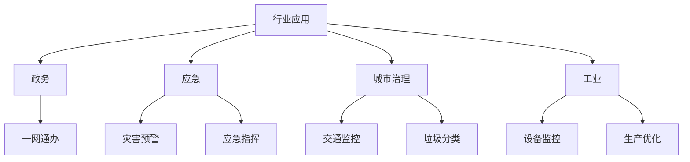
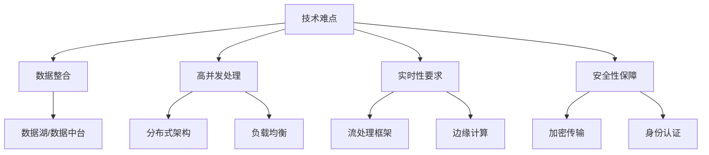
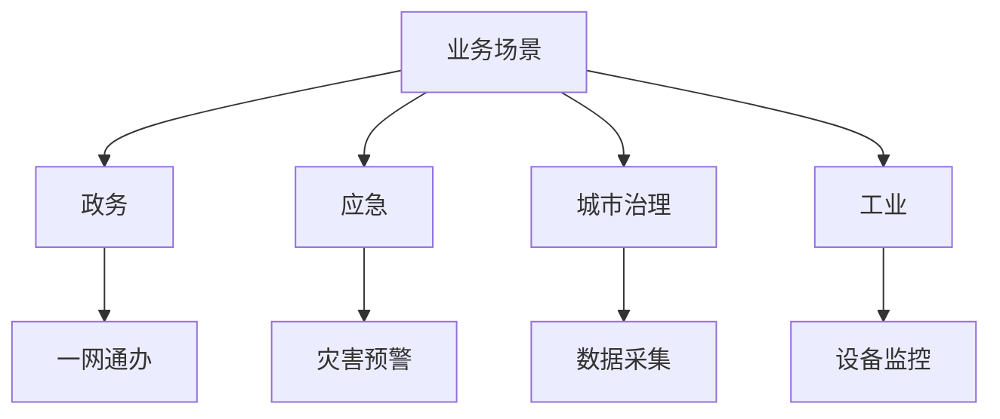
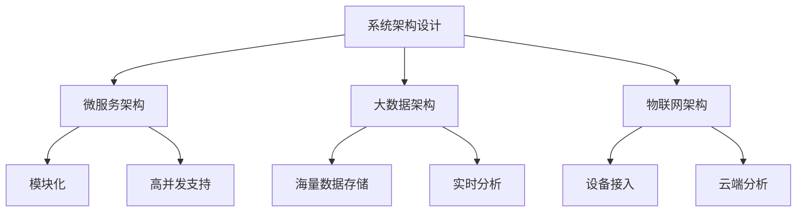
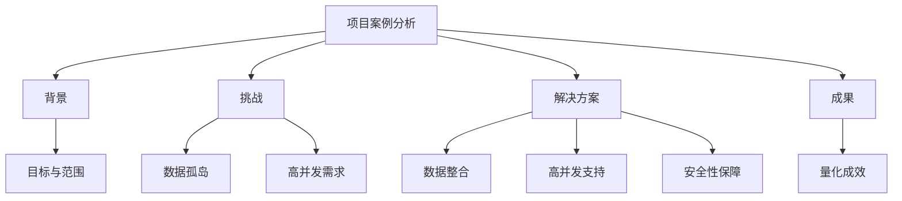
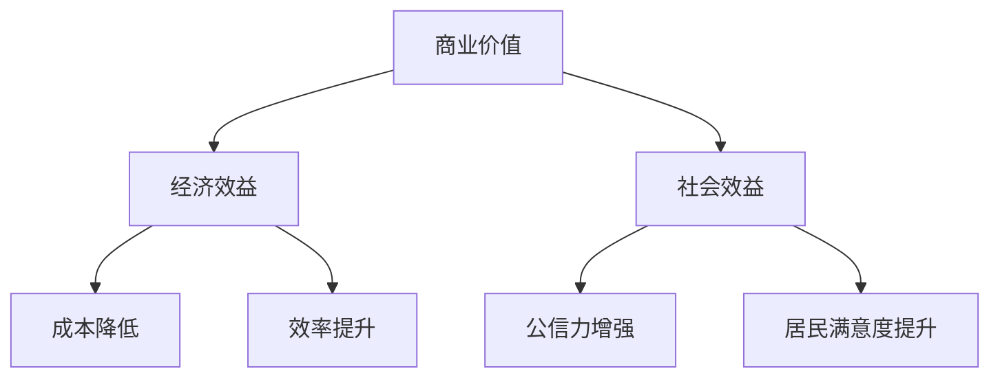

### 行业经验
------
#### **1. 政务、数字政府、应急、城市治理、工业等行业应用平台相关项目案例**
**🔑 知识点详解**
- **政务与数字政府**：
  - **定义**：政务和数字政府项目旨在通过信息化手段提升政府服务效率，推动“互联网+政务服务”。
  - **典型案例**：
    - **联通智慧政务平台**：
      - **功能**：实现“一网通办”，整合多部门数据，提供在线审批、查询、缴费等服务。
      - **技术栈**：Spring Cloud 微服务架构、分布式数据库（如 MySQL、PostgreSQL）、大数据分析（如 Hadoop、Spark）。
      - **价值**：提升政务服务效率，优化用户体验。

- **应急管理**：
  - **定义**：应急管理平台用于灾害预警、应急指挥和资源调度。
  - **典型案例**：
    - **联通应急指挥系统**：
      - **功能**：集成气象、地震、交通等多源数据，支持实时监控和决策支持。
      - **技术栈**：物联网（IoT）、GIS 地理信息系统、实时流处理（如 Kafka、Flink）。
      - **价值**：提升灾害响应速度，降低损失。

- **城市治理**：
  - **定义**：城市治理平台通过智能化手段解决城市管理问题，如交通拥堵、环境监测。
  - **典型案例**：
    - **联通智慧城市平台**：
      - **功能**：实现交通流量监控、垃圾分类管理、公共安全预警等功能。
      - **技术栈**：AI 视频分析、边缘计算、数据湖（Data Lake）。
      - **价值**：提高城市运行效率，改善居民生活质量。

- **工业互联网**：
  - **定义**：工业互联网平台连接设备、生产线和供应链，实现智能制造。
  - **典型案例**：
    - **联通工业互联网平台**：
      - **功能**：设备状态监控、生产流程优化、预测性维护。
      - **技术栈**：5G 技术、边缘计算、时序数据库（如 InfluxDB）。
      - **价值**：提升生产效率，降低运营成本。

**🔥 面试高频题**
1. 国内三大运营商在政务领域的项目有哪些特点？
   - **一句话答案**：国内三大运营商的政务项目以“互联网+政务服务”为核心，注重数据整合和服务效率。
   - **深入回答**：三大运营商在政务领域的项目特点如下：
     - **联通**：强调微服务架构和大数据分析能力，支持“一网通办”。
     - **移动**：注重 5G 和物联网技术的应用，提升政务服务的智能化水平。
     - **电信**：聚焦云网融合，提供高可靠性和高性能的服务。

2. 应急管理平台的核心功能是什么？如何实现？
   - **一句话答案**：应急管理平台的核心功能包括灾害预警、应急指挥和资源调度，通过多源数据集成和实时分析实现。
   - **深入回答**：应急管理平台的核心功能及其实现方式如下：
     - **灾害预警**：集成气象、地震、交通等多源数据，通过 AI 模型进行预测。
     - **应急指挥**：利用 GIS 地理信息系统展示灾情分布，支持实时决策。
     - **资源调度**：通过物联网设备监控资源状态，结合算法优化调度方案。

**🌟 重点提醒**
- **要点一**：政务项目以“互联网+政务服务”为核心，注重数据整合。
- **要点二**：应急管理平台通过多源数据集成和实时分析提升响应速度。
- **要点三**：城市治理平台利用 AI 和物联网技术改善城市运行效率。

**📝 实践经验**
```plaintext
# 示例：联通智慧城市平台功能
交通流量监控：实时分析车流数据，优化信号灯控制
垃圾分类管理：通过 AI 识别垃圾类型，提升分类效率
公共安全预警：利用视频监控和 AI 分析，提前发现安全隐患
```

**🔧 工具辅助**


------
#### **2. 平台开发中的技术难点与解决方案**
**🔑 知识点详解**
- **技术难点**：
  1. **数据整合**：
     - **问题**：多源异构数据难以统一管理。
     - **解决方案**：采用数据湖或数据中台技术，实现数据标准化和治理。
  2. **高并发处理**：
     - **问题**：政务和应急平台需支持高并发访问。
     - **解决方案**：使用分布式架构（如 Spring Cloud、Dubbo）和负载均衡（如 Nginx、Kubernetes）。
  3. **实时性要求**：
     - **问题**：应急管理需要实时数据处理。
     - **解决方案**：引入流处理框架（如 Kafka、Flink）和边缘计算技术。
  4. **安全性保障**：
     - **问题**：政务和工业平台对数据安全要求高。
     - **解决方案**：采用加密传输（如 HTTPS、TLS）和身份认证（如 OAuth2、JWT）。

**🔥 面试高频题**
1. 平台开发中常见的技术难点有哪些？如何解决？
   - **一句话答案**：常见技术难点包括数据整合、高并发处理、实时性和安全性，可通过数据湖、分布式架构、流处理框架和加密技术解决。
   - **深入回答**：平台开发中的技术难点及解决方案如下：
     - **数据整合**：
       - **问题**：多源异构数据难以统一管理。
       - **解决方案**：采用数据湖或数据中台技术，实现数据标准化和治理。
     - **高并发处理**：
       - **问题**：政务和应急平台需支持高并发访问。
       - **解决方案**：使用分布式架构（如 Spring Cloud、Dubbo）和负载均衡（如 Nginx、Kubernetes）。
     - **实时性要求**：
       - **问题**：应急管理需要实时数据处理。
       - **解决方案**：引入流处理框架（如 Kafka、Flink）和边缘计算技术。
     - **安全性保障**：
       - **问题**：政务和工业平台对数据安全要求高。
       - **解决方案**：采用加密传输（如 HTTPS、TLS）和身份认证（如 OAuth2、JWT）。

**🌟 重点提醒**
- **要点一**：数据整合可通过数据湖或数据中台解决。
- **要点二**：高并发处理依赖分布式架构和负载均衡。
- **要点三**：实时性需求可通过流处理框架和边缘计算满足。

**📝 实践经验**
```plaintext
# 示例：技术难点与解决方案
数据整合：采用数据湖技术，统一管理多源数据
高并发处理：使用 Spring Cloud 和 Kubernetes 提升性能
实时性要求：引入 Kafka 和 Flink 实现实时分析
安全性保障：通过 HTTPS 和 OAuth2 保护数据安全
```

**🔧 工具辅助**


------
#### **3. 业务场景理解，核心业务流程、数据交互、安全要求**
**🔑 知识点详解**
- **核心业务流程**：
  - **政务**：
    - 用户提交申请 -> 系统自动审核 -> 数据流转至相关部门 -> 审批完成 -> 结果反馈。
  - **应急**：
    - 数据采集 -> 灾害预警 -> 应急指挥 -> 资源调度 -> 后续评估。
  - **城市治理**：
    - 数据采集 -> 数据分析 -> 决策支持 -> 执行反馈 -> 持续优化。
  - **工业**：
    - 设备监控 -> 数据采集 -> 生产优化 -> 预测性维护 -> 效率提升。

- **数据交互**：
  - **政务**：跨部门数据共享，确保数据一致性和隐私保护。
  - **应急**：多源数据集成，支持实时分析和决策。
  - **城市治理**：传感器数据上传，云端分析后下发指令。
  - **工业**：设备与云端双向通信，支持远程控制和数据分析。

- **安全要求**：
  - **数据隐私**：采用加密存储和传输，防止数据泄露。
  - **访问控制**：基于角色的权限管理（RBAC），限制敏感数据访问。
  - **审计日志**：记录操作行为，便于事后追溯。

**🔥 面试高频题**
1. 如何理解政务项目的业务场景？核心流程是什么？
   - **一句话答案**：政务项目通过信息化手段实现“一网通办”，核心流程包括用户申请、自动审核、部门审批和结果反馈。
   - **深入回答**：政务项目的业务场景及核心流程如下：
     - **业务场景**：用户通过在线平台提交申请，系统自动审核后流转至相关部门，审批完成后反馈结果。
     - **核心流程**：
       1. 用户提交申请。
       2. 系统自动审核。
       3. 数据流转至相关部门。
       4. 审批完成。
       5. 结果反馈给用户。

2. 应急管理平台的数据交互有哪些特点？
   - **一句话答案**：应急管理平台通过多源数据集成，支持实时分析和决策。
   - **深入回答**：应急管理平台的数据交互特点如下：
     - **多源数据集成**：整合气象、地震、交通等多源数据。
     - **实时分析**：通过流处理框架（如 Kafka、Flink）实现实时分析。
     - **决策支持**：将分析结果展示在 GIS 地理信息系统上，支持实时决策。

**🌟 重点提醒**
- **要点一**：政务项目的核心流程包括用户申请、自动审核、部门审批和结果反馈。
- **要点二**：应急管理平台通过多源数据集成支持实时分析和决策。
- **要点三**：安全要求包括数据隐私、访问控制和审计日志。

**📝 实践经验**
```plaintext
# 示例：政务项目核心流程
用户提交申请 -> 系统自动审核 -> 数据流转至相关部门 -> 审批完成 -> 结果反馈
```

**🔧 工具辅助**


------
#### **4. 系统架构设计**
**🔑 知识点详解**
- **系统架构设计原则**：
  - **模块化**：将系统划分为独立模块，便于开发和维护。
  - **可扩展性**：支持横向扩展，适应业务增长。
  - **高可用性**：通过冗余设计和容灾机制确保系统稳定运行。
  - **安全性**：采用多层次安全防护措施，保护数据和系统。

- **典型架构**：
  - **微服务架构**：
    - **特点**：服务拆分，独立部署，支持弹性扩展。
    - **技术栈**：Spring Cloud、Kubernetes、Docker。
  - **大数据架构**：
    - **特点**：支持海量数据存储和分析。
    - **技术栈**：Hadoop、Spark、Flink。
  - **物联网架构**：
    - **特点**：设备接入、数据采集、云端分析。
    - **技术栈**：MQTT、CoAP、边缘计算。

**🔥 面试高频题**
1. 如何设计一个政务系统的架构？
   - **一句话答案**：政务系统采用微服务架构，支持高并发和数据整合。
   - **深入回答**：政务系统的设计要点如下：
     - **微服务架构**：将系统划分为独立模块，如用户管理、审批服务、数据共享等。
     - **数据整合**：采用数据中台或数据湖技术，实现跨部门数据的标准化和治理。
            - **高并发支持**：使用分布式架构（如 Spring Cloud）和负载均衡（如 Nginx、Kubernetes），确保系统能够应对高并发访问。
                 - **安全性保障**：通过 HTTPS 加密传输、OAuth2 身份认证和 RBAC 权限管理，保护敏感数据和系统安全。
                 - **高可用性**：采用主从复制、集群部署和容灾机制，确保系统的稳定运行。

2. 应急管理平台的架构设计有哪些关键点？
   - **一句话答案**：应急管理平台需支持实时数据处理、多源数据集成和高可用性。
   - **深入回答**：应急管理平台的架构设计关键点如下：
     - **实时数据处理**：引入流处理框架（如 Kafka、Flink），实现实时数据采集和分析。
     - **多源数据集成**：通过数据中台或 ETL 工具整合气象、地震、交通等多源数据。
     - **GIS 支持**：利用 GIS 地理信息系统展示灾情分布，支持应急指挥决策。
     - **高可用性**：采用分布式数据库（如 MongoDB、Cassandra）和冗余设计，确保系统在灾害场景下的稳定性。
     - **边缘计算**：在靠近数据源的边缘节点进行初步处理，减少延迟并提升响应速度。

**🌟 重点提醒**
- **要点一**：政务系统采用微服务架构，注重数据整合和高并发支持。
- **要点二**：应急管理平台需支持实时数据处理和多源数据集成。
- **要点三**：系统架构设计需兼顾模块化、可扩展性和高可用性。

**📝 实践经验**
```plaintext
# 示例：政务系统架构设计
微服务架构：Spring Cloud + Kubernetes
数据整合：数据中台 + 数据湖
高并发支持：Nginx 负载均衡 + Redis 缓存
安全性保障：HTTPS 加密 + OAuth2 认证
高可用性：主从复制 + 容灾机制
```

**🔧 工具辅助**


------
#### **5. 项目案例分析**
**🔑 知识点详解**
- **案例背景**：
  - **项目名称**：联通智慧政务平台。
  - **目标**：实现“一网通办”，提升政务服务效率。
  - **挑战**：
    - 多部门数据孤岛问题。
    - 高并发访问需求。
    - 数据安全与隐私保护。

- **解决方案**：
  1. **数据整合**：
     - 使用数据中台技术，统一管理多部门数据。
     - 通过 ETL 工具清洗和标准化数据。
  2. **高并发支持**：
     - 采用 Spring Cloud 微服务架构，将系统拆分为独立模块。
     - 使用 Redis 缓存热点数据，减轻数据库压力。
  3. **安全性保障**：
     - 引入 HTTPS 和 TLS 加密传输，保护数据隐私。
     - 使用 OAuth2 和 JWT 实现身份认证和权限管理。

- **成果**：
  - 实现了跨部门数据共享，用户可通过单一入口完成多项业务办理。
  - 系统支持日均百万级访问量，响应时间控制在 200ms 内。
  - 数据泄露风险显著降低，用户满意度提升。

**🔥 面试高频题**
1. 如何分析一个政务项目的成功案例？
   - **一句话答案**：从背景、挑战、解决方案和成果四个方面分析政务项目的成功案例。
   - **深入回答**：政务项目案例分析的关键步骤如下：
     - **背景**：明确项目的目标和范围，例如实现“一网通办”。
     - **挑战**：识别项目面临的主要问题，如数据孤岛、高并发需求。
     - **解决方案**：
       - 数据整合：通过数据中台解决数据孤岛问题。
       - 高并发支持：采用微服务架构和缓存技术提升性能。
       - 安全性保障：引入加密传输和身份认证保护数据安全。
     - **成果**：量化项目的成效，如提升服务效率、降低响应时间。

2. 应急管理平台的案例中有哪些值得借鉴的经验？
   - **一句话答案**：应急管理平台的成功经验包括多源数据集成、实时分析和高可用性设计。
   - **深入回答**：应急管理平台的案例经验如下：
     - **多源数据集成**：整合气象、地震、交通等多源数据，提供全面的灾害预警。
     - **实时分析**：通过流处理框架（如 Kafka、Flink）实现秒级数据分析，支持快速决策。
     - **高可用性设计**：采用分布式架构和冗余设计，确保系统在灾害场景下的稳定性。

**🌟 重点提醒**
- **要点一**：项目案例分析需从背景、挑战、解决方案和成果四个方面展开。
- **要点二**：政务项目的成功经验包括数据整合、高并发支持和安全性保障。
- **要点三**：应急管理平台注重多源数据集成和实时分析。

**📝 实践经验**
```plaintext
# 示例：政务项目案例分析
背景：实现“一网通办”，提升政务服务效率
挑战：数据孤岛、高并发需求、数据安全
解决方案：
  数据整合：数据中台 + ETL 工具
  高并发支持：Spring Cloud + Redis 缓存
  安全性保障：HTTPS + OAuth2 认证
成果：跨部门数据共享，日均百万级访问量，响应时间 < 200ms
```

**🔧 工具辅助**


------
#### **6. 商业价值落地**
**🔑 知识点详解**
- **商业价值的定义**：
  - **定义**：商业价值是项目为企业或社会带来的实际收益，包括经济效益和社会效益。
  - **核心思想**：通过技术创新和流程优化，提升效率、降低成本、改善用户体验。

- **政务领域的商业价值**：
  - **经济效益**：
    - 提升政务服务效率，降低运营成本。
    - 减少人工审核工作量，节省人力资源。
  - **社会效益**：
    - 提升政府公信力，增强民众满意度。
    - 推动数字化转型，促进智慧城市建设。

- **应急领域的商业价值**：
  - **经济效益**：
    - 降低灾害损失，减少经济损失。
    - 提高资源调度效率，节约应急成本。
  - **社会效益**：
    - 提升灾害响应速度，保障人民生命财产安全。
    - 增强公众安全感，提升社会治理水平。

- **城市治理的商业价值**：
  - **经济效益**：
    - 优化资源配置，降低城市管理成本。
    - 提升交通效率，减少拥堵带来的经济损失。
  - **社会效益**：
    - 改善居民生活质量，提升城市宜居性。
    - 推动绿色可持续发展，减少环境污染。

- **工业领域的商业价值**：
  - **经济效益**：
    - 提升生产效率，降低运营成本。
    - 实现预测性维护，减少设备故障带来的损失。
  - **社会效益**：
    - 推动智能制造，促进产业升级。
    - 减少资源浪费，支持绿色发展。

**🔥 面试高频题**
1. 如何评估政务项目的商业价值？
   - **一句话答案**：从经济效益和社会效益两个维度评估政务项目的商业价值。
   - **深入回答**：政务项目的商业价值评估方法如下：
     - **经济效益**：
       - 提升政务服务效率，降低运营成本。
       - 减少人工审核工作量，节省人力资源。
     - **社会效益**：
       - 提升政府公信力，增强民众满意度。
       - 推动数字化转型，促进智慧城市建设。
     ```plaintext
     示例：某政务项目每年节省人力成本 500 万元，用户满意度提升 30%。
     ```

2. 应急管理平台如何体现商业价值？
   - **一句话答案**：应急管理平台通过降低灾害损失和提升响应速度，带来经济效益和社会效益。
   - **深入回答**：应急管理平台的商业价值体现在以下方面：
     - **经济效益**：
       - 通过灾害预警和资源调度，降低灾害损失。
       - 提高资源调度效率，节约应急成本。
     - **社会效益**：
       - 提升灾害响应速度，保障人民生命财产安全。
       - 增强公众安全感，提升社会治理水平。
     ```plaintext
     示例：某应急平台每年减少灾害损失 1 亿元，响应时间缩短至 5 分钟内。
     ```

**🌟 重点提醒**
- **要点一**：商业价值包括经济效益和社会效益。
- **要点二**：政务项目的价值体现在效率提升和公信力增强。
- **要点三**：应急管理平台的价值体现在灾害损失降低和响应速度提升。

**📝 实践经验**
```plaintext
# 示例：商业价值评估
政务项目：每年节省人力成本 500 万元，用户满意度提升 30%
应急平台：每年减少灾害损失 1 亿元，响应时间缩短至 5 分钟内
```

**🔧 工具辅助**


------
#### **💡 复习建议**
1. 掌握政务、应急、城市治理和工业等领域的典型项目案例。
2. 理解平台开发中的技术难点及解决方案。
3. 学习核心业务流程、数据交互和安全要求。
4. 掌握系统架构设计的原则和方法。
5. 结合实际案例，分析项目的商业价值。