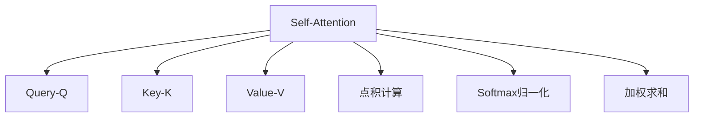
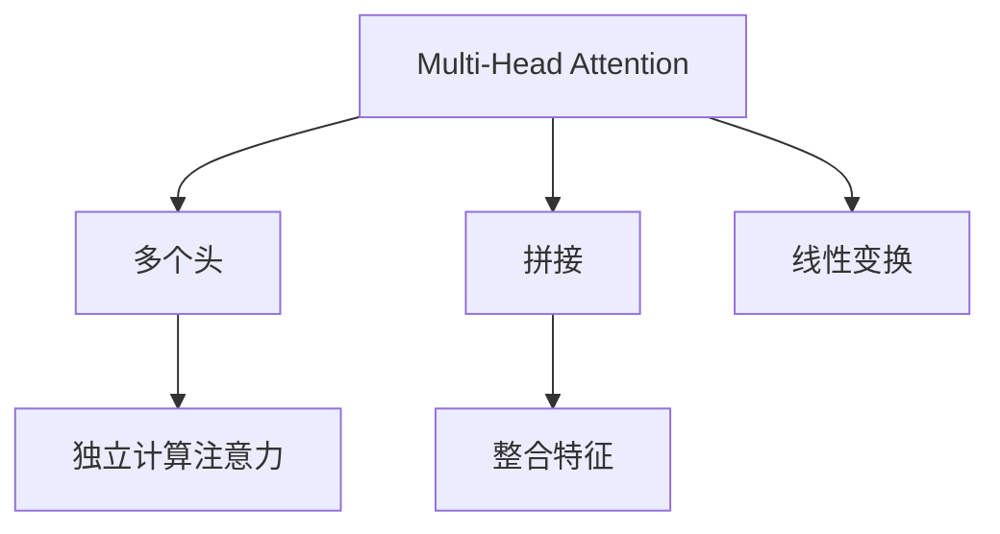
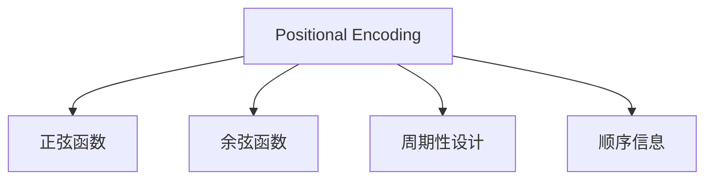
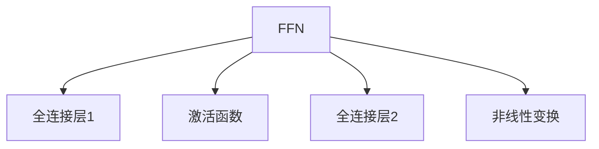
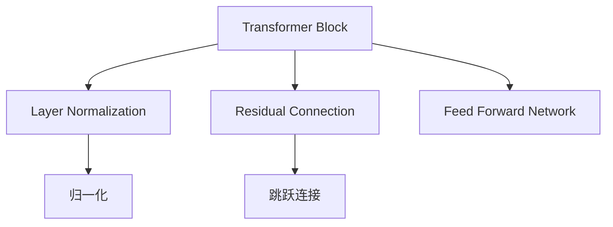
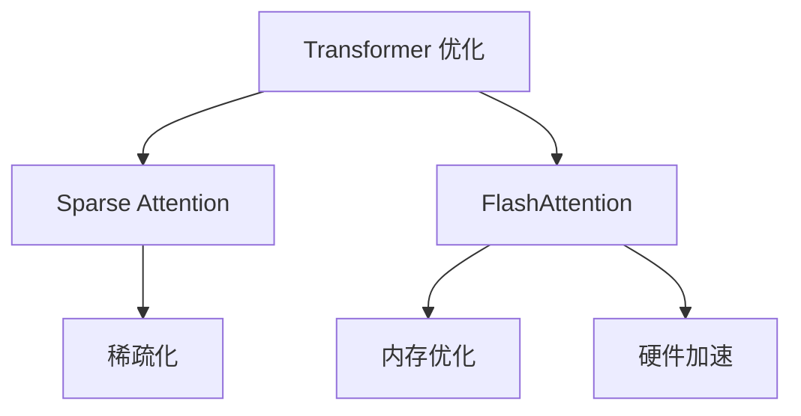

### Transformer 及其核心概念
------
#### **1. Self-Attention 机制（Q, K, V 计算）**
**🔑 知识点详解**
- **Self-Attention 的定义**：
  - 定义：Self-Attention 是一种通过计算输入序列中每个单词与其他单词的相关性，动态分配权重的机制。
  - 核心思想：通过查询（Query, Q）、键（Key, K）和值（Value, V）的交互，捕捉序列中的全局依赖关系。
    👉 **注意**：Self-Attention 能够并行计算，显著提升了效率。
- **公式与计算流程**：
  - 输入表示：将输入序列 $ X $ 映射为三个向量：
    - 查询矩阵 $ Q = XW_Q $
    - 键矩阵 $ K = XW_K $
    - 值矩阵 $ V = XW_V $
    - 其中 $ W_Q, W_K, W_V $ 是可学习的权重矩阵。
  - 注意力分数：计算查询与键之间的相似性，公式为：
    - $ \text{Attention}(Q, K, V) = \text{softmax}(\frac{QK^T}{\sqrt{d_k}})V $
    - $ d_k $: 键向量的维度，用于缩放点积结果以避免梯度不稳定。
  - 输出：注意力权重与值矩阵相乘，生成加权后的表示。
    👉 **注意**：Softmax 操作确保注意力权重的和为 1。

**🔥 面试高频题**
1. Self-Attention 的核心思想是什么？如何计算注意力权重？
   - **一句话答案**：Self-Attention 通过计算查询与键的相似性，动态分配权重并加权求和值向量。
   - **深入回答**：Self-Attention 的核心思想是通过查询（Q）、键（K）和值（V）的交互，捕捉输入序列中每个单词与其他单词的关系。具体来说，首先将输入映射为 Q、K 和 V 向量，然后计算 Q 和 K 的点积得到注意力分数，再通过 Softmax 归一化得到注意力权重。最后，将注意力权重与 V 相乘，生成加权后的表示。这种方法允许模型关注序列中的任意位置，从而更好地捕捉全局依赖关系。

2. 为什么需要对点积结果进行缩放（$ \sqrt{d_k} $）？
   - **一句话答案**：缩放点积结果可以防止梯度不稳定，尤其是在高维空间中。
   - **深入回答**：当键向量的维度 $ d_k $ 较大时，点积结果可能会变得非常大，导致 Softmax 函数的梯度接近于零，从而影响训练稳定性。通过将点积结果除以 $ \sqrt{d_k} $，可以有效地控制数值范围，避免梯度消失或爆炸问题。

**🌟 重点提醒**
- **要点一**：Self-Attention 通过 Q、K、V 的交互捕捉全局依赖关系。
- **要点二**：注意力权重通过 Softmax 归一化，确保权重和为 1。
- **要点三**：缩放点积结果可以提升训练稳定性。

**📝 实践经验**
```python
import torch
import torch.nn.functional as F

# 示例：Self-Attention 计算
batch_size, seq_len, d_model = 2, 5, 8  # 批量大小、序列长度、模型维度
d_k = d_model  # 键向量维度

# 输入序列 (batch_size, seq_len, d_model)
X = torch.randn(batch_size, seq_len, d_model)

# 初始化权重矩阵
W_Q = torch.randn(d_model, d_k)
W_K = torch.randn(d_model, d_k)
W_V = torch.randn(d_model, d_k)

# 计算 Q, K, V
Q = torch.matmul(X, W_Q)
K = torch.matmul(X, W_K)
V = torch.matmul(X, W_V)

# 计算注意力分数
scores = torch.matmul(Q, K.transpose(-2, -1)) / (d_k ** 0.5)
attention_weights = F.softmax(scores, dim=-1)

# 加权求和
output = torch.matmul(attention_weights, V)
print("Output shape:", output.shape)
```

**🔧 工具辅助**


------
#### **2. Multi-Head Attention**
**🔑 知识点详解**
- **Multi-Head Attention 的定义**：
  - 定义：Multi-Head Attention 是一种通过多个注意力头并行计算不同子空间表示的方法，能够捕获更丰富的特征。
  - 核心思想：将输入分成多个子空间，分别计算注意力，然后将结果拼接并线性变换。
    👉 **注意**：多头注意力增强了模型的表达能力，同时保留了并行计算的优势。
- **公式与计算流程**：
  - 输入表示：将输入序列 $ X $ 分成 $ h $ 个头，每个头独立计算注意力。
  - 注意力计算：每个头的输出为：
    - $ \text{head}_i = \text{Attention}(QW_{Q_i}, KW_{K_i}, VW_{V_i}) $
    - 其中 $ W_{Q_i}, W_{K_i}, W_{V_i} $ 是第 $ i $ 个头的权重矩阵。
  - 拼接与线性变换：将所有头的输出拼接并通过一个线性层：
    - $ \text{MultiHead}(Q, K, V) = \text{Concat}(\text{head}_1, ..., \text{head}_h)W_O $
    - $ W_O $ 是最终的线性变换矩阵。
    👉 **注意**：每个头的计算是独立的，因此可以并行执行。

**🔥 面试高频题**
1. Multi-Head Attention 的作用是什么？为什么需要多个头？
   - **一句话答案**：Multi-Head Attention 通过多个头捕获不同的特征子空间，增强了模型的表达能力。
   - **深入回答**：单头注意力只能在一个子空间中捕捉信息，而 Multi-Head Attention 将输入分成多个子空间，每个头独立计算注意力，从而能够捕获更丰富的特征。例如，某些头可能专注于局部依赖关系，而另一些头可能专注于全局依赖关系。此外，多头注意力的结果通过拼接和线性变换整合，进一步提升了模型的灵活性和性能。

2. 如何理解 Multi-Head Attention 中的线性变换 $ W_O $？
   - **一句话答案**：线性变换 $ W_O $ 将多个头的输出整合为统一的表示。
   - **深入回答**：在 Multi-Head Attention 中，每个头的输出表示的是输入序列在某个子空间中的特征。通过拼接这些输出，我们得到了一个多维的表示。为了将其映射回原始维度并整合信息，使用了一个线性变换 $ W_O $。这个步骤不仅简化了后续处理，还允许模型学习如何最佳地组合不同头的信息。

**🌟 重点提醒**
- **要点一**：Multi-Head Attention 通过多个头捕获不同的特征子空间。
- **要点二**：每个头的计算是独立的，支持并行化。
- **要点三**：线性变换 $ W_O $ 整合了多个头的输出。

**📝 实践经验**
```python
import torch
import torch.nn as nn

# 示例：Multi-Head Attention
class MultiHeadAttention(nn.Module):
    def __init__(self, d_model, num_heads):
        super(MultiHeadAttention, self).__init__()
        self.d_model = d_model
        self.num_heads = num_heads
        self.depth = d_model // num_heads
        
        self.W_Q = nn.Linear(d_model, d_model)
        self.W_K = nn.Linear(d_model, d_model)
        self.W_V = nn.Linear(d_model, d_model)
        self.W_O = nn.Linear(d_model, d_model)
    
    def split_heads(self, x):
        batch_size, seq_len, d_model = x.size()
        return x.view(batch_size, seq_len, self.num_heads, self.depth).transpose(1, 2)
    
    def forward(self, Q, K, V):
        Q = self.split_heads(self.W_Q(Q))
        K = self.split_heads(self.W_K(K))
        V = self.split_heads(self.W_V(V))
        
        scores = torch.matmul(Q, K.transpose(-2, -1)) / (self.depth ** 0.5)
        attention_weights = torch.softmax(scores, dim=-1)
        output = torch.matmul(attention_weights, V)
        
        output = output.transpose(1, 2).contiguous().view(output.size(0), -1, self.d_model)
        return self.W_O(output)

# 示例输入
batch_size, seq_len, d_model = 2, 5, 8
num_heads = 4
Q = torch.randn(batch_size, seq_len, d_model)
K = torch.randn(batch_size, seq_len, d_model)
V = torch.randn(batch_size, seq_len, d_model)

# Multi-Head Attention 前向传播
mha = MultiHeadAttention(d_model, num_heads)
output = mha(Q, K, V)
print("Output shape:", output.shape)
```

**🔧 工具辅助**


------
#### **3. Positional Encoding**
**🔑 知识点详解**
- **Positional Encoding 的定义**：
  - 定义：Positional Encoding 是一种为序列中的每个位置添加位置信息的方法，弥补自注意力机制无法感知顺序的缺陷。
  - 核心思想：通过正弦和余弦函数生成固定的位置编码，并将其加到输入表示中。
    👉 **注意**：位置编码是确定性的，不随训练过程改变。
- **公式与计算流程**：
  - 位置编码公式：
    - 对于偶数维度：$ PE_{(pos, 2i)} = \sin(pos / 10000^{2i/d_{model}}) $
    - 对于奇数维度：$ PE_{(pos, 2i+1)} = \cos(pos / 10000^{2i/d_{model}}) $
    - $ pos $: 位置索引，$ i $: 维度索引，$ d_{model} $: 模型维度。
  - 添加位置编码：将位置编码加到输入嵌入中：
    - $ X_{\text{with\_pos}} = X + PE $
    👉 **注意**：位置编码的周期性设计使其能够捕捉长距离依赖关系。

**🔥 面试高频题**
1. 为什么需要 Positional Encoding？它如何工作？
   - **一句话答案**：Positional Encoding 为序列中的每个位置提供位置信息，弥补自注意力机制无法感知顺序的缺陷。
   - **深入回答**：自注意力机制本质上是对输入序列的加权求和，因此无法区分单词的顺序。Positional Encoding 通过为每个位置添加固定的正弦和余弦函数，为模型引入了顺序信息。这种方法既简单又高效，且不会增加模型的复杂度。此外，位置编码的周期性设计使其能够捕捉长距离依赖关系。

2. 为什么选择正弦和余弦函数作为位置编码？
   - **一句话答案**：正弦和余弦函数具有周期性，能够捕捉长距离依赖关系，同时易于扩展到任意长度的序列。
   - **深入回答**：正弦和余弦函数的周期性使得位置编码能够在不同频率下表示位置信息，从而捕捉长距离依赖关系。此外，由于这些函数是确定性的，可以轻松扩展到任意长度的序列，而无需额外训练。相比之下，学习式位置编码虽然灵活，但可能难以泛化到未见过的序列长度。

**🌟 重点提醒**
- **要点一**：Positional Encoding 弥补了自注意力机制无法感知顺序的缺陷。
- **要点二**：正弦和余弦函数的周期性设计使其能够捕捉长距离依赖关系。
- **要点三**：位置编码是确定性的，不随训练过程改变。

**📝 实践经验**
```python
import torch
import math

# 示例：Positional Encoding
def get_positional_encoding(seq_len, d_model):
    positional_encoding = torch.zeros(seq_len, d_model)
    for pos in range(seq_len):
        for i in range(0, d_model, 2):
            positional_encoding[pos, i] = math.sin(pos / (10000 ** (2 * i / d_model)))
            if i + 1 < d_model:
                positional_encoding[pos, i + 1] = math.cos(pos / (10000 ** (2 * i / d_model)))
    return positional_encoding

# 示例输入
seq_len, d_model = 10, 8
positional_encoding = get_positional_encoding(seq_len, d_model)
print("Positional Encoding:\n", positional_encoding)
```

**🔧 工具辅助**


**💡 复习建议**
1. 掌握 Self-Attention 的基本原理及其计算流程，理解 Q、K、V 的作用。
2. 理解 Multi-Head Attention 的工作机制，熟悉其增强模型表达能力的方式。
3. 学习 Positional Encoding 的设计思路及其在 Transformer 中的作用。

------
#### **4. Feed Forward Networks（FFN）**
**🔑 知识点详解**
- **FFN 的定义**：
  - 定义：Feed Forward Network（FFN）是 Transformer 中的一个关键组件，用于对每个位置的表示进行非线性变换。
  - 核心思想：通过两层全连接网络和激活函数（如 ReLU），增强模型的表达能力。
    👉 **注意**：FFN 是位置独立的，即每个位置的计算互不干扰。
- **公式与计算流程**：
  - 输入表示：将输入序列 $ X $ 映射为隐藏表示：
    - $ \text{FFN}(X) = \max(0, XW_1 + b_1)W_2 + b_2 $
    - 其中 $ W_1, W_2 $ 是权重矩阵，$ b_1, b_2 $ 是偏置项。
  - 激活函数：通常使用 ReLU 或 GELU（Gaussian Error Linear Unit）作为激活函数。
    👉 **注意**：FFN 的维度通常会先扩展再压缩（例如，从 $ d_{model} $ 扩展到 $ 4d_{model} $ 再压缩回 $ d_{model} $）。

**🔥 面试高频题**
1. FFN 在 Transformer 中的作用是什么？
   - **一句话答案**：FFN 对每个位置的表示进行非线性变换，增强模型的表达能力。
   - **深入回答**：FFN 是 Transformer 中的一个重要组件，负责对每个位置的表示进行非线性变换。具体来说，FFN 通过两层全连接网络和激活函数（如 ReLU 或 GELU）引入非线性能力，从而捕获更复杂的特征。此外，FFN 的维度扩展和压缩设计允许模型在计算效率和表达能力之间取得平衡。

2. 为什么 FFN 的维度会先扩展再压缩？
   - **一句话答案**：扩展维度增加了模型的表达能力，压缩维度降低了计算复杂度。
   - **深入回答**：FFN 的第一层通常将输入维度从 $ d_{model} $ 扩展到 $ 4d_{model} $，以增加模型的表达能力，捕获更丰富的特征。第二层则将维度压缩回 $ d_{model} $，以降低计算复杂度和参数数量。这种设计在提升模型性能的同时，避免了过高的计算开销。

**🌟 重点提醒**
- **要点一**：FFN 是位置独立的，每个位置的计算互不干扰。
- **要点二**：FFN 通过非线性变换增强模型的表达能力。
- **要点三**：维度扩展和压缩设计平衡了表达能力和计算效率。

**📝 实践经验**
```python
import torch
import torch.nn as nn

# 示例：Feed Forward Network
class FeedForwardNetwork(nn.Module):
    def __init__(self, d_model, d_ff, activation=nn.ReLU()):
        super(FeedForwardNetwork, self).__init__()
        self.linear1 = nn.Linear(d_model, d_ff)
        self.activation = activation
        self.linear2 = nn.Linear(d_ff, d_model)
    
    def forward(self, x):
        return self.linear2(self.activation(self.linear1(x)))

# 示例输入
batch_size, seq_len, d_model = 2, 5, 8
d_ff = 32
x = torch.randn(batch_size, seq_len, d_model)

# FFN 前向传播
ffn = FeedForwardNetwork(d_model, d_ff)
output = ffn(x)
print("Output shape:", output.shape)
```

**🔧 工具辅助**


------
#### **5. Layer Normalization & Residual Connections**
**🔑 知识点详解**
- **Layer Normalization 的定义**：
  - 定义：Layer Normalization 是一种归一化技术，通过对每个样本的特征维度进行归一化，稳定训练过程。
  - 核心思想：计算每个样本的均值和方差，并将其标准化为零均值和单位方差。
    👉 **注意**：Layer Normalization 不依赖于批量大小，适合小批量或单样本训练。
- **Residual Connections 的定义**：
  - 定义：Residual Connections 是一种通过跳跃连接将输入直接加到输出的技术，缓解梯度消失问题。
  - 核心思想：通过残差连接，确保信息能够直接传递到深层网络。
    👉 **注意**：残差连接显著提升了深度网络的训练稳定性。

**🔥 面试高频题**
1. Layer Normalization 和 Batch Normalization 的区别是什么？
   - **一句话答案**：Layer Normalization 归一化每个样本的特征维度，Batch Normalization 归一化每个特征的批量维度。
   - **深入回答**：Layer Normalization 计算每个样本的均值和方差，并对其进行归一化，因此不依赖于批量大小，适合小批量或单样本训练。而 Batch Normalization 计算每个特征在批量中的均值和方差，因此需要较大的批量大小才能有效。此外，Layer Normalization 更适合 Transformer 等序列模型，而 Batch Normalization 更适合卷积神经网络。

2. 为什么需要 Residual Connections？
   - **一句话答案**：Residual Connections 缓解了梯度消失问题，使深层网络更容易训练。
   - **深入回答**：随着网络深度的增加，梯度在反向传播过程中可能会逐渐衰减，导致深层网络难以训练。Residual Connections 通过跳跃连接将输入直接加到输出，确保信息能够直接传递到深层网络。这不仅缓解了梯度消失问题，还提升了模型的训练速度和性能。

**🌟 重点提醒**
- **要点一**：Layer Normalization 通过对特征维度归一化稳定训练过程。
- **要点二**：Residual Connections 通过跳跃连接缓解梯度消失问题。
- **要点三**：两者共同提升了 Transformer 的训练稳定性和性能。

**📝 实践经验**
```python
import torch
import torch.nn as nn

# 示例：Layer Normalization 和 Residual Connection
class TransformerBlock(nn.Module):
    def __init__(self, d_model):
        super(TransformerBlock, self).__init__()
        self.norm = nn.LayerNorm(d_model)
        self.ffn = FeedForwardNetwork(d_model, d_model * 4)
    
    def forward(self, x):
        # Layer Normalization 和 Residual Connection
        residual = x
        x = self.norm(x)
        x = self.ffn(x)
        x = x + residual  # 残差连接
        return x

# 示例输入
batch_size, seq_len, d_model = 2, 5, 8
x = torch.randn(batch_size, seq_len, d_model)

# Transformer Block 前向传播
block = TransformerBlock(d_model)
output = block(x)
print("Output shape:", output.shape)
```

**🔧 工具辅助**


------
#### 6**. Transformer 计算复杂度优化（Sparse Attention, FlashAttention）**
**🔑 知识点详解**
- **Sparse Attention 的定义**：
  - 定义：Sparse Attention 是一种通过稀疏化注意力机制减少计算复杂度的方法。
  - 核心思想：仅计算部分位置之间的注意力分数，而非所有位置。
    👉 **注意**：Sparse Attention 适用于长序列任务，显著降低了内存和计算需求。
- **FlashAttention 的定义**：
  - 定义：FlashAttention 是一种通过优化内存访问模式加速注意力计算的技术。
  - 核心思想：通过减少内存读写次数和利用硬件加速（如 GPU Tensor Cores），提升计算效率。
    👉 **注意**：FlashAttention 在保持精度的同时大幅提升了计算速度。

**🔥 面试高频题**
1. Sparse Attention 如何降低计算复杂度？
   - **一句话答案**：Sparse Attention 通过稀疏化注意力机制，仅计算部分位置之间的注意力分数。
   - **深入回答**：标准的 Self-Attention 的计算复杂度为 $ O(n^2) $，其中 $ n $ 是序列长度。Sparse Attention 通过限制注意力范围（如局部窗口或固定步长采样），仅计算部分位置之间的注意力分数，从而将复杂度降低到 $ O(nk) $ 或更低（$ k $ 是稀疏化后的计算量）。这种方法特别适合处理长序列任务，显著减少了内存和计算需求。

2. FlashAttention 的核心优化点是什么？
   - **一句话答案**：FlashAttention 通过优化内存访问模式和利用硬件加速提升计算效率。
   - **深入回答**：FlashAttention 的核心优化点在于减少内存读写次数。标准的注意力计算需要多次访问内存以加载 Q、K、V 和中间结果，而 FlashAttention 通过重新组织计算顺序，将数据尽可能保留在高速缓存中，从而减少内存访问开销。此外，FlashAttention 还充分利用了现代硬件（如 GPU Tensor Cores）的并行计算能力，进一步提升了计算速度。

**🌟 重点提醒**
- **要点一**：Sparse Attention 通过稀疏化注意力机制降低计算复杂度。
- **要点二**：FlashAttention 通过优化内存访问模式和硬件加速提升计算效率。
- **要点三**：两者均为 Transformer 的高效实现提供了重要支持。

**📝 实践经验**
```python
# 示例：Sparse Attention 的简化实现
def sparse_attention(Q, K, V, window_size):
    batch_size, num_heads, seq_len, d_k = Q.size()
    attention_scores = torch.zeros(batch_size, num_heads, seq_len, seq_len)
    
    for i in range(seq_len):
        start = max(0, i - window_size)
        end = min(seq_len, i + window_size + 1)
        scores = torch.matmul(Q[:, :, i:i+1], K[:, :, start:end].transpose(-2, -1)) / (d_k ** 0.5)
        attention_weights = torch.softmax(scores, dim=-1)
        attention_scores[:, :, i, start:end] = attention_weights.squeeze(2)
    
    output = torch.matmul(attention_scores, V)
    return output

# 示例输入
batch_size, num_heads, seq_len, d_k = 2, 4, 10, 8
Q = torch.randn(batch_size, num_heads, seq_len, d_k)
K = torch.randn(batch_size, num_heads, seq_len, d_k)
V = torch.randn(batch_size, num_heads, seq_len, d_k)

# Sparse Attention 前向传播
window_size = 3
output = sparse_attention(Q, K, V, window_size)
print("Output shape:", output.shape)
```

**🔧 工具辅助**


**💡 复习建议**
1. 掌握 FFN 的基本原理及其在 Transformer 中的作用。
2. 理解 Layer Normalization 和 Residual Connections 的工作机制及其对训练稳定性的影响。
3. 学习 Sparse Attention 和 FlashAttention 的优化思路，熟悉其在长序列任务中的应用。