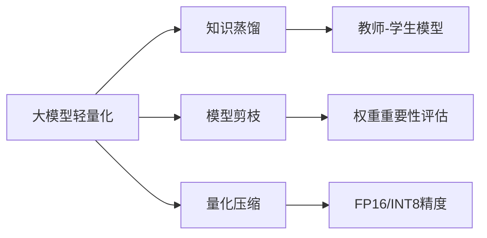

### 主流大模型架构  
------
#### **1. BERT（双向编码，文本理解）**  
**🔑 知识点详解**  
- **核心机制**：  
  - **双向Transformer编码器**：通过掩码语言建模（MLM）和下一句预测（NSP）联合训练  
  - **上下文感知**：利用自注意力机制捕获双向语义  
  👉 **注意**：BERT **仅适用于编码任务**（如分类、实体识别），需微调后使用  
- **关键变体**：  
  - **RoBERTa**：移除NSP任务，动态掩码，更大训练数据  
  - **ALBERT**：参数共享技术减少模型体积  

**🔥 面试高频题**  
1. **BERT 的 MLM 任务如何实现？为何需要随机替换？**  
   - **一句话答案**：随机掩码15%的输入词，80%替换为[MASK]，10%随机词，10%保持原词，增强鲁棒性。  
   - **深入回答**：防止模型过度依赖[MASK]标记，提升对未登录词的泛化能力。  

------
#### **2. GPT-3/4, LLaMA（自回归生成模型）**  
**🔑 知识点详解**  
- **核心特点**：  
  - **单向Transformer解码器**：仅利用左侧上下文生成文本  
  - **自回归生成**：逐词预测（`p(x_t | x_{<t}）`  
  👉 **注意**：推理时需用采样策略（Top-k, Top-p, Temperature）控制多样性  
- **优化方向**：  
  - **稀疏注意力**（LLaMA）：减少计算复杂度  
  - **指令微调**（GPT-4）：对齐人类反馈（RLHF）  

**📝 实践经验**  
```python  
# GPT-2 文本生成示例（PyTorch）  
from transformers import GPT2LMHeadModel, GPT2Tokenizer  
model = GPT2LMHeadModel.from_pretrained("gpt2")  
tokenizer = GPT2Tokenizer.from_pretrained("gpt2")  
inputs = tokenizer("AI will", return_tensors="pt")  
outputs = model.generate(inputs.input_ids, max_length=50)  
print(tokenizer.decode(outputs[0]))  
```

------
#### **3. T5, BART（编码-解码架构）**  
**🔑 知识点详解**  
- **设计目标**：  
  - **统一文本到文本框架**（T5）：所有任务转为“输入文本→输出文本”  
  - **去噪自编码**（BART）：通过损坏输入重建原始文本  
- **应用场景**：  
  - **文本生成**（摘要、翻译）  
  - **文本理解**（问答、文本修复）  

**🌟 重点提醒**  
- **T5 的灵活输入格式**：任务前缀（如 `"summarize: {text}"`）指定任务类型  
- **BART 的噪声策略**：随机掩码、句子重排、文本删除  

------
#### **4. Stable Diffusion（扩散模型）**  
**🔑 知识点详解**  
- **核心原理**：  
  - **前向扩散**：逐步为图像添加高斯噪声  
  - **反向去噪**：通过UNet预测噪声并迭代重建  
  👉 **注意**：依赖CLIP文本编码器实现文本到图像的跨模态对齐  
- **关键优化**：  
  - **Latent Diffusion**：在隐空间操作，降低计算成本  
  - **CFG（Classifier-Free Guidance）**：平衡生成质量与多样性  

**🔥 面试高频题**  
1. **扩散模型与GAN的主要区别？**  
   - **一句话答案**：扩散模型通过逐步去噪生成样本，GAN通过对抗训练直接生成。  
   - **深入回答**：扩散模型训练更稳定，模式覆盖更全，但推理速度较慢；GAN生成速度快，但易出现模式崩溃。  

------
#### **5. Mistral / Phi / Claude（轻量大模型）**  
**🔑 知识点详解**  
- **核心目标**：  
  - **高效推理**：减少参数量（如Phi-2仅2.7B参数）  
  - **知识蒸馏**：从大模型迁移知识到小模型  
- **技术手段**：  
  - **混合专家（MoE）**（Mistral）：动态激活子网络  
  - **结构化剪枝**：移除冗余神经元  

**🔧 工具辅助**  



**💡 复习建议**  
1. 掌握各架构的预训练任务与微调方法（如BERT的MLM vs GPT的LM）  
2. 对比自回归（GPT）、编码-解码（T5）、扩散（Stable Diffusion）的生成机制差异  
3. 熟悉轻量化技术的应用场景（移动端部署 vs 云端推理）