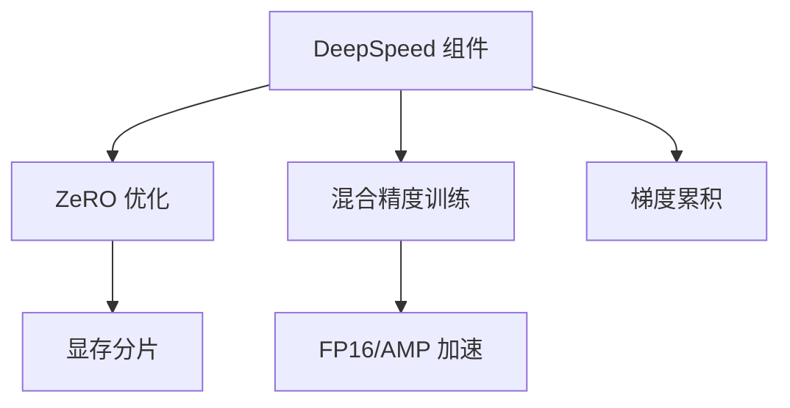
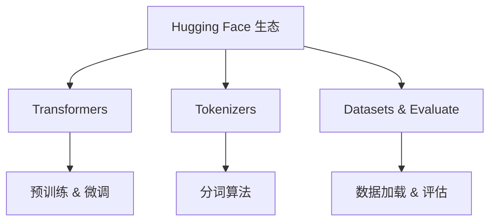
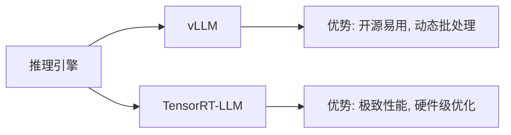

### PyTorch & DeepSpeed
------
#### **1. PyTorch Tensor 操作 & 自动微分**  
**🔑 知识点详解**  
- **Tensor 核心特性**：  
  - **动态计算图**：操作即时执行，支持动态控制流（如循环、条件分支）  
  - **设备切换**：`.to('cuda')` 显式迁移数据到 GPU  
  - **自动微分**：通过 `requires_grad=True` 追踪梯度，`backward()` 反向传播  
    👉 **注意**：`with torch.no_grad()` 可禁用梯度追踪以节省内存  

- **自动微分机制**：  
  - **计算图**：每个 Tensor 的 `grad_fn` 记录操作历史  
  - **梯度累积**：`loss.backward()` 自动计算并累积梯度  
  - **优化器联动**：`optimizer.step()` 更新参数，`optimizer.zero_grad()` 清空梯度  

**📝 代码示例**  
```python  
x = torch.randn(3, requires_grad=True)  
y = x * 2  
z = y.mean()  
z.backward()  # 计算梯度  
print(x.grad)  # 输出梯度值  
```

------
#### **2. Transformer 构建（nn.Transformer, HuggingFace）**  
**🔑 知识点详解**  
- **PyTorch 原生实现**：  
  - **`nn.Transformer` 模块**：包含编码器/解码器层，支持多头注意力  
  - **自定义配置**：调整 `nhead`, `num_encoder_layers` 等参数  
    👉 **注意**：需手动实现位置编码（如 `nn.Embedding` 或正弦函数）  

- **HuggingFace Transformers**：  
  - **预训练模型库**：`BertModel`, `GPT2LMHeadModel` 等即插即用  
  - **Pipeline API**：快速实现文本生成、分类等任务  
  ```python  
  from transformers import AutoTokenizer, AutoModel  
  tokenizer = AutoTokenizer.from_pretrained("bert-base-uncased")  
  model = AutoModel.from_pretrained("bert-base-uncased")  
  ```

**🔥 面试高频题**  
1. **HuggingFace 的 `AutoModel` 和 `AutoModelForSequenceClassification` 区别？**  
   - **一句话答案**：前者输出原始隐藏状态，后者添加任务特定头（如分类层）。  
   - **深入回答**：`AutoModelForX` 类封装了预训练模型和任务适配层，简化微调流程。  

------
#### **3. DeepSpeed 训练优化（ZeRO, Activation Checkpointing）**  
**🔑 知识点详解**  
- **ZeRO 优化技术**：  
  - **ZeRO-1**：分割优化器状态，减少内存占用  
  - **ZeRO-2**：分割优化器状态 + 梯度，支持更大批次  
  - **ZeRO-3**：分割优化器状态 + 梯度 + 参数，支持超大模型  

- **激活重计算（Activation Checkpointing）**：  
  - **原理**：在前向传播中仅保存部分激活值，反向传播时重新计算  
  - **内存-计算权衡**：减少显存占用约 50%，但增加约 20% 计算时间  

**🌟 配置示例**  
```json  
// deepspeed_config.json  
{  
  "train_batch_size": 32,  
  "zero_optimization": {  
    "stage": 3,  
    "offload_optimizer": {"device": "cpu"}  
  },  
  "activation_checkpointing": {  
    "partition_activations": true  
  }  
}  
```

**🔥 面试高频题**  
1. **ZeRO-3 如何支持千亿参数模型训练？**  
   - **一句话答案**：将参数、梯度、优化器状态分片到多 GPU，单卡仅保留必要切片。  
   - **深入回答**：通过通信协调各 GPU 的切片更新，内存占用与 GPU 数量成反比。  

**🔧 工具辅助**  




**💡 复习建议**  
1. 掌握 ZeRO 各阶段的内存优化原理与适用场景  
2. 熟练使用 HuggingFace 的 `Trainer` 集成 DeepSpeed  
3. 对比 Activation Checkpointing 与梯度累积的异同

### Hugging Face 生态

------

#### **1. Transformers（预训练 & 微调）**

**🔑 知识点详解**

- Transformers：
  - **核心定义**：Transformers 是一种基于自注意力机制的深度学习架构，广泛用于自然语言处理任务。Hugging Face 的 Transformers 库提供了大量预训练模型，并支持针对下游任务进行微调。
  - **重要特性**：支持多种模型（如 BERT、GPT、T5 等），模块化设计便于迁移学习；预训练与微调分离，使模型能够快速适应特定任务。
  - **关键机制**：
    - 预训练阶段在大规模语料上构建通用语言模型；
    - 微调阶段利用较少的任务特定数据进行参数调整；
    - 自注意力机制捕捉文本中长距离依赖。
       👉 **注意**：预训练模型参数量巨大，微调时需控制过拟合，并关注硬件资源的需求。
- 相关概念：
  - **预训练 vs. 微调**：
    - **具体说明**：预训练构建通用模型，微调适配具体任务；
    - **实现方式**：利用大规模无标签数据进行预训练，再用少量有标签数据进行微调；
    - **使用场景**：文本分类、问答、生成、翻译等 NLP 任务。
       👉 **辨析**：与从零开始训练相比，预训练+微调能显著缩短开发周期并提升性能。

**🔥 面试高频题**

1. 什么是 Transformers 模型及其优势？
   - **一句话答案**：Transformers 模型利用自注意力机制并行处理序列数据，能够捕捉长距离依赖，适用于大规模预训练和下游微调。
   - **深入回答**：Transformers 通过自注意力机制避免了 RNN 的顺序计算瓶颈，使得训练更高效，同时在预训练阶段通过海量数据学习通用语言表示，微调阶段只需少量数据即可实现高性能应用。这种方法已在多个 NLP 任务中取得了显著成果。

------

#### **2. Tokenizers（WordPiece, SentencePiece, BPE）**

**🔑 知识点详解**

- Tokenizers：
  - **核心定义**：Tokenizers 将文本切分为基本单位（token），并将其转换为模型可处理的数值序列。常用算法包括 WordPiece、SentencePiece 和 Byte-Pair Encoding（BPE）。
  - **重要特性**：自动构建词汇表，处理未登录词；适用于多语言和多任务场景；高效分词和编码实现。
  - **关键机制**：
    - **WordPiece**：基于最大似然估计将词拆分为子词，常用于 BERT；
    - **SentencePiece**：将文本视为连续字符序列，支持 BPE 或 unigram 模型，适用于无空格语言；
    - **BPE**：通过迭代合并最常见的字符对来构建词汇表。
       👉 **注意**：分词算法会影响词汇表大小与模型覆盖率，选择不当可能导致信息丢失或过大词汇表。
- 相关概念：
  - **分词与编码**：
    - **具体说明**：分词将文本切割成 token，编码将 token 映射为数值;
    - **实现方式**：利用内置算法和预训练词汇表自动完成；
    - **使用场景**：用于 NLP 模型的输入预处理。
       👉 **辨析**：传统分词算法与子词分词相比，子词方法更能处理未登录词和多语言问题。

**🔥 面试高频题**

1. Tokenization 的主要方法有哪些？
   - **一句话答案**：主要包括 WordPiece、SentencePiece 和 BPE，各自采用不同策略构建词汇表和分割文本。
   - **深入回答**：WordPiece 通过概率模型拆分词语，适用于 BERT；SentencePiece 不依赖空格，将文本视为连续字符序列，适用于多语言环境；BPE 根据字符频率迭代合并最常见的子串，有效控制词汇表规模。

------

#### **3. Datasets & Evaluate（数据加载 & 评估）**

**🔑 知识点详解**

- Datasets：
  - **核心定义**：Datasets 模块提供高效、标准化的数据加载、预处理和管理接口，支持大规模数据集的分布式处理和流式加载。
  - **重要特性**：支持多种数据格式、自动缓存、并行处理；便于数据转换和分割，与 Transformers 无缝对接。
  - **关键机制**：
    - 利用内存映射和分布式加载技术加速数据处理；
    - 集成数据清洗、格式转换等功能，确保数据一致性。
       👉 **注意**：数据预处理的效率直接影响模型训练速度，需根据任务和硬件资源调优。
- Evaluate:
  - **核心定义**：Evaluate 模块统一模型评估标准，提供常见指标计算接口，简化模型性能评估流程。
  - **重要特性**：支持准确率、F1-score、AUC 等指标，允许自定义评估标准；与 Datasets 模块集成，实现端到端评估。
  - **关键机制**：
    - 提供标准化的评估函数，自动汇总和展示结果；
    - 与数据加载和预处理模块无缝结合，便于调优。
       👉 **注意**：评估指标应与任务目标紧密匹配，避免误导性结果。
- 相关概念：
  - **数据加载与评估**：
    - **具体说明**：数据加载模块处理数据预处理和批量加载，评估模块计算模型性能;
    - **实现方式**：利用 API 接口快速加载和转换数据，并调用预设指标函数；
    - **使用场景**：用于 NLP 模型的训练、验证和测试过程。
       👉 **辨析**：Datasets 聚焦于数据管理，Evaluate 聚焦于结果评估，两者相辅相成。

**🔥 面试高频题**

1. Datasets 模块在 Hugging Face 生态中的作用是什么？
   - **一句话答案**：Datasets 模块提供高效、灵活的数据加载和预处理接口，支撑大规模 NLP 任务的数据管理。
   - **深入回答**：通过 Datasets 模块，用户可以轻松加载、转换、分割和缓存各种格式的数据，并与 Transformers 模型直接对接，极大地提升了训练和评估效率。
2. Evaluate 模块如何辅助模型调优？
   - **一句话答案**：Evaluate 模块提供统一评估指标和自动化评估接口，简化模型性能对比和调优流程。
   - **深入回答**：Evaluate 模块整合了多种标准评估指标，如准确率、F1-score 和 AUC 等，支持自定义指标，有助于快速反馈模型性能，指导调优策略选择。

**🌟 重点提醒**

- **Hugging Face 生态提供端到端解决方案，从预训练模型到数据处理和评估，覆盖 NLP 全流程。**
- **选择合适的分词算法和数据预处理策略对模型性能至关重要。**
- **评估指标必须与任务目标匹配，确保模型调优方向正确。**

**📝 实践经验**

```python
from datasets import load_dataset
from transformers import AutoTokenizer, AutoModelForSequenceClassification
from evaluate import load

# 加载数据集
dataset = load_dataset('glue', 'mrpc')

# 加载预训练分词器
tokenizer = AutoTokenizer.from_pretrained('bert-base-uncased')

# 数据预处理
def tokenize_function(examples):
    return tokenizer(examples['sentence1'], examples['sentence2'], truncation=True)

tokenized_datasets = dataset.map(tokenize_function, batched=True)

# 加载评估指标
metric = load('glue', 'mrpc')
```

**🔧 工具辅助**



**💡 复习建议**

1. 深入理解 Transformers 模型预训练和微调的全流程。
2. 熟悉不同分词算法（WordPiece, SentencePiece, BPE）的原理和应用场景。
3. 掌握 Datasets 与 Evaluate 模块的使用，提升数据处理和模型评估效率。

------

### 大模型训练与推理平台  
------
#### **1. Megatron-LM（GPU 高效训练）**  
**🔑 知识点详解**  
- **核心特性**：  
  - **混合并行策略**：结合模型并行（Tensor/Pipeline Parallelism）与数据并行  
  - **显存优化**：梯度检查点（Gradient Checkpointing）、参数分片  
  - **定制化内核**：Fused Attention（融合多头注意力计算）  
    👉 **注意**：需手动配置并行策略（如 `tp_size`、`pp_size`）  

- **应用场景**：  
  - **千亿参数模型训练**（如 GPT-3、T5-XXL）  
  - **多GPU集群训练**：支持 NCCL 高速通信  

**🔥 面试高频题**  
1. **Megatron-LM 的 Tensor Parallelism 如何实现？**  
   - **一句话答案**：将权重矩阵按列/行分片到不同 GPU，同步计算后聚合结果。  
   - **深入回答**：例如，线性层 `Y = XW` 将 `W` 分片到多卡，每卡计算局部结果后通过 `all-reduce` 合并。  

------
#### **2. ColossalAI（分布式训练）**  
**🔑 知识点详解**  
- **核心技术**：  
  - **多维并行**：数据并行 + 流水线并行 + 模型并行  
  - **内存优化**：ZeRO 增强版（Gemini Offload）、自动混合精度  
  - **自动并行策略**：根据硬件配置生成最优并行方案  

**🌟 重点示例**  
```python  
# ColossalAI 配置流水线并行  
from colossalai.nn import PipelineModule  
model = PipelineModule(layers=my_layers, num_stages=4)  
```

**🔥 面试高频题**  
1. **ColossalAI 与 DeepSpeed 的 ZeRO 有何区别？**  
   - **一句话答案**：ColossalAI 的 Gemini Offload 支持动态显存-内存交换，显存利用率更高。  

------
#### **3. vLLM（优化推理引擎）**  
**🔑 知识点详解**  
- **核心优化**：  
  - **PagedAttention**：显存分页管理（类似虚拟内存），减少碎片  
  - **连续批处理（Continuous Batching）**：动态调整请求批次，提升吞吐量  
  - **量化支持**：AWQ（Activation-aware Weight Quantization）  

- **使用场景**：  
  - **大模型高并发推理**（如 LLaMA、GPT-NeoX）  
  - **低延迟服务**：支持 Triton 推理服务器  

**📝 部署示例**  
```bash  
# 启动 vLLM 服务  
python -m vllm.entrypoints.api_server --model mistralai/Mistral-7B-v0.1  
```

------
#### **4. TensorRT-LLM（高性能推理）**  
**🔑 知识点详解**  
- **核心技术**：  
  - **内核融合**：将多个算子合并为单一 GPU 内核（如 LayerNorm + GeLU）  
  - **动态形状优化**：支持可变输入长度（无需填充）  
  - **量化支持**：FP8/INT8 量化，适配 NVIDIA H100 Tensor Core  

- **框架集成**：  
  - **HuggingFace 转换**：通过 `trtllm-build` 工具转换 PyTorch 模型  
  - **Triton 部署**：支持 TensorRT-LLM 后端  

**🔧 工具对比**  



**💡 复习建议**  

1. 掌握 Megatron-LM 与 ColossalAI 的并行策略设计差异  
2. 对比 vLLM 和 TensorRT-LLM 的适用场景（开源 vs 闭源、吞吐量 vs 延迟）  
3. 熟悉 PagedAttention 与 Triton 推理服务的集成方法