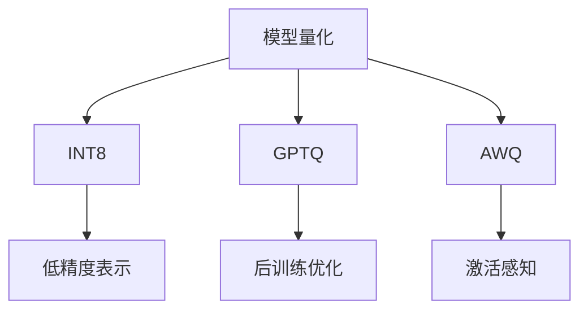
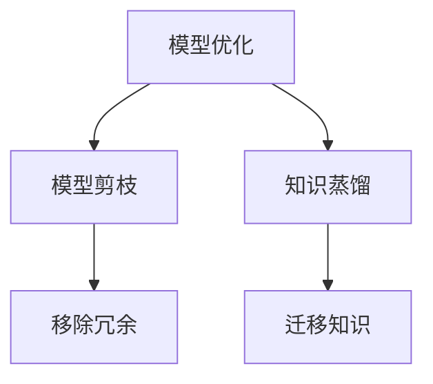
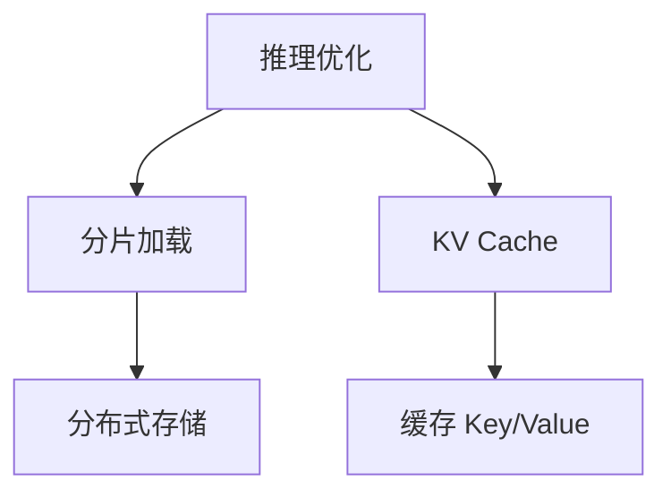
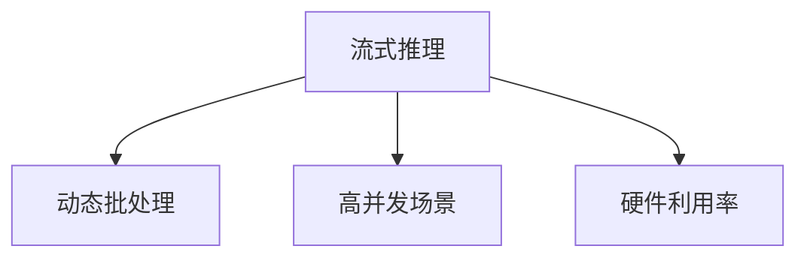

### 大模型推理优化
------
#### **1. 模型量化（INT8, GPTQ, AWQ）**
**🔑 知识点详解**
- **模型量化的定义**：
  - 定义：模型量化是一种通过降低模型权重和激活值的精度（如从 FP32 到 INT8）来减少计算和存储开销的技术。
  - 核心思想：在保持模型性能的同时，通过低精度表示加速推理过程。
    👉 **注意**：量化技术特别适合资源受限的场景（如移动设备、嵌入式系统）。
- **常见量化方法**：
  - **INT8 量化**：
    - 定义：将模型权重和激活值从 FP32 转换为 INT8 表示。
    - 特点：显著减少模型大小和计算需求，但可能导致精度损失。
  - **GPTQ（Generalized Post-Training Quantization）**：
    - 定义：一种针对 Transformer 模型的后训练量化方法，专注于最小化量化误差。
    - 特点：通过优化量化参数（如缩放因子），在 INT4 或 INT8 精度下保持高性能。
  - **AWQ（Activation-aware Weight Quantization）**：
    - 定义：一种基于激活感知的权重量化方法，动态调整量化策略以适应不同层的特性。
    - 特点：在低精度下保持更高的模型精度。

**🔥 面试高频题**
1. 模型量化的核心优势是什么？为什么需要量化？
   - **一句话答案**：模型量化通过降低精度减少计算和存储开销，同时加速推理过程。
   - **深入回答**：模型量化的核心优势在于其能够显著减少模型的存储需求和计算复杂度。例如，INT8 量化将每个权重从 32 位浮点数压缩为 8 位整数，从而减少了 75% 的存储空间和计算量。此外，低精度运算在现代硬件（如 GPU 和 TPU）上通常具有更高的吞吐量，因此可以大幅加速推理过程。量化特别适合资源受限的场景，如移动设备或实时应用。

2. GPTQ 和 AWQ 的区别是什么？
   - **一句话答案**：GPTQ 是一种通用的后训练量化方法，而 AWQ 通过激活感知动态调整量化策略。
   - **深入回答**：GPTQ 的核心思想是通过优化量化参数（如缩放因子）最小化量化误差，适用于 Transformer 模型的 INT4 或 INT8 量化。相比之下，AWQ 引入了激活感知机制，根据每层的激活分布动态调整量化策略，从而在低精度下保持更高的模型精度。这种方法特别适合那些对精度要求较高的任务。

**🌟 重点提醒**
- **要点一**：模型量化通过低精度表示减少计算和存储开销。
- **要点二**：GPTQ 和 AWQ 是两种高效的量化方法，分别适用于不同场景。
- **要点三**：量化可能导致精度损失，需通过优化策略平衡性能和效率。

**📝 实践经验**
```python
from transformers import AutoModelForCausalLM, AutoTokenizer
from optimum.gptq import GPTQQuantizer

# 加载预训练模型
model = AutoModelForCausalLM.from_pretrained("gpt-3.5-turbo")
tokenizer = AutoTokenizer.from_pretrained("gpt-3.5-turbo")

# 配置 GPTQ 量化器
quantizer = GPTQQuantizer(bits=8)

# 应用量化
quantized_model = quantizer.quantize_model(model)

# 推理测试
inputs = tokenizer("The capital of France is", return_tensors="pt")
outputs = quantized_model.generate(**inputs)
print(tokenizer.decode(outputs[0], skip_special_tokens=True))
```

**🔧 工具辅助**


------
#### **2. 模型剪枝 & 知识蒸馏**
**🔑 知识点详解**
- **模型剪枝的定义**：
  - 定义：模型剪枝是一种通过移除冗余权重或神经元来减少模型复杂度的技术。
  - 核心思想：通过分析权重的重要性，移除对模型性能影响较小的部分。
    👉 **注意**：剪枝可以显著减少模型大小和计算需求，但可能导致精度下降。
- **知识蒸馏的定义**：
  - 定义：知识蒸馏是一种将大模型（Teacher Model）的知识迁移到小模型（Student Model）的技术。
  - 核心思想：通过让小模型学习大模型的输出分布，提升小模型的性能。
    👉 **注意**：知识蒸馏特别适合部署资源受限的场景。

**🔥 面试高频题**
1. 模型剪枝和知识蒸馏的区别是什么？
   - **一句话答案**：模型剪枝通过移除冗余部分减少复杂度，知识蒸馏通过迁移知识提升小模型性能。
   - **深入回答**：模型剪枝的核心思想是通过分析权重的重要性，移除对模型性能影响较小的部分，从而减少模型大小和计算需求。然而，剪枝可能导致精度下降，且需要重新训练模型以恢复性能。相比之下，知识蒸馏通过让小模型学习大模型的输出分布（如软标签），直接提升小模型的性能。这种方法不仅减少了模型复杂度，还保留了较高的精度。

2. 如何选择合适的剪枝策略？
   - **一句话答案**：根据任务需求和硬件限制选择剪枝粒度（如权重级、神经元级）和剪枝比例。
   - **深入回答**：选择剪枝策略时需要综合考虑以下因素：
     - 剪枝粒度：权重级剪枝适合细粒度优化，但可能增加实现复杂度；神经元级剪枝更易于实现，但可能影响性能。
     - 剪枝比例：过高的剪枝比例可能导致精度显著下降，因此需要根据任务需求和硬件限制进行权衡。
     - 重训练策略：剪枝后通常需要重新训练模型以恢复性能，因此需要设计合理的重训练方案。

**🌟 重点提醒**
- **要点一**：模型剪枝通过移除冗余部分减少复杂度。
- **要点二**：知识蒸馏通过迁移知识提升小模型性能。
- **要点三**：两者均为资源受限场景提供了高效的优化方案。

**📝 实践经验**
```python
from transformers import AutoModelForCausalLM, AutoTokenizer
from torch.nn.utils.prune import l1_unstructured

# 加载预训练模型
model = AutoModelForCausalLM.from_pretrained("gpt-3.5-turbo")

# 应用 L1 剪枝
parameters_to_prune = [(module, "weight") for module in model.modules() if hasattr(module, "weight")]
for module, name in parameters_to_prune:
    l1_unstructured(module, name=name, amount=0.2)  # 移除 20% 的权重

# 推理测试
tokenizer = AutoTokenizer.from_pretrained("gpt-3.5-turbo")
inputs = tokenizer("The capital of France is", return_tensors="pt")
outputs = model.generate(**inputs)
print(tokenizer.decode(outputs[0], skip_special_tokens=True))
```

**🔧 工具辅助**


------
#### **3. 分片加载 & KV Cache**
**🔑 知识点详解**
- **分片加载的定义**：
  - 定义：分片加载是一种通过将模型权重分布在多个设备上以支持大规模模型推理的技术。
  - 核心思想：将模型的不同部分加载到不同的设备（如 GPU 或 CPU），从而突破单设备内存限制。
    👉 **注意**：分片加载特别适合超大规模模型（如 GPT-3、PaLM）。
- **KV Cache 的定义**：
  - 定义：KV Cache 是一种通过缓存注意力机制中的 Key 和 Value 向量以加速推理的技术。
  - 核心思想：在生成任务中，重复利用已计算的 Key 和 Value 向量，避免重复计算。
    👉 **注意**：KV Cache 显著提升了生成任务的推理速度。

**🔥 面试高频题**
1. 分片加载如何支持超大规模模型的推理？
   - **一句话答案**：分片加载通过将模型权重分布在多个设备上，突破单设备内存限制。
   - **深入回答**：超大规模模型（如 GPT-3、PaLM）的权重通常超过单个设备的内存容量。分片加载通过将模型的不同部分加载到多个设备（如 GPU 或 CPU），使模型能够在分布式环境中运行。例如，可以将模型的前几层加载到一个 GPU，后几层加载到另一个 GPU。这种方法不仅突破了单设备的内存限制，还可以通过并行计算加速推理过程。

2. KV Cache 的作用是什么？它如何加速生成任务？
   - **一句话答案**：KV Cache 通过缓存注意力机制中的 Key 和 Value 向量，避免重复计算，从而加速生成任务。
   - **深入回答**：在生成任务中，Transformer 模型需要逐步生成单词序列。每次生成新单词时，注意力机制需要重新计算所有先前单词的 Key 和 Value 向量。KV Cache 的核心思想是将这些向量缓存起来，在后续步骤中直接复用，从而避免重复计算。这种方法显著减少了计算量，特别是在长序列生成任务中表现尤为突出。

**🌟 重点提醒**
- **要点一**：分片加载通过分布式存储支持超大规模模型。
- **要点二**：KV Cache 通过缓存 Key 和 Value 向量加速生成任务。
- **要点三**：两者均为大规模模型推理提供了高效的解决方案。

**📝 实践经验**
```python
import torch
from transformers import AutoModelForCausalLM, AutoTokenizer

# 加载预训练模型
model = AutoModelForCausalLM.from_pretrained("gpt-3.5-turbo")
tokenizer = AutoTokenizer.from_pretrained("gpt-3.5-turbo")

# 分片加载（简化版）
device_map = {"transformer.h.0": "cuda:0", "transformer.h.1": "cuda:1"}
model.parallelize(device_map)

# 使用 KV Cache
inputs = tokenizer("The capital of France is", return_tensors="pt").to("cuda:0")
past_key_values = None

for _ in range(10):  # 生成 10 个单词
    outputs = model(**inputs, past_key_values=past_key_values, use_cache=True)
    past_key_values = outputs.past_key_values
    next_token = outputs.logits[:, -1].argmax(dim=-1)
    inputs = next_token.unsqueeze(0)

print(tokenizer.decode(inputs.squeeze(), skip_special_tokens=True))
```

**🔧 工具辅助**


------
#### **4. 流式推理（Continuous Batching）**
**🔑 知识点详解**
- **流式推理的定义**：
  - 定义：流式推理是一种通过动态批处理多个请求以提高硬件利用率的技术。
  - 核心思想：在生成任务中，将不同用户的请求合并为一个批次，并动态调整批次大小。
    👉 **注意**：流式推理特别适合高并发场景（如在线服务）。
- **实现方式**：
  - 输入处理：将多个用户的请求合并为一个批次。
  - 动态调整：根据生成进度动态调整批次大小，确保高效利用硬件资源。
    👉 **注意**：流式推理需要解决请求之间的同步问题。

**🔥 面试高频题**
1. 流式推理如何提高硬件利用率？
   - **一句话答案**：流式推理通过动态批处理多个请求，充分利用硬件资源。
   - **深入回答**：在生成任务中，不同用户的请求通常具有不同的生成进度。传统静态批处理方法可能导致硬件资源闲置（如某些请求已完成生成，而其他请求仍在进行）。流式推理通过动态批处理多个请求，并根据生成进度动态调整批次大小，确保硬件资源始终处于高效利用状态。这种方法特别适合高并发场景，如在线聊天机器人或语音助手。

2. 流式推理的主要挑战是什么？
   - **一句话答案**：流式推理需要解决请求之间的同步问题和动态调整的复杂性。
   - **深入回答**：流式推理的核心挑战在于如何高效地管理多个请求的生成进度。例如，当某些请求完成生成时，需要将其从当前批次中移除，并动态调整批次大小。此外，不同请求的生成长度可能差异较大，这可能导致批次内部的不平衡。因此，流式推理需要设计高效的调度算法，以确保请求之间的同步和硬件资源的高效利用。

**🌟 重点提醒**
- **要点一**：流式推理通过动态批处理提高硬件利用率。
- **要点二**：流式推理特别适合高并发场景。
- **要点三**：流式推理需要解决请求同步和动态调整的复杂性。

**📝 实践经验**
```python
from transformers import AutoModelForCausalLM, AutoTokenizer
import torch

# 加载预训练模型
model = AutoModelForCausalLM.from_pretrained("gpt-3.5-turbo")
tokenizer = AutoTokenizer.from_pretrained("gpt-3.5-turbo")

# 模拟多个用户请求
requests = [
    "The capital of France is",
    "Translate English to French: Hello",
    "Summarize the following text:"
]

# 合并请求为一个批次
inputs = tokenizer(requests, return_tensors="pt", padding=True).to("cuda")

# 流式推理（简化版）
past_key_values = None
for _ in range(10):  # 生成 10 个单词
    outputs = model(**inputs, past_key_values=past_key_values, use_cache=True)
    past_key_values = outputs.past_key_values
    next_tokens = outputs.logits[:, -1].argmax(dim=-1)
    inputs["input_ids"] = next_tokens.unsqueeze(-1)

print(tokenizer.batch_decode(inputs["input_ids"], skip_special_tokens=True))
```

**🔧 工具辅助**


**💡 复习建议**
1. 掌握模型量化（如 INT8、GPTQ、AWQ）的基本原理及其应用场景。
2. 理解模型剪枝和知识蒸馏的工作机制，熟悉其在资源受限场景中的应用。
3. 学习分片加载和 KV Cache 的实现方式，掌握其在大规模模型推理中的作用。
4. 理解流式推理的核心思想及其在高并发场景中的优势，了解其实现挑战。