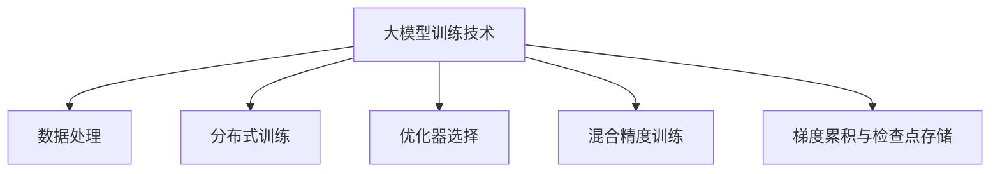

### 大模型训练技术

------

#### **1. 数据处理（去重、分词、Tokenization）**

**🔑 知识点详解**

- 数据处理：

  - **核心定义**：对原始数据进行清洗和预处理，包括去重、分词和 Tokenization，以确保训练数据的质量和一致性。

  - **重要特性**：减少冗余数据、噪声和错误，提升模型的泛化能力；直接影响词汇表构建和后续模型性能。

  - **关键机制**：

    - **去重**：删除重复样本，避免模型过拟合某些数据分布；
    - **分词**：将连续文本切分为独立单元，采用规则或统计方法；
    - **Tokenization**：将文本转换为模型可处理的 token 序列，可采用子词分词（如 BPE 或 SentencePiece）。 

    👉 **注意**：预处理方式选择不当可能导致信息丢失或词汇表过大，需针对不同语言和任务进行调优。

- 相关概念：

  - **文本预处理**：包括清洗、标准化和去噪，确保数据质量。
  - **子词分词**：相较于传统分词，能更好地处理未登录词和多语言问题。 👉 **辨析**：传统分词 vs. 子词分词，在细粒度和模型词汇表大小上存在显著差异。

**🔥 面试高频题**

1. 为什么数据预处理对大模型训练至关重要？
   - **一句话答案**：高质量的数据预处理可以减少噪声和冗余，提高模型训练效率和泛化性能。
   - **深入回答**：在大模型训练中，数据量通常庞大，数据中的重复、错误或无关信息会显著影响模型收敛和性能。通过去重、分词和 Tokenization，能够构建更精简且有效的训练数据集，进而提升模型表现。

------

#### **2. 分布式训练（Data Parallel, Model Parallel, Pipeline Parallel）**

**🔑 知识点详解**

- 分布式训练：

  - **核心定义**：利用多个设备（如GPU/TPU）协同训练大规模模型，以加速训练过程并扩展模型容量。

  - **重要特性**：支持大模型参数规模与大数据并行计算，解决单机内存和计算瓶颈。

  - **关键机制**：

    - **数据并行（Data Parallel）**：复制模型，每个设备处理不同数据子集，最后汇总梯度；
    - **模型并行（Model Parallel）**：将模型不同部分分布到不同设备，适用于参数超大模型；
    - **流水线并行（Pipeline Parallel）**：将模型分为多个阶段，按流水线方式执行不同批次，提高硬件利用率. 

    👉 **注意**：分布式训练需关注通信开销和同步问题，负载不均可能导致训练瓶颈。

- 相关概念：

  - **并行度**：指训练过程中同时使用的设备数量，不同并行策略对通信和同步要求不同。 👉 **辨析**：数据并行实现简单但内存重复，模型并行能节省内存但切分策略复杂。

**🔥 面试高频题**

1. 分布式训练有哪些常见方式？
   - **一句话答案**：主要包括数据并行、模型并行和流水线并行，各自针对不同规模和架构的模型设计。
   - **深入回答**：数据并行复制整个模型在多个设备上并行处理数据；模型并行将模型切分到多个设备上运行，适用于单个设备无法容纳整个模型；流水线并行通过分段执行不同数据批次，优化硬件利用率。

------

#### **3. 优化器（Adam, LAMB, Adafactor）**

**🔑 知识点详解**

- 优化器：

  - **核心定义**：用于调整模型参数以最小化损失函数的算法，优化器选择直接影响收敛速度和最终模型性能。

  - **重要特性**：不同优化器在计算效率、内存占用和大批量训练稳定性上各有特点。

  - **关键机制**：

    - **Adam**：基于一阶和二阶矩估计，自适应调整学习率，适合大多数任务；
    - **LAMB**：针对大规模预训练模型优化，支持大批量训练和更稳定的参数更新；
    - **Adafactor**：内存高效的自适应优化器，适用于超大模型训练，减少内存占用。 

    👉 **注意**：不同优化器的超参数（如学习率、动量等）需要细致调节，错误的配置可能导致训练不稳定。

- 相关概念：

  - **自适应优化器**：自动调整每个参数的学习率，通常具有更快的收敛速度。 👉 **辨析**：Adam 是默认选择，但在大模型训练中，LAMB 和 Adafactor 能更好地处理大批量数据和内存问题。

**🔥 面试高频题**

1. 为什么在大模型训练中选择 LAMB 或 Adafactor 而非传统的 Adam？
   - **一句话答案**：LAMB 和 Adafactor 针对大批量和超大模型设计，更能平衡内存使用和训练稳定性。
   - **深入回答**：传统 Adam 在大模型和大批量训练时可能面临梯度不稳定和内存瓶颈，而 LAMB 能在不同层之间自适应调整学习率，Adafactor 则通过更高效的内存管理降低资源消耗，从而更适合大规模预训练任务。

------

#### **4. 混合精度训练（FP16, BF16）**

**🔑 知识点详解**

- 混合精度训练：

  - **核心定义**：在训练过程中结合使用低精度（如 FP16 或 BF16）和高精度（FP32）的计算方式，以加速训练和降低内存占用，同时保持数值稳定性。

  - **重要特性**：显著提升计算速度和内存利用率，适用于超大模型训练；需要通过损失缩放等技术确保梯度精度。

  - **关键机制**：

    - 使用低精度浮点数进行大部分计算；
    - 关键操作（如梯度累积和权重更新）保持高精度；
    - 损失缩放技术防止数值下溢。

    👉 **注意**：低精度计算可能引入数值误差，需谨慎设置损失缩放参数。

  - **相关概念**：

    - **FP16 vs. BF16**：BF16 拥有更宽的指数范围，适用于更宽数值分布，但硬件支持较少。

      👉 **辨析**：FP16 更普遍，但 BF16 在某些硬件平台上表现更优。

**🔥 面试高频题**

1. 混合精度训练如何平衡速度与精度？
   - **一句话答案**：通过损失缩放和关键操作的高精度计算，混合精度训练能加速计算同时保证模型收敛稳定。
   - **深入回答**：混合精度训练利用低精度计算提高速度和减少内存占用，同时保留关键计算（如梯度更新）的高精度，避免数值不稳定问题。正确设置损失缩放系数是关键技术之一。

------

#### **5. 梯度累积与检查点存储**

**🔑 知识点详解**

- 梯度累积：

  - **核心定义**：在显存受限情况下，通过多次小批次前向传播累积梯度，再进行一次参数更新，模拟大批量训练效果。

  - **重要特性**：允许在小批次数据下实现大批量梯度效果，平衡内存限制与训练稳定性。

  - **关键机制**：

    - 多个小批次梯度累加后再统一更新参数；

    - 需确保每次更新后正确归零累积梯度。

       👉 **注意**：梯度累积过程中必须控制好归零时机，否则可能导致梯度累加错误。

- **检查点存储**：

  - **核心定义**：在训练过程中定期保存模型和优化器状态，以便在训练中断时能够恢复训练进度。

  - **重要特性**：支持断点续训，保护长时间训练过程中的成果；需要平衡存储频率与磁盘 I/O 开销。

  - **关键机制**：

    - 定期保存模型权重、优化器状态及超参数配置；

    - 可采用自动保存和手动触发机制。

      👉 **注意**：过于频繁的检查点存储可能影响训练效率，过于稀疏则风险较大。

**🔥 面试高频题**

1. **梯度累积在大模型训练中有什么作用？**
   *  **一句话答案**：梯度累积通过多次小批次累积，实现大批量训练效果，有助于稳定更新，适应显存限制。
   * **深入回答**：在显存不足的情况下，梯度累积可以将多个小批次的梯度累加后统一更新参数，模拟大批量训练的效果，从而提高模型收敛稳定性，但需要注意累积周期和归零时机。
2. **检查点存储如何保障长时间训练的稳定性？**
   * **一句话答案**：通过定期保存训练状态，检查点存储支持断点续训，防止意外中断导致训练进度丢失。
   * **深入回答**：检查点存储保存了模型权重、优化器状态等关键信息，使得训练在遇到硬件故障或中断时可以从最近的检查点恢复，保证长时间训练的连续性和安全性。

🌟 **重点提醒**

* 大模型训练需综合利用数据处理、分布式训练、优化器、混合精度训练和梯度累积技术，整体提升训练效率。
* 分布式训练需关注通信同步，混合精度训练需确保数值稳定性。
* 梯度累积与检查点存储是应对显存不足和训练中断的关键技术。

**🔧 工具辅助**

