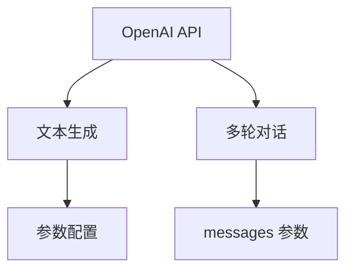
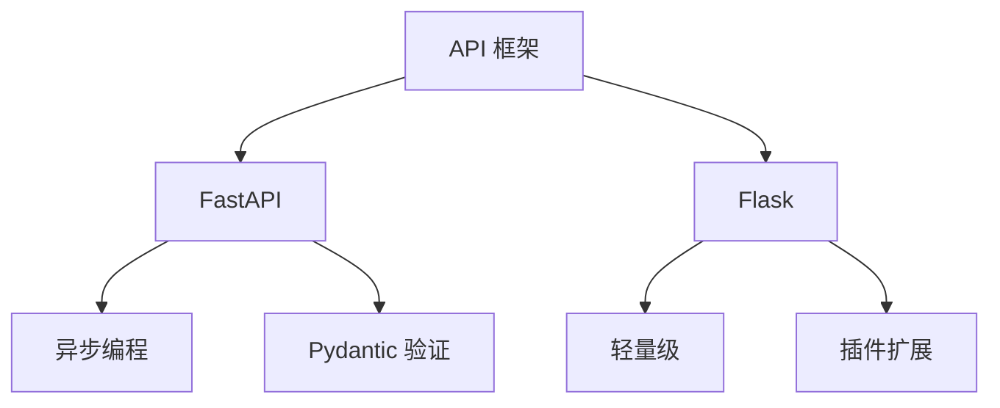
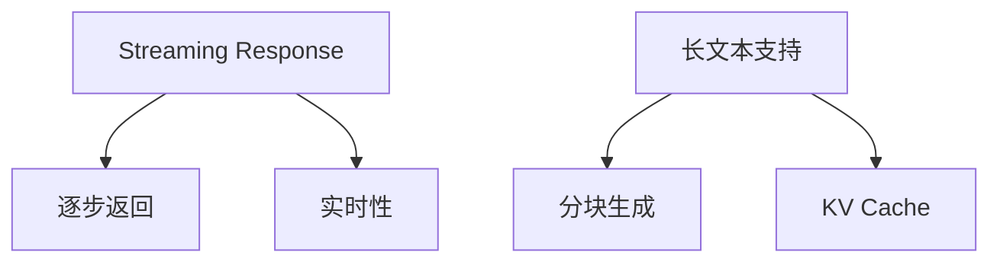
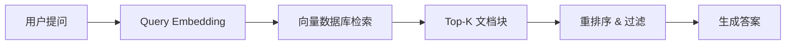
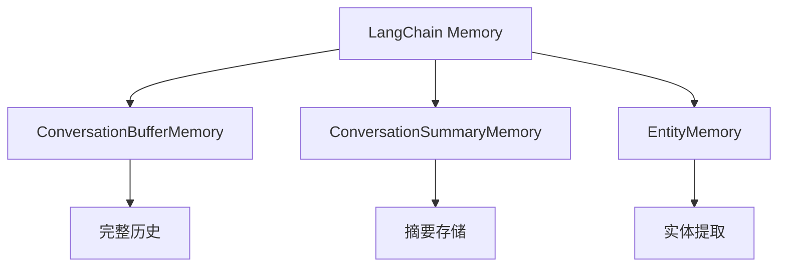
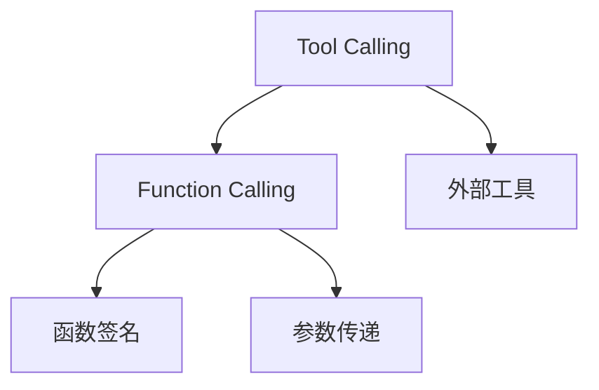
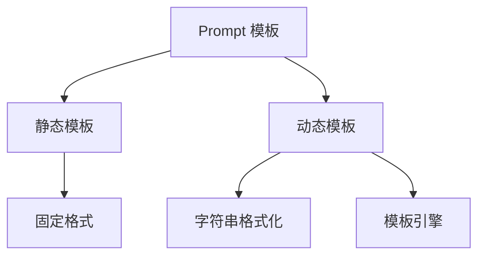

### LLM API 设计
------
#### **1. OpenAI API / ChatGPT API 使用**
**🔑 知识点详解**
- **OpenAI API 的定义**：
  - 定义：OpenAI API 是一种通过 HTTP 请求与 OpenAI 提供的大语言模型（如 GPT-3、GPT-4）交互的接口。
  - 核心思想：通过简单的 RESTful API 调用，快速集成大语言模型的能力。
    👉 **注意**：OpenAI API 支持多种任务（如文本生成、问答、翻译），并提供灵活的参数配置。
- **ChatGPT API 的特点**：
  - 定义：ChatGPT API 是 OpenAI 提供的一种专门用于对话场景的接口。
  - 特点：
    - 支持多轮对话，能够维护上下文信息。
    - 提供 `messages` 参数，用于传递对话历史。
    - 支持流式响应（Streaming Response）以实现实时输出。

**🔥 面试高频题**
1. 如何使用 OpenAI API 进行文本生成？
   - **一句话答案**：通过发送 POST 请求到 OpenAI API 端点，并指定输入文本和参数。
   - **深入回答**：使用 OpenAI API 进行文本生成的核心步骤包括：
     1. 设置 API 密钥：通过环境变量或直接在代码中配置。
     2. 构造请求体：指定输入文本（如 `prompt`）、模型名称（如 `gpt-3.5-turbo`）和其他参数（如 `max_tokens`、`temperature`）。
     3. 发送 HTTP 请求：通过 Python 的 `requests` 库或其他 HTTP 客户端发送 POST 请求。
     4. 解析响应：提取生成的文本结果。
     ```python
     import openai
     
     openai.api_key = "your-api-key"
     response = openai.Completion.create(
         model="text-davinci-003",
         prompt="The capital of France is",
         max_tokens=10
     )
     print(response.choices[0].text.strip())
     ```

2. ChatGPT API 的多轮对话如何实现？
   - **一句话答案**：通过维护对话历史（`messages` 参数）实现上下文感知。
   - **深入回答**：ChatGPT API 的核心机制是通过 `messages` 参数传递对话历史。每个消息包含角色（`role`）和内容（`content`），其中角色可以是 `system`（系统指令）、`user`（用户输入）或 `assistant`（模型输出）。例如：
     ```python
     import openai
     
     openai.api_key = "your-api-key"
     messages = [
         {"role": "system", "content": "You are a helpful assistant."},
         {"role": "user", "content": "What is the capital of France?"},
         {"role": "assistant", "content": "The capital of France is Paris."}
     ]
     response = openai.ChatCompletion.create(
         model="gpt-3.5-turbo",
         messages=messages
     )
     print(response.choices[0].message['content'])
     ```
     通过不断更新 `messages` 列表，可以实现多轮对话。

**🌟 重点提醒**
- **要点一**：OpenAI API 提供了简单易用的接口，支持多种任务。
- **要点二**：ChatGPT API 通过 `messages` 参数实现多轮对话。
- **要点三**：API 调用需设置 API 密钥，并合理配置参数（如 `max_tokens`、`temperature`）。

**📝 实践经验**
```python
import openai

# 设置 API 密钥
openai.api_key = "your-api-key"

# 文本生成示例
response = openai.Completion.create(
    model="text-davinci-003",
    prompt="Translate English to French: The weather is nice today.",
    max_tokens=20
)
print(response.choices[0].text.strip())

# 多轮对话示例
messages = [
    {"role": "system", "content": "You are a helpful assistant."},
    {"role": "user", "content": "What is the capital of France?"},
    {"role": "assistant", "content": "The capital of France is Paris."}
]
response = openai.ChatCompletion.create(
    model="gpt-3.5-turbo",
    messages=messages
)
print(response.choices[0].message['content'])
```

**🔧 工具辅助**


------
#### **2. FastAPI / Flask 搭建大模型 API**
**🔑 知识点详解**
- **FastAPI 的定义**：
  - 定义：FastAPI 是一个高性能的 Python Web 框架，专为构建 RESTful API 而设计。
  - 核心思想：基于异步编程（AsyncIO）和 Pydantic 数据验证，提供高效且易用的开发体验。
    👉 **注意**：FastAPI 特别适合需要高并发处理的场景。
- **Flask 的定义**：
  - 定义：Flask 是一个轻量级的 Python Web 框架，广泛用于构建小型到中型应用。
  - 核心思想：通过插件扩展功能，提供灵活的开发体验。
    👉 **注意**：Flask 更适合简单场景，但在高并发场景下性能可能受限。

**🔥 面试高频题**
1. FastAPI 和 Flask 的主要区别是什么？
   - **一句话答案**：FastAPI 基于异步编程，性能更高；Flask 更轻量，但性能较低。
   - **深入回答**：FastAPI 的核心优势在于其基于异步编程（AsyncIO）和 Pydantic 数据验证，能够高效处理高并发请求。此外，FastAPI 自动生成 OpenAPI 文档，便于调试和测试。相比之下，Flask 是一个轻量级框架，虽然易于上手，但在高并发场景下性能可能受限。如果需要快速搭建一个简单的 API，Flask 是不错的选择；但如果需要高性能和复杂功能，FastAPI 更为合适。

2. 如何使用 FastAPI 搭建大模型 API？
   - **一句话答案**：通过定义异步路由和调用大模型接口实现。
   - **深入回答**：使用 FastAPI 搭建大模型 API 的核心步骤包括：
     1. 定义数据模型：使用 Pydantic 定义输入和输出的数据结构。
     2. 创建异步路由：通过 `@app.post` 定义 API 端点，并在路由中调用大模型接口。
     3. 启动服务：运行 FastAPI 应用。
     ```python
     from fastapi import FastAPI
     from pydantic import BaseModel
     import openai
     
     app = FastAPI()
     
     class InputText(BaseModel):
         text: str
     
     @app.post("/generate")
     async def generate_text(input_data: InputText):
         openai.api_key = "your-api-key"
         response = openai.Completion.create(
             model="text-davinci-003",
             prompt=input_data.text,
             max_tokens=50
         )
         return {"output": response.choices[0].text.strip()}
     ```

**🌟 重点提醒**
- **要点一**：FastAPI 基于异步编程，性能更高。
- **要点二**：Flask 更轻量，但性能较低。
- **要点三**：使用 FastAPI 搭建大模型 API 时需定义数据模型和异步路由。

**📝 实践经验**
```python
from flask import Flask, request, jsonify
import openai

app = Flask(__name__)

@app.route("/generate", methods=["POST"])
def generate_text():
    data = request.json
    openai.api_key = "your-api-key"
    response = openai.Completion.create(
        model="text-davinci-003",
        prompt=data["text"],
        max_tokens=50
    )
    return jsonify({"output": response.choices[0].text.strip()})

if __name__ == "__main__":
    app.run(debug=True)
```

**🔧 工具辅助**


------
#### **3. Streaming Response & 长文本支持**
**🔑 知识点详解**
- **Streaming Response 的定义**：
  - 定义：Streaming Response 是一种通过逐步返回生成结果的技术，适用于实时性要求高的场景。
  - 核心思想：将生成的文本分块返回，避免一次性加载长文本导致延迟。
    👉 **注意**：Streaming Response 特别适合生成长文本或实时对话。
- **长文本支持的挑战**：
  - 定义：长文本生成可能导致内存占用过高或响应时间过长。
  - 解决方案：
    - 分块生成：将长文本分段生成并逐步返回。
    - KV Cache：缓存注意力机制中的 Key 和 Value 向量以加速生成。

**🔥 面试高频题**
1. 如何实现 Streaming Response？
   - **一句话答案**：通过逐步返回生成结果实现。
   - **深入回答**：实现 Streaming Response 的核心步骤包括：
     1. 在 API 框架中启用流式响应（如 FastAPI 的 `StreamingResponse` 或 Flask 的 `Response`）。
     2. 在生成过程中逐步返回结果（如通过 `yield` 返回部分文本）。
     3. 在客户端解析流式响应并动态更新界面。
     ```python
     from fastapi import FastAPI
     from fastapi.responses import StreamingResponse
     import openai
     
     app = FastAPI()
     
     def generate_stream(prompt):
         openai.api_key = "your-api-key"
         response = openai.Completion.create(
             model="text-davinci-003",
             prompt=prompt,
             max_tokens=100,
             stream=True
         )
         for chunk in response:
             yield chunk.choices[0].text
     
     @app.post("/stream")
     async def stream_response(input_data: dict):
         return StreamingResponse(generate_stream(input_data["text"]))
     ```

2. 长文本生成的主要挑战是什么？如何解决？
   - **一句话答案**：长文本生成可能导致内存占用过高或响应时间过长，可通过分块生成和 KV Cache 解决。
   - **深入回答**：长文本生成的核心挑战在于其对计算资源的需求较高。例如，生成长文本可能导致内存占用过高（如存储所有 Key 和 Value 向量）或响应时间过长（如一次性生成完整文本）。解决方案包括：
     - 分块生成：将长文本分段生成并逐步返回，减少单次生成的压力。
     - KV Cache：缓存注意力机制中的 Key 和 Value 向量，避免重复计算，从而加速生成过程。

**🌟 重点提醒**
- **要点一**：Streaming Response 通过逐步返回生成结果提升实时性。
- **要点二**：长文本生成需解决内存占用和响应时间问题。
- **要点三**：分块生成和 KV Cache 是解决长文本生成挑战的有效方法。

**📝 实践经验**
```python
from flask import Flask, Response, request
import openai

app = Flask(__name__)

@app.route("/stream", methods=["POST"])
def stream_response():
    data = request.json
    openai.api_key = "your-api-key"
    response = openai.Completion.create(
        model="text-davinci-003",
        prompt=data["text"],
        max_tokens=100,
        stream=True
    )
    def generate():
        for chunk in response:
            yield chunk.choices[0].text
    return Response(generate(), content_type="text/plain")

if __name__ == "__main__":
    app.run(debug=True)
```

**🔧 工具辅助**


**💡 复习建议**
1. 掌握 OpenAI API 和 ChatGPT API 的基本用法及其应用场景。
2. 学习 FastAPI 和 Flask 的核心概念，熟悉其在搭建大模型 API 中的应用。
3. 理解 Streaming Response 的实现方式及其在长文本生成中的作用。
4. 了解长文本生成的挑战及解决方案（如分块生成和 KV Cache）。

### 检索增强生成（RAG）  
------
#### **1. Embedding 模型（BGE, OpenAI Embeddings）**  
**🔑 知识点详解**  
- **核心模型对比**：  
  - **BGE（智源FlagEmbedding）**：  
    - **多语言支持**：中英文优化，支持跨语言检索  
    - **微调友好**：可基于领域数据微调（如法律、医疗）  
  - **OpenAI Embeddings**：  
    - **通用性强**：`text-embedding-3-small/large` 平衡性能与成本  
    - **API 调用**：无需本地部署，但依赖网络且存在成本  
    👉 **注意**：OpenAI Embeddings 的输入长度限制（如 8192 tokens）  

- **关键指标**：  
  - **语义相似度**：通过余弦相似度或点积计算  
  - **召回质量评估**：使用 `MRR@K`（平均倒数排名）或 `Hit Rate@K`  

**📝 代码示例**  
```python  
# 使用 HuggingFace 加载 BGE  
from sentence_transformers import SentenceTransformer  
model = SentenceTransformer("BAAI/bge-base-en-v1.5")  
embeddings = model.encode(["Hello, world!"])  
```

------
#### **2. 向量数据库（FAISS, Milvus, Chroma）**  
**🔑 知识点详解**  
- **技术选型对比**：  
  | 工具       | 核心特性                         | 适用场景               |
  | ---------- | -------------------------------- | ---------------------- |
  | **FAISS**  | 本地内存索引，支持 IVF-PQ/HNSW   | 中小规模数据，快速原型 |
  | **Milvus** | 分布式架构，支持持久化与动态更新 | 大规模生产环境         |
  | **Chroma** | 轻量级，集成 LangChain 生态      | 开发调试与简单应用     |

- **索引优化技巧**：  
  - **IVF（倒排文件）**：聚类加速检索，需平衡 `nlist`（聚类中心数）与精度  
  - **HNSW（层级可导航小世界图）**：高召回率，但内存占用较高  

**🔥 面试高频题**  
1. **FAISS 的 IVF 索引如何提升检索效率？**  
   - **一句话答案**：通过聚类将数据分桶，检索时优先搜索最近邻桶。  
   - **深入回答**：减少全量数据对比，`nprobe` 参数控制搜索桶数，平衡速度与召回率。  

------
#### **3. 文档索引 & Retrieval Pipeline**  
**🔑 知识点详解**  
- **文档处理流程**：  
  1. **预处理**：文本清洗（去噪、分句）、分块（滑动窗口或按段落）  
  2. **Embedding 生成**：批量计算文档块向量  
  3. **索引构建**：选择 FAISS/Milvus 并配置索引类型（如 IVF+HNSW）  

- **检索增强策略**：  
  - **多路召回**：结合关键词搜索（BM25）与语义检索  
  - **重排序（Rerank）**：使用交叉编码模型（如 `bge-reranker-base`）提升精度  
  - **HyDE（假设性文档嵌入）**：先让 LLM 生成假设答案，再检索相关文档  

**🌟 重点示例**  
```python  
# HyDE 实现伪代码  
query = "如何学习深度学习？"  
hypothetical_answer = llm.generate(f"假设答案：{query}")  # 生成假设答案  
hypo_embedding = model.encode(hypothetical_answer)  
results = faiss_index.search(hypo_embedding, k=5)  # 基于假设答案检索  
```

**🔧 工具辅助**  



**💡 复习建议**  

1. 掌握 FAISS 索引参数调优（`nlist`, `nprobe`, `efSearch`）  
2. 对比 BM25 与语义检索的互补性（关键词匹配 vs 语义泛化）  
3. 实践 LangChain 或 LlamaIndex 的 RAG 全流程集成

### LangChain & AI Agent 复习笔记
------
#### **1. LangChain Memory（聊天上下文管理）**
**🔑 知识点详解**
- **LangChain Memory 的定义**：
  - 定义：LangChain Memory 是一种用于管理聊天上下文的机制，帮助模型在多轮对话中维护状态。
  - 核心思想：通过存储和更新对话历史，使模型能够理解并响应上下文信息。
    👉 **注意**：Memory 模块是构建智能对话系统的关键组件。
- **常见 Memory 类型**：
  - **ConversationBufferMemory**：
    - 定义：将所有对话历史存储在一个缓冲区中。
    - 特点：简单易用，但可能占用较多内存。
  - **ConversationSummaryMemory**：
    - 定义：对对话历史进行摘要，减少存储开销。
    - 特点：适合长对话场景，但可能丢失部分细节。
  - **EntityMemory**：
    - 定义：提取对话中的实体信息并存储。
    - 特点：专注于特定领域的上下文管理。

**🔥 面试高频题**
1. LangChain Memory 的作用是什么？如何选择合适的 Memory 类型？
   - **一句话答案**：LangChain Memory 通过管理聊天上下文提升多轮对话能力，需根据任务需求选择合适的类型。
   - **深入回答**：LangChain Memory 的核心作用是通过存储和更新对话历史，使模型能够在多轮对话中理解和响应上下文信息。例如，在客服机器人中，Memory 可以帮助模型记住用户的偏好或问题背景。选择合适的 Memory 类型需要考虑以下因素：
     - 对话长度：对于短对话，可以使用 `ConversationBufferMemory`；对于长对话，建议使用 `ConversationSummaryMemory`。
     - 上下文复杂度：如果需要提取特定信息（如用户提到的实体），可以选择 `EntityMemory`。
     - 性能需求：摘要型 Memory 减少了存储开销，但可能丢失细节。

2. 如何实现一个简单的 Memory 管理？
   - **一句话答案**：通过 LangChain 提供的 Memory 模块记录和更新对话历史。
   - **深入回答**：实现 Memory 管理的核心步骤包括：
     1. 初始化 Memory 模块：选择合适的 Memory 类型（如 `ConversationBufferMemory`）。
     2. 更新对话历史：在每次对话后将用户输入和模型输出存入 Memory。
     3. 构造 Prompt：将 Memory 中的上下文信息与当前输入结合，生成完整的 Prompt。
     ```python
     from langchain.memory import ConversationBufferMemory
     from langchain.chains import ConversationChain
     from langchain.llms import OpenAI
     
     # 初始化 Memory 和 LLM
     memory = ConversationBufferMemory()
     llm = OpenAI(temperature=0)
     conversation = ConversationChain(llm=llm, memory=memory)
     
     # 多轮对话
     response1 = conversation.run("Hi, my name is Alice.")
     print(response1)  # 输出: Hello Alice!
     response2 = conversation.run("What's my name?")
     print(response2)  # 输出: Your name is Alice.
     ```

**🌟 重点提醒**
- **要点一**：LangChain Memory 通过管理上下文提升多轮对话能力。
- **要点二**：不同 Memory 类型适用于不同场景。
- **要点三**：Memory 模块是构建智能对话系统的关键。

**📝 实践经验**
```python
from langchain.memory import ConversationSummaryMemory
from langchain.chains import ConversationChain
from langchain.llms import OpenAI

# 初始化 Memory 和 LLM
memory = ConversationSummaryMemory(llm=OpenAI(temperature=0))
conversation = ConversationChain(llm=OpenAI(temperature=0), memory=memory)

# 多轮对话
response1 = conversation.run("Tell me about the history of AI.")
print(response1)  # 输出: AI has a rich history...
response2 = conversation.run("What did you just say?")
print(response2)  # 输出: I summarized the history of AI for you.
```

**🔧 工具辅助**


------
#### **2. Tool Calling & Function Calling**
**🔑 知识点详解**
- **Tool Calling 的定义**：
  - 定义：Tool Calling 是一种让模型调用外部工具（如搜索引擎、数据库）完成特定任务的能力。
  - 核心思想：通过定义工具接口，使模型能够动态调用外部资源。
    👉 **注意**：Tool Calling 提升了模型的功能性，使其能够处理复杂任务。
- **Function Calling 的定义**：
  - 定义：Function Calling 是一种让模型调用预定义函数（如 API 或自定义逻辑）的能力。
  - 核心思想：通过函数签名和参数传递，使模型能够执行特定操作。
    👉 **注意**：Function Calling 是 Tool Calling 的具体实现形式之一。

**🔥 面试高频题**
1. Tool Calling 和 Function Calling 的区别是什么？
   - **一句话答案**：Tool Calling 是广义的概念，Function Calling 是其具体实现形式。
   - **深入回答**：Tool Calling 是一种广义的概念，指模型通过调用外部工具完成特定任务（如搜索、计算）。Function Calling 则是 Tool Calling 的具体实现形式，通过定义函数签名和参数传递，使模型能够调用预定义函数（如 API 或自定义逻辑）。例如，Tool Calling 可以包括调用搜索引擎或数据库，而 Function Calling 更关注具体的函数调用逻辑。

2. 如何实现 Function Calling？
   - **一句话答案**：通过定义函数签名和参数传递，使模型能够调用外部函数。
   - **深入回答**：实现 Function Calling 的核心步骤包括：
     1. 定义函数：编写需要调用的函数，并明确其输入和输出格式。
     2. 注册函数：将函数注册到模型的工具库中。
     3. 调用函数：在模型生成过程中，根据 Prompt 动态调用函数。
     ```python
     from langchain.tools import BaseTool
     from langchain.agents import initialize_agent, Tool
     from langchain.llms import OpenAI
     
     # 定义工具
     class CalculatorTool(BaseTool):
         name = "Calculator"
         description = "Useful for performing arithmetic operations."
     
         def _run(self, expression: str):
             return eval(expression)
     
     # 初始化工具和代理
     tools = [Tool(name="Calculator", func=CalculatorTool().run, description="Perform calculations.")]
     agent = initialize_agent(tools, OpenAI(temperature=0), agent="zero-shot-react-description")
     
     # 调用工具
     response = agent.run("What is 5 + 7?")
     print(response)  # 输出: The answer is 12.
     ```

**🌟 重点提醒**
- **要点一**：Tool Calling 提升了模型的功能性。
- **要点二**：Function Calling 是 Tool Calling 的具体实现形式。
- **要点三**：通过定义工具接口，模型能够动态调用外部资源。

**📝 实践经验**
```python
from langchain.tools import BaseTool
from langchain.agents import initialize_agent, Tool
from langchain.llms import OpenAI

# 定义工具
class SearchTool(BaseTool):
    name = "Search"
    description = "Useful for searching the web."

    def _run(self, query: str):
        # 模拟搜索结果
        return f"Search results for '{query}': ..."

# 初始化工具和代理
tools = [Tool(name="Search", func=SearchTool().run, description="Search the web.")]
agent = initialize_agent(tools, OpenAI(temperature=0), agent="zero-shot-react-description")

# 调用工具
response = agent.run("What is the capital of France?")
print(response)  # 输出: Search results for 'What is the capital of France?': ...
```

**🔧 工具辅助**


------
#### **3. 自定义 Prompt 模板**
**🔑 知识点详解**
- **Prompt 模板的定义**：
  - 定义：Prompt 模板是一种用于构造输入文本的结构化方式，通过填充变量生成完整的 Prompt。
  - 核心思想：通过模板化设计，提升 Prompt 的灵活性和可复用性。
    👉 **注意**：自定义 Prompt 模板是优化模型性能的重要手段。
- **常见模板类型**：
  - **静态模板**：
    - 定义：固定格式的 Prompt，适用于简单任务。
    - 特点：易于实现，但灵活性较低。
  - **动态模板**：
    - 定义：根据输入动态调整 Prompt 内容。
    - 特点：灵活性高，但实现复杂度较高。

**🔥 面试高频题**
1. 自定义 Prompt 模板的作用是什么？如何设计高效的模板？
   - **一句话答案**：自定义 Prompt 模板通过结构化设计提升灵活性和性能，需根据任务需求设计高效模板。
   - **深入回答**：自定义 Prompt 模板的核心作用是通过结构化设计，使模型能够更好地理解任务需求并生成高质量输出。设计高效模板时需要注意以下几点：
     - 明确任务目标：确保模板清晰地描述任务需求。
     - 提供上下文：通过示例或背景信息帮助模型理解任务。
     - 灵活调整：根据输入动态调整模板内容，避免冗余或模糊描述。

2. 如何实现动态 Prompt 模板？
   - **一句话答案**：通过字符串格式化或模板引擎动态生成 Prompt。
   - **深入回答**：实现动态 Prompt 模板的核心步骤包括：
     1. 定义模板：使用占位符（如 `{variable}`）表示动态部分。
     2. 填充变量：根据输入数据替换占位符。
     3. 构造 Prompt：将动态生成的内容与固定部分结合。
     ```python
     from langchain.prompts import PromptTemplate
     
     # 定义模板
     template = "Translate the following sentence to {language}: {sentence}"
     prompt_template = PromptTemplate(input_variables=["language", "sentence"], template=template)
     
     # 填充变量
     prompt = prompt_template.format(language="French", sentence="The weather is nice today.")
     print(prompt)  # 输出: Translate the following sentence to French: The weather is nice today.
     ```

**🌟 重点提醒**
- **要点一**：自定义 Prompt 模板通过结构化设计提升灵活性。
- **要点二**：动态模板可根据输入调整内容。
- **要点三**：高效模板需明确任务目标并提供上下文。

**📝 实践经验**
```python
from langchain.prompts import PromptTemplate

# 定义动态模板
template = "You are an expert in {domain}. Answer the following question: {question}"
prompt_template = PromptTemplate(input_variables=["domain", "question"], template=template)

# 填充变量
prompt = prompt_template.format(domain="AI", question="What is reinforcement learning?")
print(prompt)  # 输出: You are an expert in AI. Answer the following question: What is reinforcement learning?
```

**🔧 工具辅助**


**💡 复习建议**
1. 掌握 LangChain Memory 的基本原理及其在多轮对话中的应用。
2. 理解 Tool Calling 和 Function Calling 的工作机制，熟悉其实现方式。
3. 学习自定义 Prompt 模板的设计方法，掌握动态模板的实现技巧。