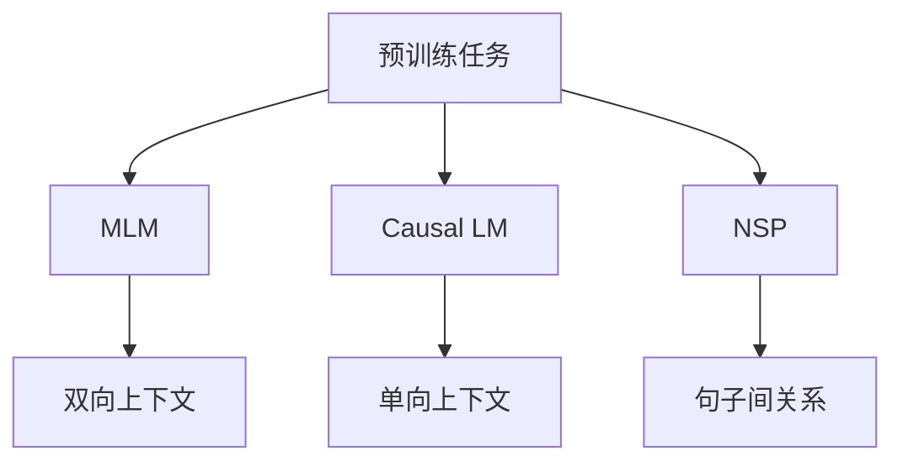
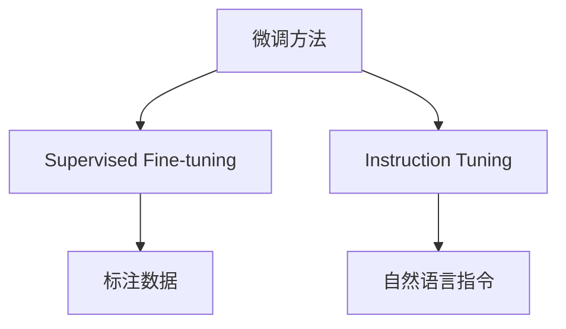
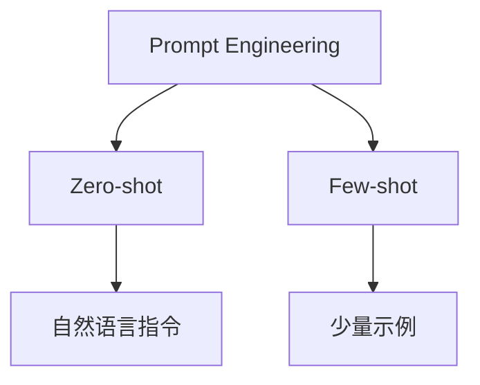
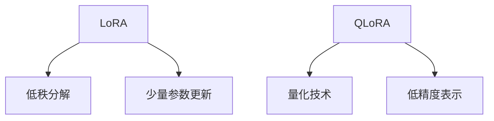

### 预训练-微调范式（Pretrain-Finetune）
------
#### **1. 预训练任务（Masked LM, Causal LM, Next Sentence Prediction）**
**🔑 知识点详解**
- **预训练任务的定义**：
  - 定义：预训练任务是通过无监督学习从大规模语料库中提取通用语言表示的任务。
  - 核心思想：利用大量未标注数据，通过设计特定的自监督任务，使模型学习到丰富的语言知识。
    👉 **注意**：预训练任务的设计直接影响模型的泛化能力和下游任务的表现。

- **常见预训练任务**：
  - **Masked Language Model (MLM)**：
    - 定义：随机遮掩输入序列中的部分单词，并预测这些被遮掩的单词。
    - 特点：双向上下文建模，适合理解任务。
  - **Causal Language Model (Causal LM)**：
    - 定义：通过自回归生成的方式预测下一个单词。
    - 特点：单向上下文建模，适合生成任务。
  - **Next Sentence Prediction (NSP)**：
    - 定义：判断两个句子是否连续。
    - 特点：增强模型对句子间关系的理解能力。

**🔥 面试高频题**
1. 为什么需要预训练任务？
   - **一句话答案**：预训练任务通过无监督学习提取通用语言表示，显著降低了对标注数据的需求。
   - **深入回答**：在自然语言处理中，标注数据通常昂贵且稀缺。预训练任务通过利用大量未标注数据，使模型能够学习到通用的语言知识（如语法、语义和上下文关系）。这种通用表示可以在下游任务中通过微调快速适应特定需求，从而显著提升模型性能。

2. 不同预训练任务的适用场景是什么？
   - **一句话答案**：MLM 适合理解任务，Causal LM 适合生成任务，NSP 增强句子间关系建模。
   - **深入回答**：MLM 通过双向上下文建模，能够捕捉更丰富的语义信息，因此在文本分类、问答等理解任务中表现优异。Causal LM 的单向特性使其更适合生成任务（如文本生成、对话系统）。NSP 则通过二分类任务增强模型对句子间关系的理解，适用于问答、自然语言推理等任务。

**🌟 重点提醒**
- **要点一**：预训练任务通过无监督学习提取通用语言表示。
- **要点二**：不同预训练任务适用于不同场景。
- **要点三**：预训练任务的设计直接影响模型的泛化能力。

**📝 实践经验**
```python
from transformers import BertTokenizer, BertForPreTraining
import torch

# 加载 BERT 模型和分词器
tokenizer = BertTokenizer.from_pretrained('bert-base-uncased')
model = BertForPreTraining.from_pretrained('bert-base-uncased')

# 输入文本
text = "The capital of France is [MASK]. Paris is known for its landmarks."

# 分词并转化为模型输入
inputs = tokenizer(text, return_tensors='pt')

# 获取模型输出
with torch.no_grad():
    outputs = model(**inputs)

# MLM 预测
masked_index = torch.where(inputs['input_ids'][0] == tokenizer.mask_token_id)[0]
predicted_token_id = outputs.prediction_logits[0, masked_index].argmax(dim=-1)
predicted_word = tokenizer.decode(predicted_token_id)

# NSP 预测
nsp_prediction = torch.argmax(outputs.seq_relationship_logits, dim=-1)

print(f"Predicted word for '[MASK]': {predicted_word}")
print(f"Is next sentence? {'Yes' if nsp_prediction.item() == 1 else 'No'}")
```

**🔧 工具辅助**


------
#### **2. 微调方法（Supervised Fine-tuning, Instruction Tuning）**
**🔑 知识点详解**
- **Supervised Fine-tuning（监督微调）**：
  - 定义：在预训练模型的基础上，使用标注数据进行有监督训练以适应特定任务。
  - 核心思想：通过调整模型参数，使预训练模型更好地完成目标任务。
    👉 **注意**：监督微调需要大量的标注数据，且可能过拟合到特定任务。
- **Instruction Tuning（指令微调）**：
  - 定义：通过将任务描述为自然语言指令，使模型能够理解和执行多种任务。
  - 核心思想：将任务统一为“指令-响应”形式，提升模型的通用性和灵活性。
    👉 **注意**：指令微调特别适合多任务学习和零样本/少样本学习。

**🔥 面试高频题**
1. Supervised Fine-tuning 和 Instruction Tuning 的区别是什么？
   - **一句话答案**：Supervised Fine-tuning 使用标注数据进行任务特定训练，而 Instruction Tuning 使用自然语言指令实现多任务学习。
   - **深入回答**：Supervised Fine-tuning 的核心思想是通过标注数据对预训练模型进行任务特定的微调，这种方法需要大量的标注数据，且可能过拟合到特定任务。相比之下，Instruction Tuning 将任务描述为自然语言指令（如“翻译以下句子为法语”），使模型能够理解和执行多种任务。这种方法不仅提升了模型的通用性，还减少了对标注数据的依赖。

2. 为什么 Instruction Tuning 更适合多任务学习？
   - **一句话答案**：Instruction Tuning 将任务统一为“指令-响应”形式，使模型能够灵活应对多种任务。
   - **深入回答**：Instruction Tuning 的核心优势在于其将任务描述为自然语言指令，从而使模型能够以统一的方式处理多种任务。例如，模型可以通过指令“回答以下问题”完成问答任务，通过指令“总结以下文本”完成摘要任务。这种方法不仅提升了模型的通用性，还减少了任务之间的冲突，特别适合多任务学习。

**🌟 重点提醒**
- **要点一**：Supervised Fine-tuning 需要大量标注数据，适合任务特定优化。
- **要点二**：Instruction Tuning 提升了模型的通用性和灵活性。
- **要点三**：Instruction Tuning 特别适合多任务学习和零样本/少样本学习。

**📝 实践经验**
```python
from transformers import AutoTokenizer, AutoModelForSeq2SeqLM

# 加载 T5 模型和分词器
tokenizer = AutoTokenizer.from_pretrained("t5-small")
model = AutoModelForSeq2SeqLM.from_pretrained("t5-small")

# 输入指令
instruction = "Translate English to French: The capital of France is Paris."
inputs = tokenizer(instruction, return_tensors="pt")

# 获取模型输出
outputs = model.generate(**inputs)
translated_text = tokenizer.decode(outputs[0], skip_special_tokens=True)

print(f"Translated text: {translated_text}")
```

**🔧 工具辅助**


------
#### **3. Prompt Engineering（Zero-shot, Few-shot）**
**🔑 知识点详解**
- **Prompt Engineering 的定义**：
  - 定义：Prompt Engineering 是一种通过设计自然语言提示（Prompt）引导模型完成任务的方法。
  - 核心思想：通过构造合适的输入格式，使预训练模型能够在零样本（Zero-shot）或少样本（Few-shot）情况下完成任务。
    👉 **注意**：Prompt Engineering 特别适合资源受限的场景。
- **Zero-shot Learning**：
  - 定义：无需任何任务特定数据，直接通过自然语言指令完成任务。
  - 特点：完全依赖预训练模型的知识。
- **Few-shot Learning**：
  - 定义：通过少量示例引导模型完成任务。
  - 特点：结合示例和指令提升模型性能。

**🔥 面试高频题**
1. Prompt Engineering 的作用是什么？如何设计有效的 Prompt？
   - **一句话答案**：Prompt Engineering 通过设计自然语言提示引导模型完成任务，设计时需明确任务目标并提供清晰的上下文。
   - **深入回答**：Prompt Engineering 的核心思想是通过构造合适的输入格式，使预训练模型能够在零样本或少样本情况下完成任务。例如，在问答任务中，可以通过“问题：XXX 答案：”的形式引导模型生成答案。设计有效的 Prompt 需要注意以下几点：
     - 明确任务目标：确保 Prompt 清晰地描述任务需求。
     - 提供上下文：通过示例或背景信息帮助模型理解任务。
     - 简洁明了：避免冗长或模糊的描述，减少歧义。

2. Zero-shot 和 Few-shot Learning 的区别是什么？
   - **一句话答案**：Zero-shot Learning 无需任务特定数据，Few-shot Learning 使用少量示例提升性能。
   - **深入回答**：Zero-shot Learning 完全依赖预训练模型的知识，通过自然语言指令完成任务。例如，GPT-3 可以直接根据指令“翻译以下句子为法语”完成翻译任务。Few-shot Learning 则通过提供少量示例（如输入-输出对）引导模型完成任务。例如，在文本分类任务中，可以提供几个类别标签和对应的示例，帮助模型更好地理解任务需求。

**🌟 重点提醒**
- **要点一**：Prompt Engineering 通过设计自然语言提示引导模型完成任务。
- **要点二**：Zero-shot Learning 完全依赖预训练模型的知识。
- **要点三**：Few-shot Learning 通过少量示例提升模型性能。

**📝 实践经验**
```python
from transformers import pipeline

# 加载 GPT-3 风格模型
generator = pipeline("text-generation", model="gpt-3.5-turbo")

# Zero-shot 示例
prompt_zero_shot = "Translate the following sentence to French: The capital of France is Paris."
output_zero_shot = generator(prompt_zero_shot, max_length=50)

# Few-shot 示例
prompt_few_shot = """
Translate English to French:
English: The capital of France is Paris.
French: La capitale de la France est Paris.

English: The weather is nice today.
French:
"""
output_few_shot = generator(prompt_few_shot, max_length=50)

print(f"Zero-shot output: {output_zero_shot[0]['generated_text']}")
print(f"Few-shot output: {output_few_shot[0]['generated_text']}")
```

**🔧 工具辅助**


------
#### **4. LoRA, QLoRA（低秩适配）**
**🔑 知识点详解**
- **LoRA（Low-Rank Adaptation）**：
  - 定义：LoRA 是一种通过低秩分解对预训练模型进行高效微调的方法。
  - 核心思想：仅更新模型中少量参数，显著降低计算和存储开销。
    👉 **注意**：LoRA 特别适合资源受限的场景。
- **QLoRA（Quantized Low-Rank Adaptation）**：
  - 定义：QLoRA 是 LoRA 的量化版本，进一步通过量化技术减少模型大小和计算需求。
  - 核心思想：结合低秩分解和量化技术，实现高效的微调和推理。
    👉 **注意**：QLoRA 在保持性能的同时大幅降低了资源需求。

**🔥 面试高频题**
1. LoRA 的核心思想是什么？它如何降低微调成本？
   - **一句话答案**：LoRA 通过低秩分解仅更新模型中少量参数，显著降低计算和存储开销。
   - **深入回答**：LoRA 的核心思想是通过对模型权重矩阵进行低秩分解，仅更新分解后的低秩矩阵，而非整个权重矩阵。这种方法显著减少了需要更新的参数数量，从而降低了计算和存储开销。此外，LoRA 的低秩分解还可以在不显著影响性能的情况下，快速适应新任务。

2. QLoRA 和 LoRA 的区别是什么？
   - **一句话答案**：QLoRA 是 LoRA 的量化版本，进一步通过量化技术减少模型大小和计算需求。
   - **深入回答**：QLoRA 在 LoRA 的基础上引入了量化技术，将模型权重压缩为低精度表示（如 INT8 或 INT4）。这不仅进一步减少了模型大小和计算需求，还提升了推理速度。相比之下，LoRA 仅通过低秩分解降低微调成本，而 QLoRA 结合了低秩分解和量化技术，实现了更高的效率。

**🌟 重点提醒**
- **要点一**：LoRA 通过低秩分解降低微调成本。
- **要点二**：QLoRA 进一步通过量化技术提升效率。
- **要点三**：两者均为资源受限场景提供了高效的微调方案。

**📝 实践经验**
```python
from peft import LoraConfig, get_peft_model
from transformers import AutoModelForCausalLM

# 加载预训练模型
model = AutoModelForCausalLM.from_pretrained("gpt-3.5-turbo")

# 配置 LoRA
lora_config = LoraConfig(
    r=8,  # 低秩分解的秩
    lora_alpha=16,
    target_modules=["q_proj", "v_proj"],
    lora_dropout=0.1
)

# 应用 LoRA
model = get_peft_model(model, lora_config)

# 微调模型（简化版）
# model.train()
```

**🔧 工具辅助**


**💡 复习建议**
1. 掌握常见预训练任务（如 MLM、Causal LM、NSP）的设计及其适用场景。
2. 理解监督微调和指令微调的区别，熟悉 Instruction Tuning 的优势。
3. 学习 Prompt Engineering 的基本原理，掌握 Zero-shot 和 Few-shot 的应用场景。
4. 熟悉 LoRA 和 QLoRA 的工作机制及其在资源受限场景中的应用。