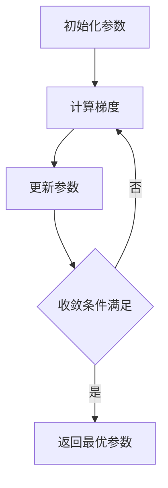
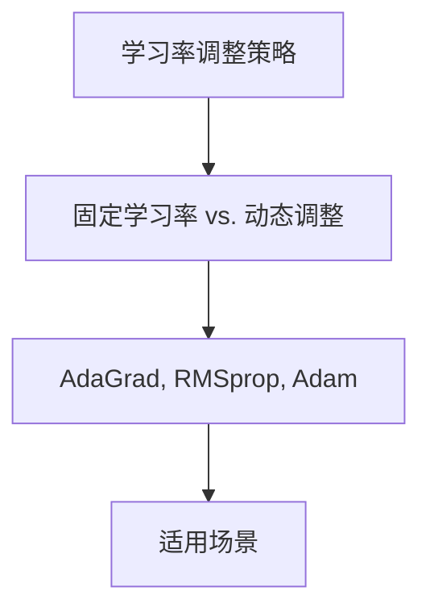
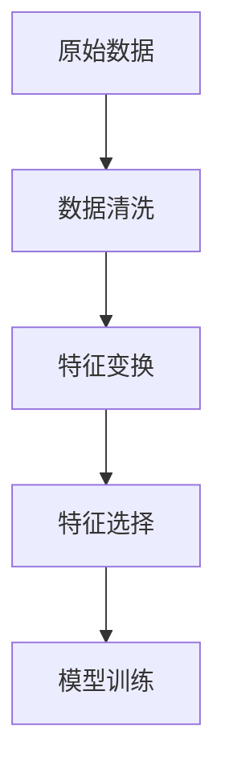
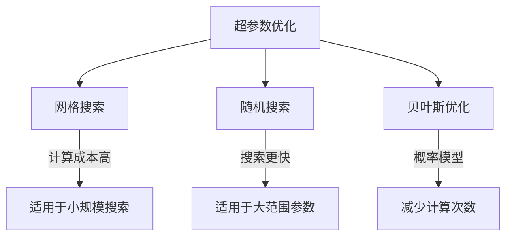

### 优化方法

------

#### **1. 梯度下降（Gradient Descent）基本概念**

**🔑 知识点详解**

- **概念**：

  - 梯度下降是一种**最优化算法**，用于最小化损失函数（J(θ)），通过沿着**负梯度方向**调整参数来找到最优解。
  - 本质：通过计算损失函数对参数的导数（梯度 ∇J(θ)），不断更新参数，使损失下降。

- **更新公式（一般形式）**：

  $$\theta = \theta - \alpha \nabla J(\theta)$$

  其中：

  - θ 为模型参数
  - α= 为学习率（Learning Rate）
  - ∇J(θ) 为损失函数关于 θ 的梯度

- **关键机制**：

  - 计算损失函数关于参数的梯度。
  - 选择学习率 α 控制更新步长。
  - 迭代更新参数，直到收敛（即梯度接近 0）。

  👉 **注意**：学习率太大可能导致发散，太小可能收敛太慢。

------

#### **2. 三种梯度下降方法**

##### **（1）批量梯度下降（Batch Gradient Descent, BGD）**

- **特点**：

  - 使用**所有训练数据**计算梯度，更新一次参数。
  - 计算成本高，但梯度估计稳定。

- **公式**：

  $$\theta = \theta - \alpha \frac{1}{m} \sum_{i=1}^{m} \nabla J_i(\theta)$$

  其中 m 为训练样本总数。

- **优缺点**：
   ✅ 适用于**凸函数优化**，更新稳定，收敛方向可靠。
   ❌ 每次更新计算量大，数据量很大时训练速度慢。

- **适用场景**：

  - 数据集较小且计算资源充足的情况下。

##### **（2）随机梯度下降（Stochastic Gradient Descent, SGD）**

- **特点**：

  - **每次仅使用一个样本**计算梯度并更新参数。
  - 计算速度快，但梯度更新方向波动大。

- **公式**：

  $$\theta = \theta - \alpha \nabla J_i(\theta)$$

  其中 ii 为当前样本索引。

- **优缺点**：
   ✅ 计算量小，适用于大规模数据。
   ✅ 能跳出局部最优，有助于优化非凸函数。
   ❌ 由于更新方向波动较大，**收敛不稳定**，可能在最优解附近震荡。

- **适用场景**：

  - 大规模数据集、在线学习（Online Learning）。

##### **（3）小批量梯度下降（Mini-Batch Gradient Descent, MBGD）**

- **特点**：

  - 介于批量和随机梯度下降之间，**每次使用一个小批量（Batch）**样本计算梯度。
  - 保持了 SGD 的计算效率，同时减少了梯度波动。

- **公式**：

  $$\theta = \theta - \alpha \frac{1}{|B|} \sum_{i \in B} \nabla J_i(\theta)$$

  其中 B 为一个小批量数据集。

- **优缺点**：
   ✅ 计算量适中，训练速度较快。
   ✅ 通过向量化计算加速梯度计算（适用于 GPU 计算）。
   ✅ 收敛更加稳定，避免 SGD 震荡问题。
   ❌ 仍然可能陷入局部最优。

- **适用场景**：

  - 深度学习训练，数据量大时广泛使用。
  - 适用于神经网络和 GPU 计算环境。

------

#### **3. 比较总结**

| 方法     | 计算效率               | 收敛稳定性              | 适用场景             |
| -------- | ---------------------- | ----------------------- | -------------------- |
| **BGD**  | 慢（一次使用全部数据） | 高（梯度稳定）          | 小数据集、凸优化问题 |
| **SGD**  | 快（每次使用一个样本） | 低（梯度波动大）        | 大数据、在线学习     |
| **MBGD** | 适中（使用小批量数据） | 适中（折中 SGD 和 BGD） | 深度学习、GPU 加速   |

------

#### **🔥 面试高频题**

1. **SGD 为什么比 BGD 更适合大数据？**
   - **一句话答案**：SGD 每次只计算一个样本的梯度，计算量小，适用于大数据。
   - 深入回答：
     - BGD 每次计算完整数据集的梯度，计算量大，数据量过大时不现实。
     - SGD 通过随机抽样更新参数，能更快学习，但收敛可能较不稳定。
     - MBGD 在计算效率和稳定性之间取得了平衡，常用于深度学习。
2. **如何选择 Mini-Batch 的大小？**
   - **一句话答案**：通常取 32、64、128、256 这些 2 的幂，适应 GPU 计算优化。
   - 深入回答：
     - 小批量能加速计算，并在噪声和收敛速度之间取得平衡。
     - 太小的 Batch 会导致收敛不稳定，太大的 Batch 可能收敛速度变慢。
     - 实际中通过实验调整最佳批量大小。

------

#### **🌟 重点提醒**

- **BGD** 适用于小数据集，计算稳定但效率低。
- **SGD** 适用于大数据和在线学习，更新快但收敛震荡。
- **MBGD** 结合两者优点，是深度学习中的标准优化方法。
- 学习率 α\alpha 选择很重要，可使用**学习率衰减（Learning Rate Decay）**优化收敛。

------

#### **📝 代码示例（Mini-Batch Gradient Descent）**

```python
import numpy as np

def mini_batch_gradient_descent(X, y, theta, alpha, batch_size, epochs):
    m = len(y)
    for epoch in range(epochs):
        # 随机打乱数据
        indices = np.random.permutation(m)
        X_shuffled, y_shuffled = X[indices], y[indices]
        
        for i in range(0, m, batch_size):
            X_batch = X_shuffled[i:i+batch_size]
            y_batch = y_shuffled[i:i+batch_size]
            
            # 计算梯度
            gradient = (1 / batch_size) * X_batch.T @ (X_batch @ theta - y_batch)
            
            # 更新参数
            theta -= alpha * gradient
    return theta
```

------

#### **🔧 可视化梯度下降过程**



#### **💡 复习建议**

1. **掌握三种梯度下降的原理及应用场景**。
2. **练习面试题**，特别是算法之间的对比。
3. **理解 mini-batch 在深度学习中的作用**，并能写出基本代码实现。

---

### 学习率（Learning Rate）调整策略

------

#### **1. 学习率的影响**

**🔑 知识点详解**

- 学习率（Learning Rate, α）：
  - 控制模型参数更新的步长。
  - 影响收敛速度和最终优化效果。
  - 过大可能导致震荡或不收敛，过小可能收敛过慢或陷入局部最优。
     👉 **注意**：学习率的选择对训练效果至关重要，需要结合调整策略优化。
- 学习率衰减（Learning Rate Decay）：
  - 逐步减少学习率，以提高训练稳定性。
  - 常见方法：指数衰减、分段衰减、循环学习率等。 
    👉 **辨析**：固定学习率 vs. 动态调整学习率。

**🔥 面试高频题**

1. 为什么学习率不能太大或太小？
   - **一句话答案**：过大导致梯度震荡或发散，过小收敛慢或陷入局部最优。
   - **深入回答**：学习率决定了参数更新的步长，合适的学习率能确保收敛高效稳定。

------

#### **2. 自适应学习率优化算法**

**🔑 知识点详解**

- AdaGrad（Adaptive Gradient）：
  - 自适应调整每个参数的学习率，对变化较大的参数降低学习率。
  - 适用于稀疏数据，但学习率持续衰减可能导致训练提前停止。
     👉 **注意**：适用于凸优化问题，如 NLP 任务。
- RMSprop（Root Mean Square Propagation）：
  - 采用指数加权平均（EMA）控制梯度更新，防止学习率持续下降。
  - 适用于非凸问题，尤其是 RNN 训练。 
    👉 **辨析**：RMSprop 解决了 AdaGrad 学习率过快下降的问题。
- Adam（Adaptive Moment Estimation）：
  - 结合 Momentum 和 RMSprop，自适应调整学习率。
  - 适用于深度学习任务，是目前最常用的优化器之一。 
    👉 **注意**：可能导致过早收敛，可结合 AdamW 进行优化。

**🔥 面试高频题**

1. Adam 为什么比 SGD 更适合深度学习？
   - **一句话答案**：结合 Momentum 和 RMSprop，优化非凸问题效果更稳定。
   - **深入回答**：SGD 可能震荡收敛慢，Adam 通过自适应梯度调整提高稳定性和收敛速度。
2. RMSprop 适用于哪些场景？
   - **一句话答案**：特别适用于 RNN 训练，防止梯度消失或爆炸。
   - **深入回答**：RMSprop 通过指数加权均值控制梯度更新，适用于非凸优化和长序列任务。

**🌟 重点提醒**

- **学习率太大会导致梯度震荡，太小可能陷入局部最优。**
- **自适应学习率算法（AdaGrad、RMSprop、Adam）各有优劣，需根据任务选择合适方法。**
- **Adam 是默认优化器，但在某些情况下，SGD + Momentum 可能更有效。**

**📝 代码示例**

```python
import torch

# 定义 Adam 优化器
optimizer = torch.optim.Adam(model.parameters(), lr=0.01)
```

**🔧 工具辅助**



**💡 复习建议**

1. 了解不同学习率调整策略的优缺点。
2. 熟悉不同优化器的适用场景，尤其是 AdaGrad、RMSprop、Adam。
3. 练习不同优化器的 PyTorch 实现，观察收敛效果对比。

------

### 特征工程 (Feature Engineering)
------
#### **1. 特征选择 (Feature Selection)**
**🔑 知识点详解**
- **过滤法 (Filter)**：
  - 根据统计指标对特征进行评分和排序（方差、相关系数、互信息等）
  - 优点：计算简单、速度快、与模型无关
  - 缺点：无法考虑特征间的组合效应
    👉 **注意**：方差为0的特征通常可以直接删除

- **包装法 (Wrapper)**：
  - 使用目标模型的性能作为特征子集的评价标准
  - 前向选择、后向消除、递归特征消除(RFE)
  - 计算复杂度高但效果好
    👉 **辨析**：与嵌入法的区别在于包装法将模型视为黑盒

**🔥 面试高频题**
1. 为什么要进行特征选择？
   - **一句话答案**：减少维度灾难、降低过拟合风险、提高模型效率
   - **深入回答**：特征选择可以去除冗余和无关特征，降低模型复杂度，提高泛化能力，同时减少计算资源消耗，提高训练和预测速度

------
#### **2. 特征变换 (Feature Transformation)**
**🔑 知识点详解**
- **多项式特征**：
  - 生成原始特征的高阶组合项
  - 可以捕捉非线性关系
  - 容易导致维度爆炸
    👉 **注意**：需要配合正则化使用

- **特征分箱**：
  - 等宽分箱、等频分箱、决策树分箱
  - 处理异常值和连续特征的非线性
  - 提高模型稳定性
    👉 **注意**：分箱边界的选择很重要

**🔥 面试高频题**
1. 什么情况下需要进行特征组合？
   - **一句话答案**：当单个特征无法很好地表达业务含义或存在特征交互效应时
   - **深入回答**：特征组合能捕捉特征间的非线性关系，创造更有预测力的新特征，例如在推荐系统中组合用户和物品特征

------
#### **3. 数据预处理 (Data Preprocessing)**
**🔑 知识点详解**
- **标准化和归一化**：
  - 标准化(StandardScaler)：转换为均值为0，方差为1的分布
  - 归一化(MinMaxScaler)：将数据缩放到[0,1]区间
  - RobustScaler：使用四分位数，对异常值不敏感
    👉 **注意**：测试集的转换要用训练集的参数

- **类别特征编码**：
  - One-Hot编码：创建虚拟变量
  - Label编码：将类别映射为整数
  - Target编码：使用目标变量统计量替换类别
    👉 **注意**：高基数类别特征需要特殊处理

**🌟 重点提醒**
- **顺序很重要**：特征工程步骤的顺序会影响最终效果
- **数据泄露**：预处理时要防止未来数据的信息泄露
- **业务理解**：好的特征工程需要深入的业务理解

**📝 实践经验**
```python
# 特征工程pipeline示例
from sklearn.pipeline import Pipeline
from sklearn.preprocessing import StandardScaler
from sklearn.feature_selection import SelectKBest

pipeline = Pipeline([
    ('scaler', StandardScaler()),
    ('feature_selection', SelectKBest(k=10)),
    ('classifier', RandomForestClassifier())
])
```

**🔧 工具辅助**


**💡 复习建议**
1. 掌握不同预处理方法的适用场景
2. 理解特征选择的原理和方法
3. 注意特征工程中的数据泄露问题
4. 多积累实际项目中的特征工程经验

------

### 超参数优化（Hyperparameter Optimization）

------

#### **1. 超参数优化概述**

**🔑 知识点详解**

- **超参数（Hyperparameters）**：
  - 超参数是在训练前设定的参数，影响模型的学习过程和性能，例如学习率、正则化强度、决策树深度、神经网络的隐藏层数等。
  - 不同于模型参数（如权重和偏置），超参数不会在训练过程中自动学习，而是通过调优手段确定。
  - 选择合适的超参数可以提高模型的泛化能力，避免过拟合或欠拟合。 👉 **注意**：超参数的选择依赖于经验或搜索策略，且不同任务需要不同的调优策略。
- **超参数优化方法（Hyperparameter Optimization Methods）**：
  - **网格搜索（Grid Search）**
  - **随机搜索（Random Search）**
  - **贝叶斯优化（Bayesian Optimization）**
  - **其他高级方法（如Hyperband、Optuna等）**

------

#### **2. 主要超参数优化方法**

##### **（1）网格搜索（Grid Search）**

**🔑 知识点详解**

- 定义：
  - 枚举所有可能的超参数组合，并通过交叉验证选择最优参数。
- 特点：
  - 适用于小规模参数搜索，易于并行计算。
  - 计算成本高，参数组合过多时会导致指数级增长。 👉 **注意**：如果搜索空间大，计算资源需求可能过高。

**🔥 面试高频题**

1. 网格搜索的优缺点？
   - **一句话答案**：优点是系统全面，能找到最优解；缺点是计算成本高，适用范围有限。
   - **深入回答**：网格搜索适用于小范围参数调整，可以保证搜索的完整性，但在高维度参数空间下计算复杂度极高。因此，在超参数较多的情况下，通常不推荐使用。

```python
from sklearn.model_selection import GridSearchCV
from sklearn.ensemble import RandomForestClassifier

param_grid = {
    'n_estimators': [10, 50, 100],
    'max_depth': [None, 10, 20]
}
clf = GridSearchCV(RandomForestClassifier(), param_grid, cv=5)
clf.fit(X_train, y_train)
print(clf.best_params_)
```

------

##### **（2）随机搜索（Random Search）**

**🔑 知识点详解**

- 定义：
  - 随机选择超参数组合进行评估，避免全局搜索的计算成本。
- 特点：
  - 在大范围参数搜索时更有效，计算开销比网格搜索低。
  - 不能保证找到全局最优参数，但在资源受限情况下表现良好。 👉 **注意**：当搜索空间较大时，随机搜索可能比网格搜索更高效。

**🔥 面试高频题**

1. 随机搜索与网格搜索的比较？
   - **一句话答案**：随机搜索计算成本低，适用于大规模参数搜索；网格搜索更精确，但计算量大。
   - **深入回答**：随机搜索在参数空间大的情况下可以找到较优的超参数组合，并且计算复杂度低。网格搜索适用于小规模搜索，能保证找到最优参数。

```python
from sklearn.model_selection import RandomizedSearchCV
from scipy.stats import randint

param_dist = {
    'n_estimators': randint(10, 200),
    'max_depth': [None, 10, 20]
}
clf = RandomizedSearchCV(RandomForestClassifier(), param_distributions=param_dist, n_iter=10, cv=5)
clf.fit(X_train, y_train)
print(clf.best_params_)
```

------

##### **（3）贝叶斯优化（Bayesian Optimization）**

**🔑 知识点详解**

- 定义：
  - 通过构建概率模型（如高斯过程）预测最优超参数组合，减少计算次数。
- 特点：
  - 计算效率比网格搜索和随机搜索更高。
  - 适用于计算成本高的模型（如深度学习）。 👉 **注意**：适用于高维参数搜索，但实现相对复杂。

**🔥 面试高频题**

1. 贝叶斯优化的优势？
   - **一句话答案**：利用历史信息减少计算次数，搜索更高效。
   - **深入回答**：贝叶斯优化基于概率模型（如高斯过程）进行参数搜索，可以通过“探索-利用”平衡策略减少不必要的计算，从而更快找到最优参数。

```python
from skopt import BayesSearchCV
from sklearn.ensemble import RandomForestClassifier

search_space = {
    'n_estimators': (10, 200),
    'max_depth': (None, 10, 20)
}
opt = BayesSearchCV(RandomForestClassifier(), search_space, n_iter=10, cv=5)
opt.fit(X_train, y_train)
print(opt.best_params_)
```

------

#### **3. 重点总结**

**🌟 重点提醒**

- **超参数调优是模型优化的关键环节，能显著提升模型表现。**
- **网格搜索适用于小规模参数搜索，计算量大但能找到最优解。**
- **随机搜索在大规模搜索空间中更高效，但不能保证最优解。**
- **贝叶斯优化适用于计算成本高的场景，可减少不必要的计算。**

**🔧 工具辅助**



**💡 复习建议**

1. 理解超参数与模型参数的区别。
2. 熟练掌握不同调优方法的优缺点及适用场景。
3. 实践使用 `GridSearchCV`、`RandomizedSearchCV` 和 `BayesSearchCV` 进行调优。

------