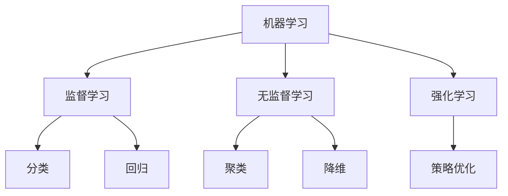
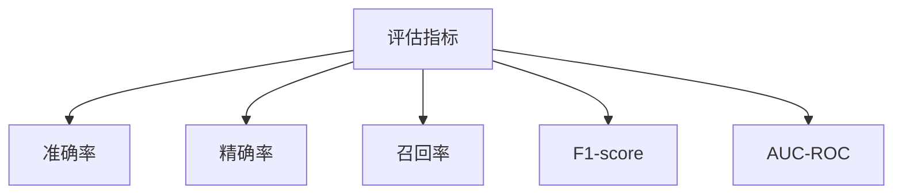

### 机器学习基本概念

------

#### **1. 监督学习 vs 无监督学习 vs 强化学习**

**🔑 知识点详解**

- **监督学习（Supervised Learning）**：
  - 训练数据包含 **输入（X）和标注的输出（Y）**，目标是学习 **映射函数** f:X→Yf: X \to Y。
  - 适用于 **分类**（如垃圾邮件检测）和 **回归**（如房价预测）。
  - 主要算法：线性回归、逻辑回归、决策树、SVM、神经网络等。
     👉 **注意**：过度依赖训练数据可能导致**过拟合**。
- **无监督学习（Unsupervised Learning）**：
  - 训练数据只有 **输入（X）**，没有标注的输出（Y），目标是发现数据的**内在结构或模式**。
  - 适用于 **聚类**（如K-means）和 **降维**（如PCA）。
  - 主要算法：K-means、DBSCAN、PCA、Autoencoder 等。
     👉 **辨析**：相比监督学习，无监督学习没有明确的“正确答案”。
- **强化学习（Reinforcement Learning, RL）**：
  - 通过**试错（Trial and Error）**方式学习，智能体（Agent）在环境（Environment）中通过 **状态-动作-奖励（State-Action-Reward）** 机制进行优化。
  - 适用于**策略优化问题**（如AlphaGo、自动驾驶）。
  - 主要算法：Q-learning、DQN、PPO 等。
     👉 **注意**：强化学习训练需要大量计算资源，并且难以保证收敛。

**🔥 面试高频题**

1. 监督学习 vs 无监督学习 vs 强化学习的核心区别？

   - **一句话答案**：监督学习依赖标注数据，无监督学习自动发现数据模式，强化学习通过试错学习最优策略。

   - 深入回答：

     | 特性     | 监督学习      | 无监督学习   | 强化学习         |
     | -------- | ------------- | ------------ | ---------------- |
     | 训练数据 | 有标签 (X, Y) | 无标签 X     | 通过交互获取     |
     | 目标     | 学习映射函数  | 发现数据模式 | 通过奖励学习策略 |
     | 主要应用 | 分类、回归    | 聚类、降维   | 机器人控制、博弈 |

------

#### **2. 训练、验证、测试集的划分原则**

**🔑 知识点详解**

- **数据集划分比例**：
  - **训练集（Training Set）**：用于训练模型，通常占 60%-80%。
  - **验证集（Validation Set）**：用于调参和选择最佳模型，占 10%-20%。
  - **测试集（Test Set）**：用于评估最终模型的泛化能力，占 10%-20%。
     👉 **注意**：验证集不能用于训练，否则会导致**信息泄露（Data Leakage）**。
- **数据划分策略**：
  - **随机划分**（Random Split）：适用于数据量足够大的情况。
  - **K折交叉验证（K-Fold Cross Validation）**：适用于数据量较少时提高训练稳定性。
  - **时间序列分割**（Time Series Split）：用于时间序列数据，如股票预测。
     👉 **辨析**：K折交叉验证能减少过拟合，但计算成本较高。

**🔥 面试高频题**

1. 为什么需要训练集、验证集和测试集？
   - **一句话答案**：避免过拟合，提高模型泛化能力。
   - **深入回答**：训练集用于拟合模型，验证集用于调参，测试集用于评估泛化性能。如果没有验证集，可能会过拟合训练数据，导致真实环境下的性能下降。

------

#### **3. 欠拟合（Underfitting）与过拟合（Overfitting）**

**🔑 知识点详解**

- **欠拟合（Underfitting）**：
  - 模型**过于简单**，无法捕捉数据中的重要模式。
  - 可能原因：特征不足、模型复杂度过低、训练轮数太少。
  - 解决方案：增加特征、提高模型复杂度（如更深的神经网络）。
     👉 **注意**：欠拟合通常导致**训练误差和测试误差都较高**。
- **过拟合（Overfitting）**：
  - 模型**过度学习**训练数据，无法泛化到新数据。
  - 可能原因：模型过于复杂、数据量少、训练时间过长。
  - 解决方案：
    - **正则化（L1/L2 Regularization）**
    - **Dropout（神经网络中随机丢弃神经元）**
    - **增加训练数据（Data Augmentation）**
    - **使用早停（Early Stopping）**
       👉 **辨析**：过拟合会导致**训练误差低，但测试误差高**。

**🔥 面试高频题**

1. 如何判断模型过拟合？如何解决？

   - **一句话答案**：训练误差远低于测试误差，解决方案包括正则化、数据增强、减少模型复杂度等。

   - 深入回答：

     | 现象     | 欠拟合     | 过拟合             |
     | -------- | ---------- | ------------------ |
     | 训练误差 | 高         | 低                 |
     | 测试误差 | 高         | 高                 |
     | 解决方案 | 增加复杂度 | 降低复杂度、正则化 |

**🌟 重点提醒**

- 监督 vs 无监督 vs 强化学习：
  - 监督学习适用于有标注数据，无监督学习用于模式发现，强化学习用于决策优化。
- 数据集划分：
  - 训练、验证、测试集划分比例一般为 6:2:2，确保模型泛化能力。
- 欠拟合 vs 过拟合：
  - 欠拟合需要增加模型复杂度，过拟合需要正则化和数据增强。

**🔧 工具辅助**

------

#### **4. 偏差（Bias）与方差（Variance）权衡**

**🔑 知识点详解**

- **偏差（Bias）**：

  - 衡量模型预测值与真实值的**平均误差**。
  - 偏差高的模型**过于简单**，无法很好地学习数据（即欠拟合）。
  - 例如，线性回归在学习非线性数据时可能会有较高偏差。
     👉 **注意**：高偏差意味着模型过于依赖假设，无法准确刻画数据模式。

- **方差（Variance）**：

  - 衡量模型在不同训练集上的表现差异，即对训练数据的**敏感度**。
  - 方差高的模型**过度拟合**训练数据，泛化能力较差（即过拟合）。
  - 例如，高深度神经网络可能会过度拟合训练集，导致测试集性能下降。
     👉 **辨析**：方差高时，模型对训练数据拟合很好，但在测试数据上的表现不稳定。

- **偏差-方差权衡（Bias-Variance Tradeoff）**：

  - 低偏差的模型通常**复杂度较高**，但可能会有较高方差。

  - 低方差的模型通常**简单**，但可能会有较高偏差。

  - 目标是找到合适的模型复杂度，在偏差和方差之间达到最佳平衡。

    👉 优化策略：

    - **减少偏差**：增加模型复杂度，如使用更复杂的特征、增加网络深度。
    - **减少方差**：使用正则化、数据增强、交叉验证等方法提高泛化能力。

**🔥 面试高频题**

1. 如何平衡偏差和方差？

   - **一句话答案**：通过选择合适的模型复杂度、正则化、数据增强等方法降低过拟合风险。

   - 深入回答：

     | 偏差-方差 | 高偏差（欠拟合）       | 高方差（过拟合）       |
     | --------- | ---------------------- | ---------------------- |
     | 现象      | 训练误差和测试误差都高 | 训练误差低但测试误差高 |
     | 解决方案  | 增加复杂度             | 降低复杂度、正则化     |

------

#### **5. 交叉验证（Cross-Validation）**

**🔑 知识点详解**

- **交叉验证（CV）的作用**：
  - 评估模型的**泛化能力**，防止因数据划分不同导致模型评价不稳定。
  - 主要用于**小样本数据集**，确保训练数据尽可能充分利用。
     👉 **注意**：单独划分训练集/测试集可能导致评估不稳定，CV 通过多次划分提升评估稳定性。
- **K折交叉验证（K-Fold Cross Validation）**：
  - **常用方法**，将数据集分成 **K** 份，每次用 **K-1** 份训练，剩余 1 份测试，循环 **K** 次，最后取平均值。
  - 适用于大多数模型训练，**K=5 或 10 是常见选择**。
     👉 **辨析**：K 值过大增加计算开销，但减少方差，提高稳定性。
- **留一交叉验证（LOO, Leave-One-Out Cross Validation）**：
  - 每次只用 **1** 个样本测试，剩余样本训练，适用于**小样本数据集**。
  - 计算开销大，但评估更稳定。
- **时间序列交叉验证**：
  - 适用于**时序数据**，保证训练集中的时间早于测试集，不可随机划分。

**🔥 面试高频题**

1. 为什么要使用 K 折交叉验证？
   - **一句话答案**：防止模型因数据划分不同而导致评估结果不稳定，确保泛化能力。
   - **深入回答**：K 折交叉验证通过多次训练/验证，减少单次划分的随机性，提高评估准确性。

------

#### **6. 评估指标：准确率（Accuracy）、精确率（Precision）、召回率（Recall）、F1-score、AUC-ROC**

**🔑 知识点详解**

- **混淆矩阵（Confusion Matrix）**：

  |                      | 预测正类（Positive） | 预测负类（Negative） |
  | -------------------- | -------------------- | -------------------- |
  | 真实正类（Positive） | TP（真正）           | FN（假负）           |
  | 真实负类（Negative） | FP（假正）           | TN（真负）           |

- **准确率（Accuracy）**：

  - 公式：$$Accuracy = \frac{TP + TN}{TP + TN + FP + FN}$$
  - 适用于数据分布均衡的情况。
     👉 **注意**：当数据不平衡（如 99% 为负类），高准确率可能误导模型性能。

- **精确率（Precision, P）**：

  - 公式：$$Precision = \frac{TP}{TP + FP}$$
  - 关注的是**被预测为正类的样本中，真正是正类的比例**。
  - 适用于**错误预测成本高的场景**（如垃圾邮件检测，FP 过多会误删正常邮件）。
     👉 **辨析**：提高精确率可能会降低召回率。

- **召回率（Recall, R）**：

  - 公式：$$Recall = \frac{TP}{TP + FN}$$
  - 关注的是**所有正类样本中，正确预测出的比例**。
  - 适用于**漏判成本高的场景**（如癌症检测，FN 过多会错过患者）。

- **F1-score**：

  - 公式：$$F1 = \frac{2 \times Precision \times Recall}{Precision + Recall}$$
  - 平衡**精确率和召回率**，适用于数据不均衡的情况。

- **AUC-ROC**：

  - **ROC 曲线（Receiver Operating Characteristic Curve）**：绘制**TPR（Recall）与 FPR（假正率）**的曲线。
  - **AUC（Area Under Curve）**：曲线下的面积，越接近 1.0，模型性能越好。
     👉 **适用场景**：分类任务中评估模型区分正负类的能力，适用于数据不平衡问题。

**🔥 面试高频题**

1. 何时使用 Precision，何时使用 Recall？

   - **一句话答案**：Precision 适用于 FP 代价高（如垃圾邮件检测），Recall 适用于 FN 代价高（如癌症筛查）。

   - 深入回答：

     | 指标                | 适用场景                                 |
     | ------------------- | ---------------------------------------- |
     | 精确率（Precision） | 需要减少误报（如金融欺诈检测）           |
     | 召回率（Recall）    | 需要减少漏报（如医疗诊断）               |
     | F1-score            | 综合评估精确率和召回率的场景             |
     | AUC-ROC             | 评估模型整体分类能力，特别是数据不平衡时 |

**🔧 工具辅助**

------
