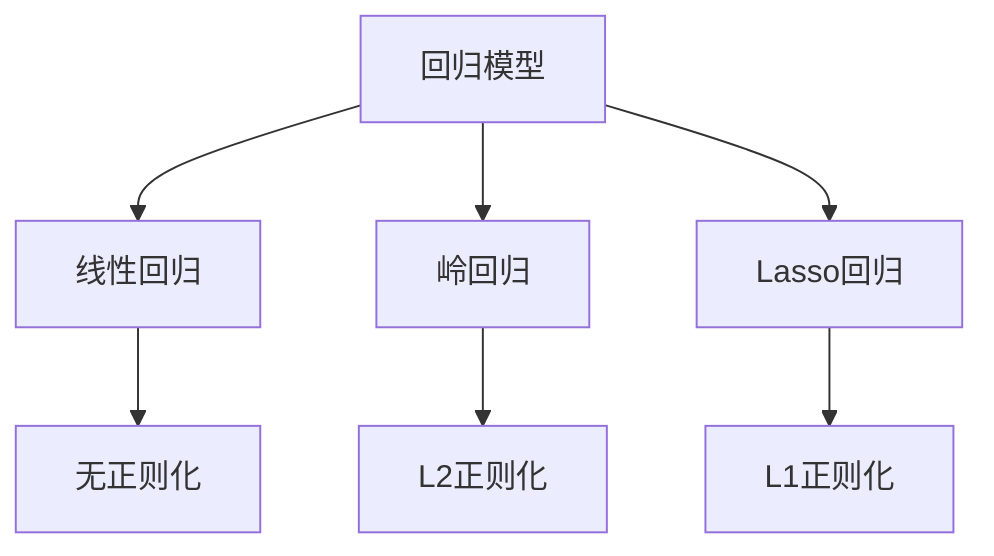
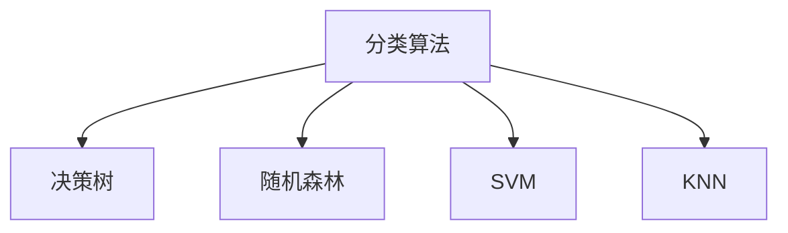
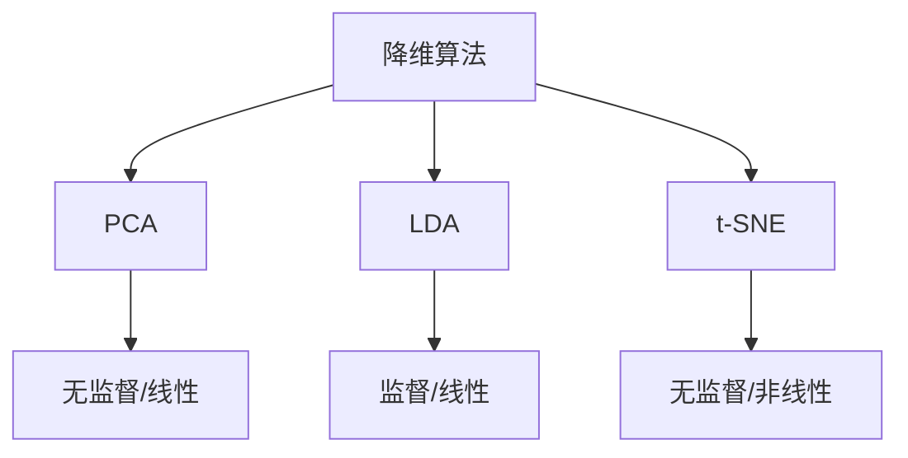
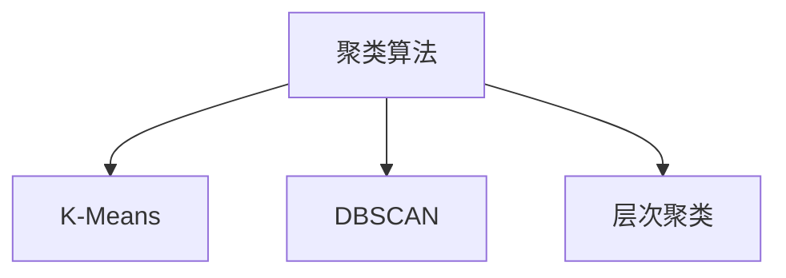

### 经典机器学习算法

---

#### 回归（Regression）

---

**1. 线性回归（Linear Regression）**

**🔑 知识点详解**

- **基本概念**：
  - 线性回归是通过线性组合来预测目标变量的监督学习算法
  - 假设预测值与特征之间存在线性关系：y = wx + b
  - 使用最小二乘法（OLS）求解参数
    👉 **注意**：线性回归假设因变量与自变量间存在线性关系，且残差服从正态分布

- **损失函数**：
  - 均方误差（MSE）：∑(y - ŷ)²/n
  - 目标是最小化预测值与实际值的差异
  - 通过梯度下降等优化算法求解
    👉 **辨析**：MSE vs MAE，MSE对异常值更敏感

**🔥 面试高频题**
1. 为什么选择MSE作为损失函数？
   - **一句话答案**：MSE可导且能放大误差，便于优化。
   - **深入回答**：MSE具有连续可导特性，便于梯度计算；平方项能够放大误差，加快收敛；对称性使得正负误差得到同等处理。但需注意其对异常值敏感的特点。

2. 线性回归的优缺点是什么？
   - **一句话答案**：简单直观但假设条件严格。
   - **深入回答**：优点包括计算简单、可解释性强；缺点是假设条件严格，容易欠拟合，对异常值敏感。

------
#### **2. 岭回归（Ridge Regression）**

**🔑 知识点详解**
- **基本原理**：
  - 在线性回归基础上添加L2正则化项：λ∑w²
  - 通过惩罚项控制模型复杂度
  - 防止过拟合，处理多重共线性
    👉 **注意**：λ值的选择对模型性能影响重大

- **与线性回归区别**：
  - 添加了正则化项
  - 可以处理特征间高度相关的情况
  - 得到的权重值较小但不为零
    👉 **辨析**：岭回归不会产生稀疏解

**🔥 面试高频题**
1. 岭回归如何选择正则化参数λ？
   - **一句话答案**：通过交叉验证选择最优λ值。
   - **深入回答**：使用网格搜索配合交叉验证，在验证集上评估不同λ值的模型性能，选择误差最小的λ值。需要注意λ过大会导致欠拟合。

------
#### **3. Lasso回归（Least Absolute Shrinkage and Selection Operator）**

**🔑 知识点详解**
- **核心特征**：
  - 使用L1正则化：λ∑|w|
  - 可以产生稀疏解（特征选择）
  - 用于特征筛选和降维
    👉 **注意**：Lasso会使部分特征权重变为0

- **应用场景**：
  - 高维数据特征选择
  - 需要模型解释性时
  - 处理特征冗余问题
    👉 **辨析**：相比Ridge，Lasso更容易得到稀疏解

**🔥 面试高频题**
1. 为什么Lasso能实现特征选择？
   - **一句话答案**：L1正则化会使部分特征权重变为0。
   - **深入回答**：L1正则化在优化过程中，当特征权重接近0时，会将其直接推至0，而L2正则化只会使权重变小但不为0。这种特性使Lasso天然具备特征选择能力。

**🌟 重点提醒**
- **正则化选择**：根据数据特点和任务需求选择合适的正则化方法
- **参数调优**：正则化系数λ的选择对模型性能至关重要
- **模型评估**：需要考虑模型的解释性、泛化能力和计算效率

**📝 实践经验**
```python
# 示例代码
from sklearn.linear_model import LinearRegression, Ridge, Lasso

# 线性回归
lr = LinearRegression()
# 岭回归
ridge = Ridge(alpha=1.0)
# Lasso回归
lasso = Lasso(alpha=1.0)
```

**🔧 原理图示**


**💡 复习建议**
1. 理解三种回归的数学原理和区别
2. 掌握正则化项的作用机制
3. 练习参数调优和模型评估
4. 准备实际应用案例

------

### **分类（Classification）**

------

#### **1. 决策树（Decision Tree）**

**🔑 知识点详解**

- **概念**：

  - 决策树是一种基于**树形结构**的分类模型，利用特征划分数据，并做出决策。
  - 由**根节点、内部节点、叶子节点**组成，每个内部节点是一个**决策规则**，叶子节点是最终分类结果。

- **关键机制**：

  - 划分标准（常见指标）：
    - **信息增益（ID3 算法）**：基于**熵**（Entropy）选择划分属性。
    - **信息增益率（C4.5 算法）**：对信息增益进行归一化，避免偏向高维特征。
    - **基尼系数（CART 算法）**：计算基尼不纯度（Gini Impurity）衡量数据混乱程度。

  👉 **注意**：决策树容易**过拟合**，需要**剪枝（Pruning）**来减少噪声影响。

**🔥 面试高频题**

1. 决策树如何选择最佳特征进行划分？
   - **一句话答案**：基于信息增益、信息增益率或基尼指数选择最优特征。
   - 深入回答：不同算法使用不同标准：
     - ID3 选择信息增益最大的特征。
     - C4.5 选择信息增益率最高的特征。
     - CART 选择基尼指数最小的特征。

------

#### **2. 随机森林（Random Forest）**

**🔑 知识点详解**

- **概念**：

  - 随机森林是**多个决策树的集成模型**，通过**Bagging（自助采样）**提升分类稳定性。
  - 适用于高维数据，能有效降低单个决策树的过拟合风险。

- **关键机制**：

  - **Bagging（Bootstrap Aggregating）**：每棵决策树使用随机采样的数据训练，减少方差。
  - **随机特征选择**：每次节点划分时，只在随机选择的特征子集中选出最佳特征，提高多样性。
  - **投票机制**：分类任务中，采用**多数投票（majority voting）**决策最终类别。

  👉 **注意**：随机森林计算量大，模型可解释性比单棵决策树弱。

**🔥 面试高频题**

1. 随机森林如何降低过拟合？
   - **一句话答案**：通过**Bagging 采样 + 随机特征选择**，减少单个决策树的方差，提高泛化能力。
   - 深入回答：
     - 训练时，每棵决策树仅使用部分数据，避免过度依赖特定样本。
     - 预测时，多棵树投票决定最终分类结果，降低单个模型的偏差。

------

#### **3. 支持向量机（SVM, Support Vector Machine）**

**🔑 知识点详解**

- **概念**：

  - SVM 通过找到**最大间隔超平面（Maximum Margin Hyperplane）**来分类数据点。
  - 适用于高维数据，特别适合**小样本问题**。

- **关键机制**：

  - **超平面（Hyperplane）**：用于分割不同类别的数据点。
  - **支持向量（Support Vectors）**：对决策边界影响最大的样本点。
  - 核函数（Kernel Trick）：用于非线性分类，将数据映射到高维空间后进行线性分类。
    - 线性核（Linear Kernel）：适用于线性可分数据。
    - 高斯核（RBF Kernel）：适用于非线性分类。
    - 多项式核（Polynomial Kernel）：适用于复杂的非线性分类任务。

  👉 **注意**：SVM 训练时间长，不适用于**大规模数据集**。

**🔥 面试高频题**

1. SVM 如何处理非线性数据？
   - **一句话答案**：通过**核函数（Kernel Trick）**将数据映射到高维空间，使其在高维空间线性可分。
   - **深入回答**：不同核函数适用于不同类型的数据，如**RBF 核**适用于非线性分布的数据。

------

#### **4. K 近邻算法（KNN, K-Nearest Neighbors）**

**🔑 知识点详解**

- **概念**：

  - KNN 是**基于实例的学习方法**，通过计算**样本之间的距离**来进行分类。
  - 训练阶段仅存储数据点，预测时计算样本点与已知样本的距离，选取**最近的 K 个邻居**进行投票。

- **关键机制**：

  - 距离度量（常用方法）：
    - 欧几里得距离（Euclidean Distance）： $$d(A, B) = \sqrt{\sum (A_i - B_i)^2}$$
    - 曼哈顿距离（Manhattan Distance）：$$d(A, B) = \sum |A_i - B_i|$$
    - 余弦相似度（Cosine Similarity）：适用于文本数据。

  👉 **注意**：KNN 计算量大，不适用于高维数据，可用**KD 树或 Ball 树**优化搜索。

**🔥 面试高频题**

1. KNN 选择 K 值的影响？
   - **一句话答案**：K 值过小可能导致过拟合，K 值过大可能导致欠拟合。
   - 深入回答：
     - **K 值小**：受单个数据点影响大，易受噪声干扰，模型复杂度高（高方差）。
     - **K 值大**：决策边界更平滑，降低过拟合，但可能导致欠拟合（高偏差）。

------

**🌟 重点提醒**

- **决策树 vs. 随机森林 vs. SVM vs. KNN**

  | 算法     | 适用数据类型 | 计算复杂度 | 过拟合风险   | 适用于大规模数据 |
  | -------- | ------------ | ---------- | ------------ | ---------------- |
  | 决策树   | 结构化数据   | 低         | 容易过拟合   | 适中             |
  | 随机森林 | 结构化数据   | 中         | 低           | 适中             |
  | SVM      | 高维数据     | 高         | 低           | 不适合           |
  | KNN      | 任意数据     | 高         | 低（K 大时） | 不适合           |

**💡 复习建议**

1. **掌握基本原理**：了解每种分类算法的基本思想、数学公式、适用场景。
2. **比较不同方法的优缺点**：如 SVM 适用于高维数据，但计算复杂度高，KNN 计算量大，不适合大规模数据。
3. **结合面试高频问题练习**：如**偏差-方差权衡、特征选择方法、核函数选择**等。



---

### 降维（Dimensionality Reduction）

------
#### **1. PCA（Principal Component Analysis）主成分分析**

**🔑 知识点详解**
- **基本概念**：
  - PCA是一种无监督的线性降维方法
  - 将高维数据投影到方差最大的方向上
  - 通过正交变换得到的新特征间线性无关
    👉 **注意**：PCA假设数据主要分布在高方差方向上

- **算法步骤**：
  - 中心化：减去特征均值
  - 计算协方差矩阵
  - 特征值分解
  - 选择主成分：保留最大的k个特征值对应的特征向量
    👉 **辨析**：与LDA的区别在于不考虑类别信息

**🔥 面试高频题**
1. PCA的原理是什么？
   - **一句话答案**：寻找数据方差最大的投影方向。
   - **深入回答**：PCA通过最大化投影方差，找到数据主要分布方向。这些方向构成的新坐标系能保留数据的主要信息，同时实现降维。本质是线性变换的最优化问题。

2. 如何选择PCA的主成分个数？
   - **一句话答案**：通过累积方差贡献率确定。
   - **深入回答**：选择特征值的累积贡献率达到预设阈值（如95%）的前k个主成分。需要在信息保留和降维效果间取得平衡。

------
#### **2. LDA（Linear Discriminant Analysis）线性判别分析**

**🔑 知识点详解**
- **核心思想**：
  - 监督学习降维方法
  - 最大化类间方差，最小化类内方差
  - 同时用于分类和降维
    👉 **注意**：LDA降维后的维数最多为类别数-1

- **计算过程**：
  - 计算类内散度矩阵Sw
  - 计算类间散度矩阵Sb
  - 求解广义特征值问题
  - 选择最大特征值对应的特征向量
    👉 **辨析**：与PCA相比，LDA考虑了类别信息

**🔥 面试高频题**
1. LDA相比PCA有什么优势？
   - **一句话答案**：LDA利用标签信息，更适合分类任务。
   - **深入回答**：LDA通过优化类间和类内方差比，找到最有利于分类的投影方向。对于分类任务，这种有监督的降维往往比PCA更有效。

------
#### **3. t-SNE（t-distributed Stochastic Neighbor Embedding）**

**🔑 知识点详解**
- **基本原理**：
  - 非线性降维方法
  - 保持数据点之间的局部关系
  - 使用t分布模拟低维空间的相似度
    👉 **注意**：计算复杂度高，主要用于可视化

- **核心特点**：
  - 保持局部结构
  - 处理非线性关系
  - 适合数据可视化
  - 参数敏感
    👉 **辨析**：与PCA/LDA相比更关注局部结构

**🔥 面试高频题**
1. t-SNE为什么适合数据可视化？
   - **一句话答案**：能够保持数据的局部结构和全局聚类特征。
   - **深入回答**：t-SNE通过概率分布模拟数据点间的相似度，在降维过程中保持了点与点之间的局部关系，同时t分布的长尾特性有助于分离不同的簇。

**🌟 重点提醒**
- **算法选择**：
  - PCA：线性、无监督、全局结构
  - LDA：线性、监督、分类导向
  - t-SNE：非线性、局部结构、可视化

**📝 实践经验**
```python
# 示例代码
from sklearn.decomposition import PCA
from sklearn.discriminant_analysis import LinearDiscriminantAnalysis
from sklearn.manifold import TSNE

# PCA
pca = PCA(n_components=2)
# LDA
lda = LinearDiscriminantAnalysis(n_components=2)
# t-SNE
tsne = TSNE(n_components=2)
```

**🔧 算法比较**


**💡 复习建议**
1. 理解各算法的数学原理
2. 掌握适用场景和局限性
3. 练习参数调优
4. 准备实际应用案例
5. 对比不同算法的效果

------

### **聚类（Clustering）**

------

#### **1. K-Means 聚类**

**🔑 知识点详解**

- **概念**：

  - K-Means 是一种基于**原型（Prototype-based）**的聚类算法，目标是将数据点划分到**K 个簇（Cluster）**中，使得簇内数据相似度高，簇间相似度低。
  - 通过**迭代优化簇的中心点（Centroid）**来最小化样本到簇中心的距离平方和（SSE, Sum of Squared Errors）。

- **关键机制**：

  1. **初始化**：随机选择 K 个数据点作为初始簇中心。
  2. **分配样本**：计算每个样本点到各簇中心的距离，将其分配到最近的簇。
  3. **更新簇中心**：计算每个簇的均值，并将该均值作为新的簇中心。
  4. **重复步骤 2-3**，直到簇中心收敛（变化很小）或达到最大迭代次数。

  👉 **注意**：K-Means 需要指定 K 值，K 选择不当可能导致欠拟合或过拟合。

- **K 值选择（Elbow Method）**

  - 通过绘制 K 对应的 SSE 曲线，寻找“拐点”确定最佳 K 值。

**🔥 面试高频题**

1. K-Means 聚类的缺点？
   - **一句话答案**：对初始中心敏感，不适用于非凸形状的数据，难以处理噪声和异常值。
   - 深入回答：
     - 可能陷入局部最优解（可用 K-Means++ 进行优化）。
     - 只能找到**球状聚类**，不能处理复杂形状的簇。
     - K 需要人工设定，可能不合理。

------

#### **2. DBSCAN（Density-Based Spatial Clustering of Applications with Noise）**

**🔑 知识点详解**

- **概念**：

  - DBSCAN 是一种**基于密度（Density-based）的聚类算法**，通过**高密度区域扩展**形成簇。
  - 无需指定 K 值，适用于**非凸形状的聚类任务**，并且能识别**噪声点（Noise）**。

- **关键机制**：

  - 需要设定两个参数：
    - **ε（Epsilon）**：定义**邻域半径**，即某个点周围多少距离范围内的数据点会被视为“邻居”。
    - **MinPts**：设定**最少需要多少个点**才能形成一个高密度区域。
  - 主要步骤：
    1. 选取一个未访问的点，如果其邻域内有 MinPts 个以上的数据点，则将其作为核心点（Core Point）。
    2. 扩展该核心点的簇，合并所有密度可达（Density-reachable）点。
    3. 继续对剩余数据点重复上述过程，直到所有点被处理。
    4. 不能归入任何簇的数据点视为噪声点（Outliers）。

  👉 **注意**：DBSCAN 适用于**非均匀分布**的数据，但对**高维数据效果较差**，参数 ε 选择较难。

**🔥 面试高频题**

1. DBSCAN 和 K-Means 的区别？
   - **一句话答案**：K-Means 假设簇是球状的，需要指定 K 值，而 DBSCAN 通过密度找簇，无需设定 K，适用于非凸形状的簇。
   - 深入回答：
     - DBSCAN 通过 ε 和 MinPts 确定簇，而 K-Means 需要人为设定 K 值。
     - DBSCAN 可识别噪声点，而 K-Means 无法区分噪声点。
     - K-Means 适用于**球状数据**，DBSCAN 适用于**任意形状的聚类**。

------

#### **3. 层次聚类（Hierarchical Clustering）**

**🔑 知识点详解**

- **概念**：

  - 层次聚类是一种基于**树状结构（Dendrogram）**的聚类方法，可以形成嵌套层级的簇。
  - 适用于**数据层次关系强**的任务，如生物分类、文本聚类等。
  - 无需指定 K 值，能在不同层次提供不同的聚类结果。

- **关键机制**：

  - 凝聚型（Agglomerative, 自底向上）：
    1. 每个点初始时是一个单独的簇。
    2. 计算簇间的**相似度度量**（如欧几里得距离、曼哈顿距离）。
    3. 逐步合并最近的两个簇，直到形成一个大簇或达到指定层级。
  - 分裂型（Divisive, 自顶向下）：
    1. 先把所有数据点视为一个大簇。
    2. 递归地将簇拆分，直到所有点变成单独的簇。

  👉 **注意**：层次聚类计算复杂度高（O(n^2)），适用于小规模数据集。

- **常见的距离计算方式**：

  - **单链接（Single Linkage）**：最小距离。
  - **完全链接（Complete Linkage）**：最大距离。
  - **平均链接（Average Linkage）**：均值距离。
  - **Ward’s 方法**（方差最小化）

**🔥 面试高频题**

1. 层次聚类 vs. K-Means vs. DBSCAN？
   - **一句话答案**：K-Means 适用于大规模数据但需指定 K，DBSCAN 适用于密度可变的聚类，层次聚类适用于层次关系数据。
   - 深入回答：
     - **K-Means**：高效，适用于大规模数据，但要求 K。
     - **DBSCAN**：能发现任意形状的簇，不需要 K，能处理噪声点。
     - **层次聚类**：适用于层次结构数据，但计算复杂度高。

------

**🌟 重点提醒**

| 算法     | 适用数据类型 | 计算复杂度 | 适用于大规模数据 | 适用于非凸簇 | 能否发现噪声点 |
| -------- | ------------ | ---------- | ---------------- | ------------ | -------------- |
| K-Means  | 球状数据     | O(nk)      | ✅                | ❌            | ❌              |
| DBSCAN   | 密度可变数据 | O(n^2)     | ❌                | ✅            | ✅              |
| 层次聚类 | 层次关系数据 | O(n^2)     | ❌                | ✅            | ❌              |

**💡 复习建议**

1. **掌握基本原理**：理解不同聚类方法的数学基础和核心思想。
2. **比较不同算法的优缺点**：了解 K-Means、DBSCAN、层次聚类的适用场景和局限性。
3. **结合面试高频问题练习**：特别是**如何选择合适的聚类方法**。



---

### 集成学习（Ensemble Learning）
------
#### **1. Bagging（Bootstrap Aggregating）**
**🔑 知识点详解**
- **基本原理**：
  - 通过自助采样法（Bootstrap）从原始数据集中有放回地随机抽取多个子数据集
  - 每个子数据集训练一个基学习器
  - 对所有基学习器的预测结果进行投票或平均得到最终结果
    👉 **注意**：样本采样是有放回的，每个样本被选中的概率相等
- **典型算法**：
  - 随机森林（Random Forest）
  - Extra Trees
  - Random Subspace
    👉 **辨析**：与Boosting的区别在于各基学习器是并行生成的，相互独立

**🔥 面试高频题**
1. Bagging为什么能够降低方差？
   - **一句话答案**：通过随机采样和多个基学习器的平均，降低了模型对数据扰动的敏感性
   - **深入回答**：Bagging通过Bootstrap采样产生多个训练集，每个训练集都有一定的差异性，这种差异性使得在这些训练集上训练出的模型也具有差异性。当这些具有差异性的模型进行组合时，它们的预测误差的随机部分（即方差）会相互抵消，从而降低整体模型的方差。

------
#### **2. Boosting**
**🔑 知识点详解**
- **基本原理**：
  - 串行训练多个基学习器，每个基学习器都在尝试纠正前一个的错误
  - 对错误分类的样本赋予更高的权重
  - 最终将所有基学习器加权组合
    👉 **注意**：基学习器之间存在强依赖关系，必须串行生成

**🔥 面试高频题**
1. 常见的Boosting算法有哪些？各有什么特点？
   - **一句话答案**：主要包括AdaBoost、GBDT、XGBoost、LightGBM和CatBoost，各有不同的优化策略
   - **深入回答**：
     - AdaBoost：通过调整样本权重来关注难分样本
     - GBDT：使用负梯度作为残差近似，逐步降低损失
     - XGBoost：在GBDT基础上增加了正则项，支持并行计算
     - LightGBM：使用直方图算法和带深度限制的特征分裂
     - CatBoost：改进了对类别特征的处理，降低了预测偏移

2. XGBoost相比GBDT有哪些改进？
   - **一句话答案**：增加了正则项、二阶泰勒展开、并行处理等优化
   - **深入回答**：主要改进包括：①使用二阶泰勒展开对目标函数进行近似，优化更准确；②在目标函数中增加树的复杂度惩罚项；③支持特征并行和数据并行；④实现了缺失值处理的特定策略

------
#### **3. Stacking**
**🔑 知识点详解**
- **基本原理**：
  - 训练多个不同类型的基学习器
  - 使用这些基学习器的预测结果作为新特征
  - 训练一个元学习器（meta-learner）进行最终预测
    👉 **注意**：为防止过拟合，基学习器的训练通常采用k折交叉验证

**🌟 重点提醒**
- **模型选择**：基学习器应当具有差异性，可以选择不同类型的模型
- **特征工程**：除了基模型的预测结果，还可以加入原始特征
- **过拟合防控**：需要谨慎处理训练数据，避免信息泄露

**📝 实践经验**
```python
# Stacking示例代码
from sklearn.ensemble import StackingClassifier
from sklearn.linear_model import LogisticRegression
from sklearn.svm import SVC
from sklearn.tree import DecisionTreeClassifier

estimators = [
    ('rf', RandomForestClassifier()),
    ('svm', SVC(probability=True)),
    ('dt', DecisionTreeClassifier())
]
stack = StackingClassifier(
    estimators=estimators,
    final_estimator=LogisticRegression()
)
```

**💡 复习建议**
1. 理解三种集成学习方法的基本原理和区别
2. 掌握XGBoost、LightGBM等高级Boosting算法的特点
3. 能够在实际场景中选择合适的集成学习方法