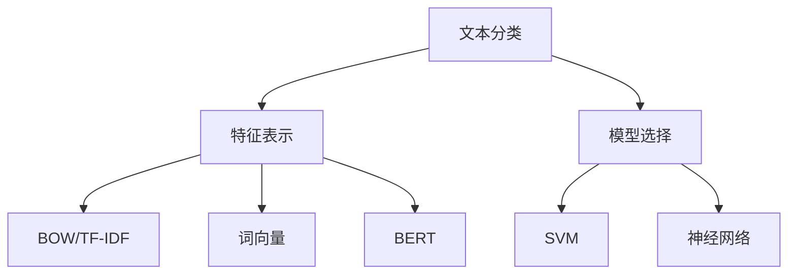
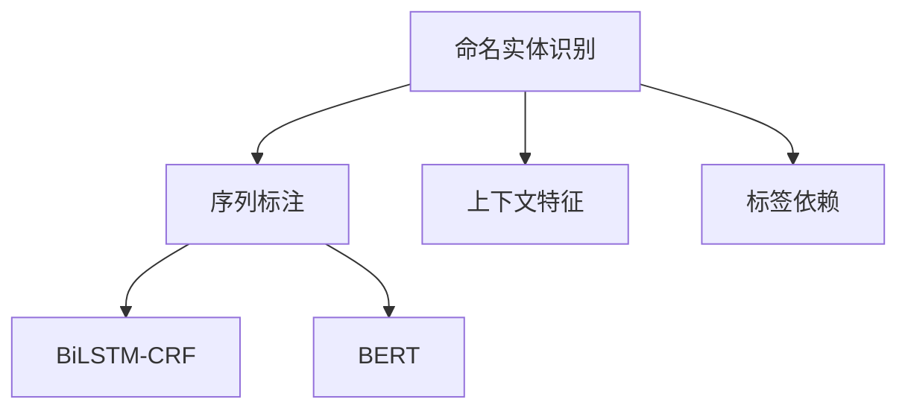
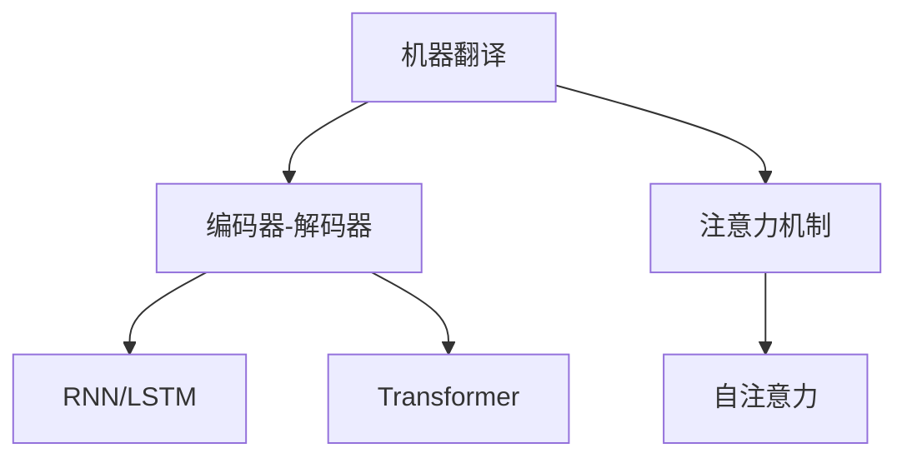
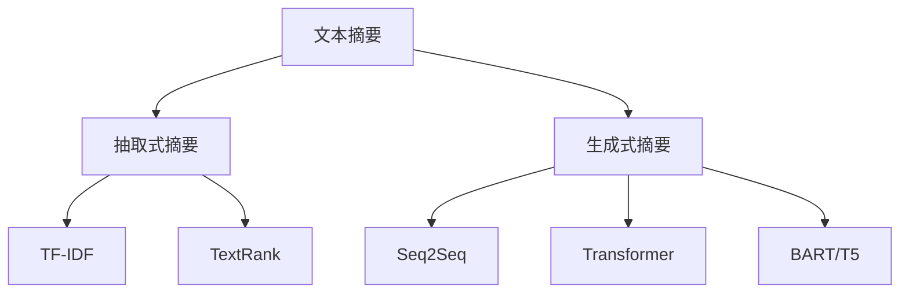

### NLP关键任务
------
#### **1. 文本分类（Text Classification）**
**🔑 知识点详解**
- **文本分类的定义**：
  - 定义：文本分类是将文本分配到预定义类别的任务，广泛应用于情感分析、垃圾邮件检测等领域。
  - 核心思想：通过提取文本特征并训练分类器，实现对文本类别的预测。
    👉 **注意**：文本分类的关键在于特征表示和模型选择。
- **常见方法**：
  - **传统方法**：
    - 使用词袋模型（BOW）或TF-IDF将文本转化为数值特征。
    - 应用机器学习算法（如SVM、朴素贝叶斯）进行分类。
  - **深度学习方法**：
    - 使用词向量（如Word2Vec、GloVe）或预训练模型（如BERT）提取文本特征。
    - 构建神经网络（如CNN、RNN、Transformer）进行分类。
- **应用场景**：
  - 情感分析：判断文本的情感倾向（正面、负面、中性）。
  - 主题分类：将新闻文章归类为体育、科技等类别。
  - 垃圾邮件检测：识别垃圾邮件与正常邮件。

**🔥 面试高频题**
1. 如何提升文本分类模型的性能？
   - **一句话答案**：通过改进特征表示（如使用预训练词向量或BERT）、优化模型架构（如引入注意力机制）以及数据增强提升性能。
   - **深入回答**：提升文本分类模型性能的方法包括：
     - 特征表示：使用高质量的词向量（如Word2Vec、GloVe）或预训练语言模型（如BERT）代替传统的BOW或TF-IDF。
     - 模型架构：引入更复杂的模型（如CNN、RNN、Transformer），并通过注意力机制捕捉重要信息。
     - 数据增强：通过同义词替换、随机删除等方式扩充训练数据，缓解数据不足问题。
     - 超参数调优：调整学习率、批量大小等超参数以优化训练效果。

2. BERT 在文本分类中的优势是什么？
   - **一句话答案**：BERT 提供了上下文感知的文本表示，显著提升了分类性能。
   - **深入回答**：BERT 的双向编码器能够同时考虑单词的左右上下文，生成更丰富的语义表示。相比传统的词向量方法，BERT 能够捕捉更深层次的语言特征，从而在情感分析、主题分类等任务中表现出色。

**🌟 重点提醒**
- **要点一**：文本分类的核心在于特征表示和模型选择。
- **要点二**：深度学习方法（如BERT）在复杂任务中表现优于传统方法。
- **要点三**：数据质量和数量对文本分类性能有重要影响。

**📝 实践经验**
```python
from transformers import BertTokenizer, BertForSequenceClassification
from torch.utils.data import DataLoader
from datasets import load_dataset

# 加载数据集
dataset = load_dataset("imdb")

# 加载 BERT 模型和分词器
tokenizer = BertTokenizer.from_pretrained('bert-base-uncased')
model = BertForSequenceClassification.from_pretrained('bert-base-uncased')

# 数据预处理
def preprocess_function(examples):
    return tokenizer(examples['text'], truncation=True, padding=True)

encoded_dataset = dataset.map(preprocess_function, batched=True)

# 构建数据加载器
train_loader = DataLoader(encoded_dataset['train'], batch_size=8, shuffle=True)

# 训练模型（简化版）
for batch in train_loader:
    outputs = model(input_ids=batch['input_ids'], attention_mask=batch['attention_mask'], labels=batch['label'])
    loss = outputs.loss
    loss.backward()
```

**🔧 工具辅助**


------
#### **2. 命名实体识别（NER）**
**🔑 知识点详解**
- **命名实体识别的定义**：
  - 定义：命名实体识别是从文本中识别出特定类型的实体（如人名、地名、组织名）的任务。
  - 核心思想：通过序列标注模型为每个单词分配一个标签（如B-PER、I-PER、O）。
    👉 **注意**：NER 是自然语言理解的重要组成部分，广泛应用于信息抽取和知识图谱构建。
- **常见方法**：
  - **传统方法**：
    - 使用CRF（条件随机场）结合手工特征进行序列标注。
  - **深度学习方法**：
    - 使用BiLSTM-CRF模型结合词向量进行序列标注。
    - 使用预训练模型（如BERT）结合CRF层进行端到端训练。
- **应用场景**：
  - 信息抽取：从新闻文章中提取人物、地点、事件等信息。
  - 知识图谱构建：识别实体并建立实体之间的关系。

**🔥 面试高频题**
1. BiLSTM-CRF 模型在 NER 中的作用是什么？
   - **一句话答案**：BiLSTM 提取上下文特征，CRF 捕捉标签之间的依赖关系。
   - **深入回答**：BiLSTM-CRF 是 NER 的经典模型，其中 BiLSTM 负责从输入序列中提取上下文特征，而 CRF 层则通过建模标签之间的转移概率，确保输出标签序列的合理性。例如，CRF 可以避免“B-PER”直接跳转到“I-LOC”的不合理情况。

2. 为什么 BERT 在 NER 中表现优异？
   - **一句话答案**：BERT 提供了上下文感知的词表示，能够更好地捕捉实体边界和语义信息。
   - **深入回答**：BERT 的双向编码器能够生成动态的词表示，根据上下文调整每个单词的语义。这使得 BERT 在识别实体边界和区分歧义实体时表现尤为出色。此外，BERT 还可以通过微调快速适应特定领域的 NER 任务。

**🌟 重点提醒**
- **要点一**：NER 的核心在于序列标注，需结合上下文特征和标签依赖关系。
- **要点二**：BiLSTM-CRF 是经典模型，但 BERT 等预训练模型表现更优。
- **要点三**：领域适应和数据标注质量对 NER 性能有重要影响。

**📝 实践经验**
```python
from transformers import BertTokenizer, BertForTokenClassification
from torch.utils.data import DataLoader
from datasets import load_dataset

# 加载数据集
dataset = load_dataset("conll2003")

# 加载 BERT 模型和分词器
tokenizer = BertTokenizer.from_pretrained('bert-base-cased')
model = BertForTokenClassification.from_pretrained('bert-base-cased', num_labels=9)

# 数据预处理
def preprocess_function(examples):
    return tokenizer(examples['tokens'], truncation=True, padding=True, is_split_into_words=True)

encoded_dataset = dataset.map(preprocess_function, batched=True)

# 构建数据加载器
train_loader = DataLoader(encoded_dataset['train'], batch_size=8, shuffle=True)

# 训练模型（简化版）
for batch in train_loader:
    outputs = model(input_ids=batch['input_ids'], attention_mask=batch['attention_mask'], labels=batch['labels'])
    loss = outputs.loss
    loss.backward()
```

**🔧 工具辅助**


------
#### **3. 机器翻译（Machine Translation）**
**🔑 知识点详解**
- **机器翻译的定义**：
  - 定义：机器翻译是将一种语言的文本自动翻译成另一种语言的任务。
  - 核心思想：通过编码器-解码器架构将源语言序列映射为目标语言序列。
    👉 **注意**：机器翻译的核心挑战在于捕捉语言间的语义对齐和句法差异。
- **常见方法**：
  - **传统方法**：
    - 基于规则的翻译系统（如基于语法和词典的翻译）。
    - 统计机器翻译（SMT）：基于平行语料库统计翻译概率。
  - **深度学习方法**：
    - Seq2Seq 模型：使用 RNN 或 LSTM 实现编码器-解码器架构。
    - Transformer 模型：通过自注意力机制实现高效的翻译。
- **应用场景**：
  - 跨语言交流：支持多语言沟通。
  - 内容本地化：将网站、文档翻译为目标语言。

**🔥 面试高频题**
1. Transformer 在机器翻译中的优势是什么？
   - **一句话答案**：Transformer 通过自注意力机制实现了高效的并行计算，并能够捕捉全局依赖关系。
   - **深入回答**：相比于传统的 RNN 和 LSTM，Transformer 不依赖顺序计算，能够并行处理整个序列，显著提升了训练速度。此外，自注意力机制允许模型动态关注序列中的任意位置，从而更好地捕捉长距离依赖关系。这使得 Transformer 在机器翻译任务中表现尤为出色。

2. 为什么需要注意力机制？
   - **一句话答案**：注意力机制能够动态捕捉源语言和目标语言之间的对齐关系。
   - **深入回答**：在机器翻译中，源语言和目标语言之间可能存在复杂的对齐关系。注意力机制通过计算查询（Query）和键（Key）之间的相似性，动态分配权重，从而帮助模型聚焦于源语言中最相关的部分。例如，在翻译长句子时，注意力机制可以确保模型正确对齐主语、谓语和宾语。

**🌟 重点提醒**
- **要点一**：机器翻译的核心在于编码器-解码器架构和注意力机制。
- **要点二**：Transformer 是当前机器翻译的主流模型。
- **要点三**：高质量的平行语料库对翻译性能至关重要。

**📝 实践经验**
```python
from transformers import MarianMTModel, MarianTokenizer

# 加载预训练翻译模型
model_name = "Helsinki-NLP/opus-mt-en-de"
tokenizer = MarianTokenizer.from_pretrained(model_name)
model = MarianMTModel.from_pretrained(model_name)

# 输入文本
text = "Machine translation is fascinating."

# 分词并翻译
inputs = tokenizer(text, return_tensors="pt")
outputs = model.generate(**inputs)
translated_text = tokenizer.decode(outputs[0], skip_special_tokens=True)

print("Translated Text:", translated_text)
```

**🔧 工具辅助**


------
#### **4. 文本摘要（Text Summarization）**
**🔑 知识点详解**
- **文本摘要的定义**：
  - 定义：文本摘要是从长文本中提取或生成简短摘要的任务，分为抽取式摘要和生成式摘要。
  - 核心思想：抽取式摘要通过选择重要句子生成摘要，生成式摘要通过生成新句子表达核心内容。
    👉 **注意**：生成式摘要更具挑战性，但能够生成更流畅的摘要。
- **常见方法**：
  - **抽取式摘要**：
    - 使用 TF-IDF 或 TextRank 算法选择重要句子。
  - **生成式摘要**：
    - 使用 Seq2Seq 模型或 Transformer 模型生成摘要。
    - 预训练模型（如 BART、T5）在生成式摘要中表现优异。
- **应用场景**：
  - 新闻摘要：为新闻文章生成简短概述。
  - 文档总结：为长篇报告生成摘要。

**🔥 面试高频题**
1. 抽取式摘要和生成式摘要的区别是什么？
   - **一句话答案**：抽取式摘要选择原文中的句子，生成式摘要生成新的句子。
   - **深入回答**：抽取式摘要通过评估句子的重要性（如基于 TF-IDF 或句子位置）选择原文中的句子作为摘要，优点是简单高效且忠实于原文，但可能缺乏连贯性。生成式摘要则通过 Seq2Seq 或 Transformer 模型生成新的句子，能够生成更流畅的摘要，但实现难度更高，且可能存在事实错误。

2. 为什么 BART 在生成式摘要中表现优异？
   - **一句话答案**：BART 结合了双向编码器和自回归解码器，能够生成高质量的摘要。
   - **深入回答**：BART 是一种基于 Transformer 的预训练模型，其双向编码器能够全面理解输入文本，而自回归解码器则能够生成流畅的输出。此外，BART 在预训练阶段采用了多种噪声注入策略（如随机删除、打乱顺序），使其在生成式摘要任务中表现尤为出色。

**🌟 重点提醒**
- **要点一**：抽取式摘要适合快速生成摘要，生成式摘要适合高质量需求。
- **要点二**：生成式摘要依赖于强大的语言模型（如 BART、T5）。
- **要点三**：评估摘要质量时需综合考虑准确性、简洁性和流畅性。

**📝 实践经验**
```python
from transformers import BartTokenizer, BartForConditionalGeneration

# 加载 BART 模型和分词器
tokenizer = BartTokenizer.from_pretrained('facebook/bart-large-cnn')
model = BartForConditionalGeneration.from_pretrained('facebook/bart-large-cnn')

# 输入文本
text = "Deep learning has revolutionized natural language processing. It enables machines to understand and generate human-like text."

# 分词并生成摘要
inputs = tokenizer(text, return_tensors="pt", max_length=1024, truncation=True)
summary_ids = model.generate(inputs['input_ids'], num_beams=4, max_length=50, early_stopping=True)
summary = tokenizer.decode(summary_ids[0], skip_special_tokens=True)

print("Generated Summary:", summary)
```

**🔧 工具辅助**


**💡 复习建议**
1. 掌握文本分类、NER、机器翻译和文本摘要的基本原理及应用场景。
2. 熟悉经典模型（如BiLSTM-CRF、Transformer）和预训练模型（如BERT、BART）的应用。
3. 动手实践相关任务，尝试在不同场景中优化模型性能。