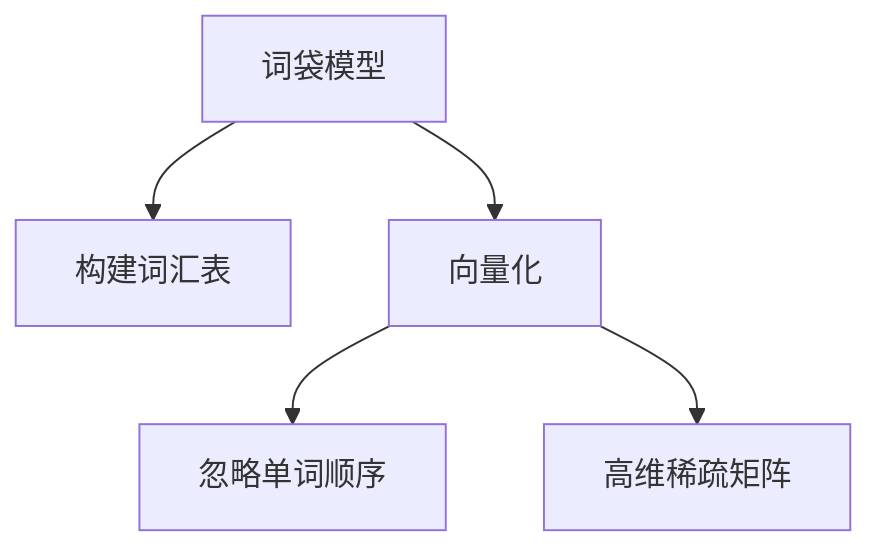
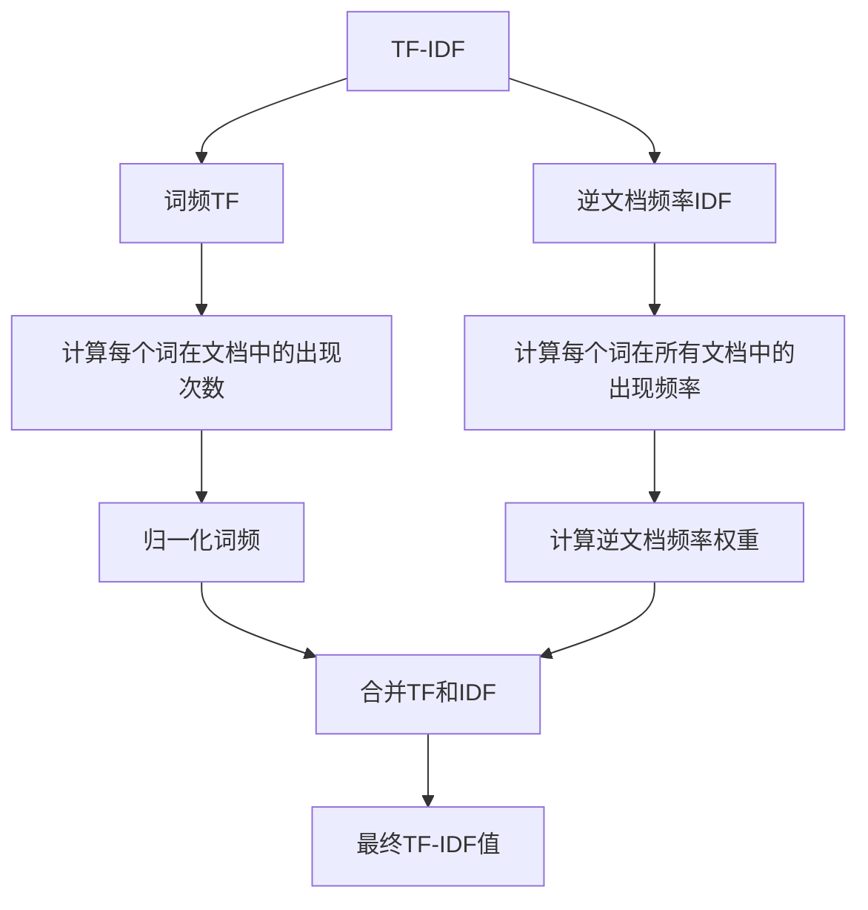
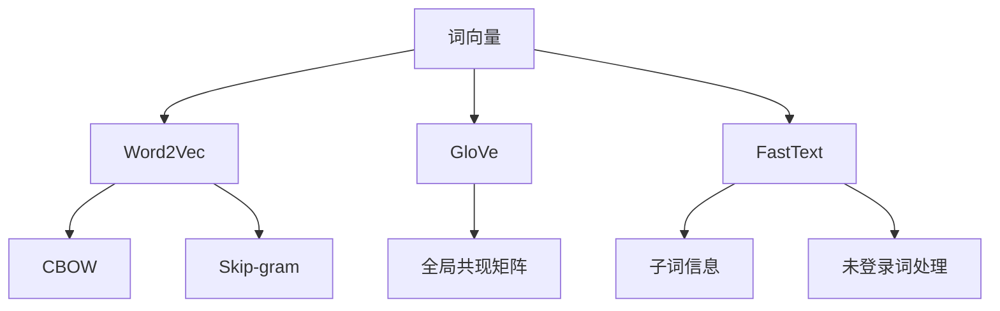

### 传统NLP方法
------
#### **1. 词袋模型（Bag of Words, BOW）**
**🔑 知识点详解**
- **词袋模型的定义**：
  - 定义：词袋模型是一种将文本表示为词汇表中单词出现频率的向量的方法。
  - 核心思想：忽略文本中单词的顺序，仅关注每个单词在文档中的出现次数。
    👉 **注意**：词袋模型无法捕捉单词之间的顺序关系和语义信息。
- **实现步骤**：
  1. 构建词汇表：统计所有文档中的唯一单词，形成一个固定的词汇表。
  2. 向量化：将每个文档表示为一个与词汇表长度相同的向量，向量中的每个元素表示对应单词的出现次数。
- **优点**：
  - 简单易实现，计算效率高。
  - 适用于简单的文本分类任务。
- **缺点**：
  - 忽略了单词的顺序和上下文信息。
  - 高维稀疏矩阵可能导致计算资源浪费。

**🔥 面试高频题**
1. 词袋模型的主要优缺点是什么？
   - **一句话答案**：词袋模型简单高效，但忽略了单词顺序和语义信息。
   - **深入回答**：词袋模型通过统计单词频率将文本转化为数值向量，便于机器学习算法处理。然而，由于它忽略了单词的顺序和上下文关系，无法捕捉复杂的语义信息。此外，生成的高维稀疏矩阵可能导致存储和计算开销较大。

2. 如何缓解词袋模型的高维稀疏问题？
   - **一句话答案**：可以通过降维技术（如PCA或SVD）或使用TF-IDF替代词频来缓解稀疏性。
   - **深入回答**：高维稀疏问题是词袋模型的一个主要缺陷，可以通过以下方法缓解：
     - 使用TF-IDF代替单纯的词频统计，减少常见词的影响。
     - 应用降维技术（如主成分分析PCA或奇异值分解SVD）降低特征维度。
     - 对词汇表进行截断，仅保留高频词或通过停用词过滤减少噪声。

**🌟 重点提醒**
- **要点一**：词袋模型的核心是将文本转化为数值向量，但忽略了单词顺序和语义。
- **要点二**：词袋模型适用于简单的文本分类任务，但在复杂任务中表现有限。
- **要点三**：可以通过TF-IDF或降维技术缓解高维稀疏问题。

**📝 实践经验**
```python
from sklearn.feature_extraction.text import CountVectorizer

# 示例文本
corpus = ["I love deep learning", "Deep learning is fascinating"]

# 构建词袋模型
vectorizer = CountVectorizer()
X = vectorizer.fit_transform(corpus)

# 输出词汇表和向量化结果
print("Vocabulary:", vectorizer.get_feature_names_out())
print("Bag of Words Matrix:\n", X.toarray())
```

**🔧 工具辅助**


------
#### **2. TF-IDF（词频-逆文档频率）**
**🔑 知识点详解**
- **TF-IDF的定义**：
  - 定义：TF-IDF是一种衡量单词在文档中的重要性的统计方法，结合了词频（Term Frequency, TF）和逆文档频率（Inverse Document Frequency, IDF）。
  - 公式：
    - $ TF(t) = \frac{\text{单词t在文档中的出现次数}}{\text{文档中的总单词数}} $
    - $ IDF(t) = \log\left(\frac{\text{文档总数}}{\text{包含单词t的文档数}}\right) $
    - $ TF\text{-}IDF(t) = TF(t) \times IDF(t) $
    👉 **注意**：TF-IDF能够有效降低常见词（如“the”、“is”）的权重，突出重要词汇。
- **应用场景**：
  - 文本分类、信息检索、关键词提取等任务。
- **优点**：
  - 相比词袋模型，更能反映单词的重要性。
  - 计算简单，易于实现。
- **缺点**：
  - 仍然无法捕捉单词的顺序和语义信息。

**🔥 面试高频题**
1. TF-IDF是如何工作的？为什么它比单纯使用词频更好？
   - **一句话答案**：TF-IDF通过结合词频和逆文档频率，降低了常见词的权重，突出了重要词汇。
   - **深入回答**：TF-IDF的核心在于通过IDF部分惩罚那些在大量文档中频繁出现的单词（如停用词），从而提升那些对特定文档更具区分度的单词的权重。相比单纯使用词频，TF-IDF能更好地反映单词在文档中的实际重要性，因此在文本分类和信息检索任务中表现更优。

2. TF-IDF有哪些局限性？
   - **一句话答案**：TF-IDF仍然无法捕捉单词的顺序和语义信息。
   - **深入回答**：尽管TF-IDF通过权重调整提升了单词的重要性评估，但它本质上仍然是基于统计的方法，无法理解单词之间的语义关系。例如，“猫”和“狗”在TF-IDF中被视为完全不同的单词，而实际上它们在语义上可能具有相似性。此外，TF-IDF也无法处理单词的上下文依赖性。

**🌟 重点提醒**
- **要点一**：TF-IDF通过结合词频和逆文档频率，提升了单词的重要性评估。
- **要点二**：TF-IDF适用于文本分类和信息检索任务，但仍无法捕捉语义信息。
- **要点三**：可以通过结合词向量方法进一步提升文本表示能力。

**📝 实践经验**
```python
from sklearn.feature_extraction.text import TfidfVectorizer

# 示例文本
corpus = ["I love deep learning", "Deep learning is fascinating"]

# 构建TF-IDF模型
vectorizer = TfidfVectorizer()
X = vectorizer.fit_transform(corpus)

# 输出词汇表和TF-IDF矩阵
print("Vocabulary:", vectorizer.get_feature_names_out())
print("TF-IDF Matrix:\n", X.toarray())
```

**🔧 工具辅助**



------
#### **3. 词向量（Word2Vec, GloVe, FastText）**
**🔑 知识点详解**
- **词向量的定义**：
  - 定义：词向量是一种将单词映射到低维连续向量空间的技术，能够捕捉单词的语义信息。
  - 核心思想：通过学习单词在上下文中的共现关系，生成能够反映语义相似性的向量表示。
    👉 **注意**：词向量方法能够有效解决传统方法（如BOW和TF-IDF）无法捕捉语义信息的问题。
- **常见方法**：
  - **Word2Vec**：
    - 包括CBOW（Continuous Bag of Words）和Skip-gram两种模型。
    - CBOW根据上下文预测目标单词，Skip-gram根据目标单词预测上下文。
  - **GloVe**：
    - 基于全局词共现矩阵，通过优化词向量的内积来近似共现概率。
    - 能够同时利用局部和全局统计信息。
  - **FastText**：
    - 在Word2Vec的基础上引入了子词（subword）信息，能够处理未登录词（OOV）。
    - 通过分解单词为字符n-gram，生成更鲁棒的词向量。
- **优点**：
  - 捕捉单词的语义信息，支持语义相似性计算。
  - 适用于多种NLP任务（如文本分类、机器翻译）。
- **缺点**：
  - 需要大规模语料库进行训练。
  - 无法动态捕捉上下文信息（需结合上下文感知模型，如BERT）。

**🔥 面试高频题**
1. Word2Vec和GloVe的区别是什么？
   - **一句话答案**：Word2Vec基于局部上下文窗口学习词向量，而GloVe基于全局共现矩阵。
   - **深入回答**：Word2Vec通过滑动窗口捕捉单词的局部上下文关系，分为CBOW和Skip-gram两种模型。GloVe则通过全局词共现矩阵，直接优化词向量的内积以近似共现概率。相比Word2Vec，GloVe能够更好地利用全局统计信息，生成更稳定的词向量。

2. FastText如何处理未登录词（OOV）问题？
   - **一句话答案**：FastText通过分解单词为字符n-gram，生成子词级别的词向量。
   - **深入回答**：FastText在Word2Vec的基础上引入了子词信息，将每个单词表示为一组字符n-gram的集合。即使某个单词未出现在训练集中，也可以通过其子词信息生成近似的词向量。这种方法显著提升了模型对未登录词的处理能力。

**🌟 重点提醒**
- **要点一**：词向量方法能够有效捕捉单词的语义信息，支持语义相似性计算。
- **要点二**：Word2Vec、GloVe和FastText各有优劣，应根据任务需求选择。
- **要点三**：FastText通过子词信息解决了未登录词问题，适合处理多语言或多形态的文本。

**📝 实践经验**
```python
from gensim.models import Word2Vec

# 示例语料
sentences = [["I", "love", "deep", "learning"], ["Deep", "learning", "is", "fascinating"]]

# 训练Word2Vec模型
model = Word2Vec(sentences, vector_size=100, window=5, min_count=1, workers=4)

# 获取单词向量
vector = model.wv["deep"]
print("Vector for 'deep':", vector)

# 计算单词相似度
similarity = model.wv.similarity("deep", "learning")
print("Similarity between 'deep' and 'learning':", similarity)
```

**🔧 工具辅助**


**💡 复习建议**
1. 理解词袋模型和TF-IDF的基本原理及其局限性。
2. 掌握词向量的核心思想，熟悉Word2Vec、GloVe和FastText的特点及应用场景。
3. 动手实践词向量的训练和应用，尝试在不同任务中比较其效果。

---

