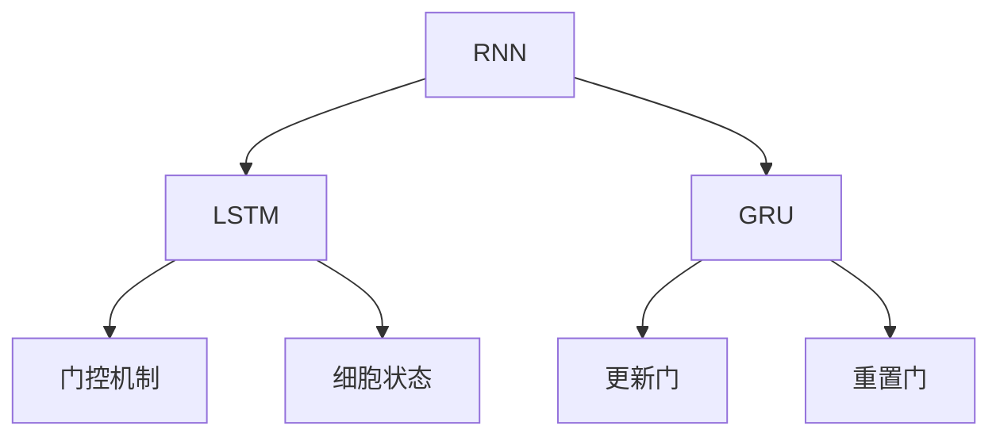
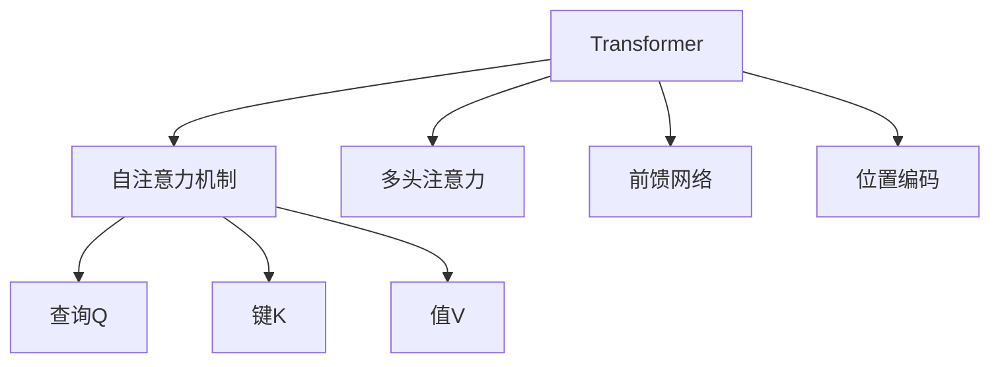
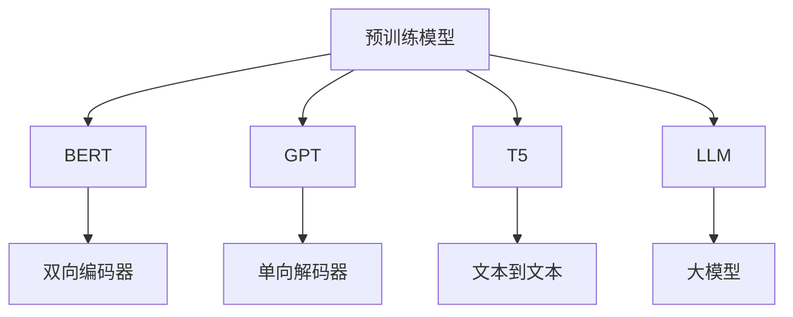

### 深度学习NLP模型
------
#### **1. RNN（循环神经网络）：LSTM, GRU**
**🔑 知识点详解**
- **RNN 的定义**：
  - 定义：RNN 是一种能够处理序列数据的神经网络，通过引入时间步的概念，允许信息在时间维度上传递。
  - 核心思想：每个时间步的隐藏状态依赖于当前输入和前一时刻的隐藏状态。
    👉 **注意**：标准 RNN 在长序列中容易出现梯度消失或梯度爆炸问题。
- **LSTM（长短期记忆网络）**：
  - 定义：LSTM 是 RNN 的改进版本，通过引入门控机制（输入门、遗忘门、输出门）来解决长期依赖问题。
  - 核心结构：
    - 输入门：控制新信息的流入。
    - 遗忘门：决定哪些信息需要被遗忘。
    - 输出门：决定哪些信息将作为输出。
    - 细胞状态：贯穿整个时间步，用于存储长期信息。
    👉 **注意**：LSTM 的门控机制使其能够捕捉长距离依赖关系。
- **GRU（门控循环单元）**：
  - 定义：GRU 是 LSTM 的简化版本，通过合并遗忘门和输入门为更新门，并去掉细胞状态，减少参数数量。
  - 核心结构：
    - 更新门：控制前一时刻隐藏状态与当前输入的结合比例。
    - 重置门：决定是否忽略前一时刻的隐藏状态。
    👉 **注意**：GRU 在性能上接近 LSTM，但计算效率更高。

**🔥 面试高频题**
1. LSTM 和 GRU 的区别是什么？
   - **一句话答案**：LSTM 通过门控机制和细胞状态捕捉长距离依赖，而 GRU 是 LSTM 的简化版本，去掉了细胞状态并合并了门控。
   - **深入回答**：LSTM 引入了三个门（输入门、遗忘门、输出门）和一个细胞状态，能够更精细地控制信息的流动，适合处理非常长的序列。GRU 则通过两个门（更新门、重置门）简化了结构，减少了参数数量，同时保留了捕捉长距离依赖的能力。GRU 的计算效率更高，但在某些复杂任务中可能略逊于 LSTM。

2. 为什么 RNN 在长序列中会出现梯度消失问题？如何解决？
   - **一句话答案**：RNN 的梯度在反向传播过程中会随时间步指数级衰减，导致梯度消失。
   - **深入回答**：RNN 的梯度消失问题源于其权重矩阵的连乘操作，当权重小于1时，梯度会逐渐趋近于零。LSTM 和 GRU 通过引入门控机制解决了这一问题，LSTM 的细胞状态允许信息直接传递，而 GRU 的更新门可以灵活控制信息的保留和遗忘。

**🌟 重点提醒**
- **要点一**：RNN 是处理序列数据的基础模型，但存在梯度消失问题。
- **要点二**：LSTM 和 GRU 通过门控机制解决了长期依赖问题，适合不同场景。
- **要点三**：GRU 是 LSTM 的简化版本，计算效率更高，但性能接近。

**📝 实践经验**
```python
import torch
import torch.nn as nn

# 定义 LSTM 模型
lstm = nn.LSTM(input_size=10, hidden_size=20, num_layers=2)

# 定义 GRU 模型
gru = nn.GRU(input_size=10, hidden_size=20, num_layers=2)

# 输入序列 (seq_len, batch_size, input_size)
input_seq = torch.randn(5, 3, 10)

# LSTM 前向传播
output_lstm, (hn_lstm, cn_lstm) = lstm(input_seq)

# GRU 前向传播
output_gru, hn_gru = gru(input_seq)
```

**🔧 工具辅助**


------
#### **2. Transformer 模型（Attention 机制）**
**🔑 知识点详解**
- **Transformer 的定义**：
  - 定义：Transformer 是一种基于自注意力机制（Self-Attention）的深度学习模型，彻底摆脱了 RNN 的顺序依赖性。
  - 核心思想：通过注意力机制动态捕捉序列中任意位置之间的关系。
    👉 **注意**：Transformer 在 NLP 中取得了突破性进展，成为现代 NLP 模型的核心架构。
- **Attention 机制**：
  - 定义：注意力机制通过计算查询（Query）、键（Key）和值（Value）之间的相似性，动态分配权重。
  - 公式：
    - $ \text{Attention}(Q, K, V) = \text{softmax}(\frac{QK^T}{\sqrt{d_k}})V $
    - $ Q $: 查询矩阵，$ K $: 键矩阵，$ V $: 值矩阵，$ d_k $: 键向量的维度。
    👉 **注意**：注意力机制能够并行计算，显著提升了效率。
- **Transformer 的核心组件**：
  - 多头注意力（Multi-Head Attention）：通过多个注意力头捕获不同的特征。
  - 前馈网络（Feed-Forward Network）：对每个位置的表示进行非线性变换。
  - 位置编码（Positional Encoding）：为序列中的每个位置添加位置信息，弥补自注意力机制无法感知顺序的缺陷。

**🔥 面试高频题**
1. Transformer 的核心优势是什么？
   - **一句话答案**：Transformer 通过自注意力机制实现了高效的并行计算，同时能够捕捉全局依赖关系。
   - **深入回答**：相比于 RNN 和 LSTM，Transformer 不依赖顺序计算，能够并行处理整个序列，显著提升了训练速度。此外，自注意力机制允许模型动态关注序列中的任意位置，从而更好地捕捉全局依赖关系。这使得 Transformer 在长序列任务中表现尤为出色。

2. 为什么需要位置编码？
   - **一句话答案**：自注意力机制无法感知序列顺序，位置编码为模型提供了位置信息。
   - **深入回答**：自注意力机制本质上是对输入序列的加权求和，因此无法区分单词的顺序。位置编码通过为每个位置添加固定的正弦和余弦函数，为模型引入了顺序信息。这种方法既简单又高效，且不会增加模型的复杂度。

**🌟 重点提醒**
- **要点一**：Transformer 通过自注意力机制实现了高效的并行计算。
- **要点二**：多头注意力和位置编码是 Transformer 的核心组件。
- **要点三**：Transformer 已成为现代 NLP 模型的标准架构。

**📝 实践经验**
```python
import torch
import torch.nn as nn

# 定义 Transformer 模型
transformer = nn.Transformer(d_model=512, nhead=8, num_encoder_layers=6, num_decoder_layers=6)

# 输入序列 (src_seq_len, batch_size, d_model)
src = torch.rand(10, 32, 512)
tgt = torch.rand(20, 32, 512)

# Transformer 前向传播
output = transformer(src, tgt)
```

**🔧 工具辅助**


------
#### **3. 预训练模型：BERT、GPT、T5、LLM（大模型）**
**🔑 知识点详解**
- **预训练模型的定义**：
  - 定义：预训练模型是在大规模语料库上预先训练的深度学习模型，能够通过微调快速适应下游任务。
  - 核心思想：利用无监督学习从大量文本中提取通用语言表示。
    👉 **注意**：预训练模型显著降低了对标注数据的需求，提升了模型的泛化能力。
- **BERT（Bidirectional Encoder Representations from Transformers）**：
  - 定义：BERT 是一种双向 Transformer 编码器，通过 Masked Language Model（MLM）和 Next Sentence Prediction（NSP）进行预训练。
  - 特点：
    - 双向编码：同时考虑上下文信息。
    - 广泛应用于分类、问答等任务。
- **GPT（Generative Pre-trained Transformer）**：
  - 定义：GPT 是一种单向 Transformer 解码器，通过自回归语言模型进行预训练。
  - 特点：
    - 单向生成：仅考虑左侧上下文。
    - 适用于生成任务（如文本生成、对话系统）。
- **T5（Text-to-Text Transfer Transformer）**：
  - 定义：T5 将所有 NLP 任务统一为文本到文本的形式，通过统一框架进行预训练和微调。
  - 特点：
    - 任务无关：支持多种任务（如翻译、摘要生成）。
    - 性能稳定且易于扩展。
- **LLM（大模型）**：
  - 定义：LLM 是指参数量极大的预训练模型（如 GPT-4、PaLM），能够在多种任务中表现出色。
  - 特点：
    - 参数量巨大，计算资源需求高。
    - 能够完成复杂的多模态任务（如代码生成、图像描述）。

**🔥 面试高频题**
1. BERT 和 GPT 的主要区别是什么？
   - **一句话答案**：BERT 是双向编码器，适合理解任务；GPT 是单向解码器，适合生成任务。
   - **深入回答**：BERT 通过双向注意力机制同时考虑上下文信息，适合需要全面理解的任务（如问答、分类）。GPT 则通过单向自回归生成模型，仅考虑左侧上下文，适合生成任务（如文本生成、对话系统）。两者在架构和应用场景上各有侧重。

2. 为什么 T5 被称为“文本到文本”模型？
   - **一句话答案**：T5 将所有任务统一为文本到文本的形式，简化了模型设计。
   - **深入回答**：T5 的核心思想是将所有 NLP 任务（如翻译、摘要生成、问答）统一为输入文本到输出文本的形式。例如，在机器翻译任务中，输入是源语言文本，输出是目标语言文本；在问答任务中，输入是问题和上下文，输出是答案。这种统一框架使得 T5 更加灵活且易于扩展。

**🌟 重点提醒**
- **要点一**：预训练模型通过无监督学习提取通用语言表示，显著降低了对标注数据的需求。
- **要点二**：BERT 适合理解任务，GPT 适合生成任务，T5 提供了统一框架。
- **要点三**：大模型（LLM）在性能上表现出色，但对计算资源需求较高。

**📝 实践经验**
```python
from transformers import BertTokenizer, BertModel

# 加载 BERT 模型和分词器
tokenizer = BertTokenizer.from_pretrained('bert-base-uncased')
model = BertModel.from_pretrained('bert-base-uncased')

# 输入文本
text = "Deep learning is fascinating."

# 分词并转化为模型输入
inputs = tokenizer(text, return_tensors='pt')

# 获取 BERT 输出
outputs = model(**inputs)
last_hidden_states = outputs.last_hidden_state
```

**🔧 工具辅助**


**💡 复习建议**
1. 掌握 RNN、LSTM 和 GRU 的基本原理及其适用场景。
2. 理解 Transformer 的核心组件（如自注意力机制、位置编码）及其优势。
3. 熟悉 BERT、GPT、T5 和 LLM 的特点及应用场景，尝试在实际任务中使用预训练模型。