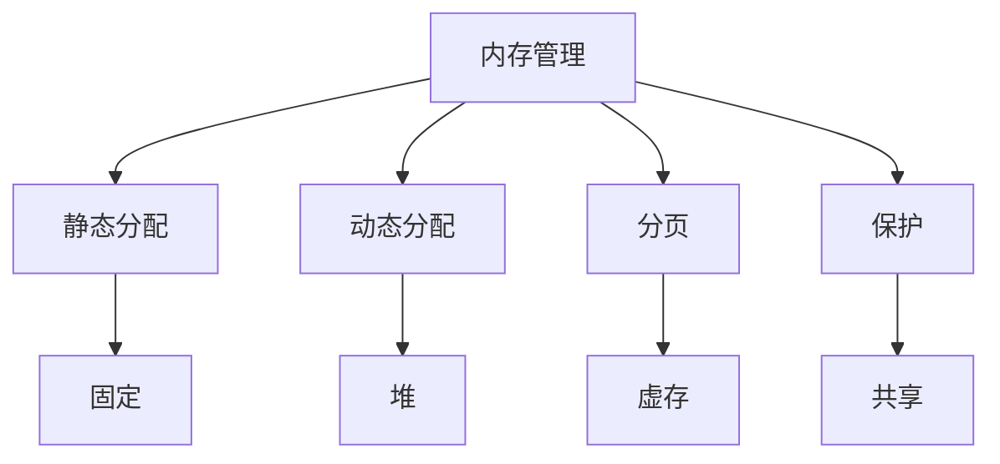

### 内存管理
------
#### **1. 内存分配：静态与动态分配**
**🔑 知识点详解**
- **静态分配**：
  - **核心定义**：程序编译时确定内存大小和位置。
  - **重要特性**：分配固定，运行时不可变，存储于全局区或栈。
  - **关键机制**：编译器直接分配，如全局变量、静态变量。
    - **细节**：C 中 `static int x = 10;`。
    👉 **注意**：效率高但灵活性差。
- **动态分配**：
  - **主要内容**：运行时根据需求分配内存。
  - **核心特点**：大小可变，存储于堆，需手动释放。
  - **实现原理**：通过内存管理函数（如 C 的 `malloc/free`，Python 的垃圾回收）。
    - **细节**：操作系统维护空闲块列表（如伙伴系统）。
    👉 **注意**：内存泄漏和碎片化是常见问题。
- **使用场景**：
  - **静态**：固定大小数据（如常量）。
  - **动态**：运行时未知大小（如链表、数组扩展）。

**🔥 面试高频题**
1. 静态分配和动态分配的区别是什么？
   - **一句话答案**：静态编译时固定，动态运行时分配。
   - **深入回答**：静态分配在栈或数据段，效率高但不可变；动态分配在堆，灵活但需管理（如 `malloc` 分配，`free` 释放）。
2. 动态内存分配如何实现？
   - **一句话答案**：通过堆管理器从空闲内存中分配。
   - **深入回答**：OS 用链表或位图追踪空闲块，分配策略（如首次适配、最佳适配），返回指针给程序。
3. 内存碎片有哪些类型？
   - **一句话答案**：外部碎片和内部碎片。
   - **深入回答**：外部碎片因分配间隙（如 10KB 空闲分不出 8KB），内部碎片因分配多余（如 4KB 页给 1KB 数据）。
4. 如何避免内存泄漏？
   - **一句话答案**：及时释放动态内存或用垃圾回收。
   - **深入回答**：C 中显式 `free()`，Python 依赖 GC，工具如 Valgrind 检测未释放内存。

#### **2. 分页与分段：虚拟内存原理、页表结构**
**🔑 知识点详解**
- **分页**：
  - **核心定义**：将内存划分为固定大小的页面（如 4KB），虚拟地址映射到物理地址。
  - **重要特性**：消除外部碎片，支持按需加载。
  - **关键机制**：页表记录虚实映射，页号+偏移量定位。
    - **细节**：如 32 位地址，4KB 页，页号 20 位，偏移 12 位。
    👉 **注意**：页表占用额外空间。
- **分段**：
  - **主要内容**：按逻辑功能（如代码段、数据段）划分内存。
  - **核心特点**：大小可变，支持保护和共享。
  - **实现原理**：段表记录基址和长度，地址为段号+偏移。
    - **细节**：段表比页表小，但有外部碎片。
    👉 **注意**：现代 OS 多用分页+分段。
- **虚拟内存原理**：
  - **主要内容**：通过虚实映射提供大地址空间。
  - **核心特点**：隔离进程、按需加载、页面置换。
  - **实现原理**：MMU（内存管理单元）翻译地址，缺页中断加载页面。
    - **细节**：页面置换算法（如 LRU）。
- **页表结构**：
  - **具体说明**：多级页表（如二级、三级）或倒排页表。
  - **实现方式**：如 32 位二级页表，10-10-12 位划分。
  - **使用场景**：减少页表内存占用。

**🔥 面试高频题**
1. 虚拟内存的作用是什么？
   - **一句话答案**：提供大地址空间并隔离进程。
   - **深入回答**：通过虚实映射，进程认为独占内存，支持页面换入换出（如磁盘交换区），提升多任务能力。
2. 分页和分段的区别是什么？
   - **一句话答案**：分页固定大小，分段按逻辑划分。
   - **深入回答**：分页无外部碎片但有内部碎片，分段灵活但碎片化严重。Linux 结合两者，段内分页。
3. 页表的作用和开销是什么？
   - **一句话答案**：映射虚拟地址到物理地址，占用额外内存。
   - **深入回答**：每进程一张页表，4KB 页下 32 位系统需 4MB（2²⁰ * 4 字节），多级页表优化至按需分配。
4. 如何处理缺页中断？
   - **一句话答案**：加载页面并更新页表。
   - **深入回答**：MMU 检测页表项无效，触发中断，OS 从磁盘加载页面，若内存满则置换（如 LRU），更新页表后返回。
5. 多级页表的优点是什么？
   - **一句话答案**：减少内存占用，按需分配。
   - **深入回答**：如二级页表，32 位分 10-10-12，仅填充活跃部分，节省空间但增加查询时间。

---

#### **3. 内存保护与共享**
**🔑 知识点详解**
- **内存保护**：
  - **核心定义**：防止进程非法访问他人内存。
  - **重要特性**：隔离性、安全性。
  - **关键机制**：虚拟内存隔离、页表权限位（如读/写/执行）。
    - **细节**：如 Linux 页表 PTE 的 R/W/X 标志。
    👉 **注意**：越界访问触发段错误（SIGSEGV）。
- **内存共享**：
  - **主要内容**：多个进程或线程访问同一内存区域。
  - **核心特点**：高效通信，节省内存。
  - **实现原理**：共享内存映射（如 `mmap`）、写时复制（COW）。
    - **细节**：COW 在修改时复制页面（如 `fork()`）。
    👉 **注意**：共享需同步机制（如信号量）。
- **使用场景**：
  - **保护**：防止恶意代码、进程隔离。
  - **共享**：IPC（如共享内存）、动态链接库。

**🔥 面试高频题**
1. 内存保护是如何实现的？
   - **一句话答案**：通过虚拟内存和页表权限。
   - **深入回答**：每个进程独立虚址空间，页表设置权限位，MMU 检查越界或非法操作，触发异常。
2. 什么是写时复制（COW）？
   - **一句话答案**：共享页面，修改时复制。
   - **深入回答**：`fork()` 时子进程共享父进程页面，写操作时复制新页面，节省内存但增加复制开销。
3. 进程如何共享内存？
   - **一句话答案**：通过映射同一物理内存到虚址。
   - **深入回答**：如 POSIX `shm_open` 或 `mmap`，创建共享块，进程映射后读写，需锁避免竞争。
4. 内存保护失败会怎样？
   - **一句话答案**：导致段错误或数据破坏。
   - **深入回答**：非法访问（如空指针解引用）触发 SIGSEGV，OS 终止进程；无保护可能覆盖其他进程数据。

**🌟 重点提醒**
- **要点一**：静态分配固定，动态需管理。
- **要点二**：分页高效，分段灵活，虚存核心。
- **要点三**：保护隔离，共享需同步。

**🔧 工具辅助**

**💡 复习建议**
1. 理解虚实地址映射过程。
2. 熟悉页表和 COW 的原理。
3. 练习内存分配与共享的场景。

---

