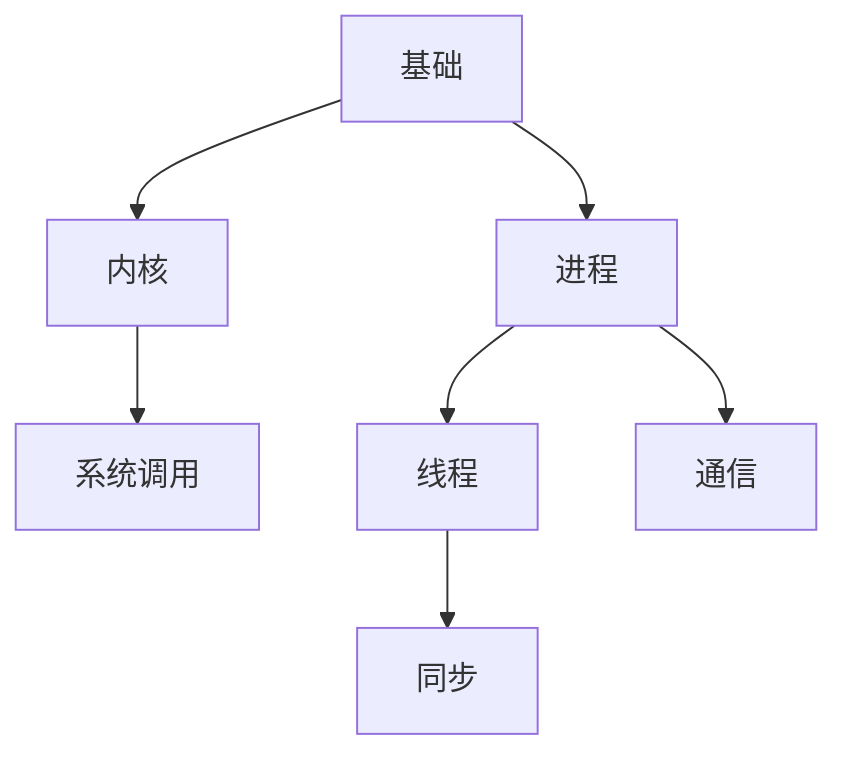

### 基础
------
#### **1. 基本概念：内核、用户空间、系统调用**
**🔑 知识点详解**
- **内核**：
  - **核心定义**：操作系统核心，管理硬件资源并提供服务。
  - **重要特性**：运行在特权模式，直接访问硬件，负责进程管理、内存分配、设备驱动。
  - **关键机制**：通过中断和系统调用与用户态交互。
    - **细节**：如 Linux 内核，提供文件系统、网络栈。
    👉 **注意**：内核态与用户态隔离，防止非法操作。
- **用户空间**：
  - **主要内容**：应用程序运行的环境，受限访问硬件。
  - **核心特点**：非特权模式，依赖系统调用访问内核服务。
  - **实现原理**：用户程序通过标准库（如 glibc）间接调用内核。
    - **细节**：如 `open()` 调用底层 `sys_open`。
    👉 **注意**：用户态崩溃不影响内核。
- **系统调用**：
  - **主要内容**：用户态请求内核服务的接口。
  - **核心特点**：桥接用户空间与内核，典型如 `fork()`、`read()`。
  - **实现原理**：触发软中断（如 x86 的 `int 0x80` 或 `syscall`），切换到内核态。
    - **细节**：参数通过寄存器传递，返回值存约定位置。
    👉 **注意**：频繁调用增加上下文切换开销。

**🔥 面试高频题**
1. 内核态和用户态的区别是什么？
   - **一句话答案**：内核态特权访问硬件，用户态受限通过系统调用。
   - **深入回答**：内核态运行 OS 核心，权限高，直接操作 CPU、内存；用户态运行应用，需 syscall 间接访问。隔离提升安全性。
2. 系统调用是如何实现的？
   - **一句话答案**：通过软中断切换到内核态执行。
   - **深入回答**：如 Linux 中，应用程序调用库函数，触发 `syscall` 指令，内核根据调用号（如 `sys_read`）执行并返回。时间开销约微秒级。
3. 为什么需要用户空间和内核空间的隔离？
   - **一句话答案**：防止用户程序破坏系统稳定性。
   - **深入回答**：用户态无权限直接操作硬件，内核通过权限检查（如 ring0/ring3）隔离，避免崩溃或恶意行为。
4. 系统调用的性能开销来自哪里？
   - **一句话答案**：上下文切换和参数传递。
   - **深入回答**：用户态到内核态需保存寄存器、切换堆栈，参数拷贝也增加延迟，优化如 vDSO 减少开销。

#### **2. 进程与线程：创建、调度、同步与通信**
**🔑 知识点详解**
- **进程**：
  - **核心定义**：运行中的程序实例，拥有独立地址空间。
  - **重要特性**：资源隔离，创建开销大（如 `fork()`）。
  - **关键机制**：
    - **创建**：Linux `fork()` 复制父进程，`exec()` 加载新程序。
    - **调度**：内核调度器（如 CFS）分配 CPU 时间。
    - **细节**：进程控制块（PCB）存储状态。
    👉 **注意**：进程间通信（IPC）较复杂。
- **线程**：
  - **主要内容**：进程内的执行单元，共享地址空间。
  - **核心特点**：轻量，创建快（如 `pthread_create`），上下文切换开销小。
  - **实现原理**：
    - **创建**：Python `threading.Thread()` 或 POSIX 线程。
    - **调度**：同进程，由内核或用户态线程库管理。
    - **细节**：线程有独立栈但共享堆。
    👉 **注意**：多线程需同步避免数据竞争。
- **同步与通信**：
  - **同步**：锁（如互斥锁、信号量）、条件变量，避免竞争。
  - **通信**：管道、消息队列、共享内存、套接字。
  - **使用场景**：线程同步（如生产者-消费者），进程间数据传递（如管道）。

**🔥 面试高频题**
1. 进程和线程的区别是什么？
   - **一句话答案**：进程独立地址空间，线程共享进程资源。
   - **深入回答**：进程是资源分配单位，线程是调度单位；进程创建慢、隔离强，线程轻量但需同步。Python GIL 限制多线程并行。
2. 如何创建进程和线程？
   - **一句话答案**：进程用 `fork()` 或 `multiprocessing`，线程用 `threading`。
   - **深入回答**：Linux `fork()` 复制进程，`multiprocessing.Process()` 跨平台；`threading.Thread(target=func)` 创建线程，时间开销线程 < 进程。
3. 线程同步有哪些方法？
   - **一句话答案**：锁、信号量、条件变量。
   - **深入回答**：互斥锁（Mutex）保护共享资源，信号量控制并发数，条件变量（如 Python `Condition`）协调线程顺序。死锁需避免。
4. 进程间通信（IPC）有哪些方式？
   - **一句话答案**：管道、共享内存、消息队列、套接字。
   - **深入回答**：管道单向（如 `pipe`），共享内存最快但需同步，消息队列结构化传递，套接字跨网络。选择依场景（如速度 vs 复杂度）。
5. 调度算法有哪些？
   - **一句话答案**：FCFS、SJF、RR、CFS。
   - **深入回答**：先来先服务（FCFS）简单但长任务阻塞，短作业优先（SJF）吞吐高但需预知时间，轮转（RR）公平，Linux CFS 用红黑树优化。

**🌟 重点提醒**
- **要点一**：内核提供资源管理，用户态依赖 syscall。
- **要点二**：进程隔离强，线程共享需同步。
- **要点三**：调度和通信影响系统性能。

**🔧 工具辅助**

**💡 复习建议**
1. 理解用户态与内核态切换。
2. 手写进程线程创建和锁代码。
3. 熟悉常见 IPC 和调度算法。

---

