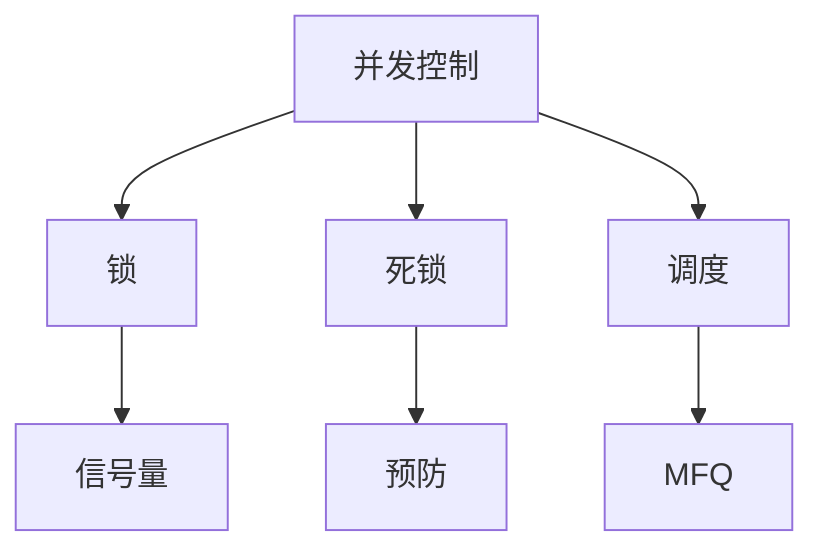

### 并发控制与调度
------
#### **1. 同步机制：锁（synchronized、Lock）、信号量、互斥与条件变量**
**🔑 知识点详解**
- **锁（synchronized、Lock）**：
  - **核心定义**：限制资源访问，保证单线程执行。
  - **重要特性**：互斥性，可重入性（某些锁）。
  - **关键机制**：
    - **synchronized**：Java 内置，自动加解锁。
    - **Lock**：如 Python `threading.Lock()`，手动控制。
    - **细节**：实现基于原子操作（如 CAS）。
    👉 **注意**：锁粒度过大降低并发。
- **信号量（Semaphore）**：
  - **主要内容**：控制并发访问资源的数量。
  - **核心特点**：计数器，支持多线程同时访问。
  - **实现原理**：P（减少计数）/V（增加计数）操作，计数 < 0 时阻塞。
    - **细节**：如 `threading.Semaphore(2)` 允许 2 个线程。
    👉 **注意**：可用于限流。
- **互斥与条件变量**：
  - **主要内容**：互斥锁（Mutex）保证独占，条件变量（Condition）协调线程顺序。
  - **核心特点**：条件变量需与锁配合，支持等待/通知。
  - **实现原理**：如 `threading.Condition`，`wait()` 释放锁并等待，`notify()` 唤醒。
    - **细节**：常用于生产者-消费者模型。
    👉 **注意**：避免虚假唤醒。
- **使用场景**：
  - **锁**：保护共享变量。
  - **信号量**：资源池管理。
  - **条件变量**：线程同步。

**🔥 面试高频题**
1. 锁和信号量的区别是什么？
   - **一句话答案**：锁限制单线程访问，信号量允许多个。
   - **深入回答**：锁（如 Mutex）是二元（0/1），信号量是计数器，锁适合独占，信号量适合限流（如线程池）。
2. 条件变量的作用是什么？
   - **一句话答案**：协调线程执行顺序。
   - **深入回答**：与锁配合，线程等待特定条件（如队列非空），收到通知后继续，解决忙等待问题。
3. 可重入锁是什么？
   - **一句话答案**：同一线程可多次获取同一锁。
   - **深入回答**：如 Python `RLock`，记录持有者及计数，避免自死锁，释放需匹配次数。
4. 如何选择同步机制？
   - **一句话答案**：依并发需求和资源特性。
   - **深入回答**：独占用锁，多资源用信号量，复杂依赖用条件变量，性能敏感用无锁（如 CAS）。

---

#### **2. 死锁：检测、预防与避免策略**
**🔑 知识点详解**
- **死锁定义**：
  - **核心定义**：多个进程/线程因互相等待资源而无法推进。
  - **重要特性**：满足四条件：互斥、持有并等待、不可抢占、循环等待。
  - **关键机制**：资源竞争导致阻塞。
    - **细节**：如线程 A 持锁 1 等锁 2，B 持锁 2 等锁 1。
    👉 **注意**：常见于多锁场景。
- **检测**：
  - **主要内容**：分析资源分配图，找环。
  - **实现原理**：构建有向图，检测循环依赖。
    - **细节**：工具如 `ps` 或调试器。
- **预防**：
  - **主要内容**：破坏死锁条件。
  - **实现原理**：
    - **无持有等待**：一次性申请所有资源。
    - **可抢占**：允许抢夺资源。
    - **有序分配**：按固定顺序获取锁。
    - **细节**：如锁编号排序。
- **避免**：
  - **主要内容**：运行时动态检查避免死锁。
  - **实现原理**：银行家算法，预判资源分配安全性。
    - **细节**：检查分配后是否仍有解。

**🔥 面试高频题**
1. 死锁的四个必要条件是什么？
   - **一句话答案**：互斥、持有并等待、不可抢占、循环等待。
   - **深入回答**：破坏任一条件可预防，如有序锁破坏循环等待。
2. 如何检测死锁？
   - **一句话答案**：检查资源分配图中的环。
   - **深入回答**：构建进程-资源图，DFS 找循环，或用工具监控锁状态，时间 O(V+E)。
3. 如何预防死锁？
   - **一句话答案**：破坏死锁条件之一。
   - **深入回答**：如按序加锁（lock1 < lock2），避免持有等待，或超时放弃重试。
4. 银行家算法的原理是什么？
   - **一句话答案**：预判资源分配是否安全。
   - **深入回答**：检查当前分配后剩余资源能否满足任一进程完成，若可则继续分配，避免进入死锁状态。

---

#### **3. 调度算法：先来先服务、短作业优先、多级反馈队列**
**🔑 知识点详解**
- **先来先服务（FCFS）**：
  - **核心定义**：按任务到达顺序执行。
  - **重要特性**：简单公平，平均等待时间长。
  - **关键机制**：队列实现，先到先运行。
    - **细节**：如 [5, 10, 2]，等待时间 0+5+15=20。
    👉 **注意**：长作业阻塞短作业（护送效应）。
- **短作业优先（SJF）**：
  - **主要内容**：优先执行运行时间最短的任务。
  - **核心特点**：最优平均等待时间，非抢占/抢占。
  - **实现原理**：按执行时间排序，抢占式需中断。
    - **细节**：如 [5, 10, 2]，执行 2-5-10，等待 0+2+7=9。
    👉 **注意**：需预知运行时间。
- **多级反馈队列（MFQ）**：
  - **主要内容**：多队列分优先级，动态调整。
  - **核心特点**：兼顾公平性和响应时间。
  - **实现原理**：高优先级短时间片，低优先级长时间片，未完成降级。
    - **细节**：如 3 级队列，时间片 4、8、16。
    👉 **注意**：避免饥饿需提升老任务。
- **使用场景**：
  - **FCFS**：批处理。
  - **SJF**：吞吐优先。
  - **MFQ**：交互系统（如 Linux CFS 变种）。

**🔥 面试高频题**
1. FCFS 和 SJF 的区别是什么？
   - **一句话答案**：FCFS 按到达顺序，SJF 按短作业优先。
   - **深入回答**：FCFS 简单但长任务拖延，SJF 等待时间最短但需预知时长，非抢占可能延迟。
2. SJF 的优缺点是什么？
   - **一句话答案**：吞吐高但公平性差。
   - **深入回答**：平均等待最优，但长作业可能饥饿，实际需预测执行时间。
3. 多级反馈队列如何工作？
   - **一句话答案**：分级队列，动态调整优先级。
   - **深入回答**：短任务高优先级快速完成，长任务降级执行，避免饥饿且响应快，Linux 借鉴此思想。
4. 如何避免调度中的饥饿？
   - **一句话答案**：提升等待任务优先级。
   - **深入回答**：如 MFQ 中老任务升回高优先级，或轮转（RR）保证每任务有机会。

**🌟 重点提醒**
- **要点一**：同步机制保障并发安全。
- **要点二**：死锁需预防和检测。
- **要点三**：调度算法平衡效率与公平。

**🔧 工具辅助**

**💡 复习建议**
1. 手写锁和条件变量代码。
2. 理解死锁条件和银行家算法。
3. 练习调度算法的计算。

