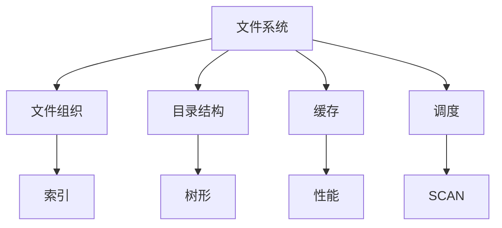

### 文件系统
------
#### **1. 文件存储结构：文件组织、目录结构**
**🔑 知识点详解**
- **文件组织**：
  - **核心定义**：文件在磁盘上的存储方式，管理数据块分配。
  - **重要特性**：支持顺序访问、随机访问、索引。
  - **关键机制**：
    - **连续分配**：文件占连续块，类似数组。
    - **链表分配**：文件块用指针链接，支持动态扩展。
    - **索引分配**：用索引表（如 inode）记录块位置。
    - **细节**：如 FAT 用链表，ext4 用索引。
    👉 **注意**：碎片化和访问效率需权衡。
- **目录结构**：
  - **主要内容**：组织文件的逻辑结构，提供路径映射。
  - **核心特点**：层次化（如树形），支持快速查找。
  - **实现原理**：
    - **线性表**：简单列表存储文件名和元数据。
    - **树形结构**：多级目录，如 `/usr/bin`。
    - **细节**：目录本质是文件，存文件条目（如文件名到 inode 的映射）。
    👉 **注意**：符号链接和硬链接影响路径解析。
- **使用场景**：
  - **文件组织**：大文件用索引，小文件用连续。
  - **目录**：文件系统导航（如 Linux `/etc`）。

**🔥 面试高频题**
1. 文件组织的优缺点是什么？
   - **一句话答案**：连续快但碎片多，链表灵活但慢，索引平衡但复杂。
   - **深入回答**：连续分配顺序读写 O(1) 但扩展难，链表分配无碎片但随机访问 O(n)，索引（如 inode）O(1) 访问但需额外空间。
2. 目录结构如何实现文件查找？
   - **一句话答案**：通过树形路径解析和索引映射。
   - **深入回答**：如 `/a/b/c`，逐级查目录表，找到文件名对应的 inode，时间依赖路径深度和存储效率。
3. 硬链接和软链接的区别是什么？
   - **一句话答案**：硬链接直接指 inode，软链接是路径引用。
   - **深入回答**：硬链接共享数据块，删除源文件仍有效；软链接是独立文件，源删除变悬空（如 Linux `ln` vs `ln -s`）。
4. inode 的作用是什么？
   - **一句话答案**：存储文件元数据和数据块指针。
   - **深入回答**：包含权限、大小、时间戳及块地址，文件名由目录维护，允许多硬链接共享同一 inode。

#### **2. I/O调度：缓存机制、磁盘调度算法**
**🔑 知识点详解**
- **缓存机制**：
  - **核心定义**：利用内存缓冲减少直接磁盘访问。
  - **重要特性**：提升读写性能，减少延迟。
  - **关键机制**：
    - **页面缓存**：缓存文件数据（如 Linux page cache）。
    - **缓冲区**：暂存写操作，批量写入磁盘。
    - **细节**：写回（write-back）延迟同步，写穿（write-through）立即同步。
    👉 **注意**：缓存一致性和内存占用需平衡。
- **磁盘调度算法**：
  - **主要内容**：优化磁盘磁头移动，减少寻道时间。
  - **核心特点**：提高吞吐量，降低响应时间。
  - **实现原理**：
    - **FCFS（先来先服务）**：按请求顺序处理。
    - **SSTF（最短寻道时间优先）**：选最近磁道。
    - **SCAN（电梯算法）**：磁头单向移动后反向。
    - **C-SCAN**：循环单向移动，减少跳跃。
    - **细节**：如 SCAN 从 50 到 100 再回 0。
    👉 **注意**：SSD 影响传统调度效果。
- **使用场景**：
  - **缓存**：频繁读写（如数据库）。
  - **调度**：机械磁盘优化（如服务器）。

**🔥 面试高频题**
1. 文件系统缓存的作用是什么？
   - **一句话答案**：减少磁盘 I/O，提升性能。
   - **深入回答**：读缓存预加载数据（如 page cache），写缓冲批量操作（如 `fsync` 强制同步），降低物理访问频率。
2. 写回和写穿缓存的区别是什么？
   - **一句话答案**：写回延迟写盘，写穿立即同步。
   - **深入回答**：写回快但掉电易丢数据（需日志恢复），写穿慢但可靠，数据库常结合两者（如 WAL）。
3. 磁盘调度算法如何选择？
   - **一句话答案**：依负载和设备类型。
   - **深入回答**：FCFS 简单但寻道多，SSTF 局部最优但可能饥饿，SCAN 均衡适合高负载，SSD 因无机械移动多用 NOOP。
4. SCAN 和 C-SCAN 的区别是什么？
   - **一句话答案**：SCAN 双向，C-SCAN 单向循环。
   - **深入回答**：SCAN 磁头来回扫（如 0→100→0），C-SCAN 单向后重置（如 0→100→0），后者更公平但总寻道稍长。
5. 缓存如何影响文件系统一致性？
   - **一句话答案**：延迟写可能导致数据不同步。
   - **深入回答**：写回缓存需同步机制（如 `sync`），否则崩溃丢失更新，日志文件系统（如 ext4）记录操作确保恢复。

**🌟 重点提醒**
- **要点一**：文件组织影响访问效率，目录支持导航。
- **要点二**：缓存提速，调度优化磁盘。
- **要点三**：一致性和性能需权衡。

**🔧 工具辅助**

**💡 复习建议**
1. 理解文件组织和 inode 的关系。
2. 熟悉缓存和调度算法的原理。
3. 练习文件操作与性能优化场景。

---

