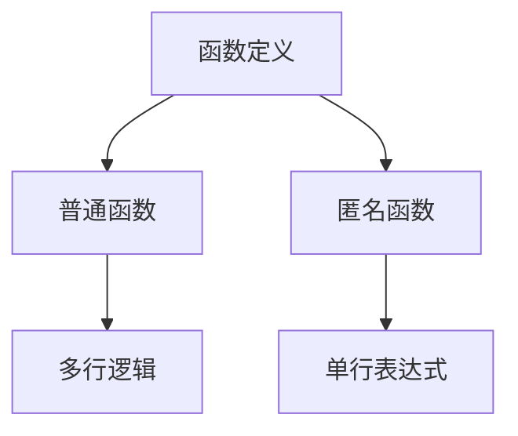
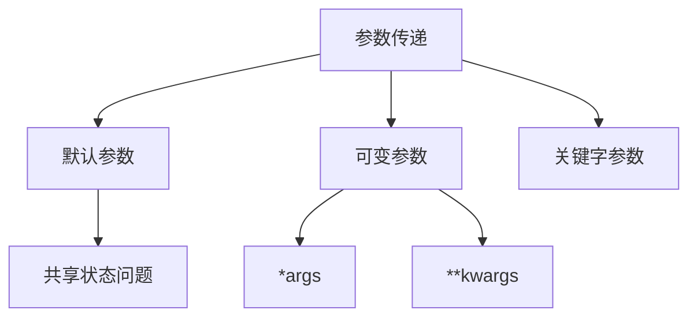
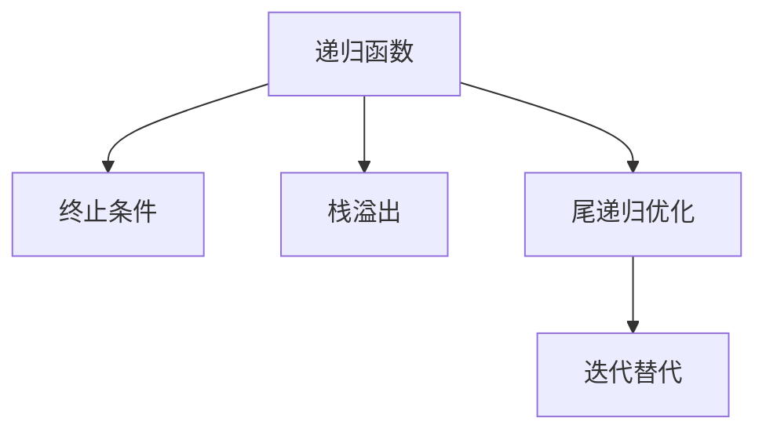
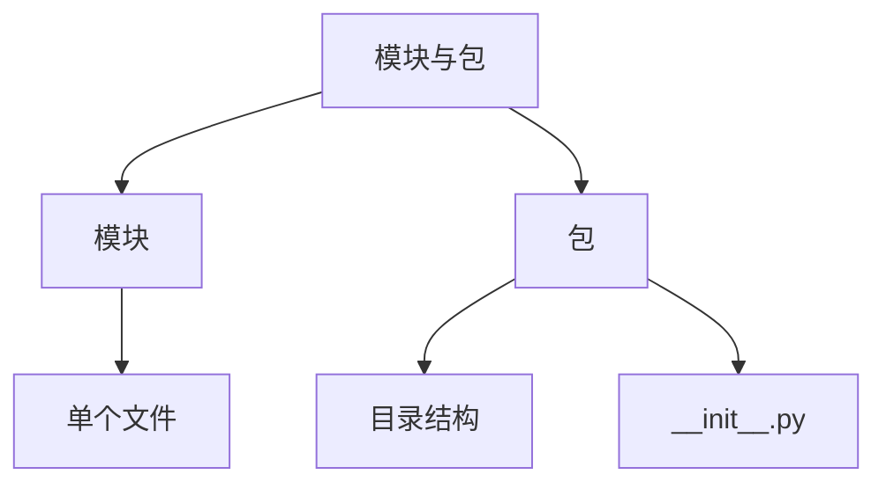
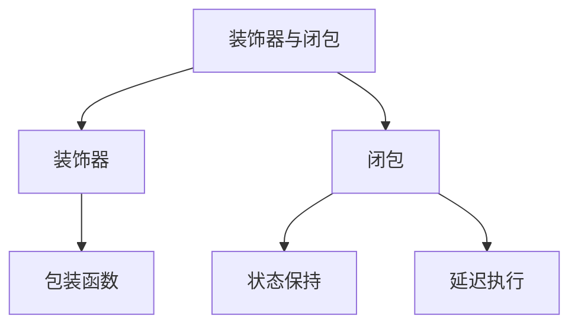

### Python函数与模块
------
#### **1. 函数定义**
**🔑 知识点详解**
- **普通函数**：
  - 定义：通过 `def` 关键字定义的命名函数。
  - 核心思想：封装可复用的代码块，提升代码的可读性和可维护性。
    👉 **注意**：普通函数可以包含多个参数和返回值。
- **匿名函数（lambda）**：
  - 定义：通过 `lambda` 关键字定义的无名函数。
  - 核心思想：用于简单的单行表达式，避免冗长的函数定义。
    👉 **注意**：匿名函数通常用于高阶函数（如 `map`、`filter`）中。

**🔥 面试高频题**
1. 普通函数和匿名函数的区别是什么？
   - **一句话答案**：普通函数通过 `def` 定义，支持多行逻辑；匿名函数通过 `lambda` 定义，仅支持单行表达式。
   - **深入回答**：普通函数通过 `def` 关键字定义，支持复杂的逻辑结构（如循环、条件分支），并且可以通过名称多次调用。匿名函数通过 `lambda` 关键字定义，语法简洁，但仅限于单行表达式，适合用于简单操作。例如：
     ```python
     # 普通函数
     def square(x):
         return x ** 2
     
     # 匿名函数
     square_lambda = lambda x: x ** 2
     print(square(5))  # 输出: 25
     print(square_lambda(5))  # 输出: 25
     ```

2. 如何使用匿名函数简化代码？
   - **一句话答案**：匿名函数可以嵌入到高阶函数中，避免显式定义函数。
   - **深入回答**：匿名函数常用于需要传递简单操作的场景，如 `map`、`filter` 和 `sorted`。例如：
     ```python
     # 使用 map 计算平方
     numbers = [1, 2, 3, 4]
     squared = list(map(lambda x: x ** 2, numbers))
     print(squared)  # 输出: [1, 4, 9, 16]
     
     # 使用 filter 过滤偶数
     evens = list(filter(lambda x: x % 2 == 0, numbers))
     print(evens)  # 输出: [2, 4]
     ```

**🌟 重点提醒**
- **要点一**：普通函数适合复杂逻辑，匿名函数适合简单操作。
- **要点二**：匿名函数常用于高阶函数中，简化代码。

**📝 实践经验**
```python
# 普通函数示例
def factorial(n):
    if n == 0:
        return 1
    return n * factorial(n - 1)

print(factorial(5))  # 输出: 120

# 匿名函数示例
factorial_lambda = lambda n: 1 if n == 0 else n * factorial_lambda(n - 1)
print(factorial_lambda(5))  # 输出: 120
```

**🔧 工具辅助**


------
#### **2. 参数传递**
**🔑 知识点详解**
- **默认参数**：
  - 定义：为函数参数指定默认值，调用时可省略该参数。
  - 核心思想：提高函数的灵活性。
    👉 **注意**：默认参数应为不可变对象（如 `None`），以避免共享状态问题。
- **可变参数**：
  - 定义：通过 `*args` 接收任意数量的位置参数，通过 `**kwargs` 接收任意数量的关键字参数。
  - 核心思想：使函数能够处理动态数量的输入。
    👉 **注意**：`*args` 是元组，`**kwargs` 是字典。
- **关键字参数**：
  - 定义：通过键值对形式传递参数，明确参数含义。
  - 核心思想：提高代码的可读性。
    👉 **注意**：关键字参数必须在位置参数之后。

**🔥 面试高频题**
1. 默认参数的陷阱是什么？如何避免？
   - **一句话答案**：默认参数是可变对象时可能导致共享状态问题，应使用不可变对象或工厂函数。
   - **深入回答**：Python 中默认参数在函数定义时被初始化一次，因此如果默认参数是可变对象（如列表或字典），多次调用函数可能会导致共享状态问题。例如：
     ```python
     def append_to_list(value, my_list=[]):
         my_list.append(value)
         return my_list
     
     print(append_to_list(1))  # 输出: [1]
     print(append_to_list(2))  # 输出: [1, 2]
     ```
     解决方法是将默认参数设置为 `None`，并在函数内部初始化：
     ```python
     def append_to_list(value, my_list=None):
         if my_list is None:
             my_list = []
         my_list.append(value)
         return my_list
     
     print(append_to_list(1))  # 输出: [1]
     print(append_to_list(2))  # 输出: [2]
     ```

2. 可变参数和关键字参数的区别是什么？
   - **一句话答案**：可变参数通过 `*args` 接收位置参数，关键字参数通过 `**kwargs` 接收键值对。
   - **深入回答**：`*args` 将所有未命名的位置参数打包为一个元组，而 `**kwargs` 将所有命名的关键字参数打包为一个字典。两者可以同时使用，但 `*args` 必须出现在 `**kwargs` 之前。例如：
     ```python
     def example(*args, **kwargs):
         print("Positional arguments:", args)
         print("Keyword arguments:", kwargs)
     
     example(1, 2, name="Alice", age=30)
     # 输出:
     # Positional arguments: (1, 2)
     # Keyword arguments: {'name': 'Alice', 'age': 30}
     ```

**🌟 重点提醒**
- **要点一**：默认参数应为不可变对象。
- **要点二**：`*args` 和 `**kwargs` 分别处理位置参数和关键字参数。
- **要点三**：关键字参数必须在位置参数之后。

**📝 实践经验**
```python
# 默认参数示例
def greet(name, greeting="Hello"):
    return f"{greeting}, {name}!"

print(greet("Alice"))  # 输出: Hello, Alice!
print(greet("Bob", "Hi"))  # 输出: Hi, Bob!

# 可变参数示例
def sum_numbers(*args):
    return sum(args)

print(sum_numbers(1, 2, 3))  # 输出: 6

# 关键字参数示例
def describe_person(**kwargs):
    return f"Name: {kwargs.get('name')}, Age: {kwargs.get('age')}"

print(describe_person(name="Alice", age=30))  # 输出: Name: Alice, Age: 30
```

**🔧 工具辅助**


------
#### **3. 递归函数与尾递归优化**
**🔑 知识点详解**
- **递归函数**：
  - 定义：函数在其定义中调用自身。
  - 核心思想：通过分解问题为更小的子问题，逐步求解。
    👉 **注意**：递归函数需设置终止条件，否则可能导致栈溢出。
- **尾递归优化**：
  - 定义：一种优化技术，通过将递归调用作为函数的最后一操作，减少栈空间占用。
  - 核心思想：避免重复计算，提升性能。
    👉 **注意**：Python 默认不支持尾递归优化。

**🔥 面试高频题**
1. 递归函数的核心思想是什么？如何避免栈溢出？
   - **一句话答案**：递归函数通过分解问题为子问题求解，需设置终止条件并控制递归深度。
   - **深入回答**：递归函数的核心思想是将复杂问题分解为更小的子问题，并通过递归调用逐步求解。为了避免栈溢出，需确保递归有明确的终止条件，并尽量控制递归深度。此外，对于深度较大的递归，可以考虑使用迭代或其他非递归方法替代。例如：
     ```python
     def factorial(n):
         if n == 0:
             return 1
         return n * factorial(n - 1)
     
     print(factorial(5))  # 输出: 120
     ```

2. 为什么 Python 不支持尾递归优化？如何手动实现？
   - **一句话答案**：Python 的解释器未实现尾递归优化，可通过手动改写为迭代实现类似效果。
   - **深入回答**：尾递归优化是一种编译器优化技术，通过将递归调用替换为循环，减少栈空间占用。然而，Python 的解释器并未实现这一优化，因此即使递归调用是函数的最后一操作，仍会占用栈空间。可以通过手动改写为迭代实现类似效果。例如：
     ```python
     # 递归实现
     def factorial_recursive(n):
         if n == 0:
             return 1
         return n * factorial_recursive(n - 1)
     
     # 迭代实现
     def factorial_iterative(n):
         result = 1
         for i in range(1, n + 1):
             result *= i
         return result
     
     print(factorial_iterative(5))  # 输出: 120
     ```

**🌟 重点提醒**
- **要点一**：递归函数需设置终止条件。
- **要点二**：Python 默认不支持尾递归优化。
- **要点三**：深度较大的递归可通过迭代替代。

**📝 实践经验**
```python
# 递归函数示例
def fibonacci(n):
    if n <= 1:
        return n
    return fibonacci(n - 1) + fibonacci(n - 2)

print(fibonacci(10))  # 输出: 55

# 尾递归优化示例（手动改写）
def factorial_tail_recursive(n, acc=1):
    if n == 0:
        return acc
    return factorial_tail_recursive(n - 1, acc * n)

print(factorial_tail_recursive(5))  # 输出: 120
```

**🔧 工具辅助**


------
#### **4. 模块与包**
**🔑 知识点详解**
- **模块导入**：
  - 定义：通过 `import` 或 `from ... import` 导入其他模块的功能。
  - 核心思想：组织代码，提升复用性。
    👉 **注意**：模块名应避免与标准库冲突。
- **包结构**：
  - 定义：通过目录和 `__init__.py` 文件组织模块。
  - 核心思想：实现模块的层次化管理。
    👉 **注意**：`__init__.py` 文件可以为空，用于标识目录为包。

**🔥 面试高频题**
1. 模块和包的区别是什么？
   - **一句话答案**：模块是单个文件，包是包含多个模块的目录。
   - **深入回答**：模块是一个包含 Python 代码的文件（如 `.py` 文件），可以通过 `import` 导入其功能。包是一个包含多个模块的目录，通常包含一个 `__init__.py` 文件，用于标识其为包。包可以嵌套，形成层次化的模块结构。例如：
     ```plaintext
     my_package/
         __init__.py
         module1.py
         module2.py
     ```

2. 常用标准库有哪些？它们的作用是什么？
   - **一句话答案**：常用标准库包括 `math`（数学运算）、`random`（随机数生成）、`datetime`（日期时间处理）、`os`（操作系统交互）、`sys`（系统参数访问）。
   - **深入回答**：
     - `math`：提供数学函数（如 `sqrt`、`sin`）。
     - `random`：生成随机数（如 `randint`、`choice`）。
     - `datetime`：处理日期和时间（如 `datetime.now()`）。
     - `os`：与操作系统交互（如 `os.getcwd()` 获取当前工作目录）。
     - `sys`：访问系统参数（如 `sys.argv` 获取命令行参数）。

**🌟 重点提醒**
- **要点一**：模块是单个文件，包是包含多个模块的目录。
- **要点二**：常用标准库提供了丰富的功能，需熟悉其用途。

**📝 实践经验**
```python
# 模块导入示例
import math
print(math.sqrt(16))  # 输出: 4.0

# 包导入示例
from my_package.module1 import greet
print(greet("Alice"))  # 输出: Hello, Alice!
```

**🔧 工具辅助**


------
#### **5. 装饰器与闭包**
**🔑 知识点详解**
- **装饰器原理与应用**：
  - 定义：装饰器是一种用于修改函数或方法行为的高阶函数。
  - 核心思想：通过包装函数，添加额外功能（如日志记录、权限校验）。
    👉 **注意**：装饰器可以带参数，需嵌套定义。
- **闭包的概念和使用场景**：
  - 定义：闭包是指函数捕获外部作用域变量的能力。
  - 核心思想：通过闭包实现状态保持或延迟执行。
    👉 **注意**：闭包常用于装饰器和回调函数。

**🔥 面试高频题**
1. 装饰器的作用是什么？如何实现一个简单的装饰器？
   - **一句话答案**：装饰器用于修改函数行为，通过包装函数实现。
   - **深入回答**：装饰器的核心作用是通过包装函数，添加额外功能，而无需修改原函数代码。实现装饰器的基本步骤包括：
     1. 定义装饰器函数。
     2. 在装饰器中定义包装函数。
     3. 返回包装函数。
     ```python
     def log_decorator(func):
         def wrapper(*args, **kwargs):
             print(f"Calling function: {func.__name__}")
             return func(*args, **kwargs)
         return wrapper
     
     @log_decorator
     def greet(name):
         return f"Hello, {name}!"
     
     print(greet("Alice"))  # 输出: Calling function: greet \n Hello, Alice!
     ```

2. 闭包的典型应用场景是什么？
   - **一句话答案**：闭包用于状态保持、延迟执行或实现装饰器。
   - **深入回答**：闭包的典型应用场景包括：
     - 状态保持：通过闭包捕获外部变量，实现函数间的状态共享。
     - 延迟执行：通过闭包返回函数，实现延迟调用。
     - 装饰器：通过闭包包装函数，添加额外功能。例如：
       ```python
       def counter():
           count = 0
           def increment():
               nonlocal count
               count += 1
               return count
           return increment
       
       c = counter()
       print(c())  # 输出: 1
       print(c())  # 输出: 2
       ```

**🌟 重点提醒**
- **要点一**：装饰器通过包装函数修改行为。
- **要点二**：闭包捕获外部变量，实现状态保持或延迟执行。

**📝 实践经验**
```python
# 装饰器示例
def timing_decorator(func):
    import time
    def wrapper(*args, **kwargs):
        start_time = time.time()
        result = func(*args, **kwargs)
        end_time = time.time()
        print(f"Execution time: {end_time - start_time:.4f} seconds")
        return result
    return wrapper

@timing_decorator
def slow_function():
    import time
    time.sleep(2)

slow_function()  # 输出: Execution time: 2.0002 seconds

# 闭包示例
def multiplier(factor):
    def multiply(x):
        return x * factor
    return multiply

double = multiplier(2)
print(double(5))  # 输出: 10
```

**🔧 工具辅助**


**💡 复习建议**
1. 掌握普通函数和匿名函数的定义及使用场景。
2. 理解参数传递的不同方式及其注意事项。
3. 学习递归函数和尾递归优化的原理及实现方法。
4. 熟悉模块与包的组织方式及常用标准库的功能。
5. 理解装饰器和闭包的工作机制及其典型应用场景。