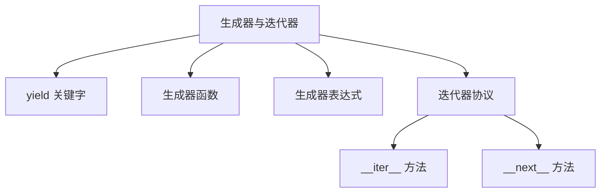
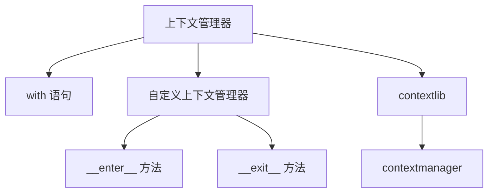
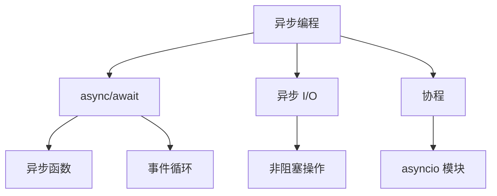

### Python高级特性
------
#### **1. 生成器与迭代器**
**🔑 知识点详解**
- **yield 关键字、生成器函数与表达式**：
  - **定义**：`yield` 是用于定义生成器的关键字，生成器是一种惰性计算的迭代器。
  - **核心思想**：通过 `yield` 暂停函数执行并返回值，节省内存。
    👉 **注意**：生成器函数使用 `def` 定义，而生成器表达式类似于列表推导式。
- **迭代器协议与内置迭代器函数**：
  - **定义**：迭代器协议要求对象实现 `__iter__()` 和 `__next__()` 方法。
  - **核心思想**：通过迭代器逐个访问集合中的元素，避免一次性加载所有数据。
    👉 **注意**：内置函数如 `iter()` 和 `next()` 可用于操作迭代器。

**🔥 面试高频题**
1. 生成器和普通函数的区别是什么？如何使用生成器？
   - **一句话答案**：生成器通过 `yield` 暂停执行并返回值，普通函数一次性执行完毕。
   - **深入回答**：普通函数在调用时会一次性执行所有代码并返回结果，而生成器函数通过 `yield` 暂停执行并返回值，每次调用 `next()` 时从上次暂停的位置继续执行。生成器特别适合处理大数据集或流式数据，因为它不会一次性加载所有数据到内存中。例如：
     ```python
     def generate_numbers(n):
         for i in range(n):
             yield i
     
     gen = generate_numbers(5)
     print(next(gen))  # 输出: 0
     print(next(gen))  # 输出: 1
     ```

2. 如何实现自定义迭代器？迭代器协议的核心是什么？
   - **一句话答案**：通过实现 `__iter__()` 和 `__next__()` 方法创建自定义迭代器。
   - **深入回答**：迭代器协议要求对象实现两个方法：
     - `__iter__()`：返回迭代器对象本身。
     - `__next__()`：返回下一个元素，若无更多元素则抛出 `StopIteration` 异常。
     自定义迭代器可以用于控制集合的遍历逻辑。例如：
     ```python
     class MyIterator:
         def __init__(self, data):
             self.data = data
             self.index = 0
     
         def __iter__(self):
             return self
     
         def __next__(self):
             if self.index >= len(self.data):
                 raise StopIteration
             value = self.data[self.index]
             self.index += 1
             return value
     
     iterator = MyIterator([1, 2, 3])
     for num in iterator:
         print(num)  # 输出: 1, 2, 3
     ```

**🌟 重点提醒**
- **要点一**：生成器通过 `yield` 实现惰性计算，节省内存。
- **要点二**：迭代器协议要求实现 `__iter__()` 和 `__next__()` 方法。
- **要点三**：生成器表达式是生成器的简洁形式，类似于列表推导式。

**📝 实践经验**
```python
# 生成器函数示例
def fibonacci(limit):
    a, b = 0, 1
    while a < limit:
        yield a
        a, b = b, a + b

for num in fibonacci(10):
    print(num)  # 输出: 0, 1, 1, 2, 3, 5, 8

# 生成器表达式示例
squares = (x ** 2 for x in range(5))
print(next(squares))  # 输出: 0
print(next(squares))  # 输出: 1
```

**🔧 工具辅助**


------
#### **2. 上下文管理器**
**🔑 知识点详解**
- **with语句的原理与实现**：
  - **定义**：`with` 语句通过上下文管理器自动管理资源（如文件、锁）的获取和释放。
  - **核心思想**：通过 `__enter__()` 和 `__exit__()` 方法实现资源的初始化和清理。
    👉 **注意**：`with` 语句确保即使发生异常也能正确释放资源。
- **自定义上下文管理器**：
  - **定义**：通过实现 `__enter__()` 和 `__exit__()` 方法创建自定义上下文管理器。
  - **核心思想**：封装资源管理逻辑，提升代码的可读性和安全性。
    👉 **注意**：也可以使用 `contextlib` 模块简化上下文管理器的实现。

**🔥 面试高频题**
1. `with` 语句的作用是什么？如何实现自定义上下文管理器？
   - **一句话答案**：`with` 语句通过上下文管理器自动管理资源，自定义上下文管理器需实现 `__enter__()` 和 `__exit__()` 方法。
   - **深入回答**：`with` 语句的核心作用是通过上下文管理器自动管理资源的获取和释放，确保即使发生异常也能正确清理资源。实现自定义上下文管理器的基本步骤包括：
     1. 定义类并实现 `__enter__()` 方法，用于初始化资源。
     2. 实现 `__exit__()` 方法，用于释放资源。
     3. 在 `with` 语句中使用该上下文管理器。
     ```python
     class FileHandler:
         def __init__(self, filename, mode):
             self.filename = filename
             self.mode = mode
     
         def __enter__(self):
             self.file = open(self.filename, self.mode)
             return self.file
     
         def __exit__(self, exc_type, exc_val, exc_tb):
             self.file.close()
     
     with FileHandler("example.txt", "w") as f:
         f.write("Hello, World!")
     ```

2. 如何使用 `contextlib` 简化上下文管理器？
   - **一句话答案**：通过 `@contextmanager` 装饰器将函数转换为上下文管理器。
   - **深入回答**：`contextlib` 模块提供了一个装饰器 `@contextmanager`，可以将普通函数转换为上下文管理器。这种方式比手动实现 `__enter__()` 和 `__exit__()` 更加简洁。例如：
     ```python
     from contextlib import contextmanager
     
     @contextmanager
     def file_handler(filename, mode):
         file = open(filename, mode)
         try:
             yield file
         finally:
             file.close()
     
     with file_handler("example.txt", "w") as f:
         f.write("Hello, World!")
     ```

**🌟 重点提醒**
- **要点一**：`with` 语句通过上下文管理器自动管理资源。
- **要点二**：自定义上下文管理器需实现 `__enter__()` 和 `__exit__()` 方法。
- **要点三**：`contextlib` 提供了简化的上下文管理器实现方式。

**📝 实践经验**
```python
# 自定义上下文管理器示例
class Timer:
    def __enter__(self):
        self.start_time = time.time()
        return self

    def __exit__(self, exc_type, exc_val, exc_tb):
        self.end_time = time.time()
        print(f"Elapsed time: {self.end_time - self.start_time:.4f} seconds")

with Timer():
    time.sleep(1)

# 使用 contextlib 示例
from contextlib import contextmanager

@contextmanager
def timer():
    start_time = time.time()
    try:
        yield
    finally:
        end_time = time.time()
        print(f"Elapsed time: {end_time - start_time:.4f} seconds")

with timer():
    time.sleep(1)
```

**🔧 工具辅助**


------
#### **3. 异步编程**
**🔑 知识点详解**
- **async/await 基础**：
  - **定义**：`async` 用于定义异步函数，`await` 用于等待异步操作完成。
  - **核心思想**：通过协程实现非阻塞 I/O 操作，提升程序性能。
    👉 **注意**：异步函数必须通过事件循环运行。
- **异步 I/O 与协程**：
  - **定义**：异步 I/O 是一种非阻塞的输入输出操作，协程是异步编程的基本单元。
  - **核心思想**：通过 `asyncio` 模块管理协程和事件循环。
    👉 **注意**：异步编程适合高并发场景（如网络请求、文件读写）。

**🔥 面试高频题**
1. `async/await` 的作用是什么？如何运行异步函数？
   - **一句话答案**：`async/await` 用于定义和调用异步函数，通过事件循环运行。
   - **深入回答**：`async` 关键字用于定义异步函数，`await` 用于等待异步操作完成。异步函数不会立即执行，而是返回一个协程对象，需要通过事件循环（如 `asyncio.run()`）运行。例如：
     ```python
     import asyncio
     
     async def say_hello():
         print("Hello")
         await asyncio.sleep(1)
         print("World")
     
     asyncio.run(say_hello())
     ```
     在上述代码中，`say_hello` 是一个异步函数，`await asyncio.sleep(1)` 模拟非阻塞操作，`asyncio.run()` 启动事件循环。

2. 异步 I/O 的优势是什么？如何实现高并发？
   - **一句话答案**：异步 I/O 通过非阻塞操作提升性能，适合高并发场景。
   - **深入回答**：异步 I/O 的核心优势在于其能够同时处理多个任务，而无需为每个任务分配独立线程。通过 `asyncio` 模块，可以轻松实现高并发操作。例如，以下代码同时发起多个网络请求：
     ```python
     import asyncio
     import aiohttp
     
     async def fetch_url(session, url):
         async with session.get(url) as response:
             return await response.text()
     
     async def main():
         urls = ["https://example.com", "https://httpbin.org/get"]
         async with aiohttp.ClientSession() as session:
             tasks = [fetch_url(session, url) for url in urls]
             results = await asyncio.gather(*tasks)
             for result in results:
                 print(len(result))
     
     asyncio.run(main())
     ```

**🌟 重点提醒**
- **要点一**：`async/await` 用于定义和调用异步函数。
- **要点二**：异步 I/O 通过非阻塞操作提升性能。
- **要点三**：`asyncio` 模块是实现异步编程的核心工具。

**📝 实践经验**
```python
# 异步函数示例
import asyncio

async def count():
    print("One")
    await asyncio.sleep(1)
    print("Two")

async def main():
    await asyncio.gather(count(), count(), count())

asyncio.run(main())

# 异步 I/O 示例
import asyncio
import aiohttp

async def fetch_url(session, url):
    async with session.get(url) as response:
        return await response.text()

async def main():
    urls = ["https://example.com", "https://httpbin.org/get"]
    async with aiohttp.ClientSession() as session:
        tasks = [fetch_url(session, url) for url in urls]
        results = await asyncio.gather(*tasks)
        for result in results:
            print(len(result))

asyncio.run(main())
```

**🔧 工具辅助**


**💡 复习建议**
1. 掌握生成器与迭代器的基本概念及其应用场景。
2. 学习上下文管理器的实现方式，熟悉 `with` 语句的原理。
3. 理解异步编程的核心概念，掌握 `async/await` 和 `asyncio` 的使用方法。