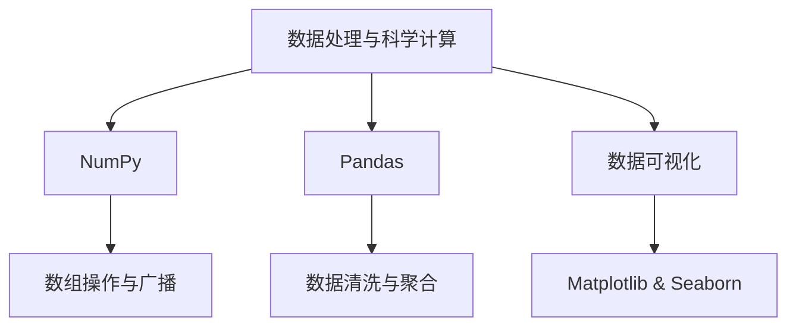

### 数据处理与科学计算

------

#### **1. NumPy**

**🔑 知识点详解**

- **数组操作、索引与切片**：
  - **核心定义**：NumPy 提供高效的多维数组（ndarray）对象，支持大量数学运算、索引、切片和广播等操作。
  - **重要特性**：内存连续、向量化操作、高性能数值计算；支持高级索引、切片和条件筛选。
  - 关键机制：
    1. 数组创建与转换：使用 `np.array()`、`np.zeros()`、`np.arange()` 等方法创建数组；
    2. 索引与切片：支持基于位置、布尔数组和花式索引；
    3. 广播机制：自动对形状不同的数组进行维度扩展，使得算术运算可以在不复制数据的情况下进行。 👉 **注意**：切片返回的是原数组的视图，而不是拷贝，修改切片可能会影响原数组。
- **矩阵运算与广播机制**：
  - 相关概念：
    - **矩阵运算**：支持线性代数运算，如矩阵乘法、转置、求逆等；通过 `np.dot()` 或 `@` 操作符实现。
    - **广播机制**：使不同形状的数组在进行算术运算时自动扩展维度，以便逐元素计算。 👉 **辨析**：广播机制与传统矩阵运算不同，需确保数组形状兼容，否则可能出现意外结果。

**🔥 面试高频题**

1. NumPy 中切片返回的是视图还是副本？
   - **一句话答案**：默认情况下，NumPy 切片返回的是原数组的视图。
   - **深入回答**：切片操作不会复制数据，而是返回对原数组数据的引用，因此对切片进行修改会直接影响原数组。若需要副本可使用 `np.copy()`。
2. 如何解释 NumPy 的广播机制？
   - **一句话答案**：广播机制允许形状不同的数组在算术运算中自动扩展维度以实现逐元素操作。
   - **深入回答**：当两个数组进行运算时，NumPy 会比较其形状，如果其中一个数组的维度为 1，则自动扩展成对应维度的大小；这种机制提高了运算效率，但要求数组的尾部维度必须兼容。
3. 如何实现矩阵乘法？
   - **一句话答案**：矩阵乘法可以通过 `np.dot()` 或 `@` 操作符实现。
   - **深入回答**：`np.dot(A, B)` 对两个数组进行矩阵乘法运算，要求 A 的列数等于 B 的行数；Python 3 中 `A @ B` 是更简洁的写法，用于实现相同操作。

------

#### **2. Pandas**

**🔑 知识点详解**

- **DataFrame、Series 基础**：
  - **核心定义**：Pandas 提供了两种主要数据结构——Series（一维数据）和 DataFrame（二维数据），用于高效存储和操作结构化数据。
  - **重要特性**：支持标签索引、自动对齐、缺失值处理和高效的分组聚合操作。
  - 关键机制：
    1. 数据加载与转换：通过 `pd.read_csv()`、`pd.DataFrame()` 等方法加载和创建数据；
    2. 数据索引与选择：利用标签或位置进行数据提取；
    3. 数据操作：包括过滤、排序、分组、聚合和合并操作。 👉 **注意**：Series 与 DataFrame 索引对齐机制有助于数据操作，但需注意缺失值处理可能引发计算误差。
- **数据清洗、缺失值处理与数据聚合**：
  - 相关概念：
    - **数据清洗**：包括去除重复、处理异常值和转换数据格式；
    - **缺失值处理**：采用填充、删除或插值方法处理缺失数据；
    - **数据聚合**：通过 `groupby` 和聚合函数（如 `mean()`、`sum()`）对数据进行分组统计。 👉 **辨析**：数据聚合与数据合并在应用场景上不同，前者侧重于统计和汇总，后者侧重于数据整合。

**🔥 面试高频题**

1. Pandas 中如何处理缺失值？
   - **一句话答案**：可以使用 `dropna()` 删除缺失值或 `fillna()` 填充缺失值。
   - **深入回答**：Pandas 提供了灵活的缺失值处理方法，通过 `dropna()` 可以删除包含缺失值的行或列；使用 `fillna()` 方法则可以用固定值、均值或插值法填充缺失值，根据数据特性选择合适策略。
2. 如何进行数据聚合操作？
   - **一句话答案**：使用 `groupby()` 方法结合聚合函数（如 `mean()`, `sum()`）进行数据分组和统计。
   - **深入回答**：`groupby()` 方法可以按照一个或多个列将 DataFrame 分组，然后应用聚合函数对每组数据进行统计计算，常用于数据分析和特征工程。
3. DataFrame 和 Series 的主要区别是什么？
   - **一句话答案**：Series 是一维带标签的数据结构，而 DataFrame 是二维带行列标签的表格数据结构。
   - **深入回答**：Series 类似于数组，支持单一索引；DataFrame 则是由多个 Series 组成的集合，支持多维数据操作，适用于大部分数据分析任务。

------

#### **3. 数据可视化**

**🔑 知识点详解**

- **Matplotlib、Seaborn 基本使用**：
  - **核心定义**：Matplotlib 是 Python 的基础绘图库，Seaborn 在其基础上提供更高级和美观的数据可视化接口。
  - **重要特性**：Matplotlib 灵活性高，适合定制各种图表；Seaborn 内置统计图表和主题，适合快速生成高质量可视化效果。
  - 关键机制：
    1. 使用 Matplotlib 绘制线图、散点图、直方图等基本图表；
    2. Seaborn 提供诸如 `sns.barplot()`, `sns.boxplot()`, `sns.heatmap()` 等函数，便于绘制统计图形；
    3. 两者可结合使用，Seaborn 调整样式，Matplotlib 完成底层绘制。 👉 **注意**：图表的美观和信息表达需根据数据特性选择合适的图表类型，避免误导性可视化。
- **相关概念**：
  - **数据可视化与数据分析**：可视化是数据分析的重要组成部分，通过图形展示数据趋势和分布，辅助决策。 👉 **辨析**：Matplotlib 强调灵活定制，Seaborn 更注重统计美观，两者可互补使用。

**🔥 面试高频题**

1. Matplotlib 和 Seaborn 各自的优势是什么？
   - **一句话答案**：Matplotlib 灵活且底层，Seaborn 美观且易用，适合快速统计图表绘制。
   - **深入回答**：Matplotlib 提供全面的绘图功能和高度定制化的接口，适合复杂图表；Seaborn 基于 Matplotlib 封装了统计图形，具有预设主题和颜色方案，适合快速生成出版级图表。
2. 如何选择合适的图表类型进行数据可视化？
   - **一句话答案**：根据数据类型和分析目的选择合适的图表，如散点图用于展示相关性，直方图用于展示分布等。
   - **深入回答**：数据可视化应结合数据特性和目标：连续数据适合使用折线图、直方图；分类数据适合使用条形图、箱型图；关系数据适合使用散点图；同时可使用 Seaborn 的联合图（JointPlot）等综合展示多变量关系。
3. 如何在可视化中避免信息误导？
   - **一句话答案**：选择合适的图表类型、正确设置坐标轴和标签，确保图表真实反映数据分布和趋势。
   - **深入回答**：误导性可视化可能来自于不合理的刻度、缺乏数据上下文或不恰当的图表类型，应保证图表设计简洁、准确，并对数据异常和统计误差进行标注和解释。

------

#### **🌟 重点提醒**

- **NumPy**：掌握数组操作与广播机制是高效数值计算的基础；注意切片返回视图问题。
- **Pandas**：数据清洗、缺失值处理和聚合操作是数据预处理的关键；理解索引对齐机制非常重要。
- **数据可视化**：根据数据特点选择合适的图表类型；Matplotlib 与 Seaborn 可互补使用，确保图形美观与准确表达。

**📝 实践经验**

```python
# NumPy 示例：数组创建与广播
import numpy as np
a = np.array([1, 2, 3])
b = np.array([[10], [20], [30]])
print(a + b)  # 广播实现元素级加法

# Pandas 示例：加载 CSV 数据，处理缺失值并聚合
import pandas as pd
df = pd.read_csv('data.csv')
df_clean = df.dropna()  # 删除缺失值
grouped = df_clean.groupby('category').mean()  # 分组求均值
print(grouped)

# 数据可视化示例：使用 Seaborn 绘制箱型图
import seaborn as sns
import matplotlib.pyplot as plt
sns.boxplot(x='category', y='value', data=df_clean)
plt.show()
```

**🔧 工具辅助**



**💡 复习建议**

1. 熟练掌握 NumPy 数组操作、索引和广播机制，理解其在高性能计算中的作用。
2. 练习使用 Pandas 进行数据加载、清洗、处理缺失值和数据聚合，确保掌握常用数据操作。
3. 掌握 Matplotlib 与 Seaborn 的基本使用，能够根据数据特点选择合适的可视化方式，并避免误导性图表设计。

------