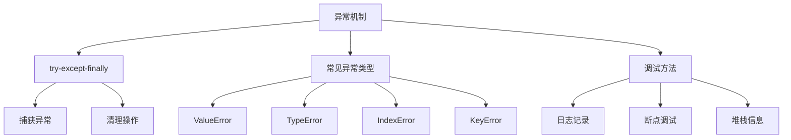
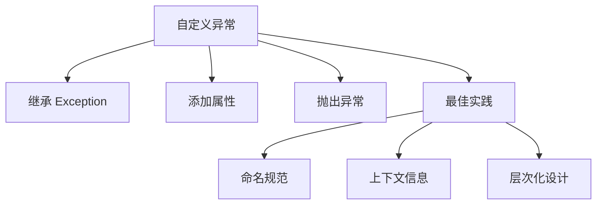
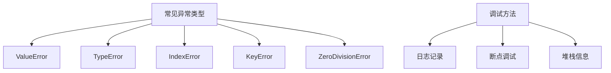

### 错误与异常处理
------
#### **1. 异常机制**
**🔑 知识点详解**
- **try-except-finally 结构**：
  - 定义：`try-except-finally` 是 Python 中用于捕获和处理异常的结构。
  - 核心思想：通过 `try` 块执行可能引发异常的代码，`except` 块捕获并处理异常，`finally` 块确保无论是否发生异常都执行清理操作。
    👉 **注意**：`finally` 块通常用于释放资源（如关闭文件或数据库连接）。
- **常见异常类型**：
  - `ValueError`：传入无效参数值。
  - `TypeError`：操作或函数应用于不适当类型的对象。
  - `IndexError`：访问序列中不存在的索引。
  - `KeyError`：访问字典中不存在的键。
  - `ZeroDivisionError`：除以零。
    👉 **注意**：Python 提供了丰富的内置异常类型，开发者也可以自定义异常。

**🔥 面试高频题**
1. `try-except-finally` 的作用是什么？如何正确使用？
   - **一句话答案**：`try-except-finally` 用于捕获异常、处理错误并执行清理操作。
   - **深入回答**：`try-except-finally` 的核心作用是通过结构化的方式处理程序中的异常。`try` 块包含可能引发异常的代码；`except` 块捕获特定类型的异常并进行处理；`finally` 块无论是否发生异常都会执行，通常用于释放资源。例如：
     ```python
     try:
         num = int(input("Enter a number: "))
         result = 10 / num
     except ValueError:
         print("Invalid input! Please enter a valid number.")
     except ZeroDivisionError:
         print("Cannot divide by zero!")
     finally:
         print("Execution completed.")
     ```
     在上述代码中，`try` 块尝试将输入转换为整数并计算结果；如果输入无效或除以零，则分别捕获 `ValueError` 和 `ZeroDivisionError`；`finally` 块确保打印完成信息。

2. 如何调试异常？有哪些常用方法？
   - **一句话答案**：通过日志记录、断点调试和异常堆栈信息定位问题。
   - **深入回答**：调试异常的核心方法包括：
     - **日志记录**：使用 `logging` 模块记录异常信息，便于后续分析。
     - **断点调试**：通过 IDE（如 PyCharm）设置断点，逐步执行代码以定位问题。
     - **异常堆栈信息**：捕获异常后打印堆栈信息（如 `traceback.print_exc()`），快速定位错误来源。例如：
       ```python
       import traceback
       
       try:
           num = int(input("Enter a number: "))
           result = 10 / num
       except Exception as e:
           print("An error occurred:")
           traceback.print_exc()
       ```

**🌟 重点提醒**
- **要点一**：`try-except-finally` 用于捕获异常、处理错误并执行清理操作。
- **要点二**：`finally` 块确保资源释放，无论是否发生异常。
- **要点三**：调试异常需结合日志记录、断点调试和异常堆栈信息。

**📝 实践经验**
```python
# try-except-finally 示例
try:
    file = open("example.txt", "r")
    content = file.read()
except FileNotFoundError:
    print("File not found!")
except IOError:
    print("Error reading the file!")
finally:
    file.close() if 'file' in locals() else None
    print("File operation completed.")

# 调试异常示例
import traceback

try:
    result = 10 / 0
except Exception as e:
    print("An error occurred:")
    traceback.print_exc()
```

**🔧 工具辅助**


------
#### **2. 自定义异常**
**🔑 知识点详解**
- **自定义异常的定义**：
  - 定义：通过继承 `Exception` 类创建自定义异常类。
  - 核心思想：根据业务需求定义特定的异常类型，提升代码的可读性和可维护性。
    👉 **注意**：自定义异常类可以添加额外属性或方法以提供更多上下文信息。

**🔥 面试高频题**
1. 为什么需要自定义异常？如何实现？
   - **一句话答案**：自定义异常可以根据业务需求定义特定的错误类型，便于识别和处理。
   - **深入回答**：自定义异常的核心作用是使代码更具语义化，便于区分不同类型的错误。例如，在支付系统中，可以通过自定义异常区分“余额不足”和“账户冻结”等错误。实现自定义异常的基本步骤包括：
     1. 继承 `Exception` 类。
     2. 添加初始化方法（如 `__init__`）以支持自定义属性。
     3. 在需要的地方抛出异常（如 `raise`）。
     ```python
     class InsufficientBalanceError(Exception):
         def __init__(self, balance, amount):
             super().__init__(f"Insufficient balance: {balance} < {amount}")
             self.balance = balance
             self.amount = amount
     
     def withdraw(balance, amount):
         if balance < amount:
             raise InsufficientBalanceError(balance, amount)
         return balance - amount
     
     try:
         withdraw(100, 200)
     except InsufficientBalanceError as e:
         print(e)  # 输出: Insufficient balance: 100 < 200
     ```

2. 自定义异常的最佳实践是什么？
   - **一句话答案**：自定义异常应具有明确的命名和清晰的上下文信息。
   - **深入回答**：设计自定义异常时需要注意以下几点：
     - **命名规范**：异常类名应以 `Error` 或 `Exception` 结尾，便于识别。
     - **上下文信息**：通过自定义属性或方法提供详细的错误描述。
     - **层次化设计**：通过继承构建异常层次结构，便于分类处理。例如：
       ```python
       class PaymentError(Exception):
           pass
       
       class InsufficientBalanceError(PaymentError):
           pass
       
       class AccountFrozenError(PaymentError):
           pass
       ```

**🌟 重点提醒**
- **要点一**：自定义异常通过继承 `Exception` 类实现。
- **要点二**：自定义异常应具有明确的命名和上下文信息。
- **要点三**：通过异常层次化设计提升代码的可维护性。

**📝 实践经验**
```python
# 自定义异常示例
class NegativeNumberError(Exception):
    def __init__(self, number):
        super().__init__(f"Negative number not allowed: {number}")
        self.number = number

def check_positive(number):
    if number < 0:
        raise NegativeNumberError(number)
    return number

try:
    check_positive(-5)
except NegativeNumberError as e:
    print(e)  # 输出: Negative number not allowed: -5
```

**🔧 工具辅助**


------
#### **3. 常见异常类型及调试方法**
**🔑 知识点详解**
- **常见异常类型**：
  - `ValueError`：传入无效参数值（如 `int("abc")`）。
  - `TypeError`：操作或函数应用于不适当类型的对象（如 `"abc" + 123`）。
  - `IndexError`：访问序列中不存在的索引（如 `my_list[10]`）。
  - `KeyError`：访问字典中不存在的键（如 `my_dict["nonexistent_key"]`）。
  - `ZeroDivisionError`：除以零（如 `10 / 0`）。
    👉 **注意**：熟悉这些异常类型有助于快速定位问题。
- **调试方法**：
  - **日志记录**：使用 `logging` 模块记录异常信息。
  - **断点调试**：通过 IDE 设置断点，逐步执行代码。
  - **异常堆栈信息**：使用 `traceback` 模块打印异常堆栈。

**🔥 面试高频题**
1. 常见异常类型有哪些？如何避免它们？
   - **一句话答案**：常见异常包括 `ValueError`、`TypeError`、`IndexError` 等，可通过输入验证和边界检查避免。
   - **深入回答**：常见的异常类型及其避免方法包括：
     - `ValueError`：确保输入值符合预期（如使用 `try-except` 捕获无效输入）。
     - `TypeError`：检查操作或函数的参数类型（如使用 `isinstance` 验证类型）。
     - `IndexError`：在访问列表前检查索引范围（如使用 `len(my_list)`）。
     - `KeyError`：在访问字典前检查键是否存在（如使用 `dict.get()` 方法）。
     - `ZeroDivisionError`：在除法前检查分母是否为零。

2. 如何利用日志记录和断点调试解决复杂问题？
   - **一句话答案**：通过日志记录捕获异常上下文，通过断点调试逐步分析代码逻辑。
   - **深入回答**：日志记录和断点调试是解决复杂问题的重要工具。日志记录可以通过 `logging` 模块记录异常的上下文信息，便于后续分析。例如：
     ```python
     import logging
     
     logging.basicConfig(level=logging.DEBUG)
     
     try:
         result = 10 / 0
     except ZeroDivisionError as e:
         logging.error("An error occurred: %s", e)
     ```
     断点调试则通过 IDE（如 PyCharm）设置断点，逐步执行代码以观察变量值和程序状态。两者结合可以快速定位并解决问题。

**🌟 重点提醒**
- **要点一**：熟悉常见异常类型及其避免方法。
- **要点二**：日志记录和断点调试是解决复杂问题的重要工具。
- **要点三**：异常堆栈信息有助于快速定位错误来源。

**📝 实践经验**
```python
# 日志记录示例
import logging

logging.basicConfig(level=logging.DEBUG)

try:
    result = 10 / 0
except ZeroDivisionError as e:
    logging.error("An error occurred: %s", e)

# 断点调试示例
def calculate_average(numbers):
    total = sum(numbers)
    count = len(numbers)
    return total / count

numbers = [10, 20, 30]
average = calculate_average(numbers)
print(f"Average: {average}")
```

**🔧 工具辅助**


**💡 复习建议**
1. 掌握 `try-except-finally` 的基本用法及其在异常处理中的作用。
2. 学习如何定义和使用自定义异常，提升代码的可读性和可维护性。
3. 熟悉常见异常类型及其避免方法，掌握日志记录和断点调试的技巧。