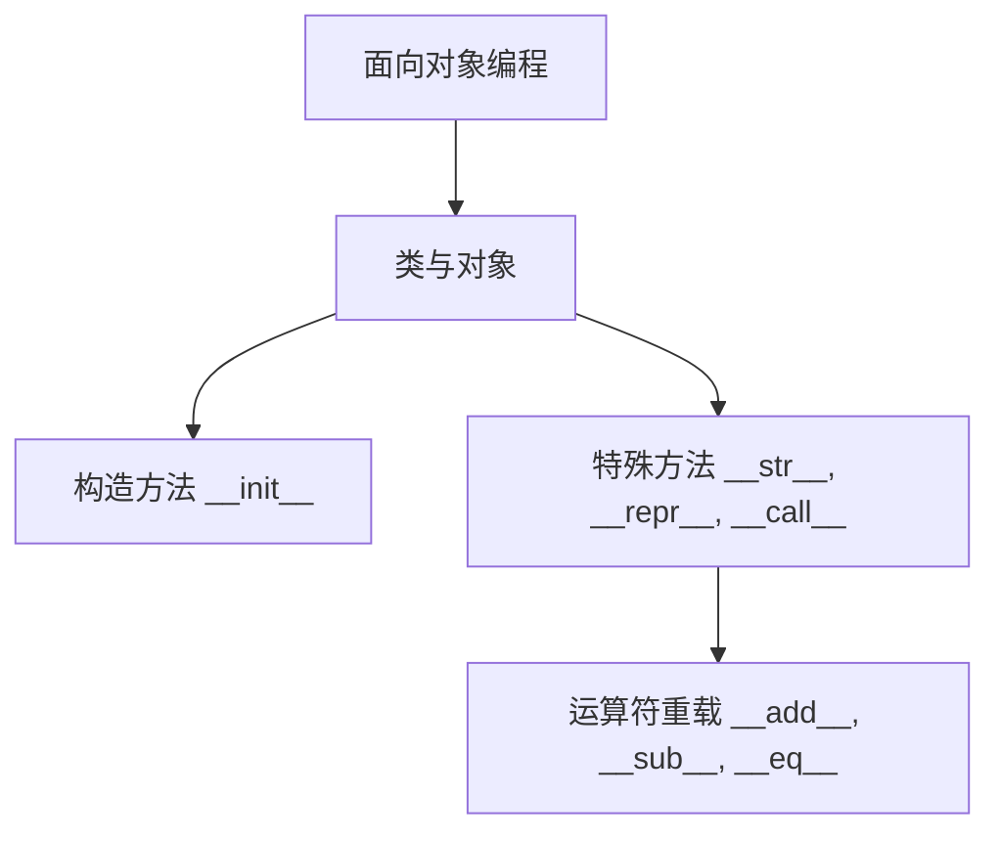

### 面向对象编程（OOP）

------

#### **1. 类与对象**

**🔑 知识点详解**

- **类的定义、构造方法、实例变量与类变量**：
  - **核心定义**：类是对象的蓝图或模板，用于定义对象的属性（实例变量）和行为（方法）。
  - **重要特性**：构造方法（通常为 `__init__`）用于初始化对象；实例变量属于具体对象，而类变量属于整个类共享。
  - **关键机制**：通过类定义创建对象，使用构造方法初始化数据；实例变量可在对象间独立，类变量在所有实例间共享。 👉 **注意**：构造方法必须正确初始化所有必要属性，避免出现未定义变量的情况。
- **方法重载与多态**：
  - **核心定义**：方法重载指在同一作用域内使用同名方法（在 Python 中可通过默认参数实现类似效果）；多态指相同接口下不同对象可表现出不同的行为。
  - **重要特性**：多态是面向对象的核心特性，允许调用父类方法时自动根据实例类型执行不同代码。
  - **关键机制**：通过子类重写父类方法实现多态；接口或抽象类可以统一不同对象的调用方式。 👉 **注意**：在 Python 中，可利用默认参数和可变参数模拟方法重载，但需注意参数顺序和类型检查。
- **继承、封装、抽象**：
  - **核心定义**：继承允许子类复用父类属性和方法；封装将数据和行为封装在一个对象中，隐藏内部实现；抽象通过定义抽象类和接口来规定子类必须实现的行为。
  - **重要特性**：继承实现代码复用，封装提高安全性，抽象确保接口一致性。
  - **关键机制**：使用 `class 子类(父类)` 语法实现继承；通过双下划线前缀实现封装；使用 `abc` 模块定义抽象基类。 👉 **注意**：过度继承可能导致代码耦合，应合理设计类层次结构。

**🔥 面试高频题**

1. 类与对象的区别是什么？
   - **一句话答案**：类是对象的模板，而对象是类的具体实例。
   - **深入回答**：类定义了对象应该具有的属性和行为，而对象则是根据这个模板创建的实际实体。类通过构造方法初始化对象，实例变量存储对象的独立状态，类变量则在所有对象间共享。
2. 请解释多态的概念以及它在实际编程中的应用。
   - **一句话答案**：多态允许同一接口下，不同对象表现出不同的行为，实现代码的灵活和扩展。
   - **深入回答**：多态使得调用父类方法时，根据对象的实际类型执行子类重写的方法，从而实现接口统一、实现多样化的效果。在实际编程中，这种机制常用于设计模式中，例如工厂模式和策略模式，可以有效降低代码耦合度，增加系统灵活性。
3. 继承如何提高代码复用性？请举例说明。
   - **一句话答案**：继承允许子类复用父类的属性和方法，从而避免重复代码，提高开发效率。
   - **深入回答**：通过继承，子类自动获得父类中定义的所有方法和属性，可以在此基础上添加或重写部分功能。例如，在设计一个动物类（Animal）时，可以将所有动物共有的属性（如年龄、体重）和行为（如吃、睡）放在父类中，而子类（如 Dog、Cat）只需关注特殊行为（如叫声）。这种方式不仅减少了代码重复，也使得代码更易于维护和扩展。

------

#### **2. 特殊方法**

**🔑 知识点详解**

- **特殊方法**：

  - **核心定义**：特殊方法是 Python 内置的、以双下划线开头和结尾的方法，用于定制类的行为，如对象初始化、字符串表示、函数调用等。

  - **重要特性**：常见特殊方法包括 `__init__`、`__str__`、`__repr__` 和 `__call__` 等；这些方法使得自定义类能够像内置类型那样使用。

  - 关键机制

    ：

    - `__init__`：构造方法，初始化新对象；
    - `__str__`：定义对象的可打印字符串形式；
    - `__repr__`：定义对象的官方字符串表示；
    - `__call__`：使对象可以像函数一样被调用。 👉 **注意**：应确保 `__repr__` 返回的字符串在可能时可用来重建对象，`__str__` 则侧重于用户友好的输出。

- **运算符重载**：

  - **核心定义**：运算符重载允许自定义类实现标准运算符的行为，如加法、减法、比较等。
  - **重要特性**：通过定义对应的特殊方法（如 `__add__`、`__sub__`、`__eq__` 等）实现运算符重载。
  - **关键机制**：实现这些特殊方法后，使用标准运算符时会调用相应方法。例如，`a + b` 会调用 `a.__add__(b)`。 👉 **注意**：重载运算符时应保持运算的一致性和直观性，确保符合数学或逻辑预期。

**🔥 面试高频题**

1. 请解释特殊方法 `__init__` 与 `__call__` 的作用？
   - **一句话答案**：`__init__` 用于初始化新创建的对象，`__call__` 允许对象像函数一样被调用。
   - **深入回答**：`__init__` 方法在对象创建后自动执行，负责设置初始状态；而 `__call__` 方法使对象具备函数调用能力，可以在对象上直接使用括号进行调用，从而扩展对象的功能和灵活性。
2. 如何实现运算符重载？请举例说明。
   - **一句话答案**：通过在类中定义对应的特殊方法（如 `__add__`）来实现运算符重载。
   - **深入回答**：运算符重载允许开发者自定义类的行为。例如，实现 `__add__` 方法后，可以通过 `a + b` 操作直接调用 `a.__add__(b)`。这种方式能使自定义对象支持数学运算，提升代码的表达能力，同时要求确保行为的一致性和直观性。
3. 特殊方法在面向对象设计中有什么作用？
   - **一句话答案**：特殊方法使自定义类具备内置类型的行为，从而可以在语法上与 Python 的内置对象无缝对接。
   - **深入回答**：通过实现特殊方法，如 `__str__` 和 `__repr__`，自定义类可以定义自己在打印、调试和交互中的表现形式；通过 `__call__` 方法，使对象能够像函数一样被调用，这样不仅提升了代码的灵活性，还能在设计模式中实现策略和回调功能。

------

#### **🌟 重点提醒**

- **面向对象核心**：类是对象的模板，对象是具体实例；继承、封装、抽象构成 OOP 的三大基石。
- **特殊方法**：通过重载特殊方法，可以自定义对象行为，使其表现得像内置数据类型。
- **运算符重载**：合理重载运算符可以增强类的表现力，但要确保语义一致。

**📝 实践经验**

```python
class Person:
    # 构造方法：初始化实例变量
    def __init__(self, name, age):
        self.name = name
        self.age = age

    # 字符串表示方法
    def __str__(self):
        return f"Person(name={self.name}, age={self.age})"

    # 运算符重载示例：比较两个 Person 对象的年龄
    def __eq__(self, other):
        if isinstance(other, Person):
            return self.age == other.age
        return False

    # 使对象可调用
    def __call__(self, greeting):
        return f"{greeting}, I am {self.name}."

# 示例使用
p1 = Person('Alice', 30)
p2 = Person('Bob', 25)
print(p1)                     # 输出：Person(name=Alice, age=30)
print(p1 == p2)               # 输出：False
print(p1("Hello"))            # 输出：Hello, I am Alice.
```

**🔧 工具辅助**



**💡 复习建议**

1. 深入理解面向对象的三大特性（继承、封装、抽象）及其在设计模式中的应用。
2. 掌握特殊方法的用途，特别是如何使自定义类与内置类型行为一致。
3. 实践编写运算符重载代码，确保对各种运算符的行为有清晰认识。

------