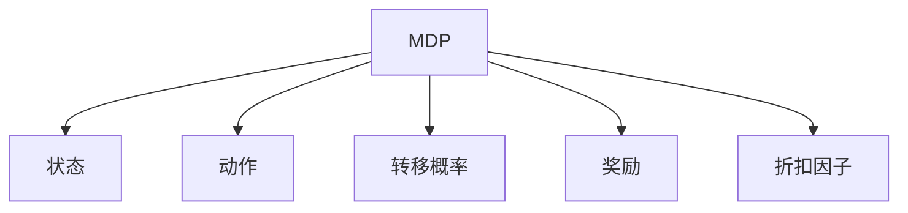
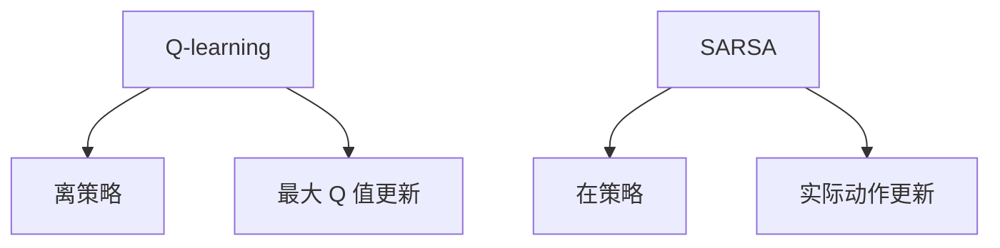
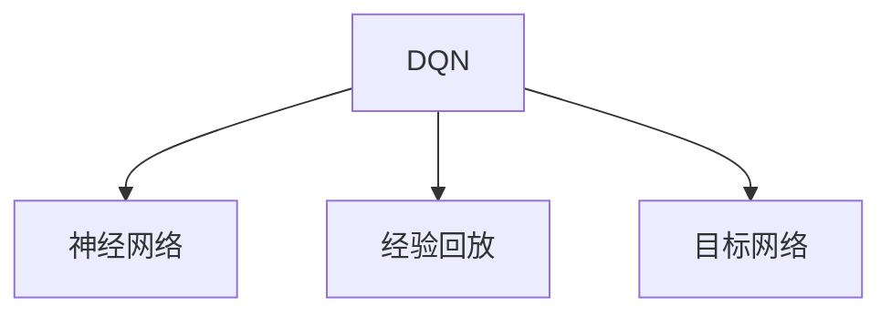
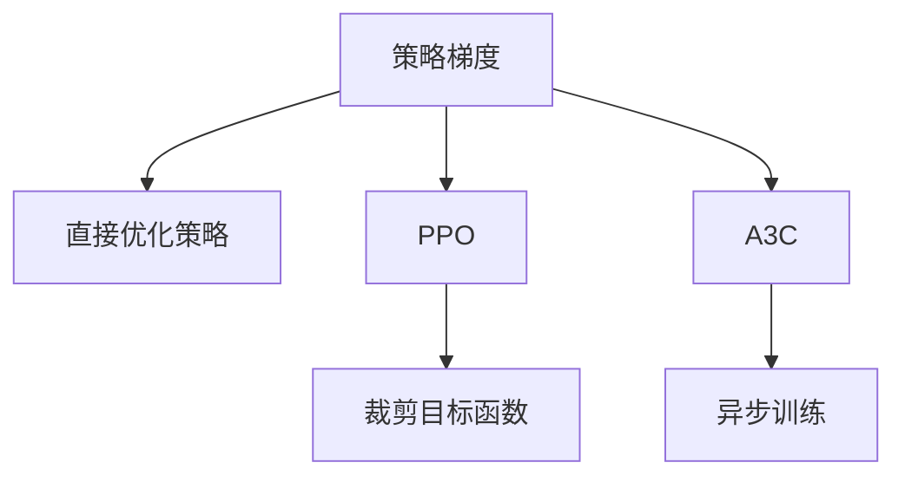

### 强化学习

------
#### **1. 马尔可夫决策过程（MDP）**
**🔑 知识点详解**
- **MDP 的定义**：
  - 定义：马尔可夫决策过程（Markov Decision Process, MDP）是强化学习的核心数学框架，用于描述智能体与环境的交互过程。
  - 核心要素：
    - **状态（State, S）**：描述环境的当前情况。
    - **动作（Action, A）**：智能体在某一状态下可以采取的行为。
    - **转移概率（Transition Probability, P）**：从一个状态转移到另一个状态的概率。
    - **奖励（Reward, R）**：智能体在某一状态下采取某一动作后获得的即时反馈。
    - **折扣因子（Discount Factor, γ）**：用于权衡未来奖励的重要性，取值范围为 [0, 1]。
    👉 **注意**：MDP 假设状态转移具有马尔可夫性质，即下一状态仅依赖于当前状态和动作，而与历史无关。
- **目标**：
  - 智能体的目标是通过策略（Policy）选择动作，最大化累积奖励（Cumulative Reward）。
  - 公式：$ G_t = R_{t+1} + \gamma R_{t+2} + \gamma^2 R_{t+3} + ... $
- **应用场景**：
  - 游戏 AI、机器人控制、资源调度等。

**🔥 面试高频题**
1. 什么是马尔可夫性质？为什么它在强化学习中重要？
   - **一句话答案**：马尔可夫性质是指下一状态仅依赖于当前状态和动作，与历史无关，简化了问题建模。
   - **深入回答**：马尔可夫性质假设环境的状态转移只与当前状态和动作相关，而与过去的状态和动作无关。这一假设大大简化了强化学习中的建模和计算复杂度。例如，在棋类游戏中，棋盘的当前状态已经包含了所有必要的信息，无需考虑之前的走法。这使得强化学习算法能够专注于当前状态下的最优决策。

2. 如何设计一个有效的奖励函数？
   - **一句话答案**：奖励函数应反映任务目标，并避免稀疏或误导性奖励。
   - **深入回答**：设计奖励函数时需要确保其与任务目标一致。例如，在机器人导航任务中，奖励函数可以设置为目标点附近的正奖励和障碍物附近的负奖励。此外，奖励函数应避免过于稀疏（如仅在任务完成时给予奖励），否则可能导致学习困难。同时，奖励函数不应误导智能体（如鼓励不安全行为）。

**🌟 重点提醒**
- **要点一**：MDP 是强化学习的核心框架，描述了智能体与环境的交互过程。
- **要点二**：马尔可夫性质简化了状态转移的建模。
- **要点三**：奖励函数的设计对强化学习的效果至关重要。

**📝 实践经验**
```python
import numpy as np

# 示例：简单 MDP
states = ['s1', 's2']
actions = ['a1', 'a2']
transition_prob = {
    ('s1', 'a1'): {'s1': 0.8, 's2': 0.2},
    ('s1', 'a2'): {'s1': 0.5, 's2': 0.5},
    ('s2', 'a1'): {'s1': 0.3, 's2': 0.7},
    ('s2', 'a2'): {'s1': 0.9, 's2': 0.1}
}
rewards = {
    ('s1', 'a1'): 1,
    ('s1', 'a2'): 2,
    ('s2', 'a1'): 3,
    ('s2', 'a2'): 4
}

# 计算某一状态下的奖励
state = 's1'
action = 'a1'
next_state_probs = transition_prob[(state, action)]
expected_reward = sum(prob * rewards[(state, action)] for state, prob in next_state_probs.items())
print(f"Expected reward for state {state} and action {action}: {expected_reward}")
```

**🔧 工具辅助**


------
#### **2. Q-learning 和 SARSA**
**🔑 知识点详解**
- **Q-learning 的定义**：
  - 定义：Q-learning 是一种基于值函数的强化学习算法，通过更新 Q 值来学习最优策略。
  - 核心公式：
    - $ Q(s, a) \leftarrow Q(s, a) + \alpha [R(s, a) + \gamma \max_{a'} Q(s', a') - Q(s, a)] $
    - $ Q(s, a) $: 状态-动作值函数，表示在状态 $ s $ 下采取动作 $ a $ 后的预期累积奖励。
    👉 **注意**：Q-learning 是一种离策略（Off-policy）算法，使用最大 Q 值更新策略。
- **SARSA 的定义**：
  - 定义：SARSA 是另一种基于值函数的强化学习算法，与 Q-learning 类似，但使用实际采取的动作更新 Q 值。
  - 核心公式：
    - $ Q(s, a) \leftarrow Q(s, a) + \alpha [R(s, a) + \gamma Q(s', a') - Q(s, a)] $
    - $ a' $: 在状态 $ s' $ 下实际采取的动作。
    👉 **注意**：SARSA 是一种在策略（On-policy）算法，更新依赖于当前策略。
- **区别**：
  - Q-learning 使用最大 Q 值更新，探索性更强；SARSA 使用实际动作更新，更保守。

**🔥 面试高频题**
1. Q-learning 和 SARSA 的主要区别是什么？
   - **一句话答案**：Q-learning 是离策略算法，使用最大 Q 值更新；SARSA 是在策略算法，使用实际动作更新。
   - **深入回答**：Q-learning 的更新公式中使用了 $ \max_{a'} Q(s', a') $，这意味着它总是假设下一步会采取最优动作，因此更具探索性。而 SARSA 使用的是实际采取的动作 $ a' $，因此更新更依赖于当前策略，表现更保守。例如，在悬崖行走任务中，Q-learning 可能会选择靠近悬崖的路径以获取更高奖励，而 SARSA 则倾向于远离悬崖以减少风险。

2. 什么是探索与利用的权衡？如何在 Q-learning 中实现？
   - **一句话答案**：探索与利用的权衡是指在已知策略和未知策略之间进行选择，通常通过 ε-greedy 策略实现。
   - **深入回答**：在强化学习中，智能体需要在探索（尝试新动作以发现更好的策略）和利用（选择当前最优动作以最大化奖励）之间找到平衡。ε-greedy 策略是一种常见方法，其中智能体以概率 $ \epsilon $ 随机选择动作（探索），以概率 $ 1-\epsilon $ 选择当前最优动作（利用）。随着训练的进行，通常逐渐减小 $ \epsilon $ 以增加利用的比例。

**🌟 重点提醒**
- **要点一**：Q-learning 和 SARSA 是两种经典的强化学习算法，分别适用于不同场景。
- **要点二**：探索与利用的权衡是强化学习中的核心问题。
- **要点三**：Q-learning 更适合探索性任务，SARSA 更适合安全性要求高的任务。

**📝 实践经验**
```python
import numpy as np

# 示例：Q-learning 算法
num_states = 5
num_actions = 2
Q = np.zeros((num_states, num_actions))
alpha = 0.1  # 学习率
gamma = 0.9  # 折扣因子
epsilon = 0.1  # 探索率

def choose_action(state):
    if np.random.rand() < epsilon:
        return np.random.choice(num_actions)  # 探索
    else:
        return np.argmax(Q[state])  # 利用

def update_q_value(state, action, reward, next_state):
    Q[state, action] += alpha * (reward + gamma * np.max(Q[next_state]) - Q[state, action])

# 示例更新
state = 0
action = choose_action(state)
next_state = 1
reward = 1
update_q_value(state, action, reward, next_state)
```

**🔧 工具辅助**


------
#### **3. 深度强化学习（Deep Q Network, DQN）**
**🔑 知识点详解**
- **DQN 的定义**：
  - 定义：深度 Q 网络（Deep Q Network, DQN）是一种结合深度学习和 Q-learning 的强化学习算法，用于处理高维状态空间。
  - 核心思想：使用神经网络近似 Q 值函数，解决传统 Q-learning 无法处理连续状态的问题。
    👉 **注意**：DQN 引入了经验回放（Experience Replay）和目标网络（Target Network）以提升稳定性。
- **关键机制**：
  - **经验回放**：将智能体的经验存储在缓冲区中，随机采样进行训练，打破数据相关性。
  - **目标网络**：使用固定的目标网络计算目标 Q 值，减少训练过程中的波动。
- **应用场景**：
  - 游戏 AI（如 Atari 游戏）、机器人控制等。

**🔥 面试高频题**
1. DQN 如何解决传统 Q-learning 的局限性？
   - **一句话答案**：DQN 使用神经网络近似 Q 值函数，并通过经验回放和目标网络提升稳定性。
   - **深入回答**：传统 Q-learning 在高维状态空间中难以扩展，因为其需要维护一个巨大的 Q 表。DQN 使用神经网络替代 Q 表，能够高效处理连续状态空间。此外，经验回放通过随机采样打破数据相关性，目标网络则通过固定目标 Q 值减少训练波动，从而显著提升了算法的稳定性和性能。

2. 为什么需要经验回放？
   - **一句话答案**：经验回放通过随机采样打破数据相关性，提升训练稳定性。
   - **深入回答**：在强化学习中，智能体的经验通常是序列相关的，直接使用这些数据进行训练会导致模型过拟合到特定序列。经验回放通过将经验存储在缓冲区中并随机采样，打破了数据之间的相关性，从而使训练更加稳定。此外，经验回放还允许重复利用过去的经验，提高了数据效率。

**🌟 重点提醒**
- **要点一**：DQN 结合了深度学习和 Q-learning，解决了高维状态空间的问题。
- **要点二**：经验回放和目标网络是 DQN 的两大关键技术。
- **要点三**：DQN 在游戏 AI 和机器人控制等领域表现优异。

**📝 实践经验**
```python
import torch
import torch.nn as nn
import random

# 定义 DQN 网络
class DQN(nn.Module):
    def __init__(self, input_dim, output_dim):
        super(DQN, self).__init__()
        self.fc = nn.Sequential(
            nn.Linear(input_dim, 128),
            nn.ReLU(),
            nn.Linear(128, output_dim)
        )
    
    def forward(self, x):
        return self.fc(x)

# 经验回放缓冲区
class ReplayBuffer:
    def __init__(self, capacity):
        self.buffer = []
        self.capacity = capacity
    
    def push(self, experience):
        if len(self.buffer) >= self.capacity:
            self.buffer.pop(0)
        self.buffer.append(experience)
    
    def sample(self, batch_size):
        return random.sample(self.buffer, batch_size)

# 示例：DQN 更新
input_dim = 4
output_dim = 2
policy_net = DQN(input_dim, output_dim)
target_net = DQN(input_dim, output_dim)
buffer = ReplayBuffer(capacity=1000)

# 更新目标网络
def update_target_network():
    target_net.load_state_dict(policy_net.state_dict())

# 示例经验
state = torch.randn(1, input_dim)
action = 0
reward = 1
next_state = torch.randn(1, input_dim)
done = False
buffer.push((state, action, reward, next_state, done))

# 采样并更新
batch = buffer.sample(batch_size=32)
for state, action, reward, next_state, done in batch:
    target = reward + (1 - done) * 0.9 * target_net(next_state).max()
    loss = (policy_net(state)[action] - target) ** 2
    loss.backward()
```

**🔧 工具辅助**


------
#### **4. 策略梯度方法（Policy Gradient, PPO, A3C）**
**🔑 知识点详解**
- **策略梯度的定义**：
  - 定义：策略梯度（Policy Gradient）是一种直接优化策略的方法，通过调整策略参数最大化期望累积奖励。
  - 核心公式：
    - $ \nabla_\theta J(\theta) = \mathbb{E}[\nabla_\theta \log \pi_\theta(a|s) Q(s, a)] $
    - $ \pi_\theta(a|s) $: 策略函数，表示在状态 $ s $ 下采取动作 $ a $ 的概率。
    👉 **注意**：策略梯度直接优化策略，无需显式构建 Q 值函数。
- **PPO（Proximal Policy Optimization）**：
  - 定义：PPO 是一种改进的策略梯度方法，通过限制策略更新幅度提升稳定性。
  - 核心思想：引入裁剪目标函数，避免策略更新过大。
- **A3C（Asynchronous Advantage Actor-Critic）**：
  - 定义：A3C 是一种异步的 Actor-Critic 方法，通过多个线程并行训练加速收敛。
  - 核心思想：Actor 负责策略优化，Critic 负责评估策略。

**🔥 面试高频题**
1. 策略梯度和值函数方法的区别是什么？
   - **一句话答案**：策略梯度直接优化策略，值函数方法通过优化 Q 值间接优化策略。
   - **深入回答**：值函数方法（如 Q-learning）通过构建 Q 值函数间接优化策略，而策略梯度方法直接优化策略参数，无需显式构建 Q 值函数。策略梯度的优点是可以处理连续动作空间，且更容易扩展到高维策略。然而，策略梯度的训练过程可能不稳定，需要引入改进方法（如 PPO）。

2. PPO 如何提升策略梯度的稳定性？
   - **一句话答案**：PPO 通过裁剪目标函数限制策略更新幅度，避免更新过大。
   - **深入回答**：PPO 引入了一个裁剪目标函数，限制新策略与旧策略之间的差异。具体来说，PPO 在目标函数中添加了一个裁剪项，确保策略更新不会偏离旧策略太远。这种方法既保证了训练的稳定性，又保留了策略梯度的高效性。

**🌟 重点提醒**
- **要点一**：策略梯度直接优化策略，适合连续动作空间。
- **要点二**：PPO 和 A3C 是策略梯度的改进方法，分别通过裁剪和异步训练提升性能。
- **要点三**：策略梯度方法在复杂任务中表现优异，但训练过程可能不稳定。

**📝 实践经验**
```python
import torch
import torch.nn as nn
import torch.optim as optim

# 定义策略网络
class PolicyNetwork(nn.Module):
    def __init__(self, input_dim, output_dim):
        super(PolicyNetwork, self).__init__()
        self.fc = nn.Sequential(
            nn.Linear(input_dim, 128),
            nn.ReLU(),
            nn.Linear(128, output_dim),
            nn.Softmax(dim=-1)
        )
    
    def forward(self, x):
        return self.fc(x)

# 示例：策略梯度更新
input_dim = 4
output_dim = 2
policy_net = PolicyNetwork(input_dim, output_dim)
optimizer = optim.Adam(policy_net.parameters(), lr=0.01)

# 示例轨迹
states = torch.randn(10, input_dim)
actions = torch.randint(0, output_dim, (10,))
rewards = torch.randn(10)

# 计算损失并更新
log_probs = torch.log(policy_net(states).gather(1, actions.unsqueeze(1)).squeeze())
loss = -(log_probs * rewards).mean()
optimizer.zero_grad()
loss.backward()
optimizer.step()
```

**🔧 工具辅助**


**💡 复习建议**
1. 掌握 MDP 的基本概念及其在强化学习中的应用。
2. 理解 Q-learning 和 SARSA 的原理及区别，熟悉探索与利用的权衡。
3. 学习 DQN 的核心技术（如经验回放、目标网络）及其应用场景。
4. 熟悉策略梯度方法的基本思想，了解 PPO 和 A3C 的改进机制。