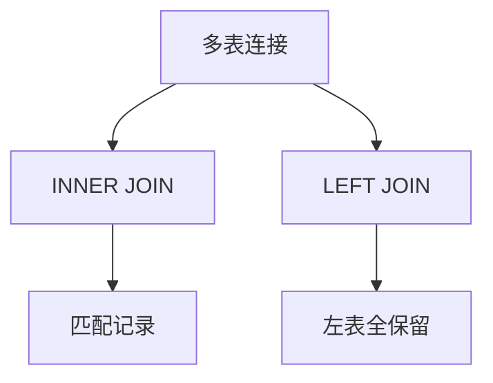
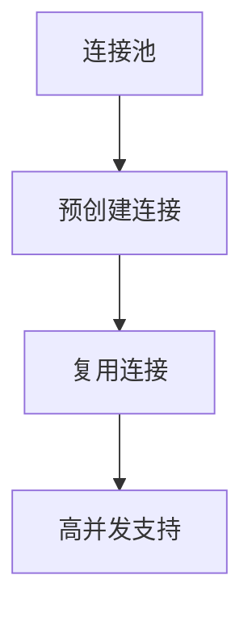

### SQL 基础及复杂查询
------
#### **1. SQL 基础**
**🔑 知识点详解**
- **SQL 语句分类**：
  - **核心定义**：SQL（Structured Query Language）是一种用于管理关系型数据库的语言，分为 DDL（数据定义语言）、DML（数据操作语言）、DQL（数据查询语言）和 DCL（数据控制语言）。
  - **重要特性**：支持结构化数据操作，语法简单，具有事务支持。
  - **关键机制**：通过解析器和优化器将 SQL 语句转化为数据库可执行的物理计划。
    👉 **注意**：SQL 是声明式语言，关注“做什么”而非“怎么做”，易错点在于忽略执行顺序（FROM → WHERE → SELECT）。
- **常见操作**：
  - **具体说明**：增（INSERT）、删（DELETE）、改（UPDATE）、查（SELECT）。
  - **实现方式**：如 `SELECT * FROM table WHERE condition`。
  - **使用场景**：数据检索、报表生成。
    👉 **辨析**：DELETE vs TRUNCATE，前者可回滚且按行删除，后者不可回滚且清空表。

**🔥 面试高频题**
1. SQL 的执行顺序是什么？
   - **一句话答案**：FROM → WHERE → GROUP BY → HAVING → SELECT → ORDER BY。
   - **深入回答**：SQL 并非按书写顺序执行，而是先确定数据源（FROM），再过滤（WHERE），分组（GROUP BY），聚合过滤（HAVING），最后选择字段（SELECT）并排序（ORDER BY）。例如，`SELECT name, COUNT(*) FROM users WHERE age > 18 GROUP BY name HAVING COUNT(*) > 1 ORDER BY name;` 会按上述顺序逐步执行。

#### **2. 复杂查询**
**🔑 知识点详解**
- **多表连接与子查询**：
  - **主要内容**：通过 INNER JOIN、LEFT JOIN 等实现表关联，或用子查询嵌套查询。
  - **核心特点**：连接操作基于键匹配，子查询提高灵活性但可能影响性能。
  - **实现原理**：数据库优化器选择嵌套循环或哈希连接等方式执行。
    👉 **注意**：连接条件缺失会导致笛卡尔积，性能急剧下降。

**🔥 面试高频题**
1. INNER JOIN 和 LEFT JOIN 的区别是什么？
   - **一句话答案**：INNER JOIN 只返回匹配记录，LEFT JOIN 返回左表所有记录及右表匹配记录。
   - **深入回答**：INNER JOIN 要求两表均满足条件，如 `SELECT * FROM A INNER JOIN B ON A.id = B.id`；LEFT JOIN 保留左表全部数据，右表无匹配则为 NULL。适用于需要保留主表数据的场景，如订单和用户信息查询。
2. 如何优化复杂查询性能？
   - **一句话答案**：添加索引、避免子查询、优化连接顺序。
   - **深入回答**：索引加速 WHERE 和 JOIN 条件匹配；子查询可改为 JOIN 减少嵌套；大表优先连接小表降低中间结果集。实践上，EXPLAIN 分析执行计划是关键。

**🌟 重点提醒**
- **要点一**：熟练掌握 JOIN 类型及其应用场景。
- **要点二**：理解子查询与连接的性能差异。
- **要点三**：避免 SELECT *，明确所需字段。

**📝 实践经验**
```sql
-- 示例：查询订单金额大于平均值的用户
SELECT u.name, o.amount
FROM users u
JOIN orders o ON u.id = o.user_id
WHERE o.amount > (SELECT AVG(amount) FROM orders);
```

**🔧 工具辅助**


**💡 复习建议**
1. 手写常见 SQL 查询，熟悉语法。
2. 理解执行计划，掌握优化思路。
3. 多练习多表连接和聚合函数。

---

### NoSQL 数据库（Redis、MongoDB）
------
#### **1. Redis 基础与应用**
**🔑 知识点详解**
- **Redis 核心**：
  - **核心定义**：Redis 是一个开源的内存键值存储数据库，支持多种数据结构。
  - **重要特性**：高性能（内存操作）、支持持久化（RDB、AOF）、单线程模型。
  - **关键机制**：事件驱动的非阻塞 I/O，数据结构如字符串、哈希、列表等。
    👉 **注意**：单线程避免了多线程竞争，但需警惕大 key 阻塞。
- **典型应用**：
  - **具体说明**：缓存、会话存储、排行榜。
  - **实现方式**：如 `SET key value`、`EXPIRE key seconds`。
  - **使用场景**：加速频繁访问的数据，如热点数据缓存。
    👉 **辨析**：Redis vs Memcached，前者支持复杂数据结构，后者仅键值对。

**🔥 面试高频题**
1. Redis 如何实现高性能？
   - **一句话答案**：内存存储和单线程模型。
   - **深入回答**：数据存储在内存，读写速度极快；单线程避免上下文切换，事件循环处理并发请求。实际应用中，合理设置过期时间和淘汰策略（如 LRU）至关重要。

---

#### **2. MongoDB 基础**
**🔑 知识点详解**
- **MongoDB 核心**：
  - **主要内容**：文档型 NoSQL 数据库，存储 BSON 格式数据。
  - **核心特点**：灵活 schema、高扩展性、支持复杂查询。
  - **实现原理**：基于集合和文档，分布式部署支持水平扩展。
    👉 **注意**：无事务支持（早期版本），需关注数据一致性。

**🔥 面试高频题**
1. MongoDB 和关系型数据库的区别？
   - **一句话答案**：MongoDB 是非结构化的文档存储，关系型数据库是结构化的表存储。
   - **深入回答**：MongoDB 无固定 schema，适合动态数据；关系型数据库依赖表结构和外键，适合事务场景。应用上，MongoDB 常用于日志、内容管理。

**🌟 重点提醒**
- **要点一**：Redis 适合高频小数据，MongoDB 适合大文档。
- **要点二**：掌握 Redis 数据结构使用场景。
- **要点三**：理解 NoSQL 的 CAP 定理权衡。

**📝 实践经验**
```python
# Redis 示例：缓存用户数据
import redis
r = redis.Redis(host='localhost', port=6379)
r.set('user:1', 'Alice', ex=3600)  # 1小时过期
print(r.get('user:1'))  # 获取缓存
```

**💡 复习建议**
1. 熟悉 Redis 命令和 MongoDB 查询语法。
2. 对比 NoSQL 和 SQL 的适用场景。
3. 实践分布式部署和数据分片。

---

### 数据库连接池与性能优化
------
#### **1. 数据库连接池**
**🔑 知识点详解**
- **连接池原理**：
  - **核心定义**：预先创建并管理一组数据库连接，供应用程序复用。
  - **重要特性**：减少连接建立开销，提高并发性能。
  - **关键机制**：池化管理、空闲连接回收、最大连接数限制。
    👉 **注意**：连接池配置不当可能导致连接泄漏或性能瓶颈。
- **常见实现**：
  - **具体说明**：HikariCP、C3P0、DBCP。
  - **实现方式**：配置最小/最大连接数、超时时间。
  - **使用场景**：高并发 Web 应用。

**🔥 面试高频题**
1. 为什么需要数据库连接池？
   - **一句话答案**：减少连接创建和销毁的开销。
   - **深入回答**：直接创建连接涉及 TCP 握手和认证，耗时较长；连接池复用连接，提升响应速度。HikariCP 是目前性能最佳选择，因其轻量和 JIT 优化。

---

#### **2. 性能优化**
**🔑 知识点详解**
- **优化策略**：
  - **主要内容**：索引、分库分表、缓存结合。
  - **核心特点**：降低 I/O 和计算成本。
  - **实现原理**：索引用 B+ 树加速查找，分库分表分散压力，缓存减少数据库负载。
    👉 **注意**：过度索引增加写操作成本。

**🔥 面试高频题**
1. 如何处理数据库慢查询？
   - **一句话答案**：分析慢查询日志，添加索引或优化 SQL。
   - **深入回答**：用 EXPLAIN 查看执行计划，定位全表扫描；针对高频查询加索引；结合 Redis 缓存热点数据。最佳实践是定期监控和调优。

**🌟 重点提醒**
- **要点一**：连接池大小需根据并发量调整。
- **要点二**：索引设计需权衡读写性能。
- **要点三**：缓存一致性是优化难点。

**📝 实践经验**
```java
// HikariCP 示例
HikariConfig config = new HikariConfig();
config.setJdbcUrl("jdbc:mysql://localhost:3306/db");
config.setUsername("root");
config.setPassword("password");
config.setMaximumPoolSize(10);
HikariDataSource ds = new HikariDataSource(config);
```

**🔧 工具辅助**


**💡 复习建议**
1. 掌握连接池参数配置。
2. 实践慢查询排查和优化。
3. 理解缓存与数据库协同工作机制。

---

