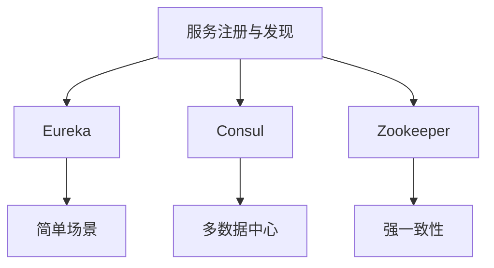
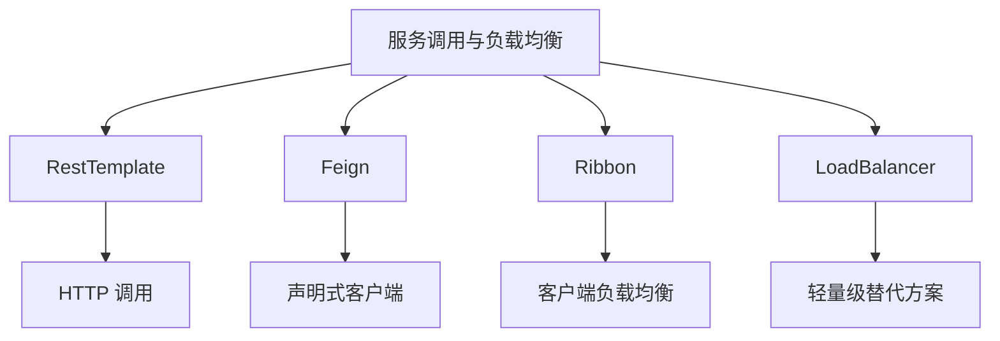
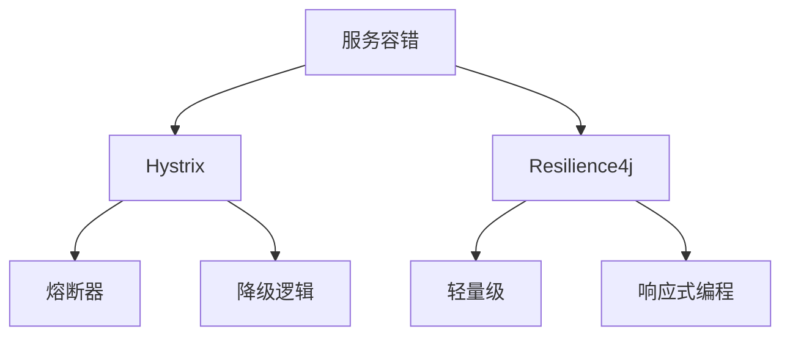
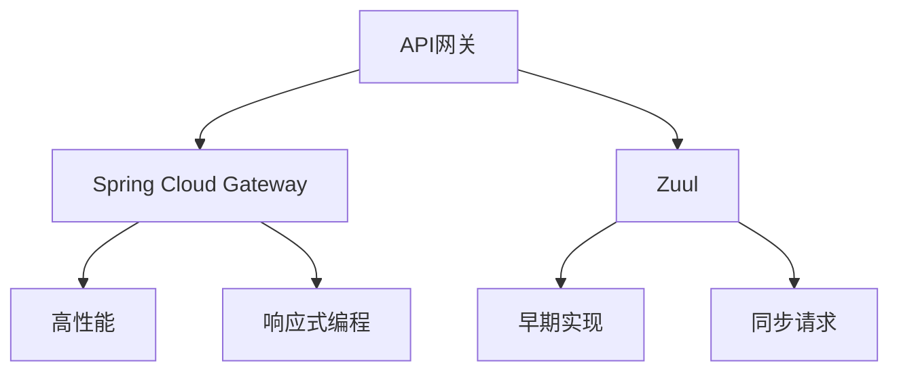
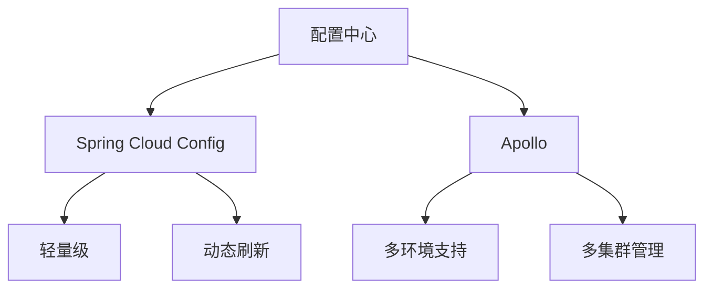
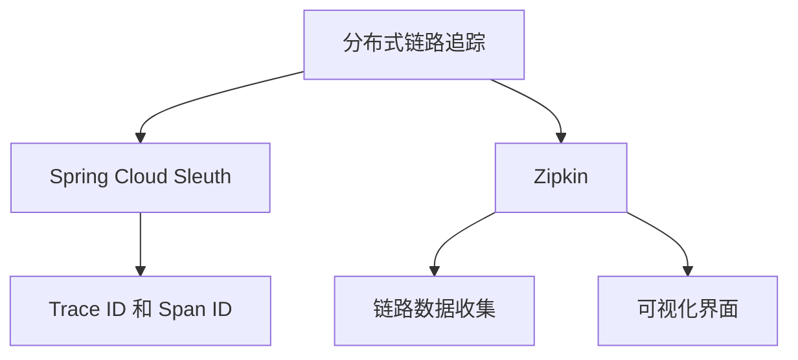

### Spring Cloud（微服务框架）核心组件与原理
------
#### **1. 服务注册与发现**
**🔑 知识点详解**
- **服务注册与发现的定义**：
  - **定义**：服务注册与发现是微服务架构中的基础功能，用于动态管理服务实例的注册和查询。
  - **核心思想**：通过服务注册中心（如 Eureka、Consul、Zookeeper）实现服务的自动注册与发现。
    👉 **注意**：服务注册中心是微服务通信的核心枢纽。

- **常见实现**：
  - **Eureka**：
    - **定义**：Netflix 提供的服务注册与发现组件。
    - **核心思想**：服务启动时向 Eureka Server 注册，客户端通过 Eureka 查询服务地址。
  - **Consul**：
    - **定义**：HashiCorp 提供的服务发现与配置管理工具。
    - **核心思想**：支持多数据中心和服务健康检查。
  - **Zookeeper**：
    - **定义**：Apache 提供的分布式协调服务。
    - **核心思想**：基于 ZNode 实现服务注册与发现。

**🔥 面试高频题**
1. 服务注册与发现的作用是什么？如何实现？
   - **一句话答案**：服务注册与发现用于动态管理服务实例的注册和查询，通过注册中心实现。
   - **深入回答**：服务注册与发现的核心作用是实现服务的动态管理和调用。具体实现步骤如下：
     1. **服务注册**：服务启动时向注册中心（如 Eureka）注册自身信息（如 IP 地址、端口）。
     2. **服务发现**：客户端通过注册中心查询目标服务的地址信息。
     3. **心跳机制**：服务定期向注册中心发送心跳，确保服务状态正常。
     ```java
     @EnableEurekaServer
     @SpringBootApplication
     public class EurekaServerApplication {
         public static void main(String[] args) {
             SpringApplication.run(EurekaServerApplication.class, args);
         }
     }
     
     @EnableEurekaClient
     @SpringBootApplication
     public class ServiceApplication {
         public static void main(String[] args) {
             SpringApplication.run(ServiceApplication.class, args);
         }
     }
     ```

2. 如何选择合适的服务注册中心？
   - **一句话答案**：根据需求选择 Eureka、Consul 或 Zookeeper。
   - **深入回答**：选择服务注册中心时需要考虑以下因素：
     - **Eureka**：适合简单的服务注册与发现场景，但不支持一致性。
     - **Consul**：支持多数据中心和健康检查，适合复杂场景。
     - **Zookeeper**：强一致性，适合对一致性要求较高的场景。

**🌟 重点提醒**
- **要点一**：服务注册与发现是微服务通信的基础。
- **要点二**：Eureka 是常见的服务注册中心。
- **要点三**：心跳机制确保服务状态正常。

**📝 实践经验**
```yaml
# application.yml (Eureka Server)
server:
  port: 8761
eureka:
  client:
    register-with-eureka: false
    fetch-registry: false

# application.yml (Service Client)
spring:
  application:
    name: user-service
eureka:
  client:
    service-url:
      defaultZone: http://localhost:8761/eureka/
```

**🔧 工具辅助**


------
#### **2. 服务调用与负载均衡**
**🔑 知识点详解**
- **服务调用的定义**：
  - **定义**：服务调用是指微服务之间通过 HTTP 或 RPC 协议进行通信。
  - **核心思想**：通过客户端或服务端负载均衡实现高可用性和性能优化。
    👉 **注意**：Spring Cloud 提供了多种服务调用方式（如 RestTemplate、Feign）。

- **负载均衡的实现**：
  - **Ribbon**：
    - **定义**：Netflix 提供的客户端负载均衡组件。
    - **核心思想**：在客户端实现负载均衡算法（如轮询、随机）。
  - **LoadBalancer**：
    - **定义**：Spring Cloud 提供的替代 Ribbon 的负载均衡组件。
    - **核心思想**：通过声明式 API 实现负载均衡。

**🔥 面试高频题**
1. Ribbon 和 LoadBalancer 的区别是什么？
   - **一句话答案**：Ribbon 是 Netflix 提供的客户端负载均衡组件，LoadBalancer 是 Spring Cloud 的替代方案。
   - **深入回答**：Ribbon 和 LoadBalancer 是两种常见的负载均衡实现方式，它们的主要区别如下：
     - **Ribbon**：
       - Netflix 提供的客户端负载均衡组件。
       - 支持多种负载均衡算法（如轮询、随机）。
       - 已被 Spring Cloud 标记为过时。
     - **LoadBalancer**：
       - Spring Cloud 提供的替代方案。
       - 更加轻量级，支持声明式 API。
       - 推荐用于新项目。
     ```java
     // Ribbon 示例
     @Bean
     public RestTemplate restTemplate() {
         return new RestTemplate();
     }
     
     @Autowired
     private RestTemplate restTemplate;
     
     public String callService() {
         return restTemplate.getForObject("http://user-service/users", String.class);
     }
     
     // LoadBalancer 示例
     @Bean
     public RestTemplate restTemplate() {
         return new RestTemplate();
     }
     
     @Autowired
     private RestTemplate restTemplate;
     
     public String callService() {
         return restTemplate.getForObject("http://user-service/users", String.class);
     }
     ```

2. 如何实现服务调用？
   - **一句话答案**：通过 RestTemplate 或 Feign 实现服务调用。
   - **深入回答**：服务调用的实现方式包括：
     - **RestTemplate**：通过 HTTP 请求调用服务，支持负载均衡。
     - **Feign**：声明式 HTTP 客户端，简化服务调用代码。
     ```java
     @FeignClient(name = "user-service")
     public interface UserServiceClient {
         @GetMapping("/users")
         List<User> getUsers();
     }
     ```

**🌟 重点提醒**
- **要点一**：服务调用通过 HTTP 或 RPC 实现。
- **要点二**：Ribbon 和 LoadBalancer 是常见的负载均衡组件。
- **要点三**：Feign 简化了服务调用代码。

**📝 实践经验**
```java
@FeignClient(name = "order-service")
public interface OrderServiceClient {
    @PostMapping("/orders")
    Order createOrder(@RequestBody Order order);
}
```

**🔧 工具辅助**


------
#### **3. 服务容错**
**🔑 知识点详解**
- **服务容错的定义**：
  - **定义**：服务容错是指在微服务架构中，当某个服务不可用时，通过降级、熔断等机制避免系统雪崩。
  - **核心思想**：通过限流、熔断器和降级策略提升系统的稳定性和可用性。
    👉 **注意**：Hystrix 是常见的服务容错组件。

- **常见实现**：
  - **Hystrix**：
    - **定义**：Netflix 提供的服务容错组件。
    - **核心思想**：通过熔断器、降级和隔离机制保护服务。
  - **Resilience4j**：
    - **定义**：轻量级服务容错库，替代 Hystrix。
    - **核心思想**：提供熔断器、限流和重试功能。

**🔥 面试高频题**
1. Hystrix 的作用是什么？如何实现熔断？
   - **一句话答案**：Hystrix 通过熔断器、降级和隔离机制保护服务，防止系统雪崩。
   - **深入回答**：Hystrix 的核心作用是通过熔断器、降级和隔离机制提升系统的稳定性。实现熔断的基本步骤如下：
     1. **定义熔断器**：通过注解或配置启用熔断器。
     2. **设置阈值**：定义错误率或超时时间触发熔断。
     3. **降级逻辑**：在熔断状态下执行降级逻辑。
     ```java
     @HystrixCommand(fallbackMethod = "fallback")
     public String callService() {
         return restTemplate.getForObject("http://user-service/users", String.class);
     }
     
     public String fallback() {
         return "Fallback response";
     }
     ```

2. 如何选择 Hystrix 或 Resilience4j？
   - **一句话答案**：Hystrix 是成熟的解决方案，但已被标记为过时；Resilience4j 是轻量级替代方案。
   - **深入回答**：选择服务容错组件时需要考虑以下因素：
     - **Hystrix**：
       - 成熟稳定，社区支持广泛。
       - 已被 Netflix 标记为过时。
     - **Resilience4j**：
       - 轻量级，支持响应式编程。
       - 推荐用于新项目。

**🌟 重点提醒**
- **要点一**：服务容错通过熔断器、降级和隔离机制保护服务。
- **要点二**：Hystrix 是常见的服务容错组件。
- **要点三**：Resilience4j 是轻量级替代方案。

**📝 实践经验**
```java
@CircuitBreaker(name = "userService", fallbackMethod = "fallback")
public String callService() {
    return restTemplate.getForObject("http://user-service/users", String.class);
}

public String fallback(Exception e) {
    return "Fallback response";
}
```

**🔧 工具辅助**


------
#### **4. API网关**
**🔑 知识点详解**
- **API网关的定义**：
  - **定义**：API网关是微服务架构中的入口，负责请求路由、负载均衡、认证授权等功能。
  - **核心思想**：通过统一入口简化客户端与后端服务的交互。
    👉 **注意**：Spring Cloud Gateway 是常见的 API 网关实现。

- **常见实现**：
  - **Spring Cloud Gateway**：
    - **定义**：Spring 提供的高性能 API 网关。
    - **核心思想**：通过过滤器和路由规则实现请求转发和处理。
  - **Zuul**：
    - **定义**：Netflix 提供的 API 网关组件。
    - **核心思想**：支持动态路由和过滤器。

**🔥 面试高频题**
1. API网关的作用是什么？如何实现？
   - **一句话答案**：API网关作为统一入口，负责请求路由、负载均衡和认证授权。
   - **深入回答**：API网关的核心作用是通过统一入口简化客户端与后端服务的交互。实现 API 网关的基本步骤如下：
     1. **定义路由规则**：配置请求路径与目标服务的映射关系。
     2. **添加过滤器**：实现认证、日志记录等功能。
     3. **负载均衡**：通过集成负载均衡组件实现高可用性。
     ```yaml
     spring:
       cloud:
         gateway:
           routes:
             - id: user-service
               uri: http://user-service
               predicates:
                 - Path=/users/**
               filters:
                 - AddRequestHeader=X-Request-Foo, Bar
     ```

2. Spring Cloud Gateway 和 Zuul 的区别是什么？
   - **一句话答案**：Spring Cloud Gateway 是高性能网关，Zuul 是早期实现。
   - **深入回答**：Spring Cloud Gateway 和 Zuul 是两种常见的 API 网关实现方式，它们的主要区别如下：
     - **Spring Cloud Gateway**：
       - 基于 WebFlux 实现，支持响应式编程。
       - 性能更高，推荐用于新项目。
     - **Zuul**：
       - 基于 Servlet 实现，支持同步请求。
       - 已被 Spring Cloud 标记为过时。

**🌟 重点提醒**
- **要点一**：API网关作为统一入口，简化客户端与后端服务的交互。
- **要点二**：Spring Cloud Gateway 是高性能网关。
- **要点三**：Zuul 是早期实现，已被标记为过时。

**📝 实践经验**
```yaml
spring:
  cloud:
    gateway:
      routes:
        - id: order-service
          uri: http://order-service
          predicates:
            - Path=/orders/**
          filters:
            - AddResponseHeader=X-Response-Time, ${timestamp}
```

**🔧 工具辅助**


------
#### **5. 配置中心**
**🔑 知识点详解**
- **配置中心的定义**：
  - **定义**：配置中心是集中管理微服务配置的组件，支持动态刷新和版本控制。
  - **核心思想**：通过配置中心实现配置的集中管理和动态更新。
    👉 **注意**：Spring Cloud Config 是常见的配置中心实现。

- **常见实现**：
  - **Spring Cloud Config**：
    - **定义**：Spring 提供的配置中心组件。
    - **核心思想**：通过 Git 或文件系统存储配置，支持动态刷新。
  - **Apollo**：
    - **定义**：携程开源的配置中心。
    - **核心思想**：支持多环境、多集群配置管理。

**🔥 面试高频题**
1. Spring Cloud Config 的作用是什么？如何实现动态刷新？
   - **一句话答案**：Spring Cloud Config 集中管理配置，通过 `@RefreshScope` 实现动态刷新。
   - **深入回答**：Spring Cloud Config 的核心作用是通过集中管理配置，简化微服务的配置管理。实现动态刷新的基本步骤如下：
     1. **配置存储**：将配置文件存储在 Git 或文件系统中。
     2. **动态刷新**：通过 `@RefreshScope` 注解实现配置的动态更新。
     3. **触发刷新**：通过 `/actuator/refresh` 端点触发刷新。
     ```java
     @RestController
     @RefreshScope
     public class ConfigController {
         @Value("${config.message}")
         private String message;
     
         @GetMapping("/message")
         public String getMessage() {
             return message;
         }
     }
     ```

2. 如何选择 Spring Cloud Config 或 Apollo？
   - **一句话答案**：Spring Cloud Config 是轻量级配置中心，Apollo 是功能强大的开源配置中心。
   - **深入回答**：选择配置中心时需要考虑以下因素：
     - **Spring Cloud Config**：
       - 轻量级，易于集成。
       - 适合小型项目。
     - **Apollo**：
       - 功能强大，支持多环境、多集群配置管理。
       - 适合大型项目。

**🌟 重点提醒**
- **要点一**：配置中心集中管理配置，支持动态刷新。
- **要点二**：Spring Cloud Config 是轻量级配置中心。
- **要点三**：Apollo 是功能强大的开源配置中心。

**📝 实践经验**
```yaml
spring:
  cloud:
    config:
      server:
        git:
          uri: https://github.com/example/config-repo
          search-paths: config
```

**🔧 工具辅助**


------
#### **6. 分布式链路追踪**
**🔑 知识点详解**
- **分布式链路追踪的定义**：
  - **定义**：分布式链路追踪用于跟踪微服务之间的调用链路，定位性能瓶颈和问题。
  - **核心思想**：通过 Trace ID 和 Span ID 标识调用链路，记录调用信息。
    👉 **注意**：Spring Cloud Sleuth 和 Zipkin 是常见的链路追踪组件。

- **常见实现**：
  - **Spring Cloud Sleuth**：
    - **定义**：Spring 提供的分布式链路追踪组件。
    - **核心思想**：通过 Trace ID 和 Span ID 标识调用链路。
  - **Zipkin**：
    - **定义**：分布式链路追踪系统，用于收集和展示链路数据。
    - **核心思想**：通过 UI 展示调用链路和性能指标。

**🔥 面试高频题**
1. Spring Cloud Sleuth 和 Zipkin 的作用是什么？
   - **一句话答案**：Spring Cloud Sleuth 标识调用链路，Zipkin 收集和展示链路数据。
   - **深入回答**：Spring Cloud Sleuth 和 Zipkin 是分布式链路追踪的核心组件，它们的作用如下：
     - **Spring Cloud Sleuth**：
       - 通过 Trace ID 和 Span ID 标识调用链路。
       - 自动注入链路信息到日志和请求头。
     - **Zipkin**：
       - 收集链路数据并提供可视化界面。
       - 支持性能分析和问题定位。
     ```yaml
     spring:
       sleuth:
         sampler:
           probability: 1.0
       zipkin:
         base-url: http://localhost:9411
     ```

2. 如何实现分布式链路追踪？
   - **一句话答案**：通过 Spring Cloud Sleuth 标识链路，结合 Zipkin 收集和展示数据。
   - **深入回答**：实现分布式链路追踪的基本步骤如下：
     1. **引入依赖**：添加 Spring Cloud Sleuth 和 Zipkin 依赖。
     2. **配置链路追踪**：设置采样率和 Zipkin 服务器地址。
     3. **查看链路数据**：通过 Zipkin UI 查看调用链路和性能指标。

**🌟 重点提醒**
- **要点一**：分布式链路追踪通过 Trace ID 和 Span ID 标识调用链路。
- **要点二**：Spring Cloud Sleuth 标识链路，Zipkin 收集和展示数据。
- **要点三**：链路追踪有助于定位性能瓶颈和问题。

**📝 实践经验**
```yaml
spring:
  sleuth:
    sampler:
      probability: 1.0
  zipkin:
    base-url: http://localhost:9411
```

**🔧 工具辅助**


------
#### **💡 复习建议**
1. 掌握服务注册与发现的核心概念及其常见实现（如 Eureka、Consul）。
2. 理解服务调用与负载均衡的实现方式（如 RestTemplate、Feign、Ribbon）。
3. 学习服务容错的原理及实现（如 Hystrix、Resilience4j）。
4. 熟悉 API 网关的功能及实现（如 Spring Cloud Gateway、Zuul）。
5. 掌握配置中心的核心概念及实现（如 Spring Cloud Config、Apollo）。
6. 理解分布式链路追踪的原理及实现（如 Spring Cloud Sleuth、Zipkin）。