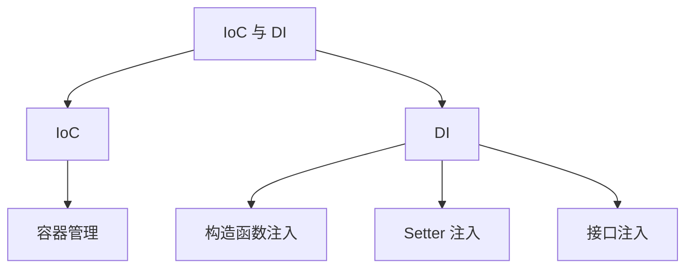
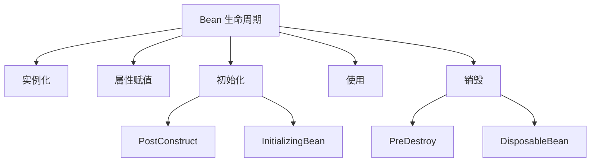
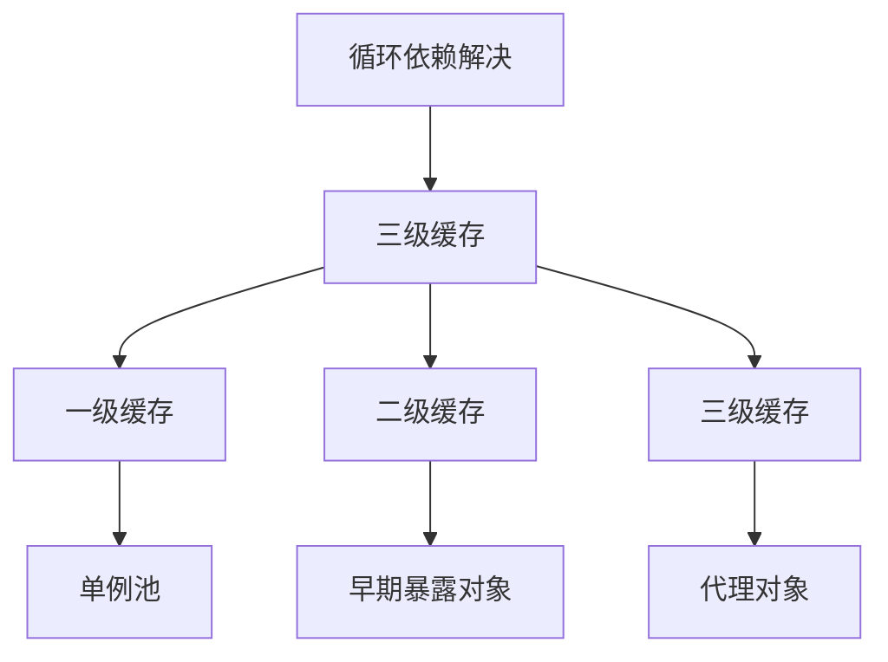
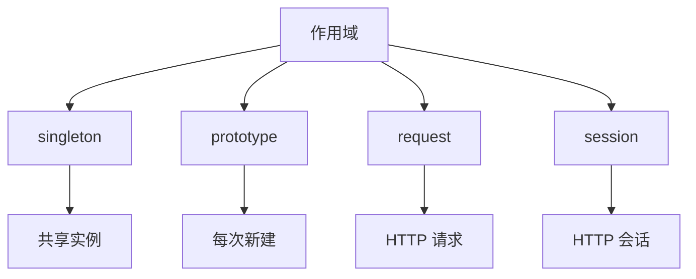

### IoC 与 DI
------
#### **1. IoC（控制反转）与 DI（依赖注入）**
**🔑 知识点详解**
- **IoC（控制反转）**：
  - **定义**：IoC 是一种设计思想，将对象的创建和管理交给框架或容器，而不是由开发者手动控制。
  - **核心思想**：通过容器管理对象的生命周期和依赖关系，降低代码耦合度。
    👉 **注意**：IoC 的实现方式包括依赖注入（DI）、工厂模式等。
- **DI（依赖注入）**：
  - **定义**：DI 是 IoC 的具体实现方式之一，通过构造函数、Setter 方法或接口注入依赖。
  - **核心思想**：将对象所需的依赖通过外部注入，而非在类内部直接创建。
    👉 **注意**：DI 提升了代码的可测试性和灵活性。

**🔥 面试高频题**
1. IoC 和 DI 的区别是什么？
   - **一句话答案**：IoC 是一种设计思想，DI 是其实现方式之一。
   - **深入回答**：IoC 的核心思想是将对象的创建和管理交给容器，而 DI 是 IoC 的具体实现方式。例如，在 Spring 框架中，IoC 容器负责管理 Bean 的生命周期和依赖关系，而 DI 则通过构造函数、Setter 方法或接口将依赖注入到对象中。这种方式降低了代码的耦合度，提升了可维护性和可测试性。

2. 如何通过 DI 实现松耦合？
   - **一句话答案**：通过外部注入依赖，避免类内部直接创建依赖对象。
   - **深入回答**：DI 的核心作用是通过外部注入依赖，使类无需关心依赖的创建过程，从而实现松耦合。例如：
     ```java
     public class UserService {
         private UserRepository userRepository;
     
         // 构造函数注入
         public UserService(UserRepository userRepository) {
             this.userRepository = userRepository;
         }
     
         public void addUser(String username) {
             userRepository.save(username);
         }
     }
     ```
     在上述代码中，`UserService` 不再直接创建 `UserRepository`，而是通过构造函数注入依赖。这种方式不仅提升了代码的灵活性，还便于单元测试。

**🌟 重点提醒**
- **要点一**：IoC 是设计思想，DI 是其具体实现方式。
- **要点二**：DI 通过外部注入依赖实现松耦合。
- **要点三**：Spring 框架通过 IoC 容器管理 Bean 和依赖。

**📝 实践经验**
```java
// 构造函数注入示例
@Service
public class OrderService {
    private final PaymentService paymentService;

    @Autowired
    public OrderService(PaymentService paymentService) {
        this.paymentService = paymentService;
    }

    public void processOrder() {
        paymentService.processPayment();
    }
}

// Setter 注入示例
@Service
public class NotificationService {
    private EmailService emailService;

    @Autowired
    public void setEmailService(EmailService emailService) {
        this.emailService = emailService;
    }

    public void sendNotification() {
        emailService.sendEmail();
    }
}
```

**🔧 工具辅助**


------
#### **2. Bean 生命周期**
**🔑 知识点详解**
- **Bean 生命周期阶段**：
  1. **实例化**：容器通过反射创建 Bean 实例。
  2. **属性赋值**：容器为 Bean 的属性注入依赖。
  3. **初始化**：调用 `@PostConstruct` 或 `InitializingBean` 的 `afterPropertiesSet()` 方法。
  4. **使用**：Bean 可供应用程序使用。
  5. **销毁**：调用 `@PreDestroy` 或 `DisposableBean` 的 `destroy()` 方法。
      👉 **注意**：生命周期方法可通过注解或接口实现。

**🔥 面试高频题**
1. Spring 中 Bean 的生命周期有哪些阶段？
   - **一句话答案**：Bean 的生命周期包括实例化、属性赋值、初始化、使用和销毁。
   - **深入回答**：Spring 容器管理 Bean 的生命周期，主要包括以下阶段：
     1. **实例化**：容器通过反射机制创建 Bean 实例。
     2. **属性赋值**：容器根据配置为 Bean 的属性注入依赖。
     3. **初始化**：调用 `@PostConstruct` 注解的方法或实现 `InitializingBean` 接口的 `afterPropertiesSet()` 方法。
     4. **使用**：Bean 进入就绪状态，可供应用程序使用。
     5. **销毁**：容器关闭时调用 `@PreDestroy` 注解的方法或实现 `DisposableBean` 接口的 `destroy()` 方法。
     ```java
     @Component
     public class MyBean implements InitializingBean, DisposableBean {
         @PostConstruct
         public void init() {
             System.out.println("Initialization logic");
         }
     
         @Override
         public void afterPropertiesSet() throws Exception {
             System.out.println("After properties set");
         }
     
         @PreDestroy
         public void destroyBean() {
             System.out.println("Destruction logic");
         }
     
         @Override
         public void destroy() throws Exception {
             System.out.println("Destroy method");
         }
     }
     ```

2. 如何自定义 Bean 的初始化和销毁逻辑？
   - **一句话答案**：通过 `@PostConstruct`、`@PreDestroy` 或实现 `InitializingBean` 和 `DisposableBean` 接口。
   - **深入回答**：Spring 提供了多种方式自定义 Bean 的初始化和销毁逻辑：
     - 使用注解：`@PostConstruct` 和 `@PreDestroy`。
     - 实现接口：`InitializingBean` 和 `DisposableBean`。
     - XML 配置：通过 `init-method` 和 `destroy-method` 属性指定方法。例如：
       ```xml
       <bean id="myBean" class="com.example.MyBean" init-method="init" destroy-method="destroy"/>
       ```

**🌟 重点提醒**
- **要点一**：Bean 生命周期包括实例化、属性赋值、初始化、使用和销毁。
- **要点二**：生命周期方法可通过注解、接口或 XML 配置实现。
- **要点三**：Spring 容器负责管理 Bean 的生命周期。

**📝 实践经验**
```java
@Component
public class LifecycleBean {
    public LifecycleBean() {
        System.out.println("Instance created");
    }

    @PostConstruct
    public void init() {
        System.out.println("Initialization logic");
    }

    @PreDestroy
    public void destroy() {
        System.out.println("Destruction logic");
    }
}
```

**🔧 工具辅助**


------
#### **3. 循环依赖解决：三级缓存**
**🔑 知识点详解**
- **循环依赖问题**：
  - **定义**：两个或多个 Bean 相互依赖，导致无法完成初始化。
  - **核心思想**：Spring 通过三级缓存解决循环依赖问题。
    👉 **注意**：三级缓存包括单例池、早期暴露对象和代理对象。
- **三级缓存机制**：
  1. **一级缓存（单例池）**：存放完全初始化的 Bean。
  2. **二级缓存（早期暴露对象）**：存放未完成初始化但已实例化的 Bean。
  3. **三级缓存（代理对象）**：存放代理对象以支持 AOP。

**🔥 面试高频题**
1. Spring 如何解决循环依赖问题？
   - **一句话答案**：Spring 通过三级缓存解决循环依赖问题。
   - **深入回答**：Spring 的三级缓存机制包括：
     1. **一级缓存（单例池）**：存放完全初始化的 Bean。
     2. **二级缓存（早期暴露对象）**：当一个 Bean 尚未完成初始化但已被实例化时，将其放入二级缓存，供其他 Bean 使用。
     3. **三级缓存（代理对象）**：如果 Bean 需要代理（如 AOP），则在三级缓存中存储代理对象。
     当发生循环依赖时，Spring 先从一级缓存查找，若不存在则尝试从二级缓存获取早期暴露对象，最后从三级缓存获取代理对象。例如：
     ```java
     @Component
     public class BeanA {
         @Autowired
         private BeanB beanB;
     }
     
     @Component
     public class BeanB {
         @Autowired
         private BeanA beanA;
     }
     ```
     在上述代码中，`BeanA` 和 `BeanB` 相互依赖，Spring 通过三级缓存机制解决循环依赖问题。

2. 为什么三级缓存可以解决循环依赖？
   - **一句话答案**：三级缓存通过早期暴露对象和代理对象打破循环依赖链。
   - **深入回答**：循环依赖的核心问题是两个 Bean 在初始化过程中相互等待对方完成。三级缓存通过以下方式解决：
     - **一级缓存**：存放完全初始化的 Bean，确保正常依赖注入。
     - **二级缓存**：存放未完成初始化但已实例化的 Bean，供其他 Bean 提前使用。
     - **三级缓存**：存放代理对象，支持 AOP 场景下的循环依赖。通过这种机制，Spring 能够在 Bean 初始化过程中提前暴露部分状态，从而打破循环依赖链。

**🌟 重点提醒**
- **要点一**：循环依赖通过三级缓存解决。
- **要点二**：三级缓存包括单例池、早期暴露对象和代理对象。
- **要点三**：Spring 的三级缓存机制支持 AOP 场景。

**📝 实践经验**
```java
@Component
public class BeanA {
    @Autowired
    private BeanB beanB;

    public void print() {
        System.out.println("BeanA using BeanB: " + beanB);
    }
}

@Component
public class BeanB {
    @Autowired
    private BeanA beanA;

    public void print() {
        System.out.println("BeanB using BeanA: " + beanA);
    }
}
```

**🔧 工具辅助**


------
#### **4. 作用域：`singleton`（默认）、`prototype`、`request`、`session`**
**🔑 知识点详解**
- **作用域类型**：
  - **`singleton`**：每个 Spring 容器中只有一个共享实例，默认作用域。
  - **`prototype`**：每次请求都会创建新的实例。
  - **`request`**：每个 HTTP 请求创建一个实例，仅适用于 Web 应用。
  - **`session`**：每个 HTTP 会话创建一个实例，仅适用于 Web 应用。
    👉 **注意**：作用域的选择影响 Bean 的生命周期和性能。

**🔥 面试高频题**
1. Spring 中的作用域有哪些？它们的区别是什么？
   - **一句话答案**：Spring 支持 `singleton`、`prototype`、`request` 和 `session` 作用域，分别对应不同生命周期。
   - **深入回答**：Spring 的作用域类型及其区别如下：
     - **`singleton`**：每个 Spring 容器中只有一个共享实例，适合无状态的 Bean。
     - **`prototype`**：每次请求都会创建新的实例，适合有状态的 Bean。
     - **`request`**：每个 HTTP 请求创建一个实例，仅适用于 Web 应用。
     - **`session`**：每个 HTTP 会话创建一个实例，仅适用于 Web 应用。
     例如：
     ```java
     @Scope("prototype")
     @Component
     public class PrototypeBean {
     }
     
     @Scope("request")
     @Component
     public class RequestBean {
     }
     ```

2. 如何选择合适的作用域？
   - **一句话答案**：根据 Bean 的用途和生命周期选择作用域。
   - **深入回答**：选择作用域时需要考虑以下因素：
     - **无状态 Bean**：使用 `singleton`，提升性能。
     - **有状态 Bean**：使用 `prototype`，避免共享状态。
     - **Web 应用**：根据请求或会话需求选择 `request` 或 `session`。
     - **线程安全**：`singleton` 需确保线程安全，`prototype` 则无需担心。

**🌟 重点提醒**
- **要点一**：`singleton` 是默认作用域，适合无状态 Bean。
- **要点二**：`prototype` 每次请求创建新实例，适合有状态 Bean。
- **要点三**：`request` 和 `session` 仅适用于 Web 应用。

**📝 实践经验**
```java
@Scope("singleton")
@Component
public class SingletonBean {
}

@Scope("prototype")
@Component
public class PrototypeBean {
}

@Scope("request")
@Component
public class RequestBean {
}

@Scope("session")
@Component
public class SessionBean {
}
```

**🔧 工具辅助**


------
#### **5. `@Autowired` 与 `@Resource` 区别**
**🔑 知识点详解**
- **`@Autowired`**：
  - **定义**：Spring 提供的注解，用于按类型注入依赖。
  - **核心思想**：优先按类型匹配，若存在多个候选者，则结合 `@Qualifier` 指定名称。
    👉 **注意**：`@Autowired` 支持构造函数、Setter 方法和字段注入。
- **`@Resource`**：
  - **定义**：JSR-250 标准注解，用于按名称注入依赖。
  - **核心思想**：优先按名称匹配，若未找到名称匹配的 Bean，则按类型匹配。
    👉 **注意**：`@Resource` 通常用于字段注入。

**🔥 面试高频题**
1. `@Autowired` 和 `@Resource` 的区别是什么？
   - **一句话答案**：`@Autowired` 按类型注入，`@Resource` 按名称注入。
   - **深入回答**：`@Autowired` 和 `@Resource` 的主要区别如下：
     - **`@Autowired`**：Spring 提供的注解，优先按类型匹配依赖。如果存在多个候选者，需结合 `@Qualifier` 指定名称。
     - **`@Resource`**：JSR-250 标准注解，优先按名称匹配依赖。若未找到名称匹配的 Bean，则按类型匹配。
     例如：
     ```java
     @Component
     public class MyService {
         @Autowired
         @Qualifier("userService")
         private UserService userService;
     
         @Resource(name = "emailService")
         private EmailService emailService;
     }
     ```

2. 如何选择 `@Autowired`和 `@Resource`？

      - **一句话答案**：根据注入需求选择，`@Autowired` 适合按类型注入，`@Resource` 适合按名称注入。
      - **深入回答**：选择 `@Autowired` 或 `@Resource` 时需要考虑以下因素：
        - **按类型注入**：如果依赖关系可以通过类型唯一确定，则使用 `@Autowired`。
        - **按名称注入**：如果需要明确指定 Bean 的名称（如存在多个同类型的 Bean），则使用 `@Resource`。
        - **标准兼容性**：`@Resource` 是 JSR-250 标准注解，具有更好的跨框架兼容性；而 `@Autowired` 是 Spring 特有的注解。
        - **灵活性**：`@Autowired` 支持构造函数、Setter 方法和字段注入，而 `@Resource` 通常用于字段注入。

   **🌟 重点提醒**
   - **要点一**：`@Autowired` 按类型注入，`@Resource` 按名称注入。
   - **要点二**：`@Autowired` 是 Spring 特有注解，`@Resource` 是 JSR-250 标准注解。
   - **要点三**：根据需求选择合适的注解以提升代码的可读性和灵活性。

   **📝 实践经验**
   ```java
   @Component
   public class MyService {
       @Autowired
       private UserService userService;
   
       @Resource(name = "emailService")
       private EmailService emailService;
   
       public void execute() {
           userService.process();
           emailService.send();
       }
   }
   ```

   **🔧 工具辅助**
   ```mermaid
   graph TD
       A[依赖注入注解] --> B[Autowired]
       A --> C[Resource]
       B --> D[按类型注入]
       B --> E[支持构造函数/Setter/字段]
       C --> F[按名称注入]
       C --> G[JSR-250 标准]
   ```

   ------
   #### **💡 复习建议**
   1. 掌握 IoC 和 DI 的核心思想及其在 Spring 中的应用。
   2. 理解 Bean 生命周期的各个阶段及其自定义方法。
   3. 学习三级缓存机制，理解其如何解决循环依赖问题。
   4. 熟悉 Spring 中的作用域类型及其适用场景。
   5. 区分 `@Autowired` 和 `@Resource` 的使用场景及差异。
